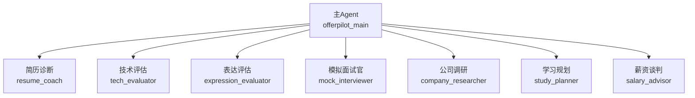
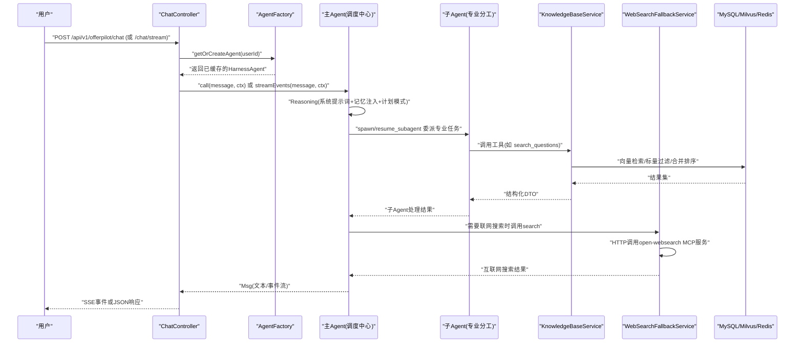
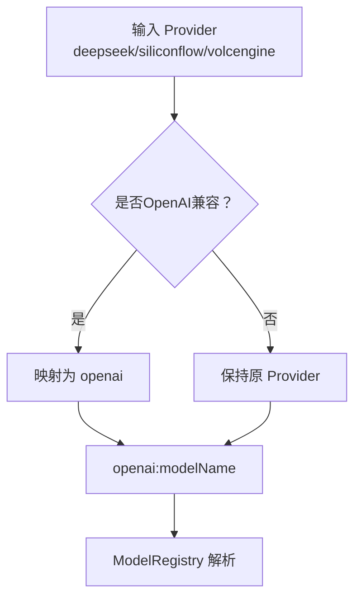
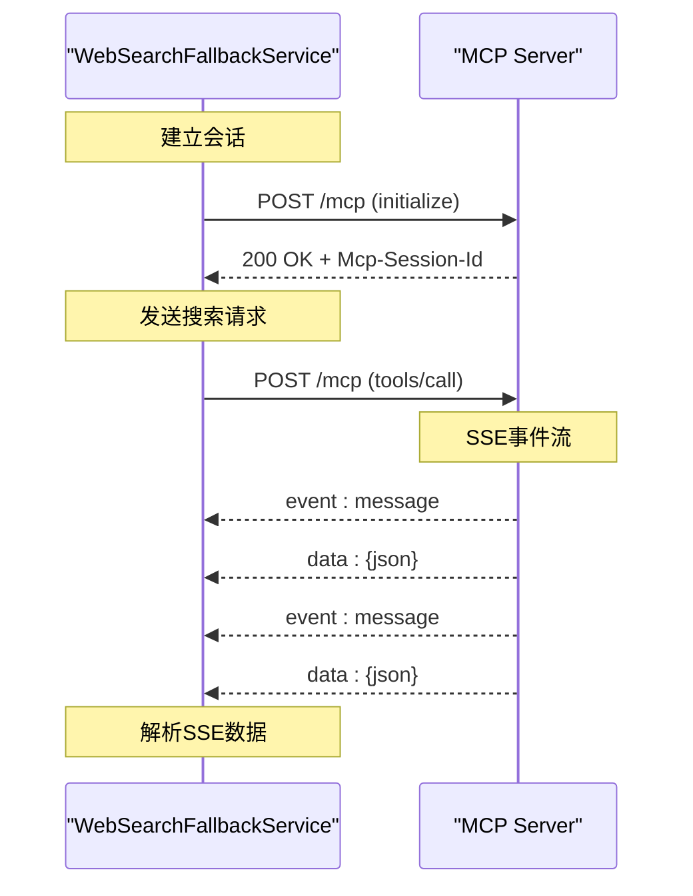
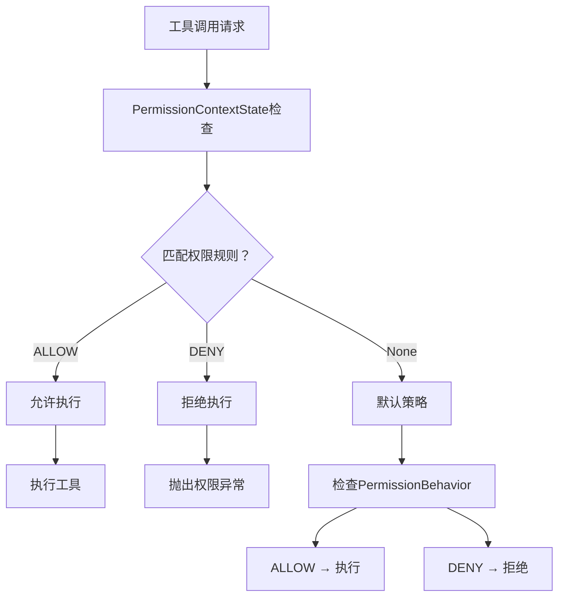
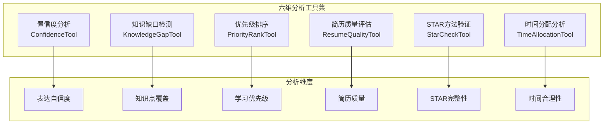

# AgentScope 核心机制深度解析

<cite>
**本文引用的文件**   
- [AgentFactory.java](file://src/main/java/com/tutorial/offerpilot/agent/AgentFactory.java)
- [WebSearchFallbackService.java](file://src/main/java/com/tutorial/offerpilot/service/WebSearchFallbackService.java)
- [tools.json](file://workspace/tools.json)
- [ConfidenceTool.java](file://src/main/java/com/tutorial/offerpilot/agent/tool/ConfidenceTool.java)
- [KnowledgeGapTool.java](file://src/main/java/com/tutorial/offerpilot/agent/tool/KnowledgeGapTool.java)
- [PriorityRankTool.java](file://src/main/java/com/tutorial/offerpilot/agent/tool/PriorityRankTool.java)
- [ResumeQualityTool.java](file://src/main/java/com/tutorial/offerpilot/agent/tool/ResumeQualityTool.java)
- [StarCheckTool.java](file://src/main/java/com/tutorial/offerpilot/agent/tool/StarCheckTool.java)
- [TimeAllocationTool.java](file://src/main/java/com/tutorial/offerpilot/agent/tool/TimeAllocationTool.java)
- [SalaryTool.java](file://src/main/java/com/tutorial/offerpilot/agent/tool/SalaryTool.java)
- [SmartSearchTool.java](file://src/main/java/com/tutorial/offerpilot/agent/tool/SmartSearchTool.java)
- [pom.xml](file://pom.xml)
- [application.yml](file://src/main/resources/application.yml)
</cite>

## 更新摘要
**变更内容**   
- **MCP工具注册机制重大升级**：新增registerMcpWebSearch()方法实现动态工具加载，替代传统的tools.json自动加载机制
- **工具名称统一标准化**：MCP搜索工具从web_search统一改为search，提升命名一致性
- **SSE流式传输支持**：新增对Server-Sent Events的完整支持，提供更高效的实时通信模式
- **双协议兼容架构**：同时支持Streamable HTTP和SSE两种MCP传输协议，增强系统兼容性

## 目录
- ReActAgent 推理循环
- @Tool 工具定义与动态激活
- 多 Agent 协作范式
- Msg 消息流转路径
- 智能模型解析与动态实例化
- Provider 映射与依赖管理机制
- MCP 联网搜索集成（重大更新）
- 权限控制与安全机制
- 六维分析工具集详解

## ReActAgent 推理循环
- 推理循环要点
  - Reasoning：主Agent作为调度中心，基于系统提示词、记忆注入与计划模式进行思考，决定下一步动作（委派子Agent或调用search）。
  - Action：通过spawn/resume_subagent将任务委派给专业子Agent；子Agent各自持有独立的过滤Toolkit（仅含其白名单工具）。
  - Observation：工具返回结构化POJO（dto/tool/*），框架自动序列化为JSON供LLM消费；LLM据此生成自然语言输出或继续下一轮推理。
- HarnessAgent.builder() 关键配置项
  - sysPrompt：调度中心角色定义，明确"唯一职责是分发任务给子Agent，严禁直接调用业务工具"的行为约束。
  - model：模型标识符（provider:modelName），从配置读取，支持动态解析。
  - toolkit：注册所有本地@Tool与registerMetaTool；子Agent通过SubagentDeclaration.tools()白名单从主Toolkit获取过滤副本。
  - subagent：声明7个子Agent（resume_coach、tech_evaluator、expression_evaluator、mock_interviewer、company_researcher、study_planner、salary_advisor）。
  - permissionContext：启用细粒度权限控制，支持工具级ALLOW/DENY规则。
  - workspace：配置MCP tools.json，启用search联网搜索能力。
  - middleware：TokenMonitorMiddleware、CostControlMiddleware等监控中间件。
  - enablePlanMode/enableTaskList：计划模式与todo_write元工具。

**章节来源**
- [AgentFactory.java:282-312](file://src/main/java/com/tutorial/offerpilot/agent/AgentFactory.java#L282-L312)
- [AgentFactory.java:155-177](file://src/main/java/com/tutorial/offerpilot/agent/AgentFactory.java#L155-L177)

## @Tool 工具定义与动态激活
- 以 SalaryTool 为例的结构
  - 类级别：@Component（Spring管理）、显式构造器注入ObjectMapper。
  - 方法级别：@Tool(name, description)，参数使用@ToolParam(name, description)。
  - 返回值：结构化DTO（dto/tool/*），框架自动序列化。
- 注册机制
  - 主Agent的Toolkit集中注册全部本地@Tool，并调用registerMetaTool()启用元工具。
  - 子Agent在spawn时从主Toolkit按tools()白名单筛选出独立副本，实现工具隔离。
- 元工具
  - registerMetaTool()提供能力：reset_equipped_tools（动态启禁工具组）、todo_write（任务清单）等。
- 19个本地@Tool + MCP search全景表
  - 名称 | 类别 | 返回类型 | 依赖注入
  - parse_resume | 简历分析 | ResumeParseResult | PDF/DOCX解析服务
  - evaluate_resume | 简历分析 | ResumeEvaluateResult | ResumeService
  - search_questions | 知识检索 | QuestionSearchResult | KnowledgeBaseService
  - search_answers | 知识检索 | AnswerSearchResult | KnowledgeBaseService
  - search_company_interviews | 知识检索 | CompanySearchResult | KnowledgeBaseService
  - analyze_answer | 面试分析 | AnswerAnalysisResult | InterviewQuestionRepository
  - transcribe_audio | 面试分析 | TranscribeResult | ASR服务
  - generate_next_question | 面试分析 | NextQuestionResult | InterviewQuestionRepository / InterviewSessionRepository
  - search_resources | 知识检索 | ResourceListResult | KnowledgeBaseService
  - track_progress | 通用工具 | ProgressResult | ProgressService
  - search_salary | 薪资谈判 | SalarySearchResult | SalaryService
  - compare_offers | 薪资谈判 | OfferComparisonResult | SalaryService (JSON适配模式)
  - generate_negotiation_script | 薪资谈判 | NegotiationScriptResult | SalaryService (简单委托模式)
  - smart_search | 统一搜索 | SmartSearchResult | KnowledgeBaseService + QueryExpansionService
  - prioritize_weaknesses | 学习规划 | PriorityResult | KnowledgeMasteryRepository + SearchAnalyticsService
  - analyze_confidence | 自信度分析 | ConfidenceResult | 文本特征分析
  - detect_knowledge_gaps | 知识盲区 | KnowledgeGapResult | KnowledgeBaseService
  - check_star | STAR检查 | StarCheckResult | 正则表达式分段
  - check_resume_quality | 简历质量 | QualityCheckResult | 文本统计分析
  - analyze_time_allocation | 时间分配 | TimeAllocationResult | 时长估算
  - search（MCP） | 联网搜索 | 搜索结果 | WebSearchFallbackService

**章节来源**
- [SalaryTool.java:31-63](file://src/main/java/com/tutorial/offerpilot/agent/tool/SalaryTool.java#L31-L63)
- [SalaryTool.java:69-99](file://src/main/java/com/tutorial/offerpilot/agent/tool/SalaryTool.java#L69-L99)
- [SmartSearchTool.java:39-157](file://src/main/java/com/tutorial/offerpilot/agent/tool/SmartSearchTool.java#L39-L157)

## 多 Agent 协作范式
- 父子关系图（1主+7子）

- spawn/resume 机制
  - 主Agent仅使用spawn/resume_subagent将任务委派给子Agent；子Agent各自持有独立的过滤Toolkit（仅含其白名单工具）。
  - 子Agent可并发执行（例如tech_evaluator与expression_evaluator并行评估同一回答）。
- 工具白名单与过滤副本
  - 主Toolkit作为"工具池"，子Agent通过SubagentDeclaration.tools()声明所需工具名列表；spawn时框架构建独立副本，确保工具隔离与最小权限。
- 7个子Agent的SubagentDeclaration摘要
  - resume_coach：parse_resume、evaluate_resume、search_questions
  - tech_evaluator：search_answers、analyze_answer、search_questions
  - expression_evaluator：analyze_answer
  - mock_interviewer：generate_next_question、search_answers、analyze_answer
  - company_researcher：search_company_interviews、search_questions、search
  - study_planner：track_progress、prioritize_weaknesses、search_resources、search_questions、search
  - salary_advisor：search_salary、compare_offers、generate_negotiation_script、search

**章节来源**
- [AgentFactory.java:318-440](file://src/main/java/com/tutorial/offerpilot/agent/AgentFactory.java#L318-L440)

## Msg 消息流转路径
- 端到端时序（用户→Controller→AgentFactory.getOrCreate→Agent.call/streamEvents）

- 关键点
  - ChatController负责鉴权、限流、SSE推送与同步阻塞等待agent.call().block()。
  - AgentFactory使用Caffeine有界缓存（最多500个Agent，30分钟未访问淘汰）避免OOM。
  - MemoryInjectMiddleware在每次推理前通过onSystemPrompt钩子加载用户长期记忆。
  - 工具层通过KnowledgeBaseService统一封装多租户检索，并在必要时触发WebSearchFallbackService进行MCP联网搜索兜底。

**章节来源**
- [AgentFactory.java:125-180](file://src/main/java/com/tutorial/offerpilot/agent/AgentFactory.java#L125-L180)
- [WebSearchFallbackService.java:52-99](file://src/main/java/com/tutorial/offerpilot/service/WebSearchFallbackService.java#L52-L99)

## 智能模型解析与动态实例化

### 四级模型优先级解析机制

**更新** 新增了智能模型解析逻辑，实现了用户私有模型 > 用户默认模型 > 全局默认模型 > application.yml回退的四级优先级体系。

#### 模型解析流程


#### 核心实现细节

**ModelCreationContext动态实例化**
- 通过ModelCreationContext.builder()构建上下文，包含apiKey、baseUrl等运行时配置
- 支持动态baseUrl配置，满足不同提供商的API地址需求
- 集成ApiKeyEncryption实现API Key的安全解密

**安全处理机制**
- API Key采用加密存储，使用时动态解密
- 支持不同提供商的认证头类型和API格式
- 模型名称验证确保配置的有效性

#### 动态模型切换优势
- **实时生效**：模型配置变更后无需重启应用
- **细粒度控制**：支持用户级别的模型个性化配置
- **高可用性**：多级回退机制确保系统稳定性
- **安全性**：API Key加密存储，防止敏感信息泄露

**章节来源**
- [AgentFactory.java:489-529](file://src/main/java/com/tutorial/offerpilot/agent/AgentFactory.java#L489-L529)

## Provider 映射与依赖管理机制

### 智能 Provider 映射机制

**更新** 实现了OpenAI兼容Provider的智能映射机制，解决了AgentScope框架中部分Provider缺少独立SPI ModelProvider的问题。

#### Provider 映射规则


#### 核心实现细节

**OpenAI兼容Provider识别**
- 定义了OPENAI_COMPATIBLE_PROVIDERS常量集合：{"deepseek", "siliconflow", "volcengine"}
- 这些Provider虽然使用OpenAI兼容API，但AgentScope框架中没有独立的SPI Provider实现
- 通过mapToAgentScopeProvider()方法将这些Provider统一映射为"openai"

**8个预设Provider完整支持**
- **DashScope**：阿里百炼，OpenAI兼容，使用agentscope-extensions-model-dashscope
- **OpenAI**：官方OpenAI，使用agentscope-extensions-model-openai
- **DeepSeek**：深度求索，OpenAI兼容，映射到openai
- **SiliconFlow**：硅基流动，OpenAI兼容，映射到openai
- **VolcEngine**：火山引擎，OpenAI兼容，映射到openai
- **Anthropic**：Claude，非OpenAI兼容，使用agentscope-extensions-model-anthropic
- **Gemini**：Google Gemini，非OpenAI兼容，使用agentscope-extensions-model-gemini
- **Ollama**：本地部署，OpenAI兼容，使用agentscope-extensions-model-ollama

### 依赖管理与容错机制

**更新** 完善了Maven依赖管理和ModelRegistry解析的容错机制。

#### Maven依赖配置
- 在pom.xml中补充了4个缺失的AgentScope Model Extension依赖：
  - agentscope-extensions-model-dashscope
  - agentscope-extensions-model-anthropic
  - agentscope-extensions-model-gemini
  - agentscope-extensions-model-ollama

#### ModelRegistry解析容错
- 添加了异常捕获机制，当ModelRegistry.resolve(modelId, context)失败时自动回退
- 记录详细的警告日志，包含原始provider信息和异常详情
- 优雅降级到application.yml中的兜底配置，确保系统可用性

#### 默认配置优化
- 将application.yml中的默认provider从deepseek改为dashscope
- 将默认model-name从deepseek-chat改为qwen-max
- 使用DashScope作为默认提供商，提供更好的稳定性和兼容性

**章节来源**
- [AgentFactory.java:535-540](file://src/main/java/com/tutorial/offerpilot/agent/AgentFactory.java#L535-L540)
- [pom.xml:146-165](file://pom.xml#L146-L165)
- [application.yml:36-39](file://src/main/resources/application.yml#L36-L39)

## MCP 联网搜索集成（重大更新）

### 动态工具注册机制升级

**重大更新** 实现了全新的registerMcpWebSearch()方法，采用动态工具注册机制替代传统的tools.json自动加载方式，提供更灵活的工具管理能力。

#### 新架构设计
```mermaid
flowchart TD
A[AgentFactory.buildToolkit()] --> B[registerMcpWebSearch(toolkit)]
B --> C[McpClientBuilder.create("web-search")]
C --> D[streamableHttpTransport(mcpUrl)]
D --> E[buildAsync().block()]
E --> F[toolkit.registration().mcpClient(mcpClient).apply()]
F --> G[动态注册search工具]
```

#### 核心实现特性
- **显式注册**：通过registerMcpWebSearch()方法主动连接MCP服务器
- **双协议支持**：同时支持Streamable HTTP和SSE两种传输协议
- **超时控制**：配置60秒请求超时和30秒初始化超时
- **错误处理**：完善的异常捕获和降级策略
- **异步构建**：使用buildAsync()配合.block()实现异步客户端构建

#### 工具名称标准化
- **统一命名**：MCP搜索工具从`web_search`统一改为`search`
- **权限配置**：PermissionContextState中添加`addAllowRule("search", ...)`
- **子Agent白名单**：所有需要联网搜索的子Agent都使用`search`而非`web_search`

**章节来源**
- [AgentFactory.java:491-520](file://src/main/java/com/tutorial/offerpilot/agent/AgentFactory.java#L491-L520)
- [AgentFactory.java:483-485](file://src/main/java/com/tutorial/offerpilot/agent/AgentFactory.java#L483-L485)

### SSE流式传输协议支持

**新增** 完整的Server-Sent Events (SSE) 流式传输支持，提供更高效的实时通信模式。

#### SSE协议实现


#### 核心功能特性
- **会话管理**：自动维护Mcp-Session-Id，支持5分钟会话过期
- **SSE解析**：智能解析`event: message\ndata: {...}`格式的响应
- **双重兼容**：同时支持标准SSE格式和纯JSON响应
- **错误恢复**：网络异常时的自动重试和降级处理

#### 配置文件更新
```json
{
  "mcpServers": {
    "web-search": {
      "transport": "sse",
      "url": "http://localhost:3000/sse",
      "env": {
        "DEFAULT_SEARCH_ENGINE": "bing"
      }
    }
  }
}
```

**章节来源**
- [WebSearchFallbackService.java:186-246](file://src/main/java/com/tutorial/offerpilot/service/WebSearchFallbackService.java#L186-246)
- [tools.json:1-12](file://workspace/tools.json#L1-12)

### 双协议兼容架构

**新增** 系统现在同时支持两种MCP传输协议，提供更高的兼容性和可靠性。

#### 协议对比表
| 特性 | Streamable HTTP | SSE流式传输 |
|------|----------------|-------------|
| 传输方式 | 单次HTTP请求 | 持续事件流 |
| 适用场景 | 简单工具调用 | 实时数据推送 |
| 性能特点 | 低延迟，高吞吐 | 实时性，低开销 |
| 错误处理 | 完整异常传播 | 部分错误容忍 |
| 资源占用 | 连接复用 | 长连接管理 |

#### 混合使用策略
- **AgentFactory.registerMcpWebSearch()**：使用Streamable HTTP进行工具发现
- **WebSearchFallbackService.search()**：使用SSE进行实际搜索请求
- **自动选择**：根据服务端能力和网络状况自动选择最优协议

**章节来源**
- [AgentFactory.java:497-520](file://src/main/java/com/tutorial/offerpilot/agent/AgentFactory.java#L497-520)
- [WebSearchFallbackService.java:95-117](file://src/main/java/com/tutorial/offerpilot/service/WebSearchFallbackService.java#L95-117)

## 权限控制与安全机制

### PermissionContextState细粒度权限控制

**新增** 实现了基于PermissionContextState的工具级访问控制，支持ALLOW/DENY规则和行为策略。

#### 权限控制架构


#### 权限规则配置
- **工具白名单**：为每个子Agent配置允许访问的工具列表
- **行为策略**：
  - PermissionBehavior.ALLOW：直接允许执行
  - PermissionBehavior.DENY：明确拒绝执行
  - PermissionBehavior.REQUIRE_APPROVAL：需要人工审批
- **上下文感知**：支持基于用户设置、会话状态等的动态权限判断

#### 安全最佳实践
- **最小权限原则**：每个子Agent仅获得完成任务所需的最小工具集
- **显式授权**：所有工具调用都需要明确的权限规则
- **审计追踪**：记录所有权限决策和执行结果
- **动态调整**：支持运行时修改权限规则

**章节来源**
- [AgentFactory.java:446-484](file://src/main/java/com/tutorial/offerpilot/agent/AgentFactory.java#L446-L484)

## 六维分析工具集详解

### 新增六维分析工具架构

**新增** 为了提供更全面的面试评估能力，系统新增了六个专业化的分析工具，形成完整的六维分析体系。这些工具专注于不同的评估维度，每个工具都返回结构化的分析结果和LLM指导文本。

#### 六维分析工具概览


### 置信度分析工具（ConfidenceTool）

**新增** 专门用于分析面试回答中的表达自信度，通过文本特征分析评估候选人的自信心水平。

#### 核心功能
- **口头禅密度统计**：识别和分析填充词（嗯、呃、那个等）的使用频率
- **自我修正模式检测**：识别不确定表达和自我修正的语言模式
- **自信度评分计算**：基于文本特征计算0-100分的自信度评分
- **结构化结果输出**：返回详细的统计数据和分析指导

#### 算法实现
- 使用预定义的犹豫词集合进行匹配统计
- 通过正则表达式识别自我修正模式
- 基于密度计算的评分算法，考虑样本长度因素

**章节来源**
- [ConfidenceTool.java:36-91](file://src/main/java/com/tutorial/offerpilot/agent/tool/ConfidenceTool.java#L36-L91)
- [ConfidenceResult.java:18-34](file://src/main/java/com/tutorial/offerpilot/dto/tool/ConfidenceResult.java#L18-L34)

### 知识缺口检测工具（KnowledgeGapTool）

**新增** 结合RAG检索和词法对比，智能检测候选人回答中的知识盲区。

#### 核心功能
- **标准答案检索**：通过KnowledgeBaseService检索相关问题的优秀答案
- **术语提取与对比**：使用正则表达式提取关键概念并进行词法对比
- **覆盖率计算**：量化分析候选人的知识点覆盖程度
- **语义复核指导**：提供LLM进行语义级别判断的详细指导

#### 技术实现
- 集成KnowledgeBaseService进行智能检索
- 使用复杂的正则表达式模式匹配专业术语
- 支持可配置的topK参数控制检索数量

**章节来源**
- [KnowledgeGapTool.java:40-88](file://src/main/java/com/tutorial/offerpilot/agent/tool/KnowledgeGapTool.java#L40-L88)
- [KnowledgeGapResult.java:18-31](file://src/main/java/com/tutorial/offerpilot/dto/tool/KnowledgeGapResult.java#L18-L31)

### 优先级排序工具（PriorityRankTool）

**新增** 基于高频考点和低掌握度的量化算法，为学习者提供个性化的学习优先级建议。

#### 核心功能
- **掌握度数据整合**：从KnowledgeMasteryRepository获取用户各知识点掌握情况
- **考频统计分析**：通过SearchAnalyticsService分析各知识点的出现频率
- **优先级计算公式**：priority = frequency × (100 - score)
- **紧急度分级**：根据优先级分数划分HIGH/MEDIUM/LOW三个等级

#### 应用场景
- 个性化学习计划制定
- 薄弱知识点精准定位
- 学习效率优化建议

**章节来源**
- [PriorityRankTool.java:32-73](file://src/main/java/com/tutorial/offerpilot/agent/tool/PriorityRankTool.java#L32-73)
- [PriorityResult.java:18-46](file://src/main/java/com/tutorial/offerpilot/dto/tool/PriorityResult.java#L18-46)

### 简历质量评估工具（ResumeQualityTool）

**新增** 对简历进行多维度的质量检查，包括技能层次分类、量化数据覆盖度和技术栈罗列问题检测。

#### 核心功能
- **技能层次分析**：检测技能描述是否按熟练度分类（精通/熟悉/了解）
- **量化数据检测**：识别项目描述中的量化指标（百分比、倍数、金额等）
- **技术栈罗列检查**：发现仅罗列技术栈而缺乏业务成果的问题
- **原始数据收集**：提供详细的原始文本片段供LLM进行深度分析

#### 检查维度
- 技能描述的层次性和专业性
- 项目成果的量化和具体化
- 技术能力与业务价值的关联度

**章节来源**
- [ResumeQualityTool.java:31-63](file://src/main/java/com/tutorial/offerpilot/agent/tool/ResumeQualityTool.java#L31-63)
- [QualityCheckResult.java:18-46](file://src/main/java/com/tutorial/offerpilot/dto/tool/QualityCheckResult.java#L18-46)

### STAR方法验证工具（StarCheckTool）

**新增** 专门用于验证简历中项目经历是否符合STAR法则（情境-任务-行动-结果）的完整性要求。

#### 核心功能
- **经历段落分割**：使用正则表达式智能识别和分割项目/工作经历段落
- **STAR要素检测**：为每段经历提供S/T/A/R四要素的检查指导
- **完整性评估**：标记缺失的STAR要素并提供修复建议
- **结构化输出**：返回标准化的检查结果供LLM进一步分析

#### STAR法则应用
- **Situation（情境）**：项目背景和环境描述
- **Task（任务）**：承担的具体职责和目标
- **Action（行动）**：采取的具体措施和方法
- **Result（结果）**：取得的成果和影响

**章节来源**
- [StarCheckTool.java:29-33](file://src/main/java/com/tutorial/offerpilot/agent/tool/StarCheckTool.java#L29-33)
- [StarCheckResult.java:18-43](file://src/main/java/com/tutorial/offerpilot/dto/tool/StarCheckResult.java#L18-43)

### 时间分配分析工具（TimeAllocationTool）

**新增** 根据回答文本长度估算面试时间分配，评估回答的合理性和充分性。

#### 核心功能
- **时长估算算法**：基于中文正常语速（250字/分钟）进行时长计算
- **合理性评估**：判断回答时长是否在合理范围内（30-180秒）
- **多维度统计**：统计过短、过长和适中的题目数量
- **改进建议生成**：为每道题提供具体的时间管理建议

#### 评估标准
- **GOOD**：60-120秒，回答充分且精炼
- **ACCEPTABLE**：30-60秒或120-180秒，基本可接受
- **TOO_SHORT**：少于30秒，回答过于简略
- **TOO_LONG**：超过180秒，回答过于冗长

**章节来源**
- [TimeAllocationTool.java:37-110](file://src/main/java/com/tutorial/offerpilot/agent/tool/TimeAllocationTool.java#L37-110)
- [TimeAllocationResult.java:18-51](file://src/main/java/com/tutorial/offerpilot/dto/tool/TimeAllocationResult.java#L18-51)

### 六维分析工具的协作机制

**新增** 六维分析工具通过统一的架构设计，实现了高效的协作和信息共享。

#### 协作模式
- **统一接口规范**：所有工具都遵循相同的@Tool注解规范和DTO返回格式
- **LLM指导文本**：每个工具都返回专门的指导文本，引导LLM进行深度分析
- **结构化数据输出**：便于后续的数据分析和可视化展示
- **可扩展架构**：支持未来新增更多分析维度的工具

#### 集成方式
- 工具通过Spring的@Component注解自动注册
- 在AgentFactory的buildToolkit()方法中进行统一管理
- 支持在子Agent的工具白名单中灵活配置访问权限

**章节来源**
- [AgentFactory.java:192-277](file://src/main/java/com/tutorial/offerpilot/agent/AgentFactory.java#L192-L277)