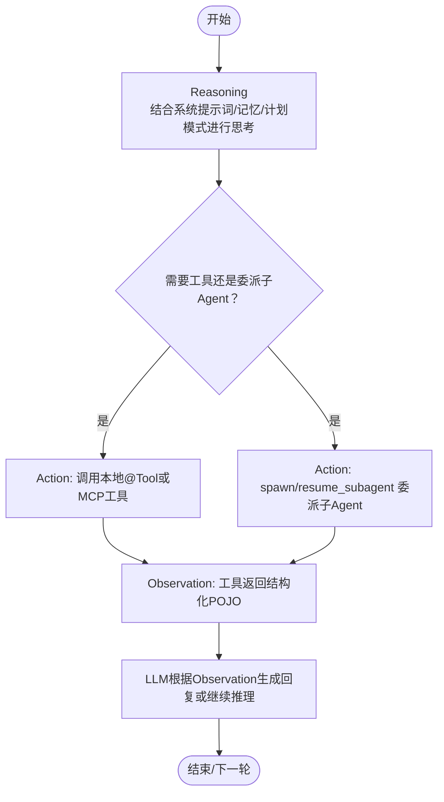
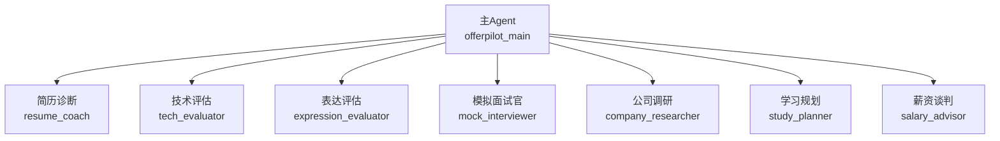
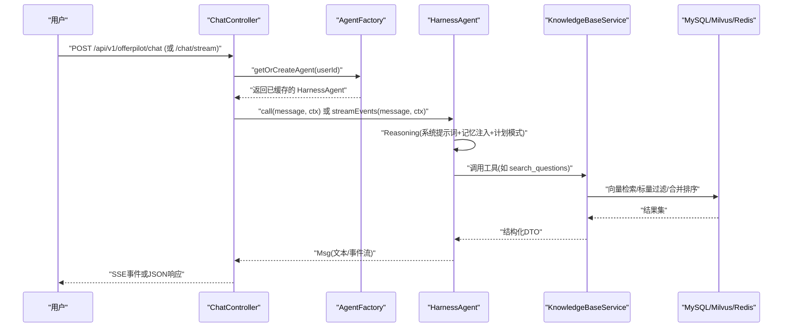

# AgentScope 核心机制深度解析

<cite>
**本文引用的文件**   
- [AgentFactory.java](file://src/main/java/com/tutorial/offerpilot/agent/AgentFactory.java)
- [QuestionSearchTool.java](file://src/main/java/com/tutorial/offerpilot/agent/tool/QuestionSearchTool.java)
- [AnswerAnalyzeTool.java](file://src/main/java/com/tutorial/offerpilot/agent/tool/AnswerAnalyzeTool.java)
- [MockInterviewTool.java](file://src/main/java/com/tutorial/offerpilot/agent/tool/MockInterviewTool.java)
- [02-系统架构设计说明书.md](file://Documents/02-系统架构设计说明书.md)
- [04-实现与编码规范.md](file://Documents/04-实现与编码规范.md)
</cite>

## 目录
- ReActAgent 推理循环
- @Tool 工具定义与动态激活
- 多 Agent 协作范式
- Msg 消息流转路径

## ReActAgent 推理循环
- 推理循环要点
  - Reasoning：主 Agent 基于系统提示词、记忆注入与计划模式进行思考，决定下一步动作（调用工具或委派子 Agent）。
  - Action：通过 Toolkit 执行本地 @Tool 或通过 MCP 注册的外部工具；在“1 主 + 7 子”模式下，主 Agent 仅调度 spawn/resume_subagent，业务工具由子 Agent 白名单持有。
  - Observation：工具返回结构化 POJO（dto/tool/*），框架自动序列化为 JSON 供 LLM 消费；LLM 据此生成自然语言输出或继续下一轮推理。
- HarnessAgent.builder() 关键配置项
  - sysPrompt：定义角色、行为约束与“指导型工具”解读规则（如 generate_next_question/analyze_answer/evaluate_resume 只返回指导文本，需由 LLM 自行生成最终内容）。
  - model：模型标识符（provider:modelName），从配置读取。
  - toolkit：注册所有本地 @Tool 与 registerMetaTool；子 Agent 通过 SubagentDeclaration.tools() 白名单从主 Toolkit 获取过滤副本。
  - subagent：声明 7 个子 Agent（resume_coach、tech_evaluator、expression_evaluator、mock_interviewer、company_researcher、study_planner、salary_advisor）。
  - middleware：TokenMonitorMiddleware、CostControlMiddleware、MemoryInjectMiddleware（每次推理前 onSystemPrompt 钩子加载用户长期记忆）。
  - stateStore：RedisAgentStateStore（会话短期记忆，TTL 30 分钟）。
  - compaction/memory：压缩策略与对话记忆开关。
  - enablePlanMode/enableTaskList：计划模式与 todo_write 元工具。
- 流程图（ReAct 循环）

**章节来源**
- [04-实现与编码规范.md:566-598](file://Documents/04-实现与编码规范.md#L566-L598)
- [02-系统架构设计说明书.md:1074-1133](file://Documents/02-系统架构设计说明书.md#L1074-L1133)

## @Tool 工具定义与动态激活
- 以 QuestionSearchTool 为例的结构
  - 类级别：@Component（Spring 管理）、@RequiredArgsConstructor（构造器注入依赖）。
  - 方法级别：@Tool(name, description)，参数使用 @ToolParam(name, description)。
  - 返回值：结构化 DTO（dto/tool/*），框架自动序列化。
- 注册机制
  - 主 Agent 的 Toolkit 集中注册全部本地 @Tool，并调用 registerMetaTool() 启用元工具（如 reset_equipped_tools、todo_write）。
  - 子 Agent 在 spawn 时从主 Toolkit 按 tools() 白名单筛选出独立副本，实现工具隔离。
- 元工具
  - registerMetaTool() 提供能力：reset_equipped_tools（动态启禁工具组）、todo_write（任务清单）等，便于主 Agent 调度与状态管理。
- 13 个本地 @Tool + MCP web_search 全景表
  - 名称 | 类别 | 返回类型 | 依赖注入
  - parse_resume | 简历分析 | ResumeParseResult | PDF/DOCX 解析服务
  - evaluate_resume | 简历分析 | ResumeEvaluateResult | ResumeService
  - search_questions | 知识检索 | QuestionSearchResult | KnowledgeBaseService
  - search_answers | 知识检索 | AnswerSearchResult | KnowledgeBaseService
  - search_company_info | 知识检索 | CompanySearchResult | KnowledgeBaseService
  - analyze_answer | 面试分析 | AnswerAnalysisResult | InterviewQuestionRepository
  - transcribe_audio | 面试分析 | TranscribeResult | ASR 服务
  - generate_next_question | 面试分析 | NextQuestionResult | InterviewQuestionRepository / InterviewSessionRepository
  - search_learning_resources | 知识检索 | ResourceListResult | KnowledgeBaseService
  - track_progress | 通用工具 | ProgressResult | ProgressService
  - search_salary_data | 薪资谈判 | SalarySearchResult | KnowledgeBaseService
  - compare_offers | 薪资谈判 | OfferComparisonResult | KnowledgeBaseService
  - generate_negotiation_script | 薪资谈判 | NegotiationScriptResult | KnowledgeBaseService
  - web_search（MCP） | 联网搜索 | 搜索结果 | OpenWebSearch MCP Server（tools.json 配置即接入）

**章节来源**
- [QuestionSearchTool.java:1-28](file://src/main/java/com/tutorial/offerpilot/agent/tool/QuestionSearchTool.java#L1-L28)
- [AnswerAnalyzeTool.java:1-105](file://src/main/java/com/tutorial/offerpilot/agent/tool/AnswerAnalyzeTool.java#L1-L105)
- [MockInterviewTool.java:1-272](file://src/main/java/com/tutorial/offerpilot/agent/tool/MockInterviewTool.java#L1-L272)
- [02-系统架构设计说明书.md:811-865](file://Documents/02-系统架构设计说明书.md#L811-L865)

## 多 Agent 协作范式
- 父子关系图（1 主 + 7 子）

- spawn/resume 机制
  - 主 Agent 仅使用 spawn/resume_subagent 将任务委派给子 Agent；子 Agent 各自持有独立的过滤 Toolkit（仅含其白名单工具）。
  - 子 Agent 可并发执行（例如 tech_evaluator 与 expression_evaluator 并行评估同一回答）。
- 工具白名单与过滤副本
  - 主 Toolkit 作为“工具池”，子 Agent 通过 SubagentDeclaration.tools() 声明所需工具名列表；spawn 时框架构建独立副本，确保工具隔离与最小权限。
- 7 个子 Agent 的 SubagentDeclaration 摘要
  - resume_coach：parse_resume、evaluate_resume、search_questions
  - tech_evaluator：search_answers、analyze_answer、search_questions
  - expression_evaluator：analyze_answer
  - mock_interviewer：generate_next_question、search_answers、analyze_answer
  - company_researcher：search_company_info、search_questions
  - study_planner：track_progress、search_learning_resources、search_questions
  - salary_advisor：search_salary_data、compare_offers、generate_negotiation_script

**章节来源**
- [02-系统架构设计说明书.md:944-1072](file://Documents/02-系统架构设计说明书.md#L944-L1072)

## Msg 消息流转路径
- 端到端时序（用户 → Controller → AgentFactory.getOrCreate → Agent.call/streamEvents）

- 关键点
  - ChatController 负责鉴权、限流、SSE 推送与同步阻塞等待 agent.call().block()。
  - AgentFactory 使用 Caffeine 有界缓存（最多 500 个 Agent，30 分钟未访问淘汰）避免 OOM。
  - MemoryInjectMiddleware 在每次推理前通过 onSystemPrompt 钩子加载用户长期记忆，解决 Agent 被缓存期间记忆不更新的竞态问题。
  - 工具层通过 KnowledgeBaseService 统一封装多租户检索（公共库 + 私有库联合检索），并在必要时触发 MCP web_search 回退。

**章节来源**
- [04-实现与编码规范.md:725-794](file://Documents/04-实现与编码规范.md#L725-L794)
- [04-实现与编码规范.md:467-603](file://Documents/04-实现与编码规范.md#L467-L603)
- [02-系统架构设计说明书.md:800-810](file://Documents/02-系统架构设计说明书.md#L800-L810)