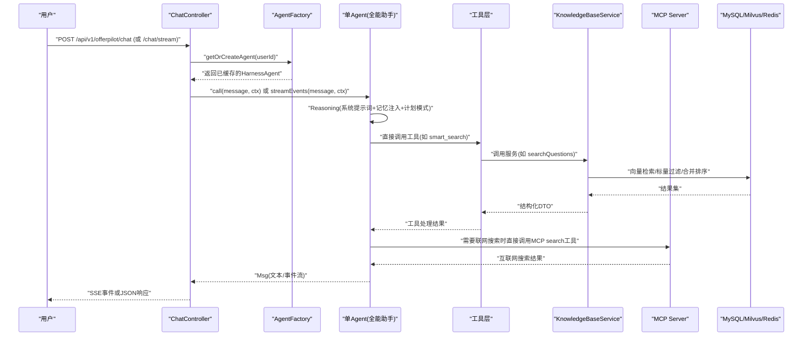
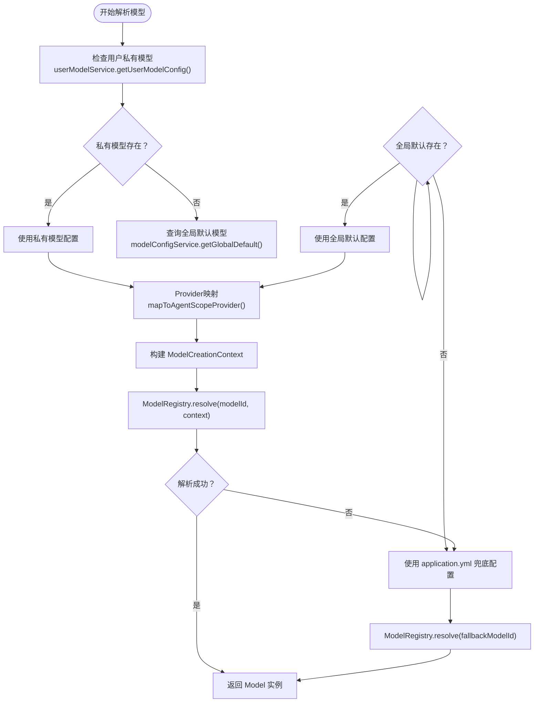
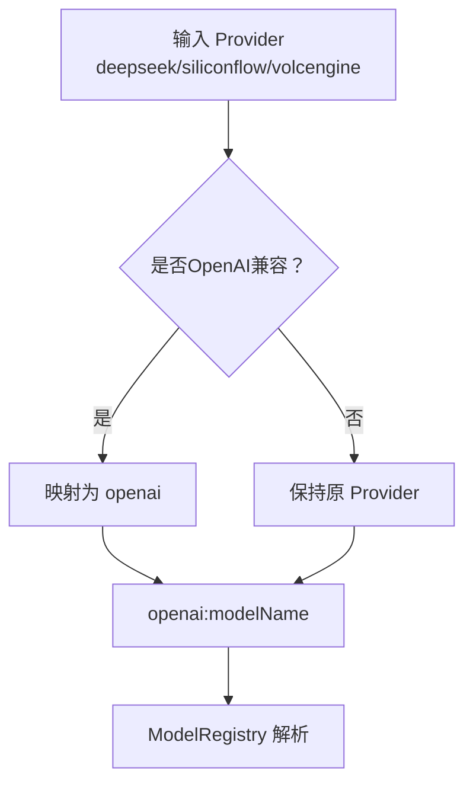
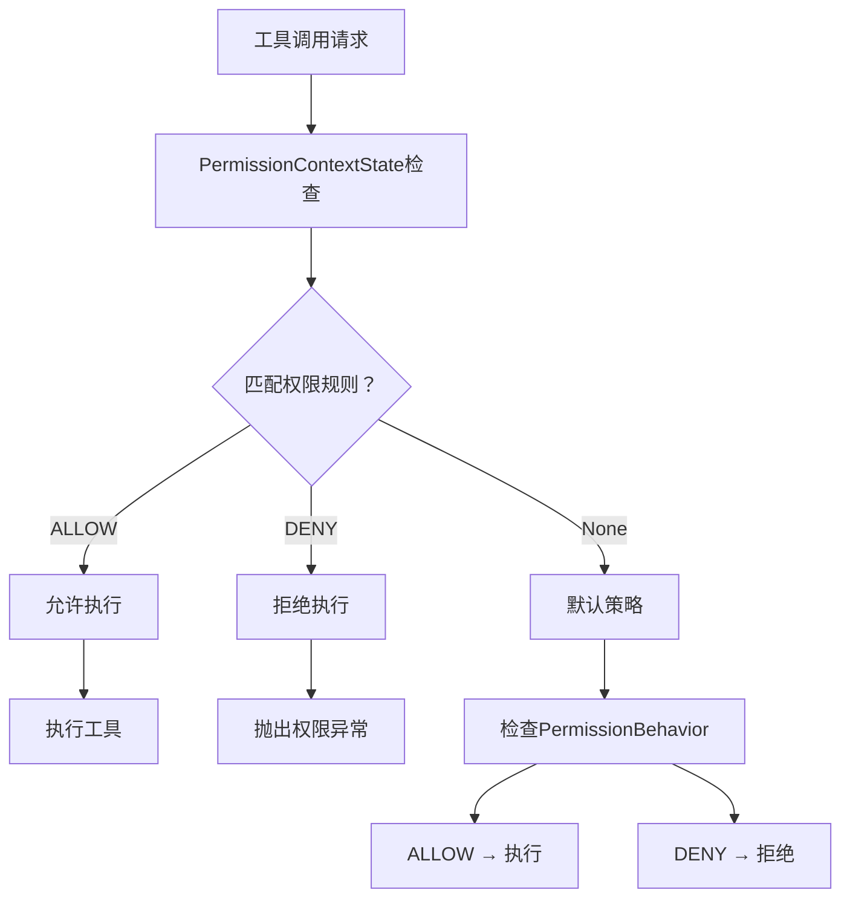
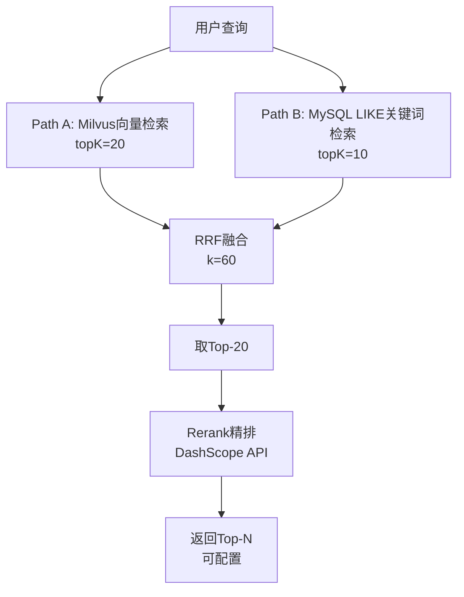

# AgentScope 核心机制深度解析

<cite>
**本文引用的文件**   
- [AgentFactory.java](file://src/main/java/com/tutorial/offerpilot/agent/AgentFactory.java)
- [tools.json](file://workspace/tools.json)
- [SmartSearchTool.java](file://src/main/java/com/tutorial/offerpilot/agent/tool/SmartSearchTool.java)
- [AnswerAnalyzeTool.java](file://src/main/java/com/tutorial/offerpilot/agent/tool/AnswerAnalyzeTool.java)
- [RerankerService.java](file://src/main/java/com/tutorial/offerpilot/service/RerankerService.java)
- [VectorSearchService.java](file://src/main/java/com/tutorial/offerpilot/service/VectorSearchService.java)
- [KnowledgeBaseService.java](file://src/main/java/com/tutorial/offerpilot/service/KnowledgeBaseService.java)
- [pom.xml](file://pom.xml)
- [application.yml](file://src/main/resources/application.yml)
</cite>

## 更新摘要
**变更内容**   
- **架构简化**：从多Agent协作模式简化为单Agent直接调用工具模式，移除了8个子Agent和复杂的调度逻辑
- **工具精简**：删除了6个六维分析工具（ConfidenceTool、KnowledgeGapTool、PriorityRankTool、ResumeQualityTool、StarCheckTool、TimeAllocationTool），保留9个核心工具
- **MCP集成优化**：采用更简洁的Agent层直接MCP协议调用架构，移除了中间服务层
- **RAG召回升级**：实现了两阶段多路并行召回+RRF融合+Rerank精排方案

## 目录
- ReActAgent 推理循环
- @Tool 工具定义与动态激活
- Msg 消息流转路径
- 智能模型解析与动态实例化
- Provider 映射与依赖管理机制
- MCP 联网搜索集成（重大更新）
- 权限控制与安全机制
- RAG 召回策略升级

## ReActAgent 推理循环
- **单Agent推理循环要点**
  - Reasoning：主Agent作为全能助手，基于系统提示词、记忆注入与计划模式进行思考，直接决定调用哪个工具或执行什么操作
  - Action：通过统一的Toolkit直接调用工具方法，无需子Agent委派；工具返回结构化POJO供LLM消费
  - Observation：所有工具结果统一序列化，LLM据此生成自然语言输出或继续下一轮推理
- **HarnessAgent.builder() 关键配置项**
  - sysPrompt：全能助手角色定义，明确"直接调用业务工具"的行为约束，列出所有可用工具及使用场景
  - model：模型标识符（provider:modelName），从配置读取，支持动态解析
  - toolkit：注册全部9个本地@Tool + MCP search，不再分组避免AgentScope分组激活问题
  - permissionContext：启用细粒度权限控制，支持工具级ALLOW/DENY规则
  - workspace：配置MCP tools.json，启用search联网搜索能力
  - middleware：TokenMonitorMiddleware、CostControlMiddleware等监控中间件
  - enablePlanMode/enableTaskList：计划模式与todo_write元工具

**章节来源**
- [AgentFactory.java:120-155](file://src/main/java/com/tutorial/offerpilot/agent/AgentFactory.java#L120-L155)
- [AgentFactory.java:212-309](file://src/main/java/com/tutorial/offerpilot/agent/AgentFactory.java#L212-L309)

## @Tool 工具定义与动态激活
- **当前保留的9个核心工具结构**
  - 类级别：@Component（Spring管理）、显式构造器注入依赖服务
  - 方法级别：@Tool(name, description)，参数使用@ToolParam(name, description)
  - 返回值：结构化DTO（dto/tool/*），框架自动序列化
- **注册机制**
  - 主Agent的Toolkit集中注册全部9个本地@Tool，不再分组注册
  - 直接调用registerMcpWebSearch()启用MCP联网搜索能力
- **9个本地@Tool全景表**
  - 名称 | 类别 | 返回类型 | 依赖注入
  - parse_resume | 简历分析 | ResumeParseResult | PDF/DOCX解析服务
  - evaluate_resume | 简历分析 | ResumeEvaluateResult | ResumeService
  - search_questions | 知识检索 | QuestionSearchResult | KnowledgeBaseService
  - search_answers | 知识检索 | AnswerSearchResult | KnowledgeBaseService
  - analyze_answer | 面试分析 | AnswerAnalysisResult | InterviewQuestionRepository
  - transcribe_audio | 面试分析 | TranscribeResult | ASR服务
  - generate_next_question | 面试分析 | NextQuestionResult | InterviewQuestionRepository / InterviewSessionRepository
  - smart_search | 统一搜索 | SmartSearchResult | KnowledgeBaseService + QueryExpansionService
  - list_knowledge_bases | 知识库管理 | KbListResult | KnowledgeBaseRepository
  - search（MCP） | 联网搜索 | 搜索结果 | MCP协议直接调用

**章节来源**
- [AgentFactory.java:160-207](file://src/main/java/com/tutorial/offerpilot/agent/AgentFactory.java#L160-L207)
- [SmartSearchTool.java:35-153](file://src/main/java/com/tutorial/offerpilot/agent/tool/SmartSearchTool.java#L35-L153)
- [AnswerAnalyzeTool.java:27-51](file://src/main/java/com/tutorial/offerpilot/agent/tool/AnswerAnalyzeTool.java#L27-L51)

## Msg 消息流转路径
- **端到端时序（用户→Controller→AgentFactory.getOrCreate→Agent.call/streamEvents）**

- **关键点**
  - ChatController负责鉴权、限流、SSE推送与同步阻塞等待agent.call().block()
  - AgentFactory使用Caffeine有界缓存（最多500个Agent，30分钟未访问淘汰）避免OOM
  - MemoryInjectMiddleware在每次推理前通过onSystemPrompt钩子加载用户长期记忆
  - 工具层通过KnowledgeBaseService统一封装多租户检索，MCP联网搜索由Agent层直接调用

**章节来源**
- [AgentFactory.java:116-118](file://src/main/java/com/tutorial/offerpilot/agent/AgentFactory.java#L116-L118)

## 智能模型解析与动态实例化

### 四级模型优先级解析机制

**更新** 新增了智能模型解析逻辑，实现了用户私有模型 > 用户默认模型 > 全局默认模型 > application.yml回退的四级优先级体系。

#### 模型解析流程


#### 核心实现细节

**ModelCreationContext动态实例化**
- 通过ModelCreationContext.builder()构建上下文，包含apiKey、baseUrl等运行时配置
- 支持动态baseUrl配置，满足不同提供商的API地址需求
- 集成ApiKeyEncryption实现API Key的安全解密

**安全处理机制**
- API Key采用加密存储，使用时动态解密
- 支持不同提供商的认证头类型和API格式
- 模型名称验证确保配置的有效性

#### 动态模型切换优势
- **实时生效**：模型配置变更后无需重启应用
- **细粒度控制**：支持用户级别的模型个性化配置
- **高可用性**：多级回退机制确保系统稳定性
- **安全性**：API Key加密存储，防止敏感信息泄露

**章节来源**
- [AgentFactory.java:383-423](file://src/main/java/com/tutorial/offerpilot/agent/AgentFactory.java#L383-L423)

## Provider 映射与依赖管理机制

### 智能 Provider 映射机制

**更新** 实现了OpenAI兼容Provider的智能映射机制，解决了AgentScope框架中部分Provider缺少独立SPI ModelProvider的问题。

#### Provider 映射规则


#### 核心实现细节

**OpenAI兼容Provider识别**
- 定义了OPENAI_COMPATIBLE_PROVIDERS常量集合：{"deepseek", "siliconflow", "volcengine"}
- 这些Provider虽然使用OpenAI兼容API，但AgentScope框架中没有独立的SPI Provider实现
- 通过mapToAgentScopeProvider()方法将这些Provider统一映射为"openai"

**8个预设Provider完整支持**
- **DashScope**：阿里百炼，OpenAI兼容，使用agentscope-extensions-model-dashscope
- **OpenAI**：官方OpenAI，使用agentscope-extensions-model-openai
- **DeepSeek**：深度求索，OpenAI兼容，映射到openai
- **SiliconFlow**：硅基流动，OpenAI兼容，映射到openai
- **VolcEngine**：火山引擎，OpenAI兼容，映射到openai
- **Anthropic**：Claude，非OpenAI兼容，使用agentscope-extensions-model-anthropic
- **Gemini**：Google Gemini，非OpenAI兼容，使用agentscope-extensions-model-gemini
- **Ollama**：本地部署，OpenAI兼容，使用agentscope-extensions-model-ollama

### 依赖管理与容错机制

**更新** 完善了Maven依赖管理和ModelRegistry解析的容错机制。

#### Maven依赖配置
- 在pom.xml中补充了4个缺失的AgentScope Model Extension依赖：
  - agentscope-extensions-model-dashscope
  - agentscope-extensions-model-anthropic
  - agentscope-extensions-model-gemini
  - agentscope-extensions-model-ollama

#### ModelRegistry解析容错
- 添加了异常捕获机制，当ModelRegistry.resolve(modelId, context)失败时自动回退
- 记录详细的警告日志，包含原始provider信息和异常详情
- 优雅降级到application.yml中的兜底配置，确保系统可用性

#### 默认配置优化
- 将application.yml中的默认provider从deepseek改为dashscope
- 将默认model-name从deepseek-chat改为qwen-max
- 使用DashScope作为默认提供商，提供更好的稳定性和兼容性

**章节来源**
- [AgentFactory.java:429-434](file://src/main/java/com/tutorial/offerpilot/agent/AgentFactory.java#L429-L434)
- [pom.xml:146-165](file://pom.xml#L146-L165)
- [application.yml:36-39](file://src/main/resources/application.yml#L36-L39)

## MCP 联网搜索集成（重大更新）

### 简化的动态工具注册机制

**重大更新** 移除了WebSearchFallbackService中间服务层，采用更简洁的Agent层直接MCP协议调用架构。

#### 新架构设计
```mermaid
flowchart TD
A[AgentFactory.buildToolkit()] --> B[registerMcpWebSearch(toolkit)]
B --> C[McpClientBuilder.create("web-search")]
C --> D[streamableHttpTransport(mcpUrl)]
D --> E[buildAsync().block()]
E --> F[toolkit.registration().mcpClient(mcpClient).apply()]
F --> G[动态注册search工具]
G --> H[Agent层直接调用MCP协议]
```

#### 核心实现特性
- **显式注册**：通过registerMcpWebSearch()方法主动连接MCP服务器
- **Streamable HTTP协议**：使用标准的HTTP请求-响应模式
- **超时控制**：配置60秒请求超时和30秒初始化超时
- **错误处理**：完善的异常捕获和降级策略
- **异步构建**：使用buildAsync()配合.block()实现异步客户端构建

#### 工具名称标准化
- **统一命名**：MCP搜索工具使用`search`名称
- **权限配置**：PermissionContextState中添加`addAllowRule("search", ...)`
- **单Agent白名单**：主Agent直接获得search工具的访问权限

**章节来源**
- [AgentFactory.java:351-378](file://src/main/java/com/tutorial/offerpilot/agent/AgentFactory.java#L351-L378)
- [AgentFactory.java:338-339](file://src/main/java/com/tutorial/offerpilot/agent/AgentFactory.java#L338-L339)

### 架构简化说明

**重要变更** WebSearchFallbackService类已被完全删除，系统架构得到显著简化。

#### 删除的服务功能
- ~~WebSearchFallbackService类~~：中间服务层已移除
- ~~SSE流式传输实现~~：不再需要复杂的SSE解析逻辑
- ~~双重协议支持~~：简化为单一的Streamable HTTP协议
- ~~会话管理~~：MCP客户端由框架统一管理

#### 新的调用流程
- **Agent层直接调用**：Agent通过注册的MCP工具直接调用网络搜索
- **简化错误处理**：统一的异常处理机制
- **降低耦合度**：减少了服务间的依赖关系

#### 配置文件更新
```json
{
  "mcpServers": {
    "web-search": {
      "transport": "streamable-http",
      "url": "http://localhost:3002/mcp",
      "env": {
        "DEFAULT_SEARCH_ENGINE": "bing"
      }
    }
  }
}
```

**章节来源**
- [tools.json:1-12](file://workspace/tools.json#L1-L12)

## 权限控制与安全机制

### PermissionContextState细粒度权限控制

**新增** 实现了基于PermissionContextState的工具级访问控制，支持ALLOW/DENY规则和行为策略。

#### 权限控制架构


#### 权限规则配置
- **工具白名单**：为单Agent配置允许访问的所有工具列表
- **行为策略**：
  - PermissionBehavior.ALLOW：直接允许执行
  - PermissionBehavior.DENY：明确拒绝执行
  - PermissionBehavior.REQUIRE_APPROVAL：需要人工审批
- **上下文感知**：支持基于用户设置、会话状态等的动态权限判断

#### 安全最佳实践
- **最小权限原则**：每个工具仅获得完成任务所需的最小权限
- **显式授权**：所有工具调用都需要明确的权限规则
- **审计追踪**：记录所有权限决策和执行结果
- **动态调整**：支持运行时修改权限规则

**章节来源**
- [AgentFactory.java:315-343](file://src/main/java/com/tutorial/offerpilot/agent/AgentFactory.java#L315-L343)

## RAG 召回策略升级

### 两阶段多路并行召回+RRF融合+Rerank精排方案

**重大更新** 将现有的单路向量检索升级为行业标准的两阶段多路并行召回+RRF融合+Rerank精排方案。

#### 目标架构


#### 核心实现特性

**多路并行召回**
- **Path A**：Milvus向量检索（PUBLIC + 用户PRIVATE KBs），topK=20
- **Path B**：MySQL InterviewQuestion LIKE关键词检索，不再是回退而是并行路径
- **并发执行**：使用CompletableFuture.supplyAsync实现并行召回

**RRF融合算法**
- 使用Reciprocal Rank Fusion公式：score(d) = Σ 1 / (k + rank_i(d))
- k值设为60，不受各路score尺度差异影响
- 基于docId + chunkIndex去重，按RRF score降序排列

**Rerank精排**
- 调用DashScope Rerank API（OpenAI兼容接口）
- 对Top-20候选进行语义相关性重排序
- 支持配置开关：agentscope.rerank.enabled=false时跳过
- 失败降级：API异常时返回原始顺序，不阻断检索链路

#### 技术实现细节

**分数归一化处理**
- 新增normalizeCosineScore(float distance)方法：score = 1 - distance/2
- 将Milvus余弦距离转换为相似度分数

**元数据过滤增强**
- SearchRequest.buildFilterExpr()恢复过滤逻辑
- 支持category、difficulty、position等多维度过滤
- 多个条件用&&拼接，提升检索精度

**容错与降级机制**
- 任一路径异常不影响其他路径执行
- Rerank API失败时自动回退到原始顺序
- 支持配置化的topN和scoreThreshold阈值

**章节来源**
- [KnowledgeBaseService.java:258-280](file://src/main/java/com/tutorial/offerpilot/service/KnowledgeBaseService.java#L258-L280)
- [VectorSearchService.java:134-185](file://src/main/java/com/tutorial/offerpilot/service/VectorSearchService.java#L134-L185)
- [RerankerService.java:111-151](file://src/main/java/com/tutorial/offerpilot/service/RerankerService.java#L111-L151)