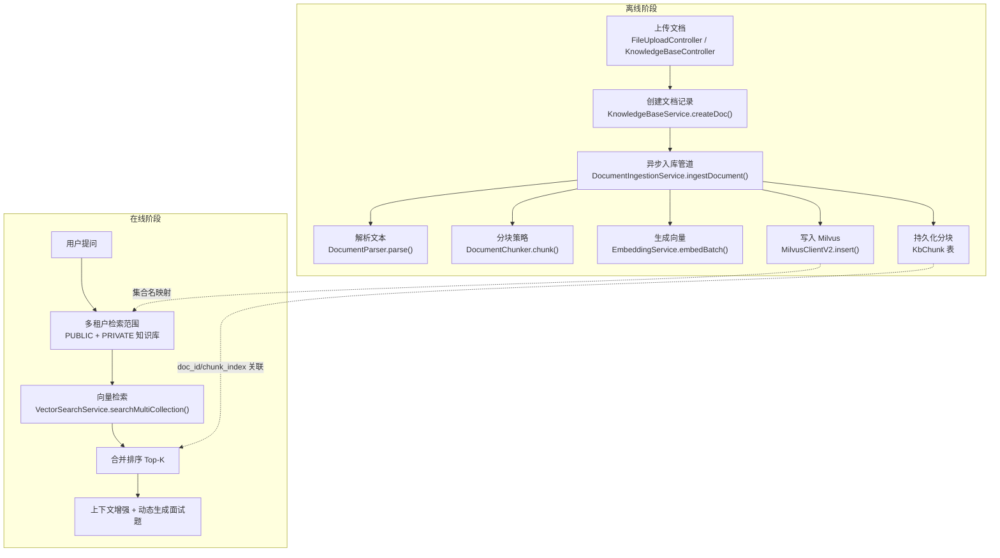
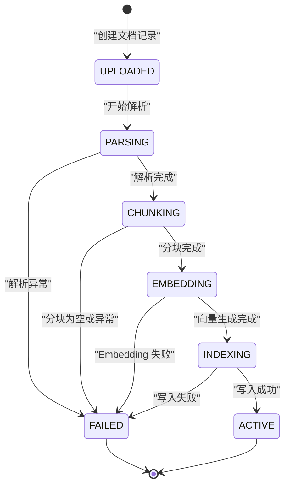
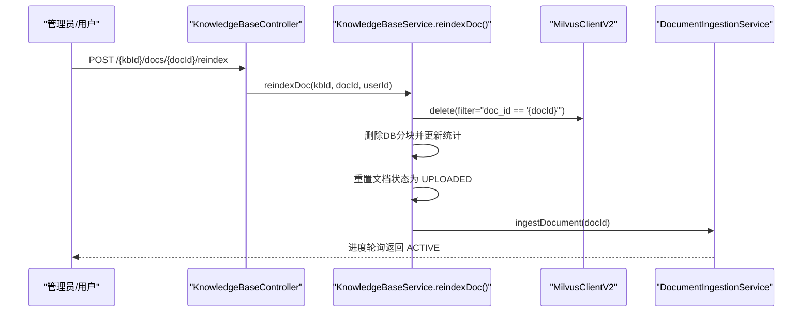
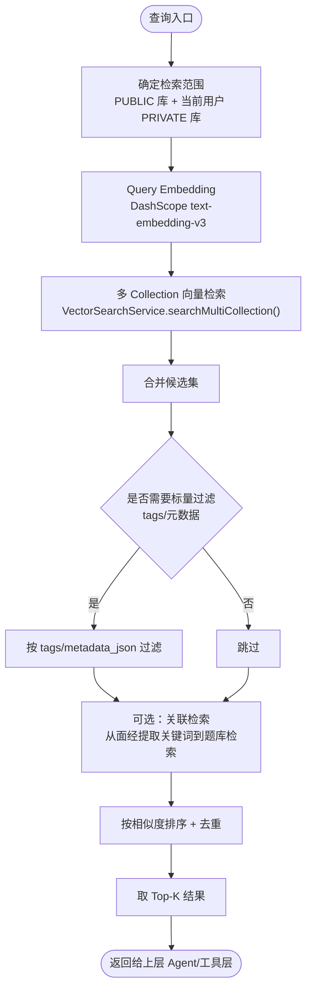
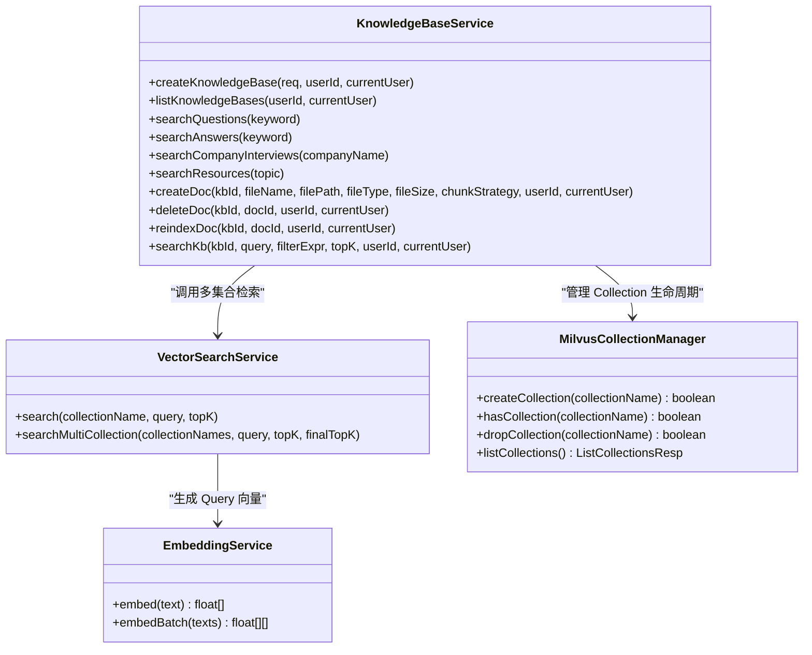
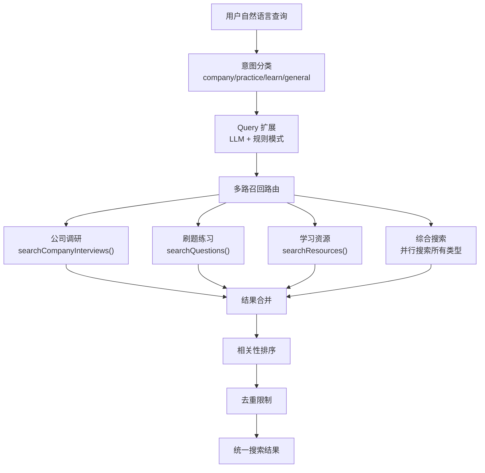
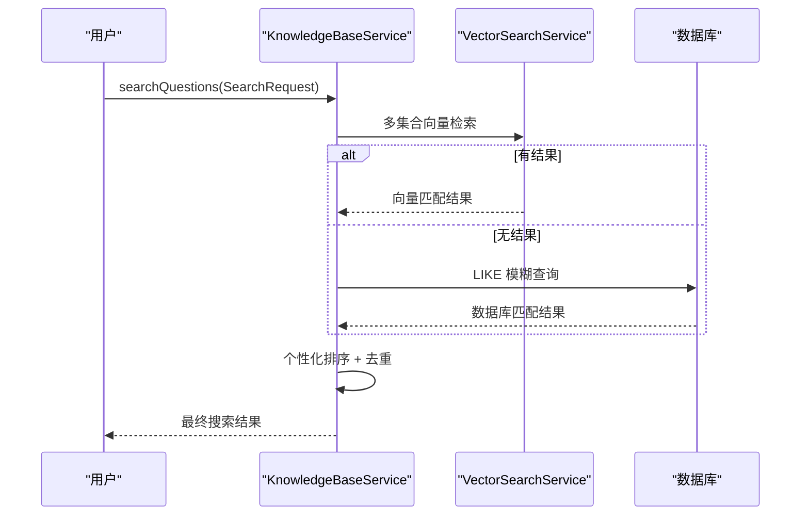
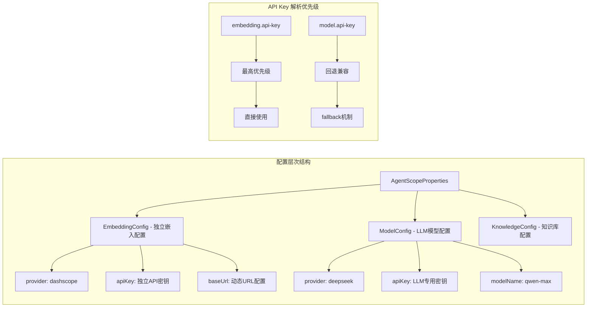

# RAG 面试题处理全链路

<cite>
**本文引用的文件列表**
- [Documents/03-详细设计说明书.md](file://Documents/03-详细设计说明书.md)
- [src/main/java/com/tutorial/offerpilot/service/ingestion/DocumentIngestionService.java](file://src/main/java/com/tutorial/offerpilot/service/ingestion/DocumentIngestionService.java)
- [src/main/java/com/tutorial/offerpilot/service/ingestion/DocumentParser.java](file://src/main/java/com/tutorial/offerpilot/service/ingestion/DocumentParser.java)
- [src/main/java/com/tutorial/offerpilot/service/ingestion/DocumentChunker.java](file://src/main/java/com/tutorial/offerpilot/service/ingestion/DocumentChunker.java)
- [src/main/java/com/tutorial/offerpilot/service/EmbeddingService.java](file://src/main/java/com/tutorial/offerpilot/service/EmbeddingService.java)
- [src/main/java/com/tutorial/offerpilot/config/AgentScopeProperties.java](file://src/main/java/com/tutorial/offerpilot/config/AgentScopeProperties.java)
- [src/main/resources/application.yml](file://src/main/resources/application.yml)
- [src/main/java/com/tutorial/offerpilot/service/KnowledgeBaseService.java](file://src/main/java/com/tutorial/offerpilot/service/KnowledgeBaseService.java)
- [src/main/java/com/tutorial/offerpilot/service/MilvusCollectionManager.java](file://src/main/java/com/tutorial/offerpilot/service/MilvusCollectionManager.java)
- [src/main/java/com/tutorial/offerpilot/service/VectorSearchService.java](file://src/main/java/com/tutorial/offerpilot/service/VectorSearchService.java)
- [src/main/java/com/tutorial/offerpilot/entity/KbChunk.java](file://src/main/java/com/tutorial/offerpilot/entity/KbChunk.java)
- [src/main/java/com/tutorial/offerpilot/entity/KbDocument.java](file://src/main/java/com/tutorial/offerpilot/entity/KbDocument.java)
- [src/main/java/com/tutorial/offerpilot/entity/KbKnowledgeBase.java](file://src/main/java/com/tutorial/offerpilot/entity/KbKnowledgeBase.java)
- [src/main/java/com/tutorial/offerpilot/controller/FileUploadController.java](file://src/main/java/com/tutorial/offerpilot/controller/FileUploadController.java)
- [src/main/java/com/tutorial/offerpilot/controller/KnowledgeBaseController.java](file://src/main/java/com/tutorial/offerpilot/controller/KnowledgeBaseController.java)
- [src/main/java/com/tutorial/offerpilot/agent/tool/SmartSearchTool.java](file://src/main/java/com/tutorial/offerpilot/agent/tool/SmartSearchTool.java)
- [src/main/java/com/tutorial/offerpilot/service/PersonalizedRankService.java](file://src/main/java/com/tutorial/offerpilot/service/PersonalizedRankService.java)
- [src/main/java/com/tutorial/offerpilot/dto/tool/SearchRequest.java](file://src/main/java/com/tutorial/offerpilot/dto/tool/SearchRequest.java)
- [src/main/java/com/tutorial/offerpilot/service/QueryExpansionService.java](file://src/main/java/com/tutorial/offerpilot/service/QueryExpansionService.java)
- [src/main/java/com/tutorial/offerpilot/service/SearchAnalyticsService.java](file://src/main/java/com/tutorial/offerpilot/service/SearchAnalyticsService.java)
- [src/main/java/com/tutorial/offerpilot/entity/SearchToolLog.java](file://src/main/java/com/tutorial/offerpilot/entity/SearchToolLog.java)
- [src/main/java/com/tutorial/offerpilot/entity/SearchFeedback.java](file://src/main/java/com/tutorial/offerpilot/entity/SearchFeedback.java)
- [src/main/java/com/tutorial/offerpilot/repository/SearchToolLogRepository.java](file://src/main/java/com/tutorial/offerpilot/repository/SearchToolLogRepository.java)
- [src/main/java/com/tutorial/offerpilot/controller/SearchStatsController.java](file://src/main/java/com/tutorial/offerpilot/controller/SearchStatsController.java)
- [src/main/java/com/tutorial/offerpilot/config/RedisConfig.java](file://src/main/java/com/tutorial/offerpilot/config/RedisConfig.java)
- [src/main/java/com/tutorial/offerpilot/service/SearchResultCacheService.java](file://src/main/java/com/tutorial/offerpilot/service/SearchResultCacheService.java)
</cite>

## 更新摘要
**变更内容**   
- 移除了WebSearchFallbackService类及其相关网络搜索兜底逻辑（删除287行代码）
- KnowledgeBaseService搜索方法简化为仅本地数据检索（Milvus + DB LIKE）
- 网络搜索决策权完全回归到Agent/LLM层的SmartSearchTool和MCP协议
- 更新了搜索流程图和相关章节，明确服务层职责边界

## 目录
- RAG 全链路架构
- 离线阶段：数据预处理与入库
- 离线阶段：向量索引构建
- 在线阶段：多路召回
- 搜索工具链增强架构
- RAG核心Bug修复

## RAG 全链路架构
> 绘制离线入库 + 在线检索的双阶段 Mermaid 流程图



图示来源
- [src/main/java/com/tutorial/offerpilot/controller/FileUploadController.java:1-49](file://src/main/java/com/tutorial/offerpilot/controller/FileUploadController.java#L1-L49)
- [src/main/java/com/tutorial/offerpilot/controller/KnowledgeBaseController.java:1-168](file://src/main/java/com/tutorial/offerpilot/controller/KnowledgeBaseController.java#L1-L168)
- [src/main/java/com/tutorial/offerpilot/service/KnowledgeBaseService.java:416-443](file://src/main/java/com/tutorial/offerpilot/service/KnowledgeBaseService.java#L416-L443)
- [src/main/java/com/tutorial/offerpilot/service/ingestion/DocumentIngestionService.java:46-145](file://src/main/java/com/tutorial/offerpilot/service/ingestion/DocumentIngestionService.java#L46-L145)
- [src/main/java/com/tutorial/offerpilot/service/ingestion/DocumentParser.java:29-37](file://src/main/java/com/tutorial/offerpilot/service/ingestion/DocumentParser.java#L29-L37)
- [src/main/java/com/tutorial/offerpilot/service/ingestion/DocumentChunker.java:25-43](file://src/main/java/com/tutorial/offerpilot/service/ingestion/DocumentChunker.java#L25-L43)
- [src/main/java/com/tutorial/offerpilot/service/EmbeddingService.java:62-74](file://src/main/java/com/tutorial/offerpilot/service/EmbeddingService.java#L62-L74)
- [src/main/java/com/tutorial/offerpilot/service/VectorSearchService.java:56-78](file://src/main/java/com/tutorial/offerpilot/service/VectorSearchService.java#L56-L78)

章节来源
- [Documents/03-详细设计说明书.md:42-109](file://Documents/03-详细设计说明书.md#L42-L109)
- [src/main/java/com/tutorial/offerpilot/controller/FileUploadController.java:28-47](file://src/main/java/com/tutorial/offerpilot/controller/FileUploadController.java#L28-L47)
- [src/main/java/com/tutorial/offerpilot/controller/KnowledgeBaseController.java:90-109](file://src/main/java/com/tutorial/offerpilot/controller/KnowledgeBaseController.java#L90-L109)
- [src/main/java/com/tutorial/offerpilot/service/KnowledgeBaseService.java:416-443](file://src/main/java/com/tutorial/offerpilot/service/KnowledgeBaseService.java#L416-L443)
- [src/main/java/com/tutorial/offerpilot/service/ingestion/DocumentIngestionService.java:46-145](file://src/main/java/com/tutorial/offerpilot/service/ingestion/DocumentIngestionService.java#L46-L145)
- [src/main/java/com/tutorial/offerpilot/service/ingestion/DocumentParser.java:29-37](file://src/main/java/com/tutorial/offerpilot/service/ingestion/DocumentParser.java#L29-L37)
- [src/main/java/com/tutorial/offerpilot/service/ingestion/DocumentChunker.java:25-43](file://src/main/java/com/tutorial/offerpilot/service/ingestion/DocumentChunker.java#L25-L43)
- [src/main/java/com/tutorial/offerpilot/service/EmbeddingService.java:62-74](file://src/main/java/com/tutorial/offerpilot/service/EmbeddingService.java#L62-L74)
- [src/main/java/com/tutorial/offerpilot/service/VectorSearchService.java:56-78](file://src/main/java/com/tutorial/offerpilot/service/VectorSearchService.java#L56-L78)

## 离线阶段：数据预处理与入库
> 展示 5 阶段异步入库管道的 Mermaid 状态图（UPLOADED→PARSING→CHUNKING→EMBEDDING→INDEXING→ACTIVE）
> 说明 DocumentParser 的 4 种格式解析（PDF/PDFBox, DOCX/POI, MD, TXT）
> 说明 DocumentChunker 的 4 种分块策略及自动检测逻辑
> 说明 EmbeddingService 的配置管理增强与 DashScope text-embedding-v3 调用（单条/批量，最多 25 条/次）
> 展示 DocumentIngestionService 的核心入库代码流程



- 文档解析器支持四种格式：Markdown、TXT、PDF（PDFBox）、DOCX（Apache POI）。解析后输出纯文本，供后续分块使用。
- 分块策略包含 AUTO、BY_QUESTION、BY_HEADING、BY_SIZE。AUTO 会统计"---"分隔符和 Markdown 标题数量，自动选择最合适的策略；BY_QUESTION 按"---"切题；BY_HEADING 按 #/##/### 切节；BY_SIZE 为固定大小滑动窗口兜底。
- **更新** Embedding 服务现已支持独立的配置管理，通过 `agentscope.embedding.*` 配置项进行设置。API Key 采用智能解析机制：优先使用 `embedding.api-key`，未配置时自动回退到 `model.api-key`。支持动态 URL 配置，默认调用 DashScope text-embedding-v3 API，提供单条与批量接口，批量上限为 25 条/次，内部自动分批。
- 异步入库管道由 @Async 驱动，顺序执行 PARSING → CHUNKING → EMBEDDING → INDEXING → ACTIVE，任一阶段异常均置为 FAILED 并记录错误信息。

**章节来源**
- [src/main/java/com/tutorial/offerpilot/service/ingestion/DocumentParser.java:29-37](file://src/main/java/com/tutorial/offerpilot/service/ingestion/DocumentParser.java#L29-L37)
- [src/main/java/com/tutorial/offerpilot/service/ingestion/DocumentChunker.java:25-43](file://src/main/java/com/tutorial/offerpilot/service/ingestion/DocumentChunker.java#L25-L43)
- [src/main/java/com/tutorial/offerpilot/service/EmbeddingService.java:37-58](file://src/main/java/com/tutorial/offerpilot/service/EmbeddingService.java#L37-L58)
- [src/main/java/com/tutorial/offerpilot/config/AgentScopeProperties.java:58-66](file://src/main/java/com/tutorial/offerpilot/config/AgentScopeProperties.java#L58-L66)
- [src/main/resources/application.yml:57-63](file://src/main/resources/application.yml#L57-L63)
- [src/main/java/com/tutorial/offerpilot/service/ingestion/DocumentIngestionService.java:46-145](file://src/main/java/com/tutorial/offerpilot/service/ingestion/DocumentIngestionService.java#L46-L145)

## 离线阶段：向量索引构建
> 说明 Milvus Collection 的动态创建（通用 Schema + IVF_FLAT 索引）
> 说明文档与 Milvus offset 的双向映射（kb_chunk.milvus_offset）
> 说明重建索引流程（delete by doc_id + re-ingest）

- **更新** 动态创建 Collection：在创建知识库时，系统现在会自动为每个知识库分配一个独立的 Milvus Collection，名称形如 kb_{kbId}。Schema 包含 id（自增主键）、doc_id、chunk_index、content、vector（1024 维浮点向量）等字段。**关键改进**：Collection 创建后会自动创建 IVF_FLAT 索引（nlist=128）并加载到内存中，确保首次查询即可正常响应。
- 双向映射：入库时将 KbChunk 的 milvus_offset 保存至数据库，用于后续删除或定位向量；同时 Milvus 行中保留 doc_id 与 chunk_index，便于按文档维度进行过滤与重建。
- 重建索引：先按 doc_id 条件删除旧向量，再删除 DB 中的对应分块，重置文档状态为 UPLOADED，最后重新触发入库管道完成重索引。



图示来源
- [src/main/java/com/tutorial/offerpilot/service/MilvusCollectionManager.java:34-78](file://src/main/java/com/tutorial/offerpilot/service/MilvusCollectionManager.java#L34-78)
- [src/main/java/com/tutorial/offerpilot/entity/KbChunk.java:38-39](file://src/main/java/com/tutorial/offerpilot/entity/KbChunk.java#L38-39)
- [src/main/java/com/tutorial/offerpilot/service/KnowledgeBaseService.java:509-558](file://src/main/java/com/tutorial/offerpilot/service/KnowledgeBaseService.java#L509-558)
- [src/main/java/com/tutorial/offerpilot/service/ingestion/DocumentIngestionService.java:46-145](file://src/main/java/com/tutorial/offerpilot/service/ingestion/DocumentIngestionService.java#L46-L145)

章节来源
- [src/main/java/com/tutorial/offerpilot/service/MilvusCollectionManager.java:34-78](file://src/main/java/com/tutorial/offerpilot/service/MilvusCollectionManager.java#L34-78)
- [src/main/java/com/tutorial/offerpilot/entity/KbChunk.java:38-39](file://src/main/java/com/tutorial/offerpilot/entity/KbChunk.java#L38-39)
- [src/main/java/com/tutorial/offerpilot/service/KnowledgeBaseService.java:509-558](file://src/main/java/com/tutorial/offerpilot/service/KnowledgeBaseService.java#L509-558)

## 在线阶段：多路召回
> 绘制多路召回策略的 Mermaid 流程图（向量检索 + 标量过滤 + 关联检索 → 合并去重排序）
> 说明 KnowledgeBase



- **更新** 多租户检索范围：系统根据当前用户身份，聚合所有 PUBLIC 知识库与其 PRIVATE 知识库对应的 Milvus Collection 名称，形成待检索集合列表。
- **更新** 向量检索：对每个 Collection 执行向量相似度检索，返回 doc_id、chunk_index、content 以及距离分数。**性能优化**：现在支持一次性多 Collection 合并检索，避免逐个遍历的性能损耗。
- **更新** 标量过滤：可在检索参数中附加 tags 或 metadata_json 条件，进一步缩小结果集。**注意**：当前 category/difficulty 字段尚未加入 Milvus Collection Schema，暂时禁用标量过滤，改为在应用层后过滤。
- 关联检索：从公司面经等文档中提取高频考点关键词，作为二次检索条件，命中题库集合的具体题目，提升相关性。
- 合并排序：将所有 Collection 的结果合并，按相似度排序并去重，最终返回 Top-K。



图示来源
- [src/main/java/com/tutorial/offerpilot/service/KnowledgeBaseService.java:157-201](file://src/main/java/com/tutorial/offerpilot/service/KnowledgeBaseService.java#L157-201)
- [src/main/java/com/tutorial/offerpilot/service/VectorSearchService.java:56-78](file://src/main/java/com/tutorial/offerpilot/service/VectorSearchService.java#L56-78)
- [src/main/java/com/tutorial/offerpilot/service/EmbeddingService.java:51-57](file://src/main/java/com/tutorial/offerpilot/service/EmbeddingService.java#L51-57)
- [src/main/java/com/tutorial/offerpilot/service/MilvusCollectionManager.java:34-78](file://src/main/java/com/tutorial/offerpilot/service/MilvusCollectionManager.java#L34-78)

章节来源
- [src/main/java/com/tutorial/offerpilot/service/KnowledgeBaseService.java:157-201](file://src/main/java/com/tutorial/offerpilot/service/KnowledgeBaseService.java#L157-201)
- [src/main/java/com/tutorial/offerpilot/service/VectorSearchService.java:56-78](file://src/main/java/com/tutorial/offerpilot/service/VectorSearchService.java#L56-78)
- [src/main/java/com/tutorial/offerpilot/service/EmbeddingService.java:51-57](file://src/main/java/com/tutorial/offerpilot/service/EmbeddingService.java#L51-57)
- [src/main/java/com/tutorial/offerpilot/service/MilvusCollectionManager.java:34-78](file://src/main/java/com/tutorial/offerpilot/service/MilvusCollectionManager.java#L34-78)

## 搜索工具链增强架构

> 详细说明搜索工具链的架构设计，包括统一智能搜索入口、多维度过滤、智能查询扩展和个性化排序

### 统一智能搜索入口 - SmartSearchTool

**更新** SmartSearchTool 作为统一的智能搜索入口，替代多个独立的 search_* 工具，提供单一 smart_search 方法。该工具内部自动完成意图分类、Query 扩展、多路召回和结果整合。



**图示来源**
- [src/main/java/com/tutorial/offerpilot/agent/tool/SmartSearchTool.java:39-157](file://src/main/java/com/tutorial/offerpilot/agent/tool/SmartSearchTool.java#L39-157)

**章节来源**
- [src/main/java/com/tutorial/offerpilot/agent/tool/SmartSearchTool.java:1-209](file://src/main/java/com/tutorial/offerpilot/agent/tool/SmartSearchTool.java#L1-L209)

### 多维度过滤 - SearchRequest 对象

**更新** 引入结构化的 SearchRequest 对象，替代单一的 keyword 字符串，支持多维度过滤和个性化搜索。

| 字段 | 类型 | 描述 | 示例值 |
|------|------|------|--------|
| keywords | String | 搜索关键词，多个用空格分隔 | "Java并发 多线程" |
| category | String | 分类过滤 | "专业技能/项目经验/情景分析" |
| difficulty | String | 难度过滤 | "easy/medium/hard" |
| company | String | 公司名称过滤 | "字节跳动/阿里巴巴" |
| position | String | 岗位名称过滤 | "后端开发/算法工程师" |
| topK | Integer | 返回数量，默认10，最大50 | 10 |
| userId | String | 用户ID（用于个性化排序） | "user-123" |

**章节来源**
- [src/main/java/com/tutorial/offerpilot/dto/tool/SearchRequest.java:1-62](file://src/main/java/com/tutorial/offerpilot/dto/tool/SearchRequest.java#L1-L62)

### Query 扩展服务 - QueryExpansionService

**更新** QueryExpansionService 服务，通过 DashScope LLM 将短关键词扩展为多条检索短语，提升召回率和多样性。

- **LLM 扩展模式**：使用 qwen-turbo 轻量模型，将输入 "Java并发" 扩展为 ["Java并发面试题", "线程池原理", "volatile关键字"]
- **规则模式兜底**：当 LLM 调用失败时，自动回退到规则模式，通过关键词拆分和常见后缀追加生成扩展词
- **配置开关**：通过 `agentscope.search.query-expansion.enabled=true` 控制是否启用

**章节来源**
- [src/main/java/com/tutorial/offerpilot/service/QueryExpansionService.java:1-214](file://src/main/java/com/tutorial/offerpilot/service/QueryExpansionService.java#L1-L214)

### 个性化排序 - PersonalizedRankService

**更新** PersonalizedRankService 服务，基于用户的知识掌握薄弱点对搜索结果进行加权排序，弱项相关的题目优先展示。

- **薄弱点识别**：从 KnowledgeMastery 表中筛选 score < 60 的知识点
- **权重提升**：相关内容的原始分数 × 1.3 倍
- **实时计算**：每次搜索时动态计算个性化权重

**章节来源**
- [src/main/java/com/tutorial/offerpilot/service/PersonalizedRankService.java:1-71](file://src/main/java/com/tutorial/offerpilot/service/PersonalizedRankService.java#L1-L71)

### 搜索分析与统计

**更新** 完整的搜索分析和统计功能，包括搜索日志记录、反馈收集和统计分析。

#### 搜索日志记录
- **SearchToolLog 实体**：记录每次搜索的详细指标，包括各来源命中数和耗时
- **SearchAnalyticsService**：提供搜索日志持久化和统计分析接口
- **SearchStatsController**：暴露 `/api/v1/kb/search/stats` 统计接口

#### 搜索反馈收集
- **SearchFeedback 实体**：追踪用户是否采纳搜索结果，用于评估搜索质量
- **反馈字段**：包含 queryText、toolName、resultSource、helpful 等关键信息

#### 数据库表结构
- **op_search_tool_log**：搜索工具链日志表
- **op_search_feedback**：搜索反馈记录表

**章节来源**
- [src/main/java/com/tutorial/offerpilot/service/SearchAnalyticsService.java:1-138](file://src/main/java/com/tutorial/offerpilot/service/SearchAnalyticsService.java#L1-L138)
- [src/main/java/com/tutorial/offerpilot/entity/SearchToolLog.java:1-60](file://src/main/java/com/tutorial/offerpilot/entity/SearchToolLog.java#L1-L60)
- [src/main/java/com/tutorial/offerpilot/entity/SearchFeedback.java:1-47](file://src/main/java/com/tutorial/offerpilot/entity/SearchFeedback.java#L1-L47)
- [src/main/java/com/tutorial/offerpilot/repository/SearchToolLogRepository.java:1-21](file://src/main/java/com/tutorial/offerpilot/repository/SearchToolLogRepository.java#L1-L21)
- [src/main/java/com/tutorial/offerpilot/controller/SearchStatsController.java:1-34](file://src/main/java/com/tutorial/offerpilot/controller/SearchStatsController.java#L1-L34)

### 简化的搜索流程

**更新** KnowledgeBaseService 中的搜索方法现已简化为仅本地数据检索，移除了自动网络搜索回退逻辑：



**图示来源**
- [src/main/java/com/tutorial/offerpilot/service/KnowledgeBaseService.java:182-249](file://src/main/java/com/tutorial/offerpilot/service/KnowledgeBaseService.java#L182-L249)

**章节来源**
- [src/main/java/com/tutorial/offerpilot/service/KnowledgeBaseService.java:50-249](file://src/main/java/com/tutorial/offerpilot/service/KnowledgeBaseService.java#L50-L249)

## RAG核心Bug修复

> 详细说明RAG系统中三个阻断性Bug的修复方案和实施细节

### Bug #1 + #2：MilvusCollectionManager 集成到 KnowledgeBaseService

**修复内容**：解决了知识库创建时Milvus Collection未自动创建和加载的问题

- **构造函数注入**：KnowledgeBaseService 构造函数新增第13个参数 `MilvusCollectionManager milvusCollectionManager`
- **同步创建流程**：在 `createKnowledgeBase()` 方法中，`kbRepo.save(kb)` 之后立即调用 `milvusCollectionManager.createCollection(collectionName)`
- **自动索引创建**：Collection 创建时自动创建 IVF_FLAT 索引（nlist=128），metricType=COSINE
- **内存加载**：Collection 创建后立即加载到内存，确保首次查询即可正常响应

**章节来源**
- [src/main/java/com/tutorial/offerpilot/service/KnowledgeBaseService.java:65-91](file://src/main/java/com/tutorial/offerpilot/service/KnowledgeBaseService.java#L65-L91)
- [src/main/java/com/tutorial/offerpilot/service/KnowledgeBaseService.java:116-123](file://src/main/java/com/tutorial/offerpilot/service/KnowledgeBaseService.java#L116-L123)
- [src/main/java/com/tutorial/offerpilot/service/MilvusCollectionManager.java:37-97](file://src/main/java/com/tutorial/offerpilot/service/MilvusCollectionManager.java#L37-L97)

### Bug #3：SearchRequest.buildFilterExpr() 字段不存在

**修复内容**：移除了对不存在的category和difficulty字段的引用，避免Milvus查询错误

- **问题原因**：category和difficulty字段尚未加入Milvus Collection Schema
- **修复方案**：`buildFilterExpr()` 方法现在返回null，禁用Milvus标量过滤
- **降级策略**：改为在应用层进行后过滤，保证功能可用性
- **未来规划**：待Schema扩展后恢复过滤逻辑

**章节来源**
- [src/main/java/com/tutorial/offerpilot/dto/tool/SearchRequest.java:42-44](file://src/main/java/com/tutorial/offerpilot/dto/tool/SearchRequest.java#L42-L44)

### 多Collection合并检索优化

**优化内容**：将逐个KB遍历的旧逻辑替换为一次性多Collection合并检索

- **性能提升**：从N次独立检索优化为1次批量检索
- **统一接口**：所有搜索方法（searchQuestions、searchAnswers、searchCompanyInterviews、searchResources）统一使用 `searchMultiCollection`
- **容错机制**：单个Collection检索失败不影响其他Collection的检索结果

**章节来源**
- [src/main/java/com/tutorial/offerpilot/service/KnowledgeBaseService.java:196-221](file://src/main/java/com/tutorial/offerpilot/service/KnowledgeBaseService.java#L196-L221)
- [src/main/java/com/tutorial/offerpilot/service/VectorSearchService.java:84-106](file://src/main/java/com/tutorial/offerpilot/service/VectorSearchService.java#L84-L106)

### Redis缓存机制增强

**增强内容**：为搜索接口添加5分钟TTL缓存，提升查询性能

- **缓存配置**：RedisConfig中为四个搜索方法分别配置5分钟TTL
- **注解使用**：搜索方法添加 `@Cacheable` 注解，文档操作添加 `@CacheEvict` 注解
- **缓存策略**：相同查询条件直接返回缓存结果，减少重复计算

**章节来源**
- [src/main/java/com/tutorial/offerpilot/config/RedisConfig.java:29-48](file://src/main/java/com/tutorial/offerpilot/config/RedisConfig.java#L29-48)
- [src/main/java/com/tutorial/offerpilot/service/KnowledgeBaseService.java:176-182](file://src/main/java/com/tutorial/offerpilot/service/KnowledgeBaseService.java#L176-L182)
- [src/main/java/com/tutorial/offerpilot/service/KnowledgeBaseService.java:694-722](file://src/main/java/com/tutorial/offerpilot/service/KnowledgeBaseService.java#L694-L722)

## 新增：Embedding 配置管理增强

> 详细说明新的独立配置架构和智能 API Key 解析机制

### 配置结构概览

**更新** EmbeddingService 现已实现完全独立的配置管理，不再依赖 LLM Model 配置。新的配置架构通过 `AgentScopeProperties.EmbeddingConfig` 类实现，支持以下核心特性：



**图示来源**
- [src/main/java/com/tutorial/offerpilot/config/AgentScopeProperties.java:58-66](file://src/main/java/com/tutorial/offerpilot/config/AgentScopeProperties.java#L58-66)
- [src/main/java/com/tutorial/offerpilot/service/EmbeddingService.java:37-58](file://src/main/java/com/tutorial/offerpilot/service/EmbeddingService.java#L37-58)

### 智能 API Key 解析机制

**更新** EmbeddingService 实现了智能的 API Key 解析逻辑，确保配置的灵活性和向后兼容性：

1. **优先级规则**：`embedding.api-key` > `model.api-key`（回退兼容）
2. **空值检查**：当 embedding.api-key 为空或空白时，自动回退到 model.api-key
3. **日志记录**：使用回退机制时会记录 INFO 级别日志，便于运维监控
4. **初始化日志**：启动时记录 provider、model、URL 等关键配置信息

### 配置示例

**更新** 配置文件中的 Embedding 独立配置示例：

```yaml
agentscope:
  # LLM 模型配置（DeepSeek）
  model:
    provider: deepseek
    api-key: ${DEEPSEEK_API_KEY:sk-xxx}
    model-name: deepseek-chat
  
  # Embedding 独立配置（DashScope）
  embedding:
    api-key: ${EMBEDDING_API_KEY:${DASHSCOPE_API_KEY:}}
    provider: dashscope
    base-url: https://dashscope.aliyuncs.com/api/v1/services/embeddings/text-embedding/text-embedding
  
  # 知识库配置
  knowledge:
    embedding-model: text-embedding-v3
```

### 增强的日志记录

**更新** EmbeddingService 现在提供更详细的初始化日志：

- **Provider 信息**：记录使用的 Embedding Provider（默认 dashscope）
- **Model 信息**：记录嵌入模型名称（text-embedding-v3）
- **URL 信息**：记录 API Base URL 配置
- **回退日志**：当使用 model.api-key 作为回退时，记录明确的提示信息

**章节来源**
- [src/main/java/com/tutorial/offerpilot/config/AgentScopeProperties.java:58-66](file://src/main/java/com/tutorial/offerpilot/config/AgentScopeProperties.java#L58-66)
- [src/main/java/com/tutorial/offerpilot/service/EmbeddingService.java:37-58](file://src/main/java/com/tutorial/offerpilot/service/EmbeddingService.java#L37-58)
- [src/main/resources/application.yml:57-63](file://src/main/resources/application.yml#L57-L63)