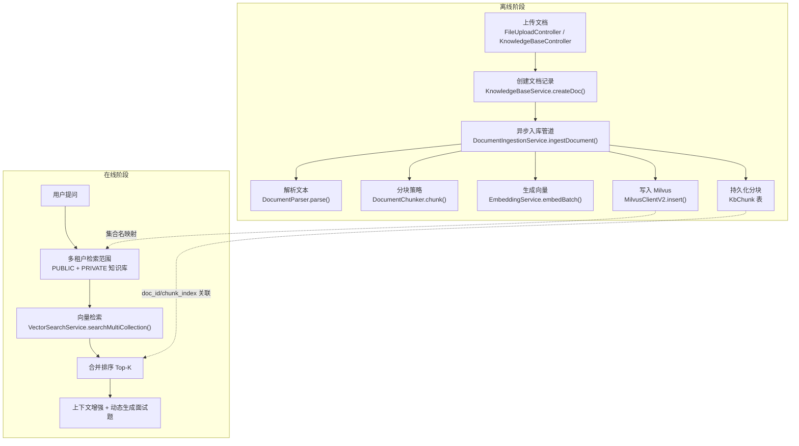
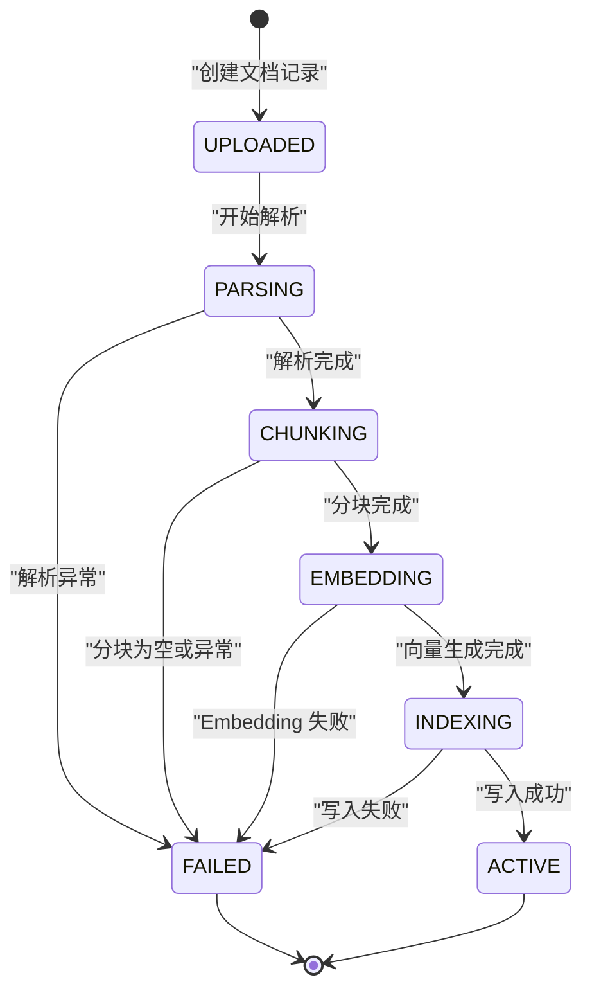
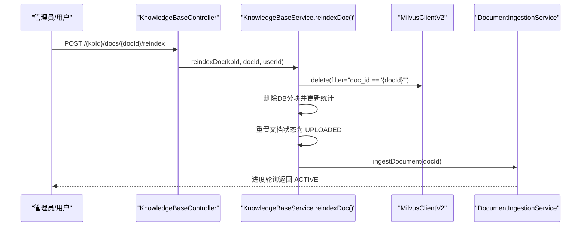
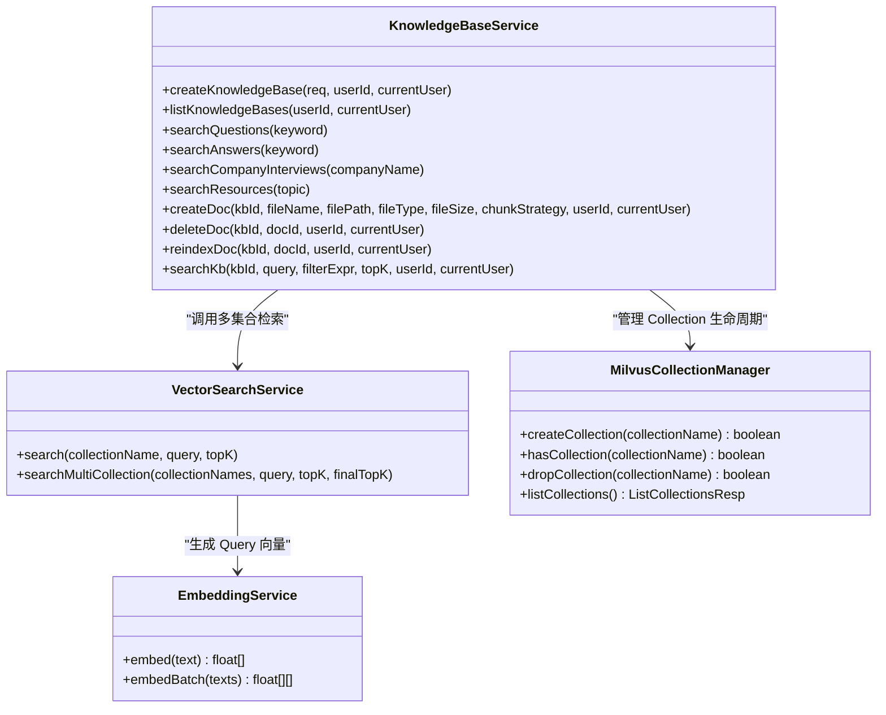

# RAG 面试题处理全链路

<cite>
**本文引用的文件列表**
- [Documents/03-详细设计说明书.md](file://Documents/03-详细设计说明书.md)
- [src/main/java/com/tutorial/offerpilot/service/ingestion/DocumentIngestionService.java](file://src/main/java/com/tutorial/offerpilot/service/ingestion/DocumentIngestionService.java)
- [src/main/java/com/tutorial/offerpilot/service/ingestion/DocumentParser.java](file://src/main/java/com/tutorial/offerpilot/service/ingestion/DocumentParser.java)
- [src/main/java/com/tutorial/offerpilot/service/ingestion/DocumentChunker.java](file://src/main/java/com/tutorial/offerpilot/service/ingestion/DocumentChunker.java)
- [src/main/java/com/tutorial/offerpilot/service/EmbeddingService.java](file://src/main/java/com/tutorial/offerpilot/service/EmbeddingService.java)
- [src/main/java/com/tutorial/offerpilot/service/KnowledgeBaseService.java](file://src/main/java/com/tutorial/offerpilot/service/KnowledgeBaseService.java)
- [src/main/java/com/tutorial/offerpilot/service/MilvusCollectionManager.java](file://src/main/java/com/tutorial/offerpilot/service/MilvusCollectionManager.java)
- [src/main/java/com/tutorial/offerpilot/service/VectorSearchService.java](file://src/main/java/com/tutorial/offerpilot/service/VectorSearchService.java)
- [src/main/java/com/tutorial/offerpilot/entity/KbChunk.java](file://src/main/java/com/tutorial/offerpilot/entity/KbChunk.java)
- [src/main/java/com/tutorial/offerpilot/entity/KbDocument.java](file://src/main/java/com/tutorial/offerpilot/entity/KbDocument.java)
- [src/main/java/com/tutorial/offerpilot/entity/KbKnowledgeBase.java](file://src/main/java/com/tutorial/offerpilot/entity/KbKnowledgeBase.java)
- [src/main/java/com/tutorial/offerpilot/controller/FileUploadController.java](file://src/main/java/com/tutorial/offerpilot/controller/FileUploadController.java)
- [src/main/java/com/tutorial/offerpilot/controller/KnowledgeBaseController.java](file://src/main/java/com/tutorial/offerpilot/controller/KnowledgeBaseController.java)
</cite>

## 目录
- RAG 全链路架构
- 离线阶段：数据预处理与入库
- 离线阶段：向量索引构建
- 在线阶段：多路召回

## RAG 全链路架构
> 绘制离线入库 + 在线检索的双阶段 Mermaid 流程图

图示来源
- [src/main/java/com/tutorial/offerpilot/controller/FileUploadController.java:1-49](file://src/main/java/com/tutorial/offerpilot/controller/FileUploadController.java#L1-L49)
- [src/main/java/com/tutorial/offerpilot/controller/KnowledgeBaseController.java:1-168](file://src/main/java/com/tutorial/offerpilot/controller/KnowledgeBaseController.java#L1-L168)
- [src/main/java/com/tutorial/offerpilot/service/KnowledgeBaseService.java:416-443](file://src/main/java/com/tutorial/offerpilot/service/KnowledgeBaseService.java#L416-L443)
- [src/main/java/com/tutorial/offerpilot/service/ingestion/DocumentIngestionService.java:46-145](file://src/main/java/com/tutorial/offerpilot/service/ingestion/DocumentIngestionService.java#L46-L145)
- [src/main/java/com/tutorial/offerpilot/service/ingestion/DocumentParser.java:29-37](file://src/main/java/com/tutorial/offerpilot/service/ingestion/DocumentParser.java#L29-L37)
- [src/main/java/com/tutorial/offerpilot/service/ingestion/DocumentChunker.java:25-43](file://src/main/java/com/tutorial/offerpilot/service/ingestion/DocumentChunker.java#L25-L43)
- [src/main/java/com/tutorial/offerpilot/service/EmbeddingService.java:62-74](file://src/main/java/com/tutorial/offerpilot/service/EmbeddingService.java#L62-L74)
- [src/main/java/com/tutorial/offerpilot/service/VectorSearchService.java:56-78](file://src/main/java/com/tutorial/offerpilot/service/VectorSearchService.java#L56-L78)

章节来源
- [Documents/03-详细设计说明书.md:42-109](file://Documents/03-详细设计说明书.md#L42-L109)
- [src/main/java/com/tutorial/offerpilot/controller/FileUploadController.java:28-47](file://src/main/java/com/tutorial/offerpilot/controller/FileUploadController.java#L28-L47)
- [src/main/java/com/tutorial/offerpilot/controller/KnowledgeBaseController.java:90-109](file://src/main/java/com/tutorial/offerpilot/controller/KnowledgeBaseController.java#L90-L109)
- [src/main/java/com/tutorial/offerpilot/service/KnowledgeBaseService.java:416-443](file://src/main/java/com/tutorial/offerpilot/service/KnowledgeBaseService.java#L416-L443)
- [src/main/java/com/tutorial/offerpilot/service/ingestion/DocumentIngestionService.java:46-145](file://src/main/java/com/tutorial/offerpilot/service/ingestion/DocumentIngestionService.java#L46-L145)
- [src/main/java/com/tutorial/offerpilot/service/ingestion/DocumentParser.java:29-37](file://src/main/java/com/tutorial/offerpilot/service/ingestion/DocumentParser.java#L29-L37)
- [src/main/java/com/tutorial/offerpilot/service/ingestion/DocumentChunker.java:25-43](file://src/main/java/com/tutorial/offerpilot/service/ingestion/DocumentChunker.java#L25-L43)
- [src/main/java/com/tutorial/offerpilot/service/EmbeddingService.java:62-74](file://src/main/java/com/tutorial/offerpilot/service/EmbeddingService.java#L62-L74)
- [src/main/java/com/tutorial/offerpilot/service/VectorSearchService.java:56-78](file://src/main/java/com/tutorial/offerpilot/service/VectorSearchService.java#L56-L78)

## 离线阶段：数据预处理与入库
> 展示 5 阶段异步入库管道的 Mermaid 状态图（UPLOADED→PARSING→CHUNKING→EMBEDDING→INDEXING→ACTIVE）
> 说明 DocumentParser 的 4 种格式解析（PDF/PDFBox, DOCX/POI, MD, TXT）
> 说明 DocumentChunker 的 4 种分块策略及自动检测逻辑
> 说明 EmbeddingService 的 DashScope text-embedding-v3 调用（单条/批量，最多 25 条/次）
> 展示 DocumentIngestionService 的核心入库代码流程

- 文档解析器支持四种格式：Markdown、TXT、PDF（PDFBox）、DOCX（Apache POI）。解析后输出纯文本，供后续分块使用。
- 分块策略包含 AUTO、BY_QUESTION、BY_HEADING、BY_SIZE。AUTO 会统计“---”分隔符和 Markdown 标题数量，自动选择最合适的策略；BY_QUESTION 按“---”切题；BY_HEADING 按 #/##/### 切节；BY_SIZE 为固定大小滑动窗口兜底。
- Embedding 服务通过 DashScope text-embedding-v3 将文本转为 1024 维向量，提供单条与批量接口，批量上限为 25 条/次，内部自动分批。
- 异步入库管道由 @Async 驱动，顺序执行 PARSING → CHUNKING → EMBEDDING → INDEXING → ACTIVE，任一阶段异常均置为 FAILED 并记录错误信息。

章节来源
- [src/main/java/com/tutorial/offerpilot/service/ingestion/DocumentParser.java:29-37](file://src/main/java/com/tutorial/offerpilot/service/ingestion/DocumentParser.java#L29-L37)
- [src/main/java/com/tutorial/offerpilot/service/ingestion/DocumentChunker.java:25-43](file://src/main/java/com/tutorial/offerpilot/service/ingestion/DocumentChunker.java#L25-L43)
- [src/main/java/com/tutorial/offerpilot/service/EmbeddingService.java:62-74](file://src/main/java/com/tutorial/offerpilot/service/EmbeddingService.java#L62-L74)
- [src/main/java/com/tutorial/offerpilot/service/ingestion/DocumentIngestionService.java:46-145](file://src/main/java/com/tutorial/offerpilot/service/ingestion/DocumentIngestionService.java#L46-L145)

## 离线阶段：向量索引构建
> 说明 Milvus Collection 的动态创建（通用 Schema + IVF_FLAT 索引）
> 说明文档与 Milvus offset 的双向映射（kb_chunk.milvus_offset）
> 说明重建索引流程（delete by doc_id + re-ingest）

- 动态创建 Collection：在创建知识库时，系统为每个知识库分配一个独立的 Milvus Collection，名称形如 kb_{kbId}。Schema 包含 id（自增主键）、doc_id、chunk_index、content、vector（1024 维浮点向量）等字段。索引类型采用 IVF_FLAT，适合中小规模数据，兼顾召回率与内存占用。
- 双向映射：入库时将 KbChunk 的 milvus_offset 保存至数据库，用于后续删除或定位向量；同时 Milvus 行中保留 doc_id 与 chunk_index，便于按文档维度进行过滤与重建。
- 重建索引：先按 doc_id 条件删除旧向量，再删除 DB 中的对应分块，重置文档状态为 UPLOADED，最后重新触发入库管道完成重索引。

图示来源
- [src/main/java/com/tutorial/offerpilot/service/MilvusCollectionManager.java:34-78](file://src/main/java/com/tutorial/offerpilot/service/MilvusCollectionManager.java#L34-L78)
- [src/main/java/com/tutorial/offerpilot/entity/KbChunk.java:38-39](file://src/main/java/com/tutorial/offerpilot/entity/KbChunk.java#L38-L39)
- [src/main/java/com/tutorial/offerpilot/service/KnowledgeBaseService.java:509-558](file://src/main/java/com/tutorial/offerpilot/service/KnowledgeBaseService.java#L509-L558)
- [src/main/java/com/tutorial/offerpilot/service/ingestion/DocumentIngestionService.java:46-145](file://src/main/java/com/tutorial/offerpilot/service/ingestion/DocumentIngestionService.java#L46-L145)

章节来源
- [src/main/java/com/tutorial/offerpilot/service/MilvusCollectionManager.java:34-78](file://src/main/java/com/tutorial/offerpilot/service/MilvusCollectionManager.java#L34-L78)
- [src/main/java/com/tutorial/offerpilot/entity/KbChunk.java:38-39](file://src/main/java/com/tutorial/offerpilot/entity/KbChunk.java#L38-L39)
- [src/main/java/com/tutorial/offerpilot/service/KnowledgeBaseService.java:509-558](file://src/main/java/com/tutorial/offerpilot/service/KnowledgeBaseService.java#L509-L558)

## 在线阶段：多路召回
> 绘制多路召回策略的 Mermaid 流程图（向量检索 + 标量过滤 + 关联检索 → 合并去重排序）
> 说明 KnowledgeBase

- 多租户检索范围：系统根据当前用户身份，聚合所有 PUBLIC 知识库与其 PRIVATE 知识库对应的 Milvus Collection 名称，形成待检索集合列表。
- 向量检索：对每个 Collection 执行向量相似度检索，返回 doc_id、chunk_index、content 以及距离分数。
- 标量过滤：可在检索参数中附加 tags 或 metadata_json 条件，进一步缩小结果集。
- 关联检索：从公司面经等文档中提取高频考点关键词，作为二次检索条件，命中题库集合的具体题目，提升相关性。
- 合并排序：将所有 Collection 的结果合并，按相似度排序并去重，最终返回 Top-K。

图示来源
- [src/main/java/com/tutorial/offerpilot/service/KnowledgeBaseService.java:157-201](file://src/main/java/com/tutorial/offerpilot/service/KnowledgeBaseService.java#L157-L201)
- [src/main/java/com/tutorial/offerpilot/service/VectorSearchService.java:56-78](file://src/main/java/com/tutorial/offerpilot/service/VectorSearchService.java#L56-L78)
- [src/main/java/com/tutorial/offerpilot/service/EmbeddingService.java:51-57](file://src/main/java/com/tutorial/offerpilot/service/EmbeddingService.java#L51-L57)
- [src/main/java/com/tutorial/offerpilot/service/MilvusCollectionManager.java:34-78](file://src/main/java/com/tutorial/offerpilot/service/MilvusCollectionManager.java#L34-L78)

章节来源
- [src/main/java/com/tutorial/offerpilot/service/KnowledgeBaseService.java:157-201](file://src/main/java/com/tutorial/offerpilot/service/KnowledgeBaseService.java#L157-L201)
- [src/main/java/com/tutorial/offerpilot/service/VectorSearchService.java:56-78](file://src/main/java/com/tutorial/offerpilot/service/VectorSearchService.java#L56-L78)
- [src/main/java/com/tutorial/offerpilot/service/EmbeddingService.java:51-57](file://src/main/java/com/tutorial/offerpilot/service/EmbeddingService.java#L51-L57)
- [src/main/java/com/tutorial/offerpilot/service/MilvusCollectionManager.java:34-78](file://src/main/java/com/tutorial/offerpilot/service/MilvusCollectionManager.java#L34-L78)