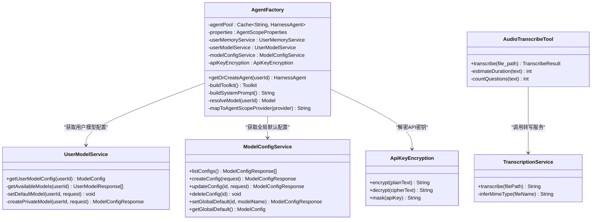
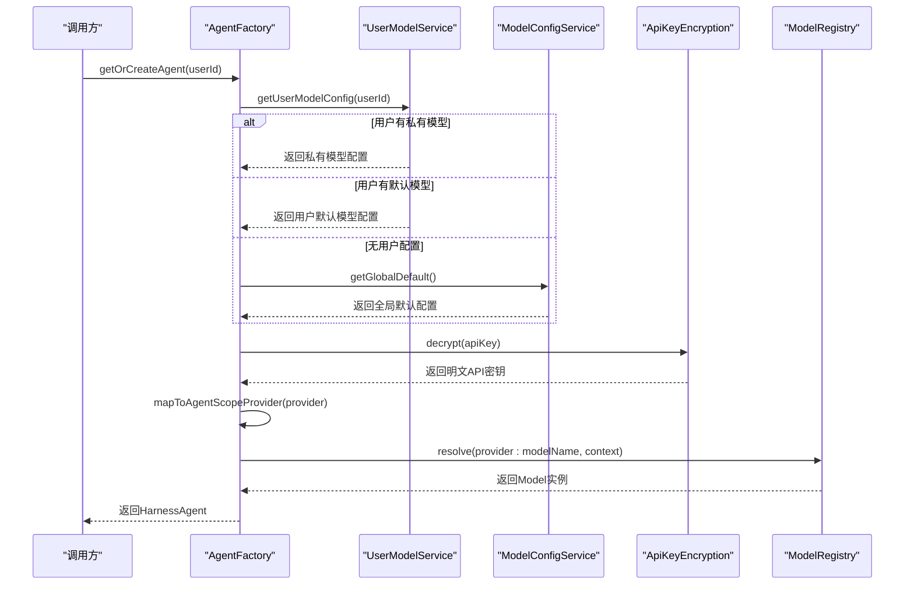
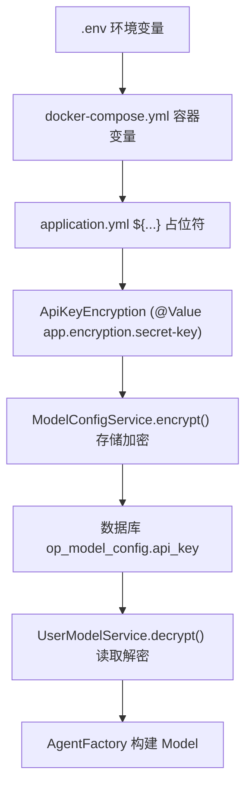
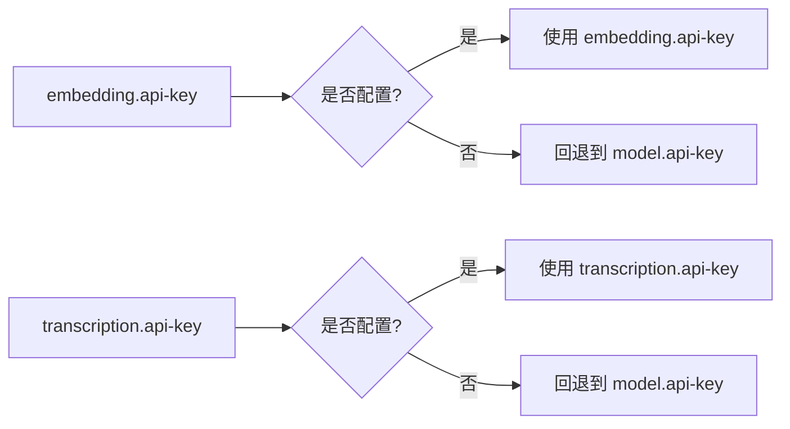
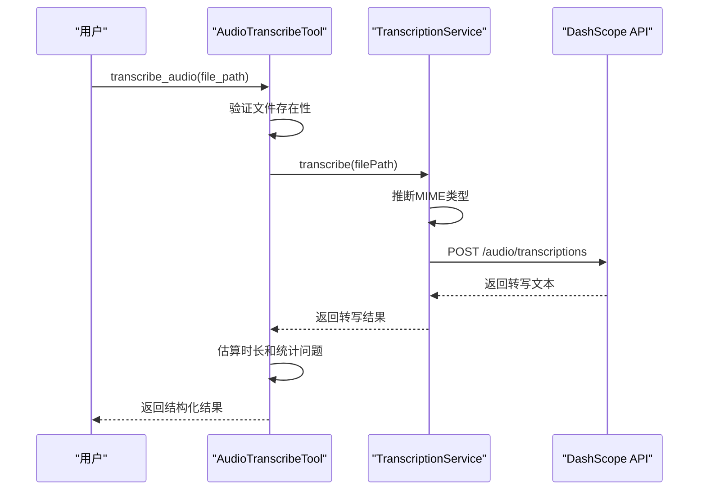
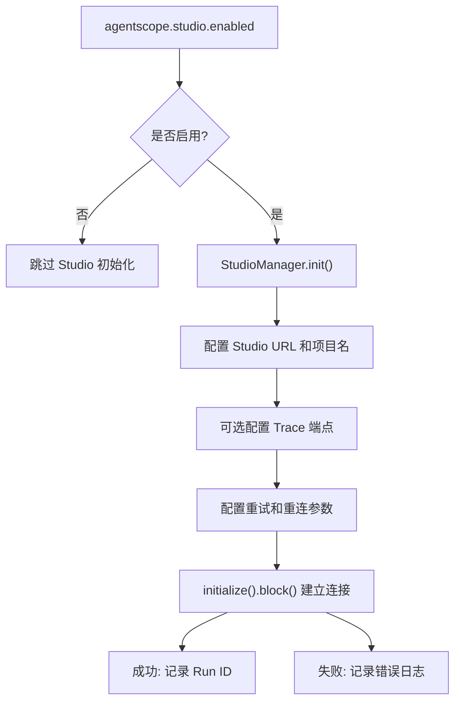
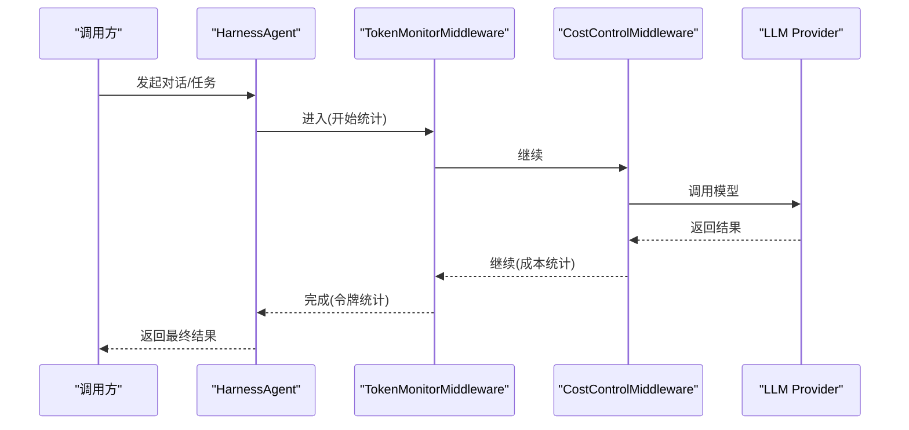
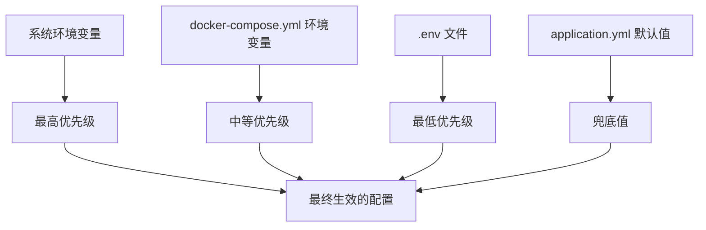

# Spring Boot 集成架构

<cite>
**本文引用的文件**   
- [AgentFactory.java](file://src/main/java/com/tutorial/offerpilot/agent/AgentFactory.java)
- [ModelConfigService.java](file://src/main/java/com/tutorial/offerpilot/service/ModelConfigService.java)
- [UserModelService.java](file://src/main/java/com/tutorial/offerpilot/service/UserModelService.java)
- [ApiKeyEncryption.java](file://src/main/java/com/tutorial/offerpilot/service/ApiKeyEncryption.java)
- [ModelListFetcher.java](file://src/main/java/com/tutorial/offerpilot/service/ModelListFetcher.java)
- [ModelConfigController.java](file://src/main/java/com/tutorial/offerpilot/controller/ModelConfigController.java)
- [UserModelController.java](file://src/main/java/com/tutorial/offerpilot/controller/UserModelController.java)
- [ModelConfig.java](file://src/main/java/com/tutorial/offerpilot/entity/ModelConfig.java)
- [ModelName.java](file://src/main/java/com/tutorial/offerpilot/entity/ModelName.java)
- [ProviderPreset.java](file://src/main/java/com/tutorial/offerpilot/enums/ProviderPreset.java)
- [ModelConfigRepository.java](file://src/main/java/com/tutorial/offerpilot/repository/ModelConfigRepository.java)
- [AgentScopeProperties.java](file://src/main/java/com/tutorial/offerpilot/config/AgentScopeProperties.java)
- [StudioIntegrationConfig.java](file://src/main/java/com/tutorial/offerpilot/config/StudioIntegrationConfig.java)
- [EmbeddingService.java](file://src/main/java/com/tutorial/offerpilot/service/EmbeddingService.java)
- [TranscriptionService.java](file://src/main/java/com/tutorial/offerpilot/service/TranscriptionService.java)
- [AudioTranscribeTool.java](file://src/main/java/com/tutorial/offerpilot/agent/tool/AudioTranscribeTool.java)
- [MilvusConfig.java](file://src/main/java/com/tutorial/offerpilot/config/MilvusConfig.java)
- [MilvusProperties.java](file://src/main/java/com/tutorial/offerpilot/config/MilvusProperties.java)
- [RedisConfig.java](file://src/main/java/com/tutorial/offerpilot/config/RedisConfig.java)
- [SecurityConfig.java](file://src/main/java/com/tutorial/offerpilot/config/SecurityConfig.java)
- [WebConfig.java](file://src/main/java/com/tutorial/offerpilot/config/WebConfig.java)
- [AsyncConfig.java](file://src/main/java/com/tutorial/offerpilot/config/AsyncConfig.java)
- [application.yml](file://src/main/resources/application.yml)
- [application-dev.yml](file://src/main/resources/application-dev.yml)
- [application-prod.yml](file://src/main/resources/application-prod.yml)
- [pom.xml](file://pom.xml)
- [docker-compose.yml](file://docker-compose.yml)
- [.gitignore](file://.gitignore)
- [JwtTokenProvider.java](file://src/main/java/com/tutorial/offerpilot/security/JwtTokenProvider.java)
</cite>

## 更新摘要
**变更内容**   
- **新增** StudioIntegrationConfig 配置类，实现 AgentScope Studio 的完整集成与生命周期管理
- **增强** AgentScopeProperties 扩展，新增 StudioConfig 内部类支持 Studio 相关属性绑定
- **重大变更** 数据库从 H2 完全迁移到 MySQL，移除所有 H2 相关配置和依赖
- **优化** 环境配置结构，统一使用 MySQL 作为生产数据库，提升数据持久化能力

## Agent 组件 Bean 注入方式
- 工厂类与工具注入模式
  - AgentFactory 使用 @Component 注册为 Spring Bean，并通过构造器一次性注入所有依赖：配置属性、用户记忆服务、用户模型服务、模型配置服务、API 密钥加密服务以及全部 11 个 @Tool Bean。
  - 在构建 Toolkit 时，将工具按业务域分组注册到四个组：knowledge_retrieval、resume_analysis、interview、utility，并统一调用 registerMetaTool 注册元工具。
  - **新增** AudioTranscribeTool 作为面试工具组的一部分，集成语音转写功能。
- Caffeine 缓存的 Agent 池
  - 使用 Caffeine 维护一个有界缓存 agentPool，最大容量 500，未访问超过 30 分钟自动淘汰；通过 getOrCreateAgent(userId) 实现"按用户维度"的 HarnessAgent 复用与按需创建。
- RuntimeContext 的构建与传递路径
  - AgentFactory 现在集成了动态模型解析能力，通过 UserModelService 和 ModelConfigService 获取用户偏好和全局配置，结合 ApiKeyEncryption 解密 API Key，最终通过 ModelRegistry.resolve() 动态创建 Model 实例。
  - **增强** 实现了 OpenAI 兼容 Provider 的动态映射，支持 deepseek、siliconflow、volcengine 等 Provider 自动映射到 openai 前缀。



**图表来源**   
- [AgentFactory.java:66-98](file://src/main/java/com/tutorial/offerpilot/agent/AgentFactory.java#L66-L98)
- [AgentFactory.java:265-298](file://src/main/java/com/tutorial/offerpilot/agent/AgentFactory.java#L265-L298)
- [AgentFactory.java:320-325](file://src/main/java/com/tutorial/offerpilot/agent/AgentFactory.java#L320-325)
- [UserModelService.java:153-168](file://src/main/java/com/tutorial/offerpilot/service/UserModelService.java#L153-L168)
- [ModelConfigService.java:200-202](file://src/main/java/com/tutorial/offerpilot/service/ModelConfigService.java#L200-202)
- [ApiKeyEncryption.java:37-62](file://src/main/java/com/tutorial/offerpilot/service/ApiKeyEncryption.java#L37-L62)
- [TranscriptionService.java:33-53](file://src/main/java/com/tutorial/offerpilot/service/TranscriptionService.java#L33-L53)
- [AudioTranscribeTool.java:27-56](file://src/main/java/com/tutorial/offerpilot/agent/tool/AudioTranscribeTool.java#L27-L56)

**章节来源**   
- [AgentFactory.java:66-98](file://src/main/java/com/tutorial/offerpilot/agent/AgentFactory.java#L66-L98)
- [AgentFactory.java:265-298](file://src/main/java/com/tutorial/offerpilot/agent/AgentFactory.java#L265-L298)
- [AgentFactory.java:320-325](file://src/main/java/com/tutorial/offerpilot/agent/AgentFactory.java#L320-325)

## 配置类扫描路径
- 包路径：com.tutorial.offerpilot.config
- 关键配置类与职责概览

| 配置类 | 主要职责 | 关键 Bean / 行为 |
| --- | --- | --- |
| AgentScopeProperties | 绑定 agentscope.* 配置项（模型、Agent、知识库、Embedding、转写、Studio） | @ConfigurationProperties(prefix="agentscope")，提供 ModelConfig/AgentConfig/KnowledgeConfig/EmbeddingConfig/TranscriptionConfig/StudioConfig |
| StudioIntegrationConfig | AgentScope Studio 集成配置，管理 Studio 连接生命周期 | @PostConstruct 初始化 Studio 连接，@PreDestroy 释放资源 |
| MilvusConfig | 初始化 Milvus v2 客户端连接 | milvusClient(MilvusProperties) → MilvusClientV2 |
| MilvusProperties | 绑定 app.milvus.* 配置项 | host/port/database/connectTimeoutMs/keepAliveTimeMs |
| RedisConfig | 暴露 StringRedisTemplate | stringRedisTemplate(RedisConnectionFactory) |
| SecurityConfig | 安全过滤链、无状态会话、异常响应格式 | SecurityFilterChain、PasswordEncoder、AuthenticationManager |
| WebConfig | CORS 跨域策略 | addMapping("/api/**") 允许凭据与常用方法 |
| AsyncConfig | 异步任务线程池 | ingestionExecutor(core/max/queue) 命名前缀 ingestion- |

**章节来源**   
- [AgentScopeProperties.java:10-17](file://src/main/java/com/tutorial/offerpilot/config/AgentScopeProperties.java#L10-17)
- [AgentScopeProperties.java:53-81](file://src/main/java/com/tutorial/offerpilot/config/AgentScopeProperties.java#L53-81)
- [AgentScopeProperties.java:69-83](file://src/main/java/com/tutorial/offerpilot/config/AgentScopeProperties.java#L69-83)
- [StudioIntegrationConfig.java:26-34](file://src/main/java/com/tutorial/offerpilot/config/StudioIntegrationConfig.java#L26-34)
- [MilvusConfig.java:18-29](file://src/main/java/com/tutorial/offerpilot/config/MilvusConfig.java#L18-29)
- [MilvusProperties.java:10-20](file://src/main/java/com/tutorial/offerpilot/config/MilvusProperties.java#L10-20)
- [RedisConfig.java:14-17](file://src/main/java/com/tutorial/offerpilot/config/RedisConfig.java#L14-17)
- [SecurityConfig.java:25-28](file://src/main/java/com/tutorial/offerpilot/config/SecurityConfig.java#L25-28)
- [WebConfig.java:10-22](file://src/main/java/com/tutorial/offerpilot/config/WebConfig.java#L10-22)
- [AsyncConfig.java:14-31](file://src/main/java/com/tutorial/offerpilot/config/AsyncConfig.java#L14-31)

## LLM 模型初始化与动态解析
- **更新** 系统现已支持多 Provider 的动态模型解析，实现了基于优先级的模型选择算法，并增强了 OpenAI 兼容 Provider 的支持

### 多 Provider 预设配置
系统内置了 8 家主流 LLM Provider 的预设配置：

| Provider | 标识 | API 格式 | 认证类型 | 默认 Base URL |
| --- | --- | --- | --- | --- |
| 阿里百炼 DashScope | dashscope | OpenAI | Bearer | https://dashscope.aliyuncs.com/compatible-mode/v1 |
| OpenAI | openai | OpenAI | Bearer | https://api.openai.com/v1 |
| DeepSeek | deepseek | OpenAI | Bearer | https://api.deepseek.com |
| 硅基流动 SiliconFlow | siliconflow | OpenAI | Bearer | https://api.siliconflow.cn/v1 |
| 火山引擎 (豆包) | volcengine | OpenAI | Bearer | https://ark.cn-beijing.volces.com/api/v3 |
| Anthropic (Claude) | anthropic | Anthropic | x-api-key | https://api.anthropic.com |
| Google Gemini | gemini | Gemini | x-goog-api-key | https://generativelanguage.googleapis.com/v1beta |
| Ollama (本地) | ollama | OpenAI | None | http://localhost:11434/v1 |

### 动态模型解析优先级算法
AgentFactory 实现了四级优先级模型解析，并新增了 OpenAI 兼容 Provider 的动态映射：



**图表来源**   
- [AgentFactory.java:265-298](file://src/main/java/com/tutorial/offerpilot/agent/AgentFactory.java#L265-298)
- [AgentFactory.java:320-325](file://src/main/java/com/tutorial/offerpilot/agent/AgentFactory.java#L320-325)
- [UserModelService.java:153-168](file://src/main/java/com/tutorial/offerpilot/service/UserModelService.java#L153-L168)
- [ModelConfigService.java:200-202](file://src/main/java/com/tutorial/offerpilot/service/ModelConfigService.java#L200-202)
- [ApiKeyEncryption.java:52-62](file://src/main/java/com/tutorial/offerpilot/service/ApiKeyEncryption.java#L52-L62)

### OpenAI 兼容 Provider 映射机制
**新增** 系统实现了 OpenAI 兼容 Provider 的动态映射逻辑：

- **映射规则**：deepseek、siliconflow、volcengine 三个 Provider 自动映射为 "openai"
- **实现原理**：这些 Provider 虽然使用 OpenAI 兼容 API，但 AgentScope 框架中没有独立的 SPI ModelProvider
- **解决方案**：通过 mapToAgentScopeProvider() 方法将非标准 Provider 映射为标准 openai 前缀，配合自定义 baseUrl 实现兼容

### 模型列表自动拉取机制
系统支持从各 Provider API 自动拉取可用模型列表：

- **支持的 API 格式**：OpenAI、Anthropic、Gemini 三种格式
- **自动解析逻辑**：根据配置的 apiFormat 自动选择对应的 JSON 解析器
- **缓存策略**：模型名称持久化到数据库，避免频繁请求外部 API

**章节来源**   
- [ProviderPreset.java:13-101](file://src/main/java/com/tutorial/offerpilot/enums/ProviderPreset.java#L13-101)
- [AgentFactory.java:265-298](file://src/main/java/com/tutorial/offerpilot/agent/AgentFactory.java#L265-298)
- [AgentFactory.java:320-325](file://src/main/java/com/tutorial/offerpilot/agent/AgentFactory.java#L320-325)
- [ModelListFetcher.java:44-60](file://src/main/java/com/tutorial/offerpilot/service/ModelListFetcher.java#L44-60)

## API 密钥安全配置管理
- **更新** 新增了专门的 API 密钥加密服务和多层安全防护机制

### AES 加密存储方案
ApiKeyEncryption 服务提供了完整的 API Key 生命周期管理：

| 操作 | 方法 | 说明 |
| --- | --- | --- |
| 加密存储 | encrypt(String) | 使用 AES-128 加密 API Key |
| 解密读取 | decrypt(String) | 解密存储的 API Key |
| 脱敏显示 | mask(String) | 保留前后各4位，中间用 **** 替换 |

### 多层安全配置链路


**图表来源**   
- [ApiKeyEncryption.java:26-32](file://src/main/java/com/tutorial/offerpilot/service/ApiKeyEncryption.java#L26-32)
- [ModelConfigService.java:67](file://src/main/java/com/tutorial/offerpilot/service/ModelConfigService.java#L67)
- [UserModelService.java:173-179](file://src/main/java/com/tutorial/offerpilot/service/UserModelService.java#L173-L179)
- [AgentFactory.java:278](file://src/main/java/com/tutorial/offerpilot/agent/AgentFactory.java#L278)

### 多环境配置策略
- application.yml 设置 spring.profiles.active=dev，可通过 application-dev.yml / application-prod.yml 覆盖敏感配置
- docker-compose.yml 中基础设施服务也通过环境变量注入，便于不同环境隔离
- JWT Secret 和加密密钥都通过环境变量注入，确保生产环境安全

**章节来源**   
- [ApiKeyEncryption.java:19-32](file://src/main/java/com/tutorial/offerpilot/service/ApiKeyEncryption.java#L19-32)
- [ApiKeyEncryption.java:68-76](file://src/main/java/com/tutorial/offerpilot/service/ApiKeyEncryption.java#L68-76)
- [ModelConfigService.java:67](file://src/main/java/com/tutorial/offerpilot/service/ModelConfigService.java#L67)
- [application.yml:63-64](file://src/main/resources/application.yml#L63-64)

## 嵌入与转写服务独立配置
- **更新** 系统现在支持 Embedding 和语音转写服务的独立配置，与 LLM 模型配置完全解耦

### Embedding 独立配置
当 LLM Provider 切换到不支持 Embedding 的服务商（如 DeepSeek）时，可以通过独立的 embedding 配置指定不同的 Embedding Provider：

| 配置项 | 说明 | 默认值 | 环境变量支持 |
| --- | --- | --- | --- |
| agentscope.embedding.provider | Embedding Provider | dashscope | - |
| agentscope.embedding.api-key | Embedding API Key | 回退到 model.api-key | EMBEDDING_API_KEY |
| agentscope.embedding.base-url | Embedding API Base URL | DashScope Embedding 端点 | - |

### 语音转写独立配置
**新增** 系统支持独立的语音转写配置，默认使用 DashScope Paraformer：

| 配置项 | 说明 | 默认值 | 环境变量支持 |
| --- | --- | --- | --- |
| agentscope.transcription.model | 转写模型 | paraformer-v2 | - |
| agentscope.transcription.api-key | 转写 API Key | 回退到 model.api-key | TRANSCRIPTION_API_KEY |
| agentscope.transcription.base-url | 转写 API Base URL | DashScope OpenAI 兼容端点 | - |

### 配置优先级策略


**图表来源**   
- [EmbeddingService.java:37-58](file://src/main/java/com/tutorial/offerpilot/service/EmbeddingService.java#L37-58)
- [TranscriptionService.java:33-53](file://src/main/java/com/tutorial/offerpilot/service/TranscriptionService.java#L33-L53)
- [AgentScopeProperties.java:53-81](file://src/main/java/com/tutorial/offerpilot/config/AgentScopeProperties.java#L53-81)
- [AgentScopeProperties.java:69-83](file://src/main/java/com/tutorial/offerpilot/config/AgentScopeProperties.java#L69-83)

### 环境变量注入示例
```bash
# 在 .env 文件中配置独立的 Embedding API Key
EMBEDDING_API_KEY=sk-dashscope-embedding-key

# 配置独立的转写 API Key  
TRANSCRIPTION_API_KEY=sk-dashscope-transcription-key

# 或者共用 DashScope API Key
DASHSCOPE_API_KEY=sk-dashscope-shared-key
```

**章节来源**   
- [AgentScopeProperties.java:53-81](file://src/main/java/com/tutorial/offerpilot/config/AgentScopeProperties.java#L53-81)
- [AgentScopeProperties.java:69-83](file://src/main/java/com/tutorial/offerpilot/config/AgentScopeProperties.java#L69-83)
- [EmbeddingService.java:37-58](file://src/main/java/com/tutorial/offerpilot/service/EmbeddingService.java#L37-58)
- [TranscriptionService.java:33-53](file://src/main/java/com/tutorial/offerpilot/service/TranscriptionService.java#L33-L53)
- [application.yml:57-71](file://src/main/resources/application.yml#L57-71)

## 音频转写服务集成
**新增** 系统集成了完整的音频转写功能，支持面试录音文件的自动转写

### TranscriptionService 核心功能
- **语音转文本**：调用 DashScope Paraformer API 进行高质量语音识别
- **多格式支持**：支持 mp3、wav、m4a、flac、ogg、webm 等常见音频格式
- **智能超时**：连接超时 30 秒，读取超时 120 秒，适应长音频处理
- **错误处理**：完善的异常处理和日志记录机制

### AudioTranscribeTool 工具集成
- **Agent 工具**：作为面试工具组的一部分，供 AI Agent 直接调用
- **结果分析**：自动估算音频时长和统计问题数量
- **用户体验**：友好的错误提示和进度反馈

### 转写流程架构


**图表来源**   
- [AudioTranscribeTool.java:27-56](file://src/main/java/com/tutorial/offerpilot/agent/tool/AudioTranscribeTool.java#L27-L56)
- [TranscriptionService.java:61-106](file://src/main/java/com/tutorial/offerpilot/service/TranscriptionService.java#L61-106)

**章节来源**   
- [TranscriptionService.java:1-122](file://src/main/java/com/tutorial/offerpilot/service/TranscriptionService.java#L1-122)
- [AudioTranscribeTool.java:1-86](file://src/main/java/com/tutorial/offerpilot/agent/tool/AudioTranscribeTool.java#L1-86)

## AgentScope Studio 集成配置
**新增** 系统集成了完整的 AgentScope Studio 监控与追踪功能，提供实时的 Agent 运行状态可视化

### StudioIntegrationConfig 核心功能
- **自动初始化**：应用启动时自动检测 Studio 配置，启用后建立 WebSocket 连接
- **生命周期管理**：@PostConstruct 初始化连接，@PreDestroy 优雅关闭资源
- **容错机制**：Studio 初始化失败不会阻止应用启动，仅记录错误日志
- **可配置参数**：支持 Studio URL、项目名称、Trace 端点、重试次数、重连尝试等配置

### Studio 实时监控能力
接入 Studio 后可实时查看：
- **Agent 消息流**：用户输入 → Agent 推理 → 工具调用 → 最终回复的完整链路
- **工具调用详情**：参数、耗时、返回结果的实时监控
- **LLM Token 消耗**：各模型的 Token 使用情况统计
- **OpenTelemetry Trace**：全链路分布式追踪

### Studio 配置管理


**图表来源**   
- [StudioIntegrationConfig.java:40-77](file://src/main/java/com/tutorial/offerpilot/config/StudioIntegrationConfig.java#L40-77)
- [AgentScopeProperties.java:85-104](file://src/main/java/com/tutorial/offerpilot/config/AgentScopeProperties.java#L85-104)

### Studio 配置属性
| 配置项 | 说明 | 默认值 | 用途 |
| --- | --- | --- | --- |
| agentscope.studio.enabled | 是否启用 Studio 集成 | false | 控制 Studio 功能开关 |
| agentscope.studio.url | Studio 服务地址 | http://localhost:8000 | AgentScope Studio 前端 + 后端地址 |
| agentscope.studio.project | 项目名称 | OfferPilot | 在 Studio 中标识本项目 |
| agentscope.studio.tracingUrl | Trace 端点 | {url}/v1/traces | OpenTelemetry Trace 上报地址 |
| agentscope.studio.maxRetries | HTTP 最大重试次数 | 3 | 网络请求失败重试策略 |
| agentscope.studio.reconnectAttempts | WebSocket 重连尝试次数 | 3 | 连接断开后的重连策略 |

**章节来源**   
- [StudioIntegrationConfig.java:1-91](file://src/main/java/com/tutorial/offerpilot/config/StudioIntegrationConfig.java#L1-91)
- [AgentScopeProperties.java:85-104](file://src/main/java/com/tutorial/offerpilot/config/AgentScopeProperties.java#L85-104)
- [application.yml:72-79](file://src/main/resources/application.yml#L72-79)

## 管理员模型配置管理接口
- **新增** 完整的模型配置 CRUD 管理和 Provider 预设管理

### 管理员 API 端点
| 方法 | 路径 | 功能 | 权限要求 |
| --- | --- | --- | --- |
| GET | /api/v1/admin/models | 获取所有非私有模型配置 | ADMIN |
| POST | /api/v1/admin/models | 新增模型配置（自动拉取模型列表） | ADMIN |
| PUT | /api/v1/admin/models/{id} | 更新模型配置 | ADMIN |
| DELETE | /api/v1/admin/models/{id} | 删除模型配置 | ADMIN |
| POST | /api/v1/admin/models/{id}/refresh-models | 重新拉取模型名称 | ADMIN |
| PUT | /api/v1/admin/models/{id}/set-global-default | 设置全局默认模型 | ADMIN |
| GET | /api/v1/admin/models/provider-presets | 获取 Provider 预设列表 | ADMIN |

### 数据实体设计
- **op_model_config**：存储模型提供方配置，包含 provider、baseUrl、apiKey（加密）、apiFormat、authHeaderType、modelListUrl、defaultModelName、isEnabled、isGlobalDefault、isPrivate 等字段
- **op_model_name**：存储从 Provider API 拉取的模型名称列表，关联 model_config_id

**章节来源**   
- [ModelConfigController.java:24-82](file://src/main/java/com/tutorial/offerpilot/controller/ModelConfigController.java#L24-82)
- [ModelConfig.java:14-64](file://src/main/java/com/tutorial/offerpilot/entity/ModelConfig.java#L14-64)
- [ModelName.java:14-34](file://src/main/java/com/tutorial/offerpilot/entity/ModelName.java#L14-34)

## 用户模型偏好管理接口
- **新增** 用户级别的模型选择和私有模型配置管理

### 用户 API 端点
| 方法 | 路径 | 功能 | 认证要求 |
| --- | --- | --- | --- |
| GET | /api/v1/user/models | 获取用户可用的模型列表 | 已登录用户 |
| PUT | /api/v1/user/models/default | 设置用户默认模型 | 已登录用户 |
| POST | /api/v1/user/models/private | 新增用户私有模型 | 已登录用户 |

### 用户模型选择逻辑
用户模型配置支持三个层次：
1. **私有模型**：用户个人创建的专属模型配置，优先级最高
2. **用户默认模型**：用户在系统中选择的默认模型
3. **全局默认模型**：管理员设置的系统级默认模型

**章节来源**   
- [UserModelController.java:22-64](file://src/main/java/com/tutorial/offerpilot/controller/UserModelController.java#L22-64)
- [UserModelService.java:42-67](file://src/main/java/com/tutorial/offerpilot/service/UserModelService.java#L42-67)
- [UserModelService.java:153-168](file://src/main/java/com/tutorial/offerpilot/service/UserModelService.java#L153-L168)

## Middleware 洋葱模式
- AgentFactory 在构建 HarnessAgent 时插入了两个中间件：TokenMonitorMiddleware 与 CostControlMiddleware，二者以 middleware(...) 的方式串联，形成"请求进入—统计—控制—推理—返回"的洋葱式处理链。
- 扩展建议
  - 如需加入鉴权、限流、审计、记忆注入等横切逻辑，可新增中间件并按顺序插入，确保幂等与线程安全。
  - 若需携带运行时上下文（userId、sessionId），建议在中间件入口处解析并透传至后续处理阶段，避免在业务工具中直接耦合。



**图表来源**   
- [AgentFactory.java:120-133](file://src/main/java/com/tutorial/offerpilot/agent/AgentFactory.java#L120-133)

**章节来源**   
- [AgentFactory.java:120-133](file://src/main/java/com/tutorial/offerpilot/agent/AgentFactory.java#L120-133)

## 环境配置与安全最佳实践
- **更新** 完整的环境变量管理和安全配置指南，新增了音频转写相关的安全配置和 Studio 集成配置

### 数据库迁移：从 H2 到 MySQL
**重大变更** 系统已完成从 H2 嵌入式数据库到 MySQL 生产级数据库的完整迁移：

#### 迁移前的 H2 配置（已废弃）
- 开发环境使用 H2 嵌入式数据库：`jdbc:h2:file:./data/offerpilot`
- 启用 H2 Console 用于开发调试：`/h2-console`
- 单文件数据库，适合单机开发和测试

#### 迁移后的 MySQL 配置
- **生产数据库**：MySQL 8.0，支持高并发和数据持久化
- **连接配置**：`jdbc:mysql://localhost:3306/offerpilot?useUnicode=true&characterEncoding=UTF-8&serverTimezone=Asia/Shanghai`
- **驱动类**：`com.mysql.cj.jdbc.Driver`
- **环境变量**：用户名和密码通过 `MYSQL_USERNAME` 和 `MYSQL_ROOT_PASSWORD` 注入

#### Docker Compose 基础设施
项目使用 Docker Compose 编排完整的基础设施服务：

| 服务 | 版本 | 端口 | 用途 |
| --- | --- | --- | --- |
| MySQL 8.0 | mysql:8.0 | 3306 | 主数据库，替代 H2 |
| Redis 7 | redis:7-alpine | 6379 | 会话缓存和限流 |
| Milvus 2.4.6 | milvusdb/milvus:v2.4.6 | 19530 | 向量数据库 (RAG) |
| etcd 3.5.14 | quay.io/coreos/etcd:v3.5.14 | 2379 | Milvus 元数据存储 |
| MinIO | minio/minio:latest | 9001 | 对象存储 (Milvus 依赖) |
| WebSearch | open-web-search | 3000 | MCP 联网搜索 (Agent 工具) |

### .env 文件安全处理
项目采用严格的安全策略处理敏感配置文件：

| 文件类型 | 用途 | Git 忽略 | 安全级别 |
| --- | --- | --- | --- |
| .env | 环境变量配置文件 | ✅ 已忽略 | 高 |
| application.yml | 基础配置 | ❌ 提交 | 低 |
| application-dev.yml | 开发环境配置 | ❌ 提交 | 中 |
| application-prod.yml | 生产环境配置 | ❌ 提交 | 中 |

### 环境变量优先级策略


### 安全配置清单
- **.gitignore 保护**：.env 文件已被添加到 git 忽略列表，防止敏感信息泄露
- **环境变量注入**：所有敏感配置通过环境变量注入，支持 Docker 容器化部署
- **密钥轮换支持**：支持运行时环境变量更新，无需重启应用
- **多环境隔离**：通过 Spring Profiles 实现开发、测试、生产环境隔离
- **新增** 音频转写 API Key 独立管理，支持与 LLM API Key 分离
- **新增** Studio 集成配置，支持开发调试时的实时监控

### Maven 依赖完整性
**新增** 系统已补齐所有必要的 AgentScope Model Extension 依赖：

| 依赖模块 | 版本 | 用途 |
| --- | --- | --- |
| agentscope-core | 2.0.0-RC5 | AgentScope 核心框架 |
| agentscope-harness | 2.0.0-RC5 | Agent 运行环境 |
| agentscope-extensions-model-openai | 2.0.0-RC5 | OpenAI 兼容 Provider |
| agentscope-extensions-model-dashscope | 2.0.0-RC5 | 阿里百炼 Provider |
| agentscope-extensions-model-anthropic | 2.0.0-RC5 | Anthropic Claude Provider |
| agentscope-extensions-model-gemini | 2.0.0-RC5 | Google Gemini Provider |
| agentscope-extensions-model-ollama | 2.0.0-RC5 | Ollama 本地 Provider |
| mysql-connector-j | runtime | MySQL 数据库驱动 |

### 数据库配置对比
| 配置项 | H2 (旧) | MySQL (新) |
| --- | --- | --- |
| JDBC URL | jdbc:h2:file:./data/offerpilot | jdbc:mysql://localhost:3306/offerpilot |
| 驱动类 | org.h2.Driver | com.mysql.cj.jdbc.Driver |
| 控制台 | /h2-console | 使用 MySQL Workbench/DBeaver |
| 数据类型 | H2 语法 | MySQL 8.0 语法 |
| 字符集 | 默认 | utf8mb4_unicode_ci |
| 时区 | 默认 | Asia/Shanghai |

**章节来源**   
- [.gitignore:21-22](file://.gitignore#L21-22)
- [application.yml:14-18](file://src/main/resources/application.yml#L14-18)
- [application-prod.yml:3-7](file://src/main/resources/application-prod.yml#L3-7)
- [docker-compose.yml:17-34](file://docker-compose.yml#L17-34)
- [pom.xml:70-75](file://pom.xml#L70-75)
- [pom.xml:130-165](file://pom.xml#L130-165)

## Middleware 洋葱模式
- AgentFactory 在构建 HarnessAgent 时插入了两个中间件：TokenMonitorMiddleware 与 CostControlMiddleware，二者以 middleware(...) 的方式串联，形成"请求进入—统计—控制—推理—返回"的洋葱式处理链。
- 扩展建议
  - 如需加入鉴权、限流、审计、记忆注入等横切逻辑，可新增中间件并按顺序插入，确保幂等与线程安全。
  - 若需携带运行时上下文（userId、sessionId），建议在中间件入口处解析并透传至后续处理阶段，避免在业务工具中直接耦合。


**图表来源**   
- [AgentFactory.java:120-133](file://src/main/java/com/tutorial/offerpilot/agent/AgentFactory.java#L120-133)

**章节来源**   
- [AgentFactory.java:120-133](file://src/main/java/com/tutorial/offerpilot/agent/AgentFactory.java#L120-133)