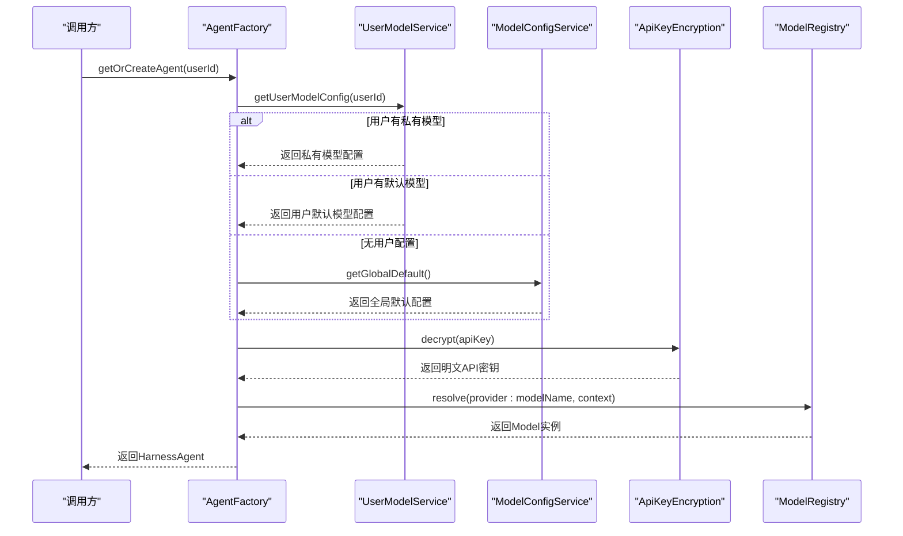
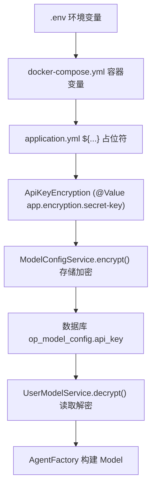
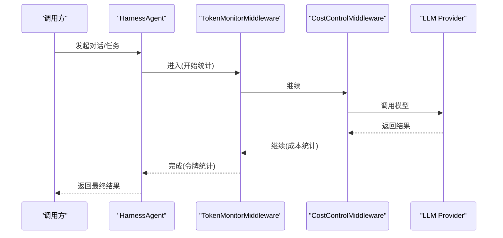

# Spring Boot 集成架构

<cite>
**本文引用的文件**   
- [AgentFactory.java](file://src/main/java/com/tutorial/offerpilot/agent/AgentFactory.java)
- [ModelConfigService.java](file://src/main/java/com/tutorial/offerpilot/service/ModelConfigService.java)
- [UserModelService.java](file://src/main/java/com/tutorial/offerpilot/service/UserModelService.java)
- [ApiKeyEncryption.java](file://src/main/java/com/tutorial/offerpilot/service/ApiKeyEncryption.java)
- [ModelListFetcher.java](file://src/main/java/com/tutorial/offerpilot/service/ModelListFetcher.java)
- [ModelConfigController.java](file://src/main/java/com/tutorial/offerpilot/controller/ModelConfigController.java)
- [UserModelController.java](file://src/main/java/com/tutorial/offerpilot/controller/UserModelController.java)
- [ModelConfig.java](file://src/main/java/com/tutorial/offerpilot/entity/ModelConfig.java)
- [ModelName.java](file://src/main/java/com/tutorial/offerpilot/entity/ModelName.java)
- [ProviderPreset.java](file://src/main/java/com/tutorial/offerpilot/enums/ProviderPreset.java)
- [ModelConfigRepository.java](file://src/main/java/com/tutorial/offerpilot/repository/ModelConfigRepository.java)
- [AgentScopeProperties.java](file://src/main/java/com/tutorial/offerpilot/config/AgentScopeProperties.java)
- [MilvusConfig.java](file://src/main/java/com/tutorial/offerpilot/config/MilvusConfig.java)
- [MilvusProperties.java](file://src/main/java/com/tutorial/offerpilot/config/MilvusProperties.java)
- [RedisConfig.java](file://src/main/java/com/tutorial/offerpilot/config/RedisConfig.java)
- [SecurityConfig.java](file://src/main/java/com/tutorial/offerpilot/config/SecurityConfig.java)
- [WebConfig.java](file://src/main/java/com/tutorial/offerpilot/config/WebConfig.java)
- [AsyncConfig.java](file://src/main/java/com/tutorial/offerpilot/config/AsyncConfig.java)
- [application.yml](file://src/main/resources/application.yml)
- [docker-compose.yml](file://docker-compose.yml)
- [JwtTokenProvider.java](file://src/main/java/com/tutorial/offerpilot/security/JwtTokenProvider.java)
</cite>

## 更新摘要
**变更内容**   
- 新增完整的 LLM 模型配置管理系统，支持 8 家主流 Provider（DashScope、OpenAI、DeepSeek、SiliconFlow、Volcengine、Anthropic Claude、Google Gemini、Ollama）
- AgentFactory 实现动态模型解析与优先级选择算法（用户私有 > 用户默认 > 全局默认 > application.yml 兜底）
- 新增 ModelConfigService、UserModelService、ApiKeyEncryption 服务及对应的 REST 控制器
- 增强 API 密钥安全管理，支持 AES 加密存储和脱敏显示
- 完善模型列表自动拉取功能，支持多种 API 格式响应解析

## Agent 组件 Bean 注入方式
- 工厂类与工具注入模式
  - AgentFactory 使用 @Component 注册为 Spring Bean，并通过构造器一次性注入所有依赖：配置属性、用户记忆服务、用户模型服务、模型配置服务、API 密钥加密服务以及全部 11 个 @Tool Bean。
  - 在构建 Toolkit 时，将工具按业务域分组注册到四个组：knowledge_retrieval、resume_analysis、interview、utility，并统一调用 registerMetaTool 注册元工具。
- Caffeine 缓存的 Agent 池
  - 使用 Caffeine 维护一个有界缓存 agentPool，最大容量 500，未访问超过 30 分钟自动淘汰；通过 getOrCreateAgent(userId) 实现"按用户维度"的 HarnessAgent 复用与按需创建。
- RuntimeContext 的构建与传递路径
  - AgentFactory 现在集成了动态模型解析能力，通过 UserModelService 和 ModelConfigService 获取用户偏好和全局配置，结合 ApiKeyEncryption 解密 API Key，最终通过 ModelRegistry.resolve() 动态创建 Model 实例。

```mermaid
classDiagram
class AgentFactory {
+getOrCreateAgent(userId) HarnessAgent
-buildToolkit() Toolkit
-buildSystemPrompt() String
-resolveModel(userId) Model
-agentPool : Cache~String, HarnessAgent~
-properties : AgentScopeProperties
-userMemoryService : UserMemoryService
-userModelService : UserModelService
-modelConfigService : ModelConfigService
-apiKeyEncryption : ApiKeyEncryption
}
class UserModelService {
+getUserModelConfig(userId) ModelConfig
-getAvailableModels(userId) UserModelResponse[]
-setDefaultModel(userId, request) void
-createPrivateModel(userId, request) ModelConfigResponse
}
class ModelConfigService {
+listConfigs() ModelConfigResponse[]
+createConfig(request) ModelConfigResponse
+updateConfig(id, request) ModelConfigResponse
+deleteConfig(id) void
+setGlobalDefault(id, modelName) ModelConfigResponse
+getGlobalDefault() ModelConfig
}
class ApiKeyEncryption {
+encrypt(plainText) String
+decrypt(cipherText) String
+mask(apiKey) String
}
AgentFactory --> UserModelService : "获取用户模型配置"
AgentFactory --> ModelConfigService : "获取全局默认配置"
AgentFactory --> ApiKeyEncryption : "解密API密钥"
```

**图表来源**   
- [AgentFactory.java:66-98](file://src/main/java/com/tutorial/offerpilot/agent/AgentFactory.java#L66-L98)
- [AgentFactory.java:265-298](file://src/main/java/com/tutorial/offerpilot/agent/AgentFactory.java#L265-L298)
- [UserModelService.java:153-168](file://src/main/java/com/tutorial/offerpilot/service/UserModelService.java#L153-L168)
- [ModelConfigService.java:200-202](file://src/main/java/com/tutorial/offerpilot/service/ModelConfigService.java#L200-L202)
- [ApiKeyEncryption.java:37-62](file://src/main/java/com/tutorial/offerpilot/service/ApiKeyEncryption.java#L37-L62)

**章节来源**   
- [AgentFactory.java:66-98](file://src/main/java/com/tutorial/offerpilot/agent/AgentFactory.java#L66-L98)
- [AgentFactory.java:265-298](file://src/main/java/com/tutorial/offerpilot/agent/AgentFactory.java#L265-L298)

## 配置类扫描路径
- 包路径：com.tutorial.offerpilot.config
- 关键配置类与职责概览

| 配置类 | 主要职责 | 关键 Bean / 行为 |
| --- | --- | --- |
| AgentScopeProperties | 绑定 agentscope.* 配置项（模型、Agent、知识库） | @ConfigurationProperties(prefix="agentscope")，提供 ModelConfig/AgentConfig/KnowledgeConfig |
| MilvusConfig | 初始化 Milvus v2 客户端连接 | milvusClient(MilvusProperties) → MilvusClientV2 |
| MilvusProperties | 绑定 app.milvus.* 配置项 | host/port/database/connectTimeoutMs/keepAliveTimeMs |
| RedisConfig | 暴露 StringRedisTemplate | stringRedisTemplate(RedisConnectionFactory) |
| SecurityConfig | 安全过滤链、无状态会话、异常响应格式 | SecurityFilterChain、PasswordEncoder、AuthenticationManager |
| WebConfig | CORS 跨域策略 | addMapping("/api/**") 允许凭据与常用方法 |
| AsyncConfig | 异步任务线程池 | ingestionExecutor(core/max/queue) 命名前缀 ingestion- |

**章节来源**   
- [AgentScopeProperties.java:10-17](file://src/main/java/com/tutorial/offerpilot/config/AgentScopeProperties.java#L10-17)
- [MilvusConfig.java:18-29](file://src/main/java/com/tutorial/offerpilot/config/MilvusConfig.java#L18-29)
- [MilvusProperties.java:10-20](file://src/main/java/com/tutorial/offerpilot/config/MilvusProperties.java#L10-20)
- [RedisConfig.java:14-17](file://src/main/java/com/tutorial/offerpilot/config/RedisConfig.java#L14-17)
- [SecurityConfig.java:25-28](file://src/main/java/com/tutorial/offerpilot/config/SecurityConfig.java#L25-28)
- [WebConfig.java:10-22](file://src/main/java/com/tutorial/offerpilot/config/WebConfig.java#L10-22)
- [AsyncConfig.java:14-31](file://src/main/java/com/tutorial/offerpilot/config/AsyncConfig.java#L14-31)

## LLM 模型初始化与动态解析
- **更新** 系统现已支持多 Provider 的动态模型解析，实现了基于优先级的模型选择算法

### 多 Provider 预设配置
系统内置了 8 家主流 LLM Provider 的预设配置：

| Provider | 标识 | API 格式 | 认证类型 | 默认 Base URL |
| --- | --- | --- | --- | --- |
| 阿里百炼 DashScope | dashscope | OpenAI | Bearer | https://dashscope.aliyuncs.com/compatible-mode/v1 |
| OpenAI | openai | OpenAI | Bearer | https://api.openai.com/v1 |
| DeepSeek | deepseek | OpenAI | Bearer | https://api.deepseek.com |
| 硅基流动 SiliconFlow | siliconflow | OpenAI | Bearer | https://api.siliconflow.cn/v1 |
| 火山引擎 (豆包) | volcengine | OpenAI | Bearer | https://ark.cn-beijing.volces.com/api/v3 |
| Anthropic (Claude) | anthropic | Anthropic | x-api-key | https://api.anthropic.com |
| Google Gemini | gemini | Gemini | x-goog-api-key | https://generativelanguage.googleapis.com/v1beta |
| Ollama (本地) | ollama | OpenAI | None | http://localhost:11434/v1 |

### 动态模型解析优先级算法
AgentFactory 实现了四级优先级模型解析：

**图表来源**   
- [AgentFactory.java:265-298](file://src/main/java/com/tutorial/offerpilot/agent/AgentFactory.java#L265-L298)
- [UserModelService.java:153-168](file://src/main/java/com/tutorial/offerpilot/service/UserModelService.java#L153-L168)
- [ModelConfigService.java:200-202](file://src/main/java/com/tutorial/offerpilot/service/ModelConfigService.java#L200-L202)
- [ApiKeyEncryption.java:52-62](file://src/main/java/com/tutorial/offerpilot/service/ApiKeyEncryption.java#L52-L62)

### 模型列表自动拉取机制
系统支持从各 Provider API 自动拉取可用模型列表：

- **支持的 API 格式**：OpenAI、Anthropic、Gemini 三种格式
- **自动解析逻辑**：根据配置的 apiFormat 自动选择对应的 JSON 解析器
- **缓存策略**：模型名称持久化到数据库，避免频繁请求外部 API

**章节来源**   
- [ProviderPreset.java:13-101](file://src/main/java/com/tutorial/offerpilot/enums/ProviderPreset.java#L13-101)
- [AgentFactory.java:265-298](file://src/main/java/com/tutorial/offerpilot/agent/AgentFactory.java#L265-L298)
- [ModelListFetcher.java:44-60](file://src/main/java/com/tutorial/offerpilot/service/ModelListFetcher.java#L44-60)

## API 密钥安全配置管理
- **更新** 新增了专门的 API 密钥加密服务和多层安全防护机制

### AES 加密存储方案
ApiKeyEncryption 服务提供了完整的 API Key 生命周期管理：

| 操作 | 方法 | 说明 |
| --- | --- | --- |
| 加密存储 | encrypt(String) | 使用 AES-128 加密 API Key |
| 解密读取 | decrypt(String) | 解密存储的 API Key |
| 脱敏显示 | mask(String) | 保留前后各4位，中间用 **** 替换 |

### 多层安全配置链路

**图表来源**   
- [ApiKeyEncryption.java:26-32](file://src/main/java/com/tutorial/offerpilot/service/ApiKeyEncryption.java#L26-32)
- [ModelConfigService.java:67](file://src/main/java/com/tutorial/offerpilot/service/ModelConfigService.java#L67)
- [UserModelService.java:173-179](file://src/main/java/com/tutorial/offerpilot/service/UserModelService.java#L173-L179)
- [AgentFactory.java:278](file://src/main/java/com/tutorial/offerpilot/agent/AgentFactory.java#L278)

### 多环境配置策略
- application.yml 设置 spring.profiles.active=dev，可通过 application-dev.yml / application-prod.yml 覆盖敏感配置
- docker-compose.yml 中基础设施服务也通过环境变量注入，便于不同环境隔离
- JWT Secret 和加密密钥都通过环境变量注入，确保生产环境安全

**章节来源**   
- [ApiKeyEncryption.java:19-32](file://src/main/java/com/tutorial/offerpilot/service/ApiKeyEncryption.java#L19-32)
- [ApiKeyEncryption.java:68-76](file://src/main/java/com/tutorial/offerpilot/service/ApiKeyEncryption.java#L68-76)
- [ModelConfigService.java:67](file://src/main/java/com/tutorial/offerpilot/service/ModelConfigService.java#L67)
- [application.yml:63-64](file://src/main/resources/application.yml#L63-64)

## 管理员模型配置管理接口
- **新增** 完整的模型配置 CRUD 管理和 Provider 预设管理

### 管理员 API 端点
| 方法 | 路径 | 功能 | 权限要求 |
| --- | --- | --- | --- |
| GET | /api/v1/admin/models | 获取所有非私有模型配置 | ADMIN |
| POST | /api/v1/admin/models | 新增模型配置（自动拉取模型列表） | ADMIN |
| PUT | /api/v1/admin/models/{id} | 更新模型配置 | ADMIN |
| DELETE | /api/v1/admin/models/{id} | 删除模型配置 | ADMIN |
| POST | /api/v1/admin/models/{id}/refresh-models | 重新拉取模型名称 | ADMIN |
| PUT | /api/v1/admin/models/{id}/set-global-default | 设置全局默认模型 | ADMIN |
| GET | /api/v1/admin/models/provider-presets | 获取 Provider 预设列表 | ADMIN |

### 数据实体设计
- **op_model_config**：存储模型提供方配置，包含 provider、baseUrl、apiKey（加密）、apiFormat、authHeaderType、modelListUrl、defaultModelName、isEnabled、isGlobalDefault、isPrivate 等字段
- **op_model_name**：存储从 Provider API 拉取的模型名称列表，关联 model_config_id

**章节来源**   
- [ModelConfigController.java:24-82](file://src/main/java/com/tutorial/offerpilot/controller/ModelConfigController.java#L24-82)
- [ModelConfig.java:14-64](file://src/main/java/com/tutorial/offerpilot/entity/ModelConfig.java#L14-64)
- [ModelName.java:14-34](file://src/main/java/com/tutorial/offerpilot/entity/ModelName.java#L14-34)

## 用户模型偏好管理接口
- **新增** 用户级别的模型选择和私有模型配置管理

### 用户 API 端点
| 方法 | 路径 | 功能 | 认证要求 |
| --- | --- | --- | --- |
| GET | /api/v1/user/models | 获取用户可用的模型列表 | 已登录用户 |
| PUT | /api/v1/user/models/default | 设置用户默认模型 | 已登录用户 |
| POST | /api/v1/user/models/private | 新增用户私有模型 | 已登录用户 |

### 用户模型选择逻辑
用户模型配置支持三个层次：
1. **私有模型**：用户个人创建的专属模型配置，优先级最高
2. **用户默认模型**：用户在系统中选择的默认模型
3. **全局默认模型**：管理员设置的系统级默认模型

**章节来源**   
- [UserModelController.java:22-64](file://src/main/java/com/tutorial/offerpilot/controller/UserModelController.java#L22-64)
- [UserModelService.java:42-67](file://src/main/java/com/tutorial/offerpilot/service/UserModelService.java#L42-67)
- [UserModelService.java:153-168](file://src/main/java/com/tutorial/offerpilot/service/UserModelService.java#L153-L168)

## Middleware 洋葱模式
- AgentFactory 在构建 HarnessAgent 时插入了两个中间件：TokenMonitorMiddleware 与 CostControlMiddleware，二者以 middleware(...) 的方式串联，形成"请求进入—统计—控制—推理—返回"的洋葱式处理链。
- 扩展建议
  - 如需加入鉴权、限流、审计、记忆注入等横切逻辑，可新增中间件并按顺序插入，确保幂等与线程安全。
  - 若需携带运行时上下文（userId、sessionId），建议在中间件入口处解析并透传至后续处理阶段，避免在业务工具中直接耦合。

**图表来源**   
- [AgentFactory.java:120-133](file://src/main/java/com/tutorial/offerpilot/agent/AgentFactory.java#L120-133)

**章节来源**   
- [AgentFactory.java:120-133](file://src/main/java/com/tutorial/offerpilot/agent/AgentFactory.java#L120-133)