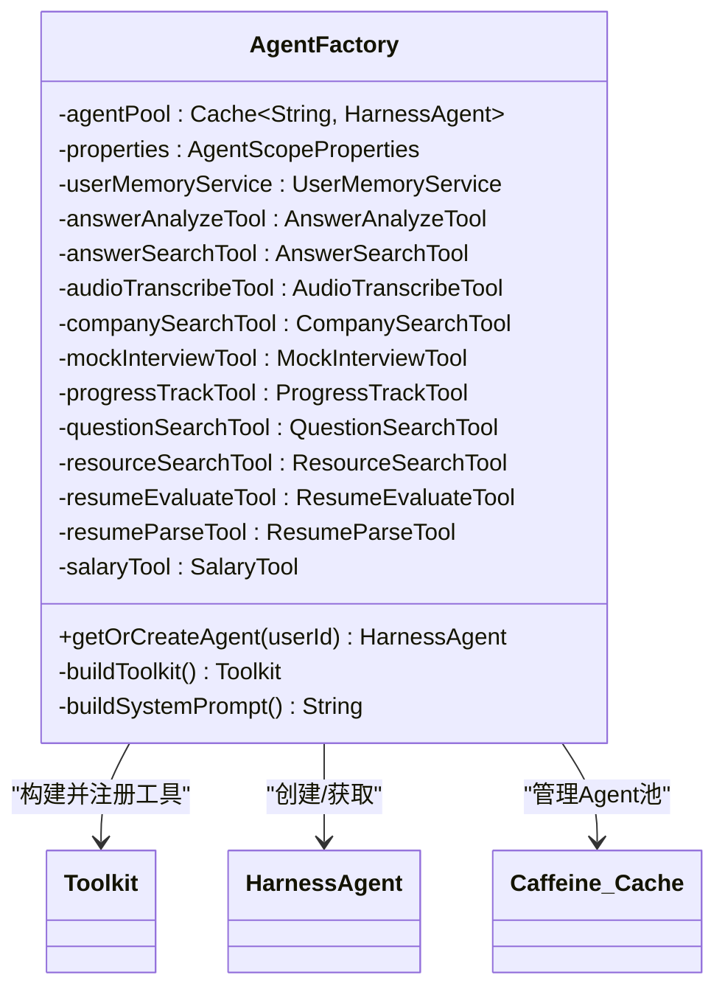
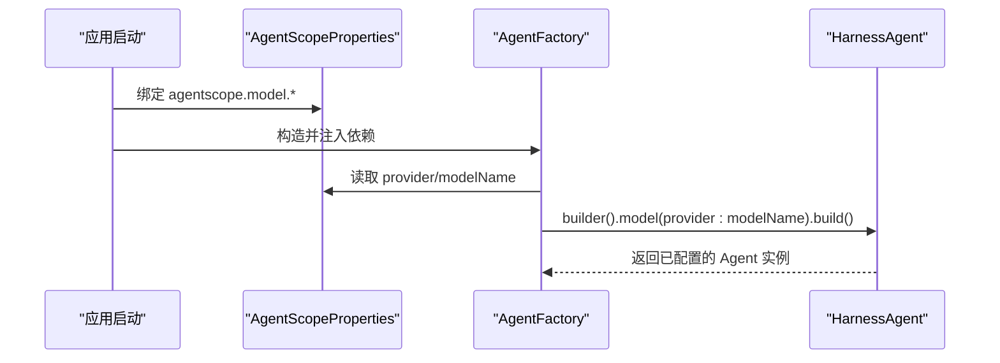
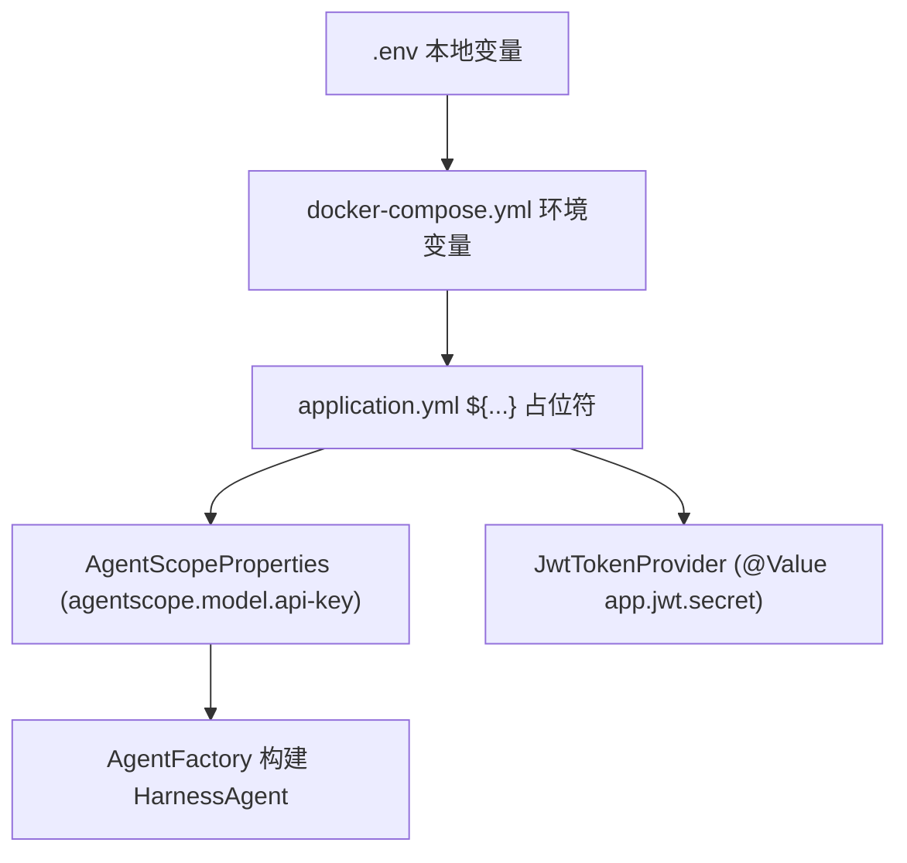
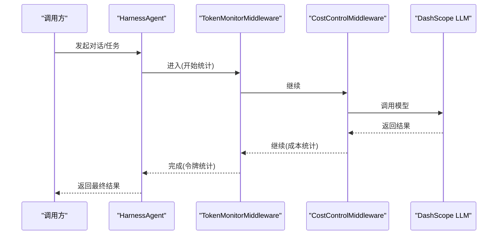

# Spring Boot 集成架构

<cite>
**本文引用的文件**   
- [AgentFactory.java](file://src/main/java/com/tutorial/offerpilot/agent/AgentFactory.java)
- [AgentScopeProperties.java](file://src/main/java/com/tutorial/offerpilot/config/AgentScopeProperties.java)
- [MilvusConfig.java](file://src/main/java/com/tutorial/offerpilot/config/MilvusConfig.java)
- [MilvusProperties.java](file://src/main/java/com/tutorial/offerpilot/config/MilvusProperties.java)
- [RedisConfig.java](file://src/main/java/com/tutorial/offerpilot/config/RedisConfig.java)
- [SecurityConfig.java](file://src/main/java/com/tutorial/offerpilot/config/SecurityConfig.java)
- [WebConfig.java](file://src/main/java/com/tutorial/offerpilot/config/WebConfig.java)
- [AsyncConfig.java](file://src/main/java/com/tutorial/offerpilot/config/AsyncConfig.java)
- [application.yml](file://src/main/resources/application.yml)
- [docker-compose.yml](file://docker-compose.yml)
- [JwtTokenProvider.java](file://src/main/java/com/tutorial/offerpilot/security/JwtTokenProvider.java)
</cite>

## Agent 组件 Bean 注入方式
- 工厂类与工具注入模式
  - AgentFactory 使用 @Component 注册为 Spring Bean，并通过构造器一次性注入所有依赖：配置属性、用户记忆服务以及全部 11 个 @Tool Bean（AnswerAnalyzeTool、AnswerSearchTool、AudioTranscribeTool、CompanySearchTool、MockInterviewTool、ProgressTrackTool、QuestionSearchTool、ResourceSearchTool、ResumeEvaluateTool、ResumeParseTool、SalaryTool）。
  - 在构建 Toolkit 时，将工具按业务域分组注册到四个组：knowledge_retrieval、resume_analysis、interview、utility，并统一调用 registerMetaTool 注册元工具。
- Caffeine 缓存的 Agent 池
  - 使用 Caffeine 维护一个有界缓存 agentPool，最大容量 500，未访问超过 30 分钟自动淘汰；通过 getOrCreateAgent(userId) 实现“按用户维度”的 HarnessAgent 复用与按需创建。
- RuntimeContext 的构建与传递路径
  - 当前代码中未见显式的 RuntimeContext 对象定义与传递逻辑；Agent 实例以 userId 作为缓存键，系统提示词由 buildSystemPrompt() 生成。若需引入会话级上下文（如 sessionId），可在上层 Service/Controller 层封装后通过中间件或参数传入，避免直接耦合到 AgentFactory。

图表来源
- [AgentFactory.java:26-82](file://src/main/java/com/tutorial/offerpilot/agent/AgentFactory.java#L26-L82)
- [AgentFactory.java:49-54](file://src/main/java/com/tutorial/offerpilot/agent/AgentFactory.java#L49-L54)
- [AgentFactory.java:134-211](file://src/main/java/com/tutorial/offerpilot/agent/AgentFactory.java#L134-L211)
- [AgentFactory.java:87-122](file://src/main/java/com/tutorial/offerpilot/agent/AgentFactory.java#L87-L122)

章节来源
- [AgentFactory.java:26-82](file://src/main/java/com/tutorial/offerpilot/agent/AgentFactory.java#L26-L82)
- [AgentFactory.java:49-54](file://src/main/java/com/tutorial/offerpilot/agent/AgentFactory.java#L49-L54)
- [AgentFactory.java:87-122](file://src/main/java/com/tutorial/offerpilot/agent/AgentFactory.java#L87-L122)
- [AgentFactory.java:134-211](file://src/main/java/com/tutorial/offerpilot/agent/AgentFactory.java#L134-L211)

## 配置类扫描路径
- 包路径：com.tutorial.offerpilot.config
- 关键配置类与职责概览

| 配置类 | 主要职责 | 关键 Bean / 行为 |
| --- | --- | --- |
| AgentScopeProperties | 绑定 agentscope.* 配置项（模型、Agent、知识库） | @ConfigurationProperties(prefix="agentscope")，提供 ModelConfig/AgentConfig/KnowledgeConfig |
| MilvusConfig | 初始化 Milvus v2 客户端连接 | milvusClient(MilvusProperties) → MilvusClientV2 |
| MilvusProperties | 绑定 app.milvus.* 配置项 | host/port/database/connectTimeoutMs/keepAliveTimeMs |
| RedisConfig | 暴露 StringRedisTemplate | stringRedisTemplate(RedisConnectionFactory) |
| SecurityConfig | 安全过滤链、无状态会话、异常响应格式 | SecurityFilterChain、PasswordEncoder、AuthenticationManager |
| WebConfig | CORS 跨域策略 | addMapping("/api/**") 允许凭据与常用方法 |
| AsyncConfig | 异步任务线程池 | ingestionExecutor(core/max/queue) 命名前缀 ingestion- |

章节来源
- [AgentScopeProperties.java:10-17](file://src/main/java/com/tutorial/offerpilot/config/AgentScopeProperties.java#L10-L17)
- [MilvusConfig.java:18-29](file://src/main/java/com/tutorial/offerpilot/config/MilvusConfig.java#L18-L29)
- [MilvusProperties.java:10-20](file://src/main/java/com/tutorial/offerpilot/config/MilvusProperties.java#L10-L20)
- [RedisConfig.java:14-17](file://src/main/java/com/tutorial/offerpilot/config/RedisConfig.java#L14-L17)
- [SecurityConfig.java:25-28](file://src/main/java/com/tutorial/offerpilot/config/SecurityConfig.java#L25-L28)
- [WebConfig.java:10-22](file://src/main/java/com/tutorial/offerpilot/config/WebConfig.java#L10-L22)
- [AsyncConfig.java:14-31](file://src/main/java/com/tutorial/offerpilot/config/AsyncConfig.java#L14-L31)

## LLM 模型初始化
- 配置项到 Bean 的构建链路
  - application.yml 中的 agentscope.model.* 被 AgentScopeProperties.ModelConfig 通过 @ConfigurationProperties(prefix="agentscope") 绑定。
  - AgentFactory 在构建 HarnessAgent 时读取 properties.getModel().getProvider() 与 getModelName()，拼接成 modelId 字符串，作为模型标识传入 HarnessAgent.builder().model(modelId)。
- 关键配置说明
  - provider：dashscope
  - api-key：通过 ${DASHSCOPE_API_KEY} 注入（默认占位符 sk-xxx）
  - model-name：qwen-max
  - temperature：0.7
  - max-tokens：4096
- 注意
  - 本仓库未出现独立的 Model Bean 定义；模型信息以字符串形式由 AgentFactory 消费。若未来需要显式 Model Bean，可在 config 包新增对应配置类并在 AgentFactory 中注入。

图表来源
- [application.yml:34-40](file://src/main/resources/application.yml#L34-L40)
- [AgentScopeProperties.java:19-26](file://src/main/java/com/tutorial/offerpilot/config/AgentScopeProperties.java#L19-L26)
- [AgentFactory.java:91-122](file://src/main/java/com/tutorial/offerpilot/agent/AgentFactory.java#L91-L122)

章节来源
- [application.yml:34-40](file://src/main/resources/application.yml#L34-L40)
- [AgentScopeProperties.java:19-26](file://src/main/java/com/tutorial/offerpilot/config/AgentScopeProperties.java#L19-L26)
- [AgentFactory.java:91-122](file://src/main/java/com/tutorial/offerpilot/agent/AgentFactory.java#L91-L122)

## API 密钥安全配置
- 环境变量到 Bean 的安全传递链路
  - .env（开发本地）→ docker-compose.yml（容器编排）→ application.yml 中的 ${DASHSCOPE_API_KEY} → AgentScopeProperties.ModelConfig.apiKey → AgentFactory 构建 HarnessAgent 时使用。
  - JWT Secret 同理：application.yml 中 app.jwt.secret 通过 ${JWT_SECRET} 注入，JwtTokenProvider 在构造时通过 @Value("${app.jwt.secret}") 读取并用于签名与校验。
- 多环境配置策略
  - application.yml 设置 spring.profiles.active=dev，可通过 application-dev.yml / application-prod.yml 覆盖敏感配置（如数据库密码、API Key、JWT Secret）。
  - docker-compose.yml 中基础设施服务（MySQL、MinIO、Milvus 等）也通过环境变量注入，便于不同环境隔离。

图表来源
- [application.yml:34-40](file://src/main/resources/application.yml#L34-L40)
- [application.yml:58-61](file://src/main/resources/application.yml#L58-L61)
- [AgentScopeProperties.java:19-26](file://src/main/java/com/tutorial/offerpilot/config/AgentScopeProperties.java#L19-L26)
- [AgentFactory.java:91-122](file://src/main/java/com/tutorial/offerpilot/agent/AgentFactory.java#L91-L122)
- [JwtTokenProvider.java:23-28](file://src/main/java/com/tutorial/offerpilot/security/JwtTokenProvider.java#L23-L28)
- [docker-compose.yml:15-100](file://docker-compose.yml#L15-L100)

章节来源
- [application.yml:34-40](file://src/main/resources/application.yml#L34-L40)
- [application.yml:58-61](file://src/main/resources/application.yml#L58-L61)
- [AgentScopeProperties.java:19-26](file://src/main/java/com/tutorial/offerpilot/config/AgentScopeProperties.java#L19-L26)
- [AgentFactory.java:91-122](file://src/main/java/com/tutorial/offerpilot/agent/AgentFactory.java#L91-L122)
- [JwtTokenProvider.java:23-28](file://src/main/java/com/tutorial/offerpilot/security/JwtTokenProvider.java#L23-L28)
- [docker-compose.yml:15-100](file://docker-compose.yml#L15-L100)

## Middleware 洋葱模式
- 当前 AgentFactory 在构建 HarnessAgent 时插入了两个中间件：TokenMonitorMiddleware 与 CostControlMiddleware，二者以 middleware(...) 的方式串联，形成“请求进入—统计—控制—推理—返回”的洋葱式处理链。
- 扩展建议
  - 如需加入鉴权、限流、审计、记忆注入等横切逻辑，可新增中间件并按顺序插入，确保幂等与线程安全。
  - 若需携带运行时上下文（userId、sessionId），建议在中间件入口处解析并透传至后续处理阶段，避免在业务工具中直接耦合。

图表来源
- [AgentFactory.java:104-118](file://src/main/java/com/tutorial/offerpilot/agent/AgentFactory.java#L104-L118)

章节来源
- [AgentFactory.java:104-118](file://src/main/java/com/tutorial/offerpilot/agent/AgentFactory.java#L104-L118)