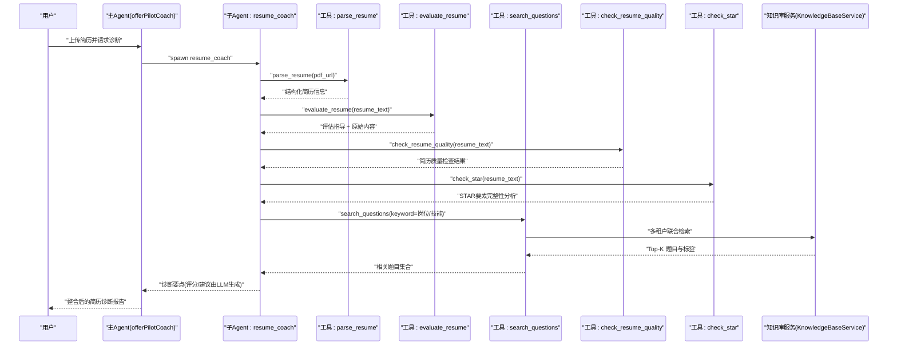
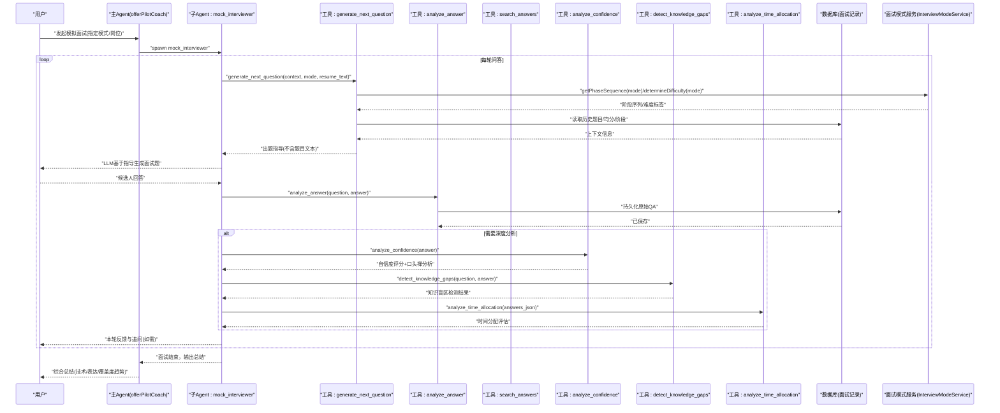
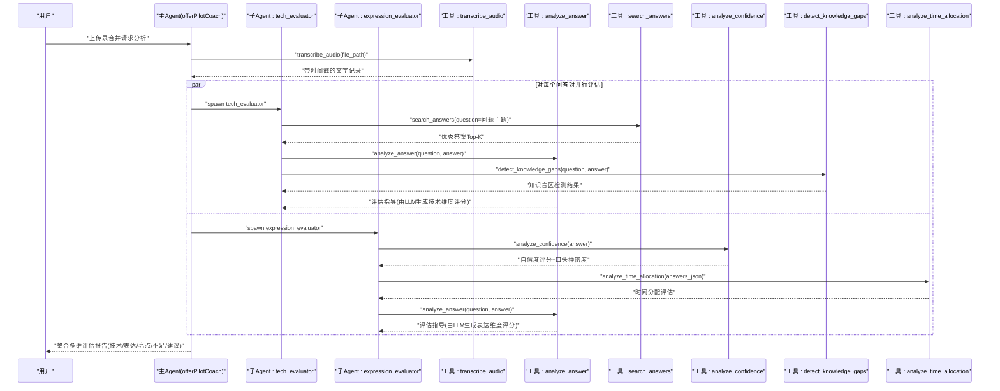
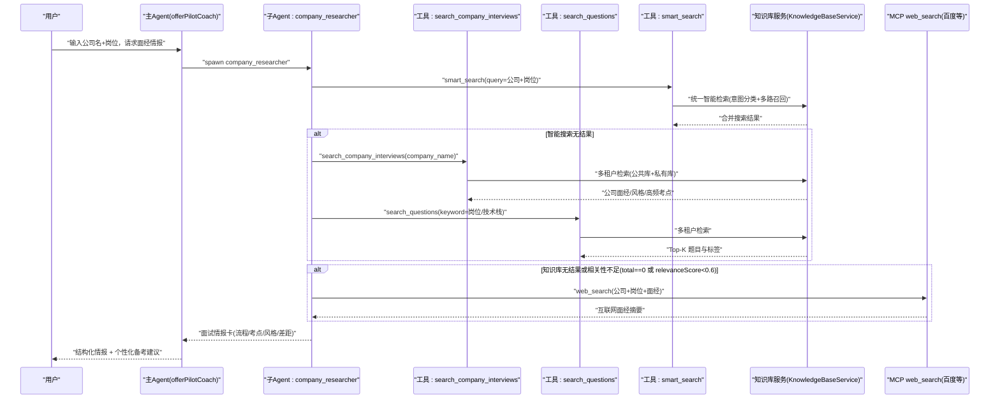
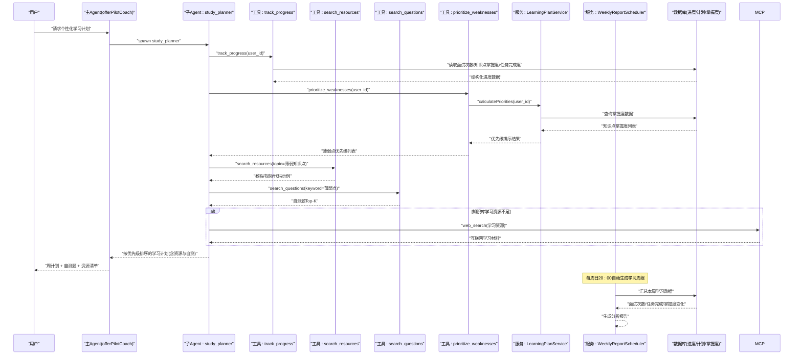
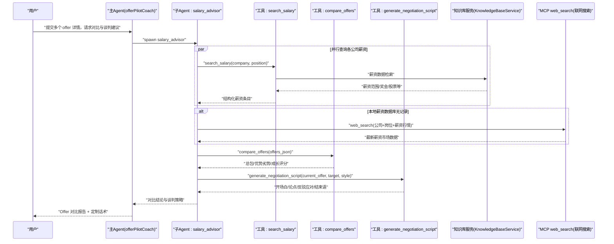

# 六大核心求职环节 Agent 交互时序

<cite>
**本文引用的文件**   
- [01-需求规格说明书.md](file://Documents/01-需求规格说明书.md)
- [02-系统架构设计说明书.md](file://Documents/02-系统架构设计说明书.md)
- [AgentFactory.java](file://src/main/java/com/tutorial/offerpilot/agent/AgentFactory.java)
- [InterviewMode.java](file://src/main/java/com/tutorial/offerpilot/enums/InterviewMode.java)
- [InterviewModeService.java](file://src/main/java/com/tutorial/offerpilot/service/InterviewModeService.java)
- [MockInterviewTool.java](file://src/main/java/com/tutorial/offerpilot/agent/tool/MockInterviewTool.java)
- [ConfidenceTool.java](file://src/main/java/com/tutorial/offerpilot/agent/tool/ConfidenceTool.java)
- [KnowledgeGapTool.java](file://src/main/java/com/tutorial/offerpilot/agent/tool/KnowledgeGapTool.java)
- [PriorityRankTool.java](file://src/main/java/com/tutorial/offerpilot/agent/tool/PriorityRankTool.java)
- [ResumeQualityTool.java](file://src/main/java/com/tutorial/offerpilot/agent/tool/ResumeQualityTool.java)
- [StarCheckTool.java](file://src/main/java/com/tutorial/offerpilot/agent/tool/StarCheckTool.java)
- [TimeAllocationTool.java](file://src/main/java/com/tutorial/offerpilot/agent/tool/TimeAllocationTool.java)
- [LearningPlanService.java](file://src/main/java/com/tutorial/offerpilot/service/LearningPlanService.java)
- [WeeklyReportScheduler.java](file://src/main/java/com/tutorial/offerpilot/service/WeeklyReportScheduler.java)
- [SmartSearchTool.java](file://src/main/java/com/tutorial/offerpilot/agent/tool/SmartSearchTool.java)
- [tools.json](file://workspace/tools.json)
</cite>

## 更新摘要
**变更内容**   
- 面试模式架构重大重构：InterviewMode从TECHNICAL/BEHAVIORAL重命名为TECH_DEEP/BEHAVIOR/SYSTEM_DESIGN/PRESSURE语义化命名
- MockInterviewTool集成新的InterviewModeService策略服务，支持模式感知的阶段轮转和难度递进
- 新增六维分析工具套件：ConfidenceTool（自信度分析）、KnowledgeGapTool（知识盲区检测）、PriorityRankTool（薄弱点排序）、ResumeQualityTool（简历质量检查）、StarCheckTool（STAR法则检查）、TimeAllocationTool（时间分配分析）
- LearningPlanService实现个性化学习计划管理，支持任务完成标记和优先级刷新
- WeeklyReportScheduler实现自动化周报生成，每周日20:00自动生成学习报告
- SmartSearchTool提供统一智能搜索入口，支持意图分类和多路召回

## 目录
- 环节一：简历智能诊断
- 环节二：AI 模拟面试
- 环节三：面试录音分析
- 环节四：目标公司面试情报
- 环节五：学习计划
- 环节六：薪资谈判

## 环节一：简历智能诊断
> 绘制用户上传简历 → 主Agent → spawn resume_coach → 调用 parse_resume/evaluate_resume/search_questions → 整合结果返回 的 Mermaid 时序图
> 标注每个步骤的工具调用和 SysPrompt 指令

- 关键说明
  - 主 Agent 仅做调度，不直接执行业务工具；子 Agent resume_coach 负责编排解析、评估与题库检索。
  - 工具返回"结构化数据 + 指导文本"，自然语言评分与建议由 LLM 在对话中动态生成（SysPrompt 明确禁止直接回显指导文本）。
  - 题库检索走多租户知识库（公共库 + 用户私有库）联合搜索。
  - **新增增强功能**：resume_coach现支持简历质量检查和STAR法则完整性验证，提供更全面的简历评估。

**章节来源**
- [01-需求规格说明书.md:41-55](file://Documents/01-需求规格说明书.md#L41-L55)
- [02-系统架构设计说明书.md:125-226](file://Documents/02-系统架构设计说明书.md#L125-L226)
- [AgentFactory.java:318-332](file://src/main/java/com/tutorial/offerpilot/agent/AgentFactory.java#L318-L332)
- [ResumeQualityTool.java:32-67](file://src/main/java/com/tutorial/offerpilot/agent/tool/ResumeQualityTool.java#L32-L67)
- [StarCheckTool.java:29-54](file://src/main/java/com/tutorial/offerpilot/agent/tool/StarCheckTool.java#L29-L54)

## 环节二：AI 模拟面试
> 绘制用户发起模拟面试 → 主Agent → spawn mock_interviewer → 多轮 generate_next_question/analyze_answer/search_answers → 面试总结 的 Mermaid 时序图
> 标注面试模式选择（技术深挖/行为面试/系统设计/压力面试）和追问机制

- 关键说明
  - **重大重构**：面试模式从TECHNICAL/BEHAVIORAL重命名为TECH_DEEP/BEHAVIOR/SYSTEM_DESIGN/PRESSURE，提供更语义化的模式标识。
  - **策略服务集成**：MockInterviewTool集成InterviewModeService，支持模式感知的阶段轮转和难度递进策略。
  - **六维分析增强**：新增自信度分析、知识盲区检测、时间分配分析等工具，提供更全面的面试评估。
  - 追问机制：当回答深度不足时，LLM 依据 analyze_answer 的指导进行追问或补充提问。
  - 工具职责分离：generate_next_question 仅产出"出题指导"，实际题目由 LLM 生成；analyze_answer 仅产出"评估指导"，评分与评语由 LLM 生成。

**章节来源**
- [01-需求规格说明书.md:70-83](file://Documents/01-需求规格说明书.md#L70-L83)
- [02-系统架构设计说明书.md:519-579](file://Documents/02-系统架构设计说明书.md#L519-579)
- [InterviewMode.java:6-11](file://src/main/java/com/tutorial/offerpilot/enums/InterviewMode.java#L6-L11)
- [InterviewModeService.java:58-88](file://src/main/java/com/tutorial/offerpilot/service/InterviewModeService.java#L58-L88)
- [MockInterviewTool.java:55-87](file://src/main/java/com/tutorial/offerpilot/agent/tool/MockInterviewTool.java#L55-L87)
- [ConfidenceTool.java:36-91](file://src/main/java/com/tutorial/offerpilot/agent/tool/ConfidenceTool.java#L36-L91)
- [KnowledgeGapTool.java:40-88](file://src/main/java/com/tutorial/offerpilot/agent/tool/KnowledgeGapTool.java#L40-L88)
- [TimeAllocationTool.java:37-110](file://src/main/java/com/tutorial/offerpilot/agent/tool/TimeAllocationTool.java#L37-L110)

## 环节三：面试录音分析
> 绘制用户上传录音 → 主Agent → transcribe_audio → 并行 spawn tech_evaluator + expression_evaluator → 分别分析每题 → 主Agent 整合报告 的 Mermaid 时序图
> 标注并行执行的技术评估和表达评估两个维度

- 关键说明
  - **六维分析增强**：tech_evaluator侧重技术深度与知识覆盖，expression_evaluator侧重表达逻辑与结构，两者都集成了新的分析工具。
  - 并行策略：tech_evaluator 侧重技术深度与知识覆盖，expression_evaluator 侧重表达逻辑与结构。
  - 评估流程：先检索优秀答案作为参考，再调用 analyze_answer 获取评估指导，最终由 LLM 生成具体分数与评语。
  - **新增分析维度**：自信度分析、知识盲区检测、时间分配分析为面试评估提供更全面的数据支撑。

**章节来源**
- [01-需求规格说明书.md:84-101](file://Documents/01-需求规格说明书.md#L84-L101)
- [02-系统架构设计说明书.md:477-517](file://Documents/02-系统架构设计说明书.md#L477-L517)
- [ConfidenceTool.java:36-91](file://src/main/java/com/tutorial/offerpilot/agent/tool/ConfidenceTool.java#L36-L91)
- [KnowledgeGapTool.java:40-88](file://src/main/java/com/tutorial/offerpilot/agent/tool/KnowledgeGapTool.java#L40-L88)
- [TimeAllocationTool.java:37-110](file://src/main/java/com/tutorial/offerpilot/agent/tool/TimeAllocationTool.java#L37-L110)

## 环节四：目标公司面试情报
> 绘制用户输入公司+岗位 → 主Agent → spawn company_researcher → search_company_info + search_questions → 生成"面试情报卡" 的 Mermaid 时序图
> 标注多租户检索与 Fallback 联网搜索触发条件

- 关键说明
  - **统一搜索入口**：company_researcher现优先使用smart_search工具进行统一智能检索，支持意图分类和多路召回。
  - 多租户检索：自动聚合公共库与用户私有库结果。
  - Fallback 规则：当 total==0 或最高相关性低于阈值时，SysPrompt 明确要求调用 MCP web_search 补充信息。
  - 子Agent工具白名单：包含 search_company_interviews、search_questions、smart_search、web_search 四个工具。

**章节来源**
- [01-需求规格说明书.md:56-69](file://Documents/01-需求规格说明书.md#L56-L69)
- [02-系统架构设计说明书.md:358-413](file://Documents/02-系统架构设计说明书.md#L358-413)
- [SmartSearchTool.java:39-157](file://src/main/java/com/tutorial/offerpilot/agent/tool/SmartSearchTool.java#L39-L157)
- [AgentFactory.java:389-399](file://src/main/java/com/tutorial/offerpilot/agent/AgentFactory.java#L389-L399)

## 环节五：学习计划
> 绘制用户请求学习计划 → 主Agent → spawn study_planner → track_progress + search_learning_resources + search_questions → 生成周计划与自测题 的 Mermaid 时序图
> 标注薄弱点优先级排序与资源推荐

- 关键说明
  - **优先级策略**：高频考点 × 低掌握度优先，通过PriorityRankTool和LearningPlanService实现量化排序。
  - **自动化周报**：WeeklyReportScheduler每周日20:00自动生成学习周报，汇总面试次数、任务完成情况、掌握度变化等维度。
  - 工具职责分离：track_progress 提供结构化数据与汇总指导，学习总结与任务拆解由 LLM 生成。
  - 子Agent工具白名单：包含 track_progress、prioritize_weaknesses、search_resources、search_questions、web_search 五个工具。
  - **增强功能**：新增薄弱点优先级排序和学习计划自动刷新机制，支持动态添加新发现的薄弱点任务。

**章节来源**
- [01-需求规格说明书.md:103-116](file://Documents/01-需求规格说明书.md#L103-L116)
- [02-系统架构设计说明书.md:580-657](file://Documents/02-系统架构设计说明书.md#L580-657)
- [PriorityRankTool.java:32-73](file://src/main/java/com/tutorial/offerpilot/agent/tool/PriorityRankTool.java#L32-L73)
- [LearningPlanService.java:84-144](file://src/main/java/com/tutorial/offerpilot/service/LearningPlanService.java#L84-L144)
- [WeeklyReportScheduler.java:43-72](file://src/main/java/com/tutorial/offerpilot/service/WeeklyReportScheduler.java#L43-L72)
- [AgentFactory.java:399-415](file://src/main/java/com/tutorial/offerpilot/agent/AgentFactory.java#L399-L415)

## 环节六：薪资谈判
> 绘制用户输入多个 offer → 主Agent → spawn salary_advisor → search_salary_data + compare_offers + generate_negotiation_script → 输出对比分析与话术 的 Mermaid 时序图
> 标注多维度对比与谈判风格配置

- 关键说明
  - **增强功能**：salary_advisor子Agent现支持三个核心工具：search_salary、compare_offers、generate_negotiation_script。
  - **多维度对比**：compare_offers工具支持base、总包、股票、福利、通勤成本、技术成长等多维度分析。
  - **谈判风格配置**：generate_negotiation_script支持assertive（强硬）、moderate（温和）、conservative（保守）三种谈判风格。
  - **JSON适配模式**：compare_offers采用JSON字符串输入，通过ObjectMapper解析为OfferCompareRequest对象。
  - **简单委托模式**：generate_negotiation_script直接透传参数给SalaryService处理。
  - **Fallback机制**：当本地薪资数据库无记录时，自动调用web_search从互联网搜索最新薪资行情。
  - **子Agent工具白名单**：包含search_salary、compare_offers、generate_negotiation_script、web_search四个工具。

**章节来源**
- [01-需求规格说明书.md:118-129](file://Documents/01-需求规格说明书.md#L118-L129)
- [02-系统架构设计说明书.md:659-765](file://Documents/02-系统架构设计说明书.md#L659-L765)
- [AgentFactory.java:415-431](file://src/main/java/com/tutorial/offerpilot/agent/AgentFactory.java#L415-L431)
- [tools.json:1-12](file://workspace/tools.json#L1-L12)