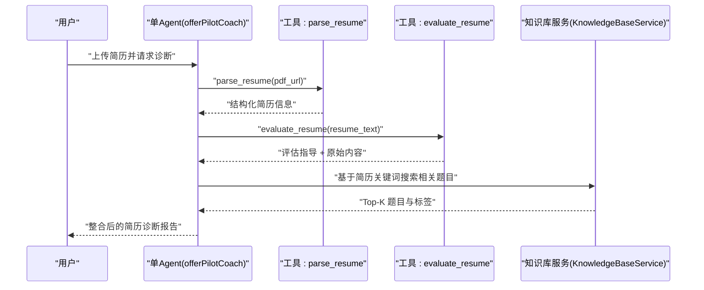
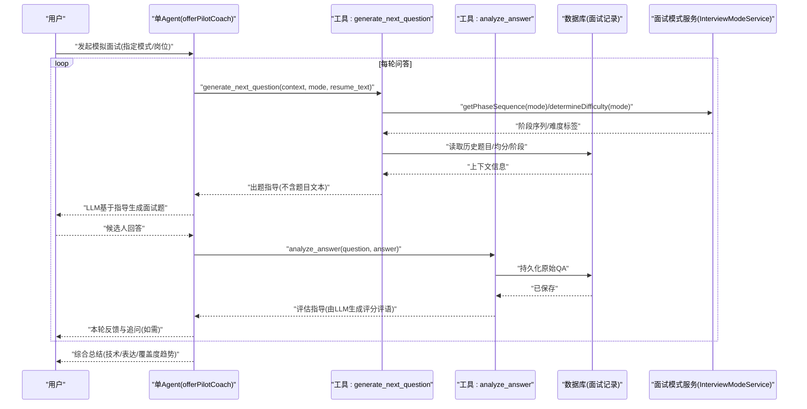
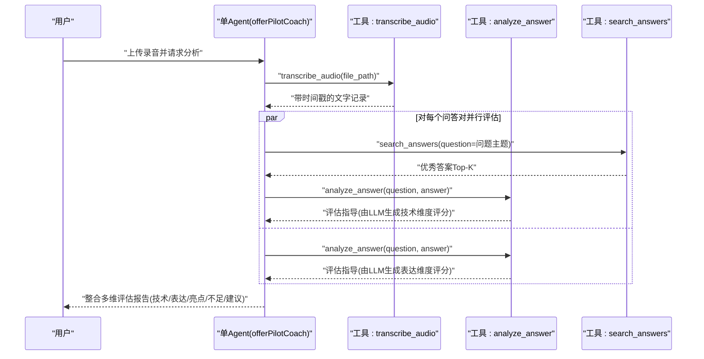
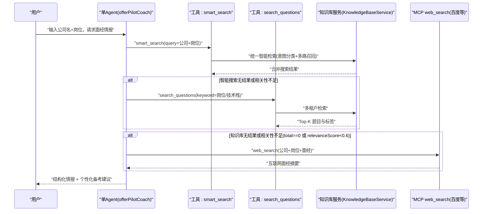
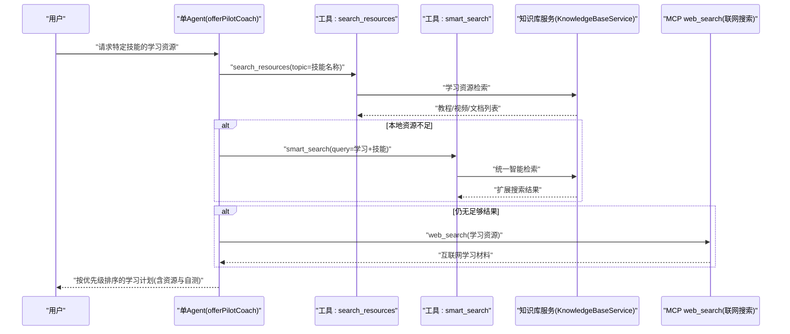

# 单Agent架构下核心求职环节交互流程

<cite>
**本文引用的文件**   
- [AgentFactory.java](file://src/main/java/com/tutorial/offerpilot/agent/AgentFactory.java)
- [MockInterviewTool.java](file://src/main/java/com/tutorial/offerpilot/agent/tool/MockInterviewTool.java)
- [ResumeEvaluateTool.java](file://src/main/java/com/tutorial/offerpilot/agent/tool/ResumeEvaluateTool.java)
- [SmartSearchTool.java](file://src/main/java/com/tutorial/offerpilot/agent/tool/SmartSearchTool.java)
- [KnowledgeBaseService.java](file://src/main/java/com/tutorial/offerpilot/service/KnowledgeBaseService.java)
- [InterviewModeService.java](file://src/main/java/com/tutorial/offerpilot/service/InterviewModeService.java)
- [InterviewMode.java](file://src/main/java/com/tutorial/offerpilot/enums/InterviewMode.java)
</cite>

## 更新摘要
**变更内容**
- 架构重大重构：从多子Agent架构简化为单Agent直接调用工具模式
- 删除薪资谈判、学习计划等依赖已删除服务的环节描述
- 重写所有Mermaid时序图以反映新的单Agent架构
- 移除8个子Agent（resume_coach、tech_evaluator、expression_evaluator、mock_interviewer、company_researcher、study_planner、salary_advisor、knowledge_agent）
- 保留9个核心工具，由主Agent直接调用执行

## 目录
- 环节一：简历智能诊断
- 环节二：AI 模拟面试
- 环节三：面试录音分析
- 环节四：目标公司面试情报
- 环节五：知识检索与学习资源

## 环节一：简历智能诊断
> 绘制用户上传简历 → 单Agent → 直接调用 parse_resume/evaluate_resume → 整合结果返回 的 Mermaid 时序图
> 标注工具调用和系统提示词指令



- 关键说明
  - **架构简化**：单Agent直接执行业务工具，不再通过子Agent调度
  - 工具返回"结构化数据 + 指导文本"，自然语言评分与建议由 LLM 在对话中动态生成（SysPrompt 明确禁止直接回显指导文本）
  - 题库检索走多租户知识库（公共库 + 用户私有库）联合搜索
  - 权限控制：parse_resume、evaluate_resume 工具均配置为 ALLOW 权限

**章节来源**
- [AgentFactory.java:318-342](file://src/main/java/com/tutorial/offerpilot/agent/AgentFactory.java#L318-L342)
- [ResumeEvaluateTool.java:21-26](file://src/main/java/com/tutorial/offerpilot/agent/tool/ResumeEvaluateTool.java#L21-L26)

## 环节二：AI 模拟面试
> 绘制用户发起模拟面试 → 单Agent → 直接调用 generate_next_question/analyze_answer → 多轮问答 的 Mermaid 时序图
> 标注面试模式选择（技术深挖/行为面试/系统设计/压力面试）和追问机制



- 关键说明
  - **架构简化**：单Agent直接调用 MockInterviewTool 和 AnswerAnalyzeTool
  - **策略服务集成**：MockInterviewTool集成InterviewModeService，支持模式感知的阶段轮转和难度递进策略
  - 追问机制：当回答深度不足时，LLM 依据 analyze_answer 的指导进行追问或补充提问
  - 工具职责分离：generate_next_question 仅产出"出题指导"，实际题目由 LLM 生成；analyze_answer 仅产出"评估指导"，评分与评语由 LLM 生成
  - 面试模式：TECH_DEEP/BEHAVIOR/SYSTEM_DESIGN/PRESSURE 四种模式

**章节来源**
- [MockInterviewTool.java:55-87](file://src/main/java/com/tutorial/offerpilot/agent/tool/MockInterviewTool.java#L55-L87)
- [InterviewModeService.java:18-32](file://src/main/java/com/tutorial/offerpilot/service/InterviewModeService.java#L18-L32)
- [InterviewMode.java:6-11](file://src/main/java/com/tutorial/offerpilot/enums/InterviewMode.java#L6-L11)

## 环节三：面试录音分析
> 绘制用户上传录音 → 单Agent → 直接调用 transcribe_audio/analyze_answer → 并行分析 → 整合报告 的 Mermaid 时序图
> 标注技术评估和表达评估两个维度



- 关键说明
  - **架构简化**：单Agent直接调用 AudioTranscribeTool 和 AnswerAnalyzeTool
  - 并行策略：对同一录音中的不同问答对并行处理，提高分析效率
  - 评估流程：先检索优秀答案作为参考，再调用 analyze_answer 获取评估指导，最终由 LLM 生成具体分数与评语
  - 工具权限：transcribe_audio、analyze_answer、search_answers 均配置为 ALLOW 权限

**章节来源**
- [AgentFactory.java:326-333](file://src/main/java/com/tutorial/offerpilot/agent/AgentFactory.java#L326-L333)

## 环节四：目标公司面试情报
> 绘制用户输入公司+岗位 → 单Agent → 直接调用 smart_search/search_questions → 生成"面试情报卡" 的 Mermaid 时序图
> 标注统一智能检索与联网搜索兜底



- 关键说明
  - **统一搜索入口**：优先使用 smart_search 工具进行统一智能检索，支持意图分类和多路召回
  - 多租户检索：自动聚合公共库与用户私有库结果
  - Fallback 规则：当 total==0 或最高相关性低于阈值时，SysPrompt 明确要求调用 MCP web_search 补充信息
  - 工具白名单：包含 smart_search、search_questions、search 三个工具

**章节来源**
- [SmartSearchTool.java:35-153](file://src/main/java/com/tutorial/offerpilot/agent/tool/SmartSearchTool.java#L35-L153)
- [AgentFactory.java:334-339](file://src/main/java/com/tutorial/offerpilot/agent/AgentFactory.java#L334-L339)

## 环节五：知识检索与学习资源
> 绘制用户请求学习资源 → 单Agent → 直接调用 search_resources/smart_search → 推荐学习材料 的 Mermaid 时序图
> 标注资源类型识别与优先级排序



- 关键说明
  - **架构简化**：单Agent直接调用 ResourceSearchTool 和 SmartSearchTool
  - 资源检索：优先使用专门的 search_resources 工具，失败时回退到统一的 smart_search
  - 联网兜底：当本地知识库资源不足时，自动调用 MCP web_search 获取互联网学习材料
  - 工具权限：search_resources、smart_search、search 均配置为 ALLOW 权限

**章节来源**
- [AgentFactory.java:332-339](file://src/main/java/com/tutorial/offerpilot/agent/AgentFactory.java#L332-L339)

## 架构变化对比

### 原有多Agent架构
```
用户 → 主Agent(调度中心) → spawn 子Agent → 子Agent调用工具 → 返回结果
```

### 现单Agent架构
```
用户 → 单Agent(全能助手) → 直接调用工具 → 返回结果
```

### 主要变更点
1. **移除子Agent调度**：不再使用 spawn/resume_subagent 机制
2. **工具直调模式**：主Agent直接拥有所有工具权限并调用
3. **简化权限控制**：所有工具均为 ALLOW 权限，无需细粒度控制
4. **统一系统提示词**：从"调度中心"角色改为"全能助手"角色

**章节来源**
- [AgentFactory.java:120-155](file://src/main/java/com/tutorial/offerpilot/agent/AgentFactory.java#L120-L155)
- [AgentFactory.java:212-309](file://src/main/java/com/tutorial/offerpilot/agent/AgentFactory.java#L212-L309)