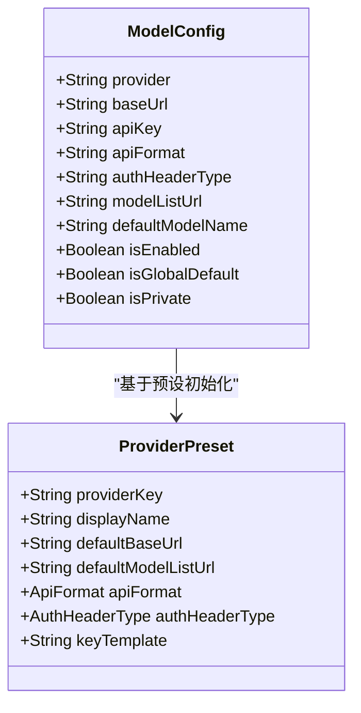
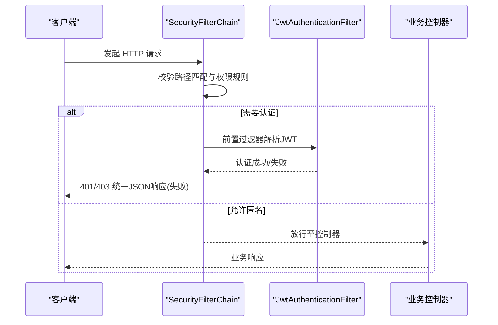
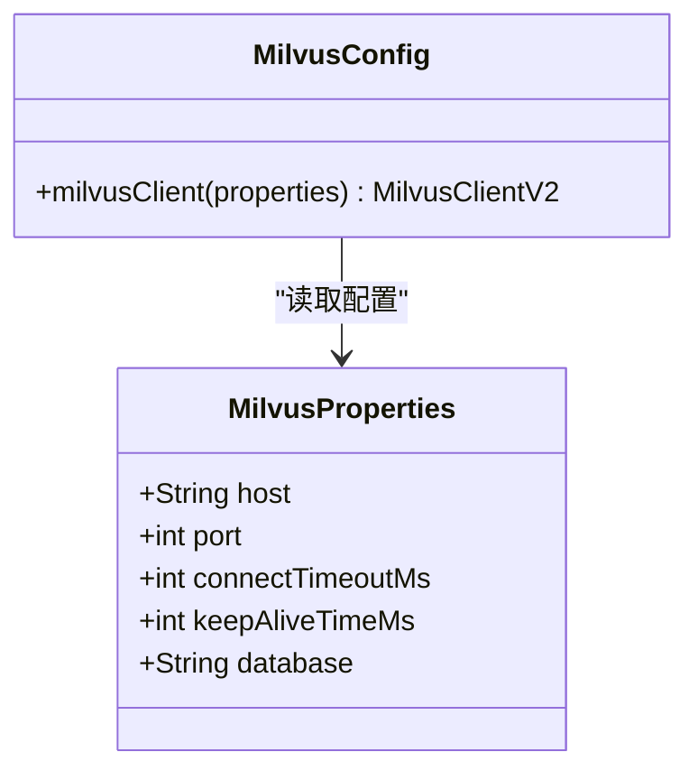
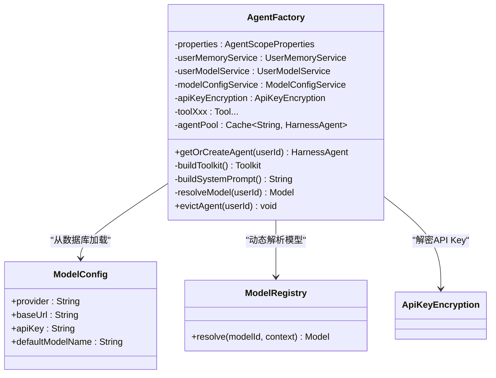

# 关键配置类代码导读

<cite>
**本文引用的文件**   
- [AgentScopeProperties.java](file://src/main/java/com/tutorial/offerpilot/config/AgentScopeProperties.java)
- [SecurityConfig.java](file://src/main/java/com/tutorial/offerpilot/config/SecurityConfig.java)
- [MilvusConfig.java](file://src/main/java/com/tutorial/offerpilot/config/MilvusConfig.java)
- [MilvusProperties.java](file://src/main/java/com/tutorial/offerpilot/config/MilvusProperties.java)
- [RedisConfig.java](file://src/main/java/com/tutorial/offerpilot/config/RedisConfig.java)
- [AsyncConfig.java](file://src/main/java/com/tutorial/offerpilot/config/AsyncConfig.java)
- [WebConfig.java](file://src/main/java/com/tutorial/offerpilot/config/WebConfig.java)
- [AgentFactory.java](file://src/main/java/com/tutorial/offerpilot/agent/AgentFactory.java)
- [ModelConfig.java](file://src/main/java/com/tutorial/offerpilot/entity/ModelConfig.java)
- [ProviderPreset.java](file://src/main/java/com/tutorial/offerpilot/enums/ProviderPreset.java)
- [ApiKeyEncryption.java](file://src/main/java/com/tutorial/offerpilot/service/ApiKeyEncryption.java)
- [ModelConfigService.java](file://src/main/java/com/tutorial/offerpilot/service/ModelConfigService.java)
- [ModelConfigController.java](file://src/main/java/com/tutorial/offerpilot/controller/ModelConfigController.java)
</cite>

## 更新摘要
**变更内容**   
- 新增动态模型配置管理功能，支持从数据库加载模型配置而非硬编码
- 新增 ModelConfig 实体类和 ProviderPreset 枚举，支持多提供商配置
- 新增 ApiKeyEncryption 服务用于 API Key 的安全存储和脱敏显示
- 增强 AgentFactory 支持多提供商模型解析和优先级选择机制
- 新增模型配置管理的完整 CRUD 接口和服务层

## 目录
- AgentScopeProperties
- 动态模型配置系统（新增）
- SecurityConfig
- MilvusConfig + MilvusProperties
- RedisConfig
- AsyncConfig
- WebConfig
- AgentFactory（核心构建器 - 已增强）

## AgentScopeProperties
- 作用与定位
  - 使用 @ConfigurationProperties(prefix="agentscope") 集中映射应用配置，提供模型、Agent、知识库等运行时参数。
  - 通过嵌套静态类组织不同域的配置：ModelConfig、AgentConfig、KnowledgeConfig。
- 关键属性映射
  - agentscope.model.*：provider、apiKey、modelName、temperature、maxTokens
  - agentscope.agent.*：workspace、stateStore、compaction.enabled、compaction.maxTokens
  - agentscope.knowledge.*：basePath、embeddingModel、chunkSize、chunkOverlap、topK、autoInit
- 典型修改点
  - 切换或新增 LLM provider 与模型名：agentscope.model.provider / agentscope.model.modelName
  - 调整温度与最大输出长度：agentscope.model.temperature / agentscope.model.maxTokens
  - 调整工作空间与状态存储策略：agentscope.agent.workspace / agentscope.agent.stateStore
  - 调整知识检索分块与召回数量：agentscope.knowledge.chunkSize / agentscope.knowledge.topK
- 对应配置文件位置
  - application.yml 中 agentscope.* 段

**Section sources**
- [AgentScopeProperties.java:10-50](file://src/main/java/com/tutorial/offerpilot/config/AgentScopeProperties.java#L10-L50)

## 动态模型配置系统（新增）

### ModelConfig 实体类
- 作用与定位
  - 数据库实体类，存储 LLM Provider 的接入配置信息，支持多提供商统一管理。
  - 表名 op_model_config，包含索引优化查询性能。
- 关键字段说明
  - provider：模型提供方标识（dashscope/openai/anthropic/gemini/ollama等）
  - baseUrl：API Base URL 地址
  - apiKey：AES 加密存储的 API Key
  - apiFormat：API 格式类型（openai/anthropic/gemini）
  - authHeaderType：认证 Header 类型（bearer/x-api-key/x-goog-api-key/none）
  - modelListUrl：模型列表获取链接
  - defaultModelName：该配置下的默认模型名称
  - isEnabled：是否启用该配置
  - isGlobalDefault：是否为全局默认模型配置
  - isPrivate：是否为用户私有模型
- 适用场景
  - 管理员通过后台界面动态添加和管理多个 LLM 提供商配置
  - 支持用户级别的私有模型配置和全局默认模型设置

**Diagram sources**
- [ModelConfig.java:23-64](file://src/main/java/com/tutorial/offerpilot/entity/ModelConfig.java#L23-L64)
- [ProviderPreset.java:103-128](file://src/main/java/com/tutorial/offerpilot/enums/ProviderPreset.java#L103-L128)

**Section sources**
- [ModelConfig.java:14-64](file://src/main/java/com/tutorial/offerpilot/entity/ModelConfig.java#L14-L64)

### ProviderPreset 枚举
- 作用与定位
  - 系统预设的 LLM Provider 配置清单，支持 8 家主流提供商的快速配置。
  - 分为 OpenAI 兼容阵营（5家）和非 OpenAI 兼容阵营（3家）。
- 支持的提供商
  - **OpenAI 兼容阵营**：阿里百炼 DashScope、OpenAI、DeepSeek、硅基流动 SiliconFlow、火山引擎豆包
  - **非 OpenAI 兼容阵营**：Anthropic Claude、Google Gemini、Ollama 本地部署
- 关键特性
  - 每个 Provider 预置了默认的 Base URL、模型列表链接、API 格式和认证方式
  - 提供 fromProviderKey() 方法根据 provider key 查找预设配置
  - 内置 API Key 模板示例，便于用户快速了解密钥格式

**Section sources**
- [ProviderPreset.java:13-157](file://src/main/java/com/tutorial/offerpilot/enums/ProviderPreset.java#L13-L157)

### ApiKeyEncryption 服务
- 作用与定位
  - API Key AES 加密/解密工具服务，确保敏感配置的安全存储。
  - 密钥从环境变量 app.encryption.secret-key 注入，生产环境必须修改默认值。
- 核心功能
  - encrypt()：对明文 API Key 进行 AES-128 加密并 Base64 编码
  - decrypt()：对密文进行解密还原为明文
  - mask()：API Key 脱敏显示，保留前4位和后4位，中间用 **** 替换
- 安全考虑
  - 使用 AES-128 算法，密钥不足16字节时补齐，超出时截断
  - 异常处理记录详细错误日志
  - 脱敏显示防止敏感信息泄露

**Section sources**
- [ApiKeyEncryption.java:21-77](file://src/main/java/com/tutorial/offerpilot/service/ApiKeyEncryption.java#L21-L77)

### ModelConfigService 服务层
- 作用与定位
  - 模型配置管理服务，提供完整的 CRUD 操作和模型列表同步功能。
  - 集成 ProviderPreset 预设配置和 ApiKeyEncryption 加密服务。
- 核心功能
  - createConfig()：新增模型配置，自动从 Provider API 拉取模型名称列表
  - updateConfig()：更新模型配置，支持选择性字段更新
  - deleteConfig()：删除模型配置，检查是否有用户引用
  - refreshModels()：重新拉取模型名称列表
  - setGlobalDefault()：设置为全局默认模型
  - listProviderPresets()：获取系统预设 Provider 列表
- 数据流程
  - 创建配置时自动填充预设信息并加密 API Key
  - 拉取模型列表后保存到数据库，支持后续选择默认模型
  - 返回响应时对 API Key 进行脱敏处理

**Section sources**
- [ModelConfigService.java:30-290](file://src/main/java/com/tutorial/offerpilot/service/ModelConfigService.java#L30-L290)

### ModelConfigController 控制器
- 作用与定位
  - 管理员模型配置管理接口，所有接口需要 ADMIN 角色权限。
  - 提供 RESTful API 供前端管理界面调用。
- 接口列表
  - GET /api/v1/admin/models：获取所有模型配置列表
  - POST /api/v1/admin/models：新增模型配置
  - PUT /api/v1/admin/models/{id}：更新模型配置
  - DELETE /api/v1/admin/models/{id}：删除模型配置
  - POST /api/v1/admin/models/{id}/refresh-models：重新拉取模型名称
  - PUT /api/v1/admin/models/{id}/set-global-default：设置全局默认模型
  - GET /api/v1/admin/models/provider-presets：获取系统预设 Provider 列表

**Section sources**
- [ModelConfigController.java:25-83](file://src/main/java/com/tutorial/offerpilot/controller/ModelConfigController.java#L25-L83)

## SecurityConfig
- 安全总览
  - 启用 Spring Security 与方法级安全注解，采用 Servlet 栈的无状态认证策略。
- 关键 Bean 与配置链
  - SecurityFilterChain Bean：禁用 CSRF、设置 SessionCreationPolicy.STATELESS、注册自定义异常处理器、配置接口权限矩阵、前置注入 JwtAuthenticationFilter、关闭 H2 Console 的 frameOptions。
  - PasswordEncoder Bean：BCryptPasswordEncoder
  - AuthenticationManager Bean：由 AuthenticationConfiguration 暴露
- 接口权限矩阵（示例）
  - /api/v1/auth/**：允许匿名访问
  - /h2-console/**：允许匿名访问
  - /api/v1/admin/**：需 ADMIN 角色
  - /api/v1/kb/**：需认证
  - anyRequest()：默认需认证
- 注意事项
  - 所有受保护接口需在请求头携带有效 JWT，否则将返回 401/403 统一 JSON 响应。

**Diagram sources**
- [SecurityConfig.java:37-67](file://src/main/java/com/tutorial/offerpilot/config/SecurityConfig.java#L37-L67)

**Section sources**
- [SecurityConfig.java:25-78](file://src/main/java/com/tutorial/offerpilot/config/SecurityConfig.java#L25-L78)

## MilvusConfig + MilvusProperties
- 配置项来源
  - app.milvus.host、app.milvus.port、app.milvus.database、app.milvus.connectTimeoutMs、app.milvus.keepAliveTimeMs
- 关键 Bean
  - MilvusClientV2：基于 ConnectConfig 构建，包含 uri、dbName、connectTimeoutMs、keepAliveTimeMs
- 连接地址拼装
  - uri = "http://" + host + ":" + port
- 适用场景
  - 向量数据库连接、集合管理、索引创建与查询

**Diagram sources**
- [MilvusConfig.java:18-29](file://src/main/java/com/tutorial/offerpilot/config/MilvusConfig.java#L18-L29)
- [MilvusProperties.java:12-20](file://src/main/java/com/tutorial/offerpilot/config/MilvusProperties.java#L12-L20)

**Section sources**
- [MilvusConfig.java:18-29](file://src/main/java/com/tutorial/offerpilot/config/MilvusConfig.java#L18-L29)
- [MilvusProperties.java:12-20](file://src/main/java/com/tutorial/offerpilot/config/MilvusProperties.java#L12-L20)

## RedisConfig
- 关键 Bean
  - StringRedisTemplate：基于 Spring Data Redis 的 String 序列化模板，用于会话记忆、限流、缓存等字符串键值操作
- 依赖
  - RedisConnectionFactory：由 Spring Boot 自动装配（application.yml 中 redis.*）

**Section sources**
- [RedisConfig.java:14-17](file://src/main/java/com/tutorial/offerpilot/config/RedisConfig.java#L14-L17)

## AsyncConfig
- 异步支持
  - @EnableAsync 开启异步执行能力
- 线程池 Bean
  - ingestionExecutor：名称为 ingestionExecutor，核心参数通过 @Value 注入，默认 corePoolSize=4、maxPoolSize=8、queueCapacity=100
  - 线程名前缀：ingestion-
- 适用场景
  - 文档解析、分块、向量化、入库等离线处理管道

**Diagram sources**
- [AsyncConfig.java:14-31](file://src/main/java/com/tutorial/offerpilot/config/AsyncConfig.java#L14-L31)

**Section sources**
- [AsyncConfig.java:14-31](file://src/main/java/com/tutorial/offerpilot/config/AsyncConfig.java#L14-L31)

## WebConfig
- CORS 配置
  - 对 /api/** 开放跨域，允许所有来源、常用方法与头部，允许携带凭证，预检缓存时间 3600s
- 适用场景
  - 前后端分离开发/部署时的跨域访问

**Section sources**
- [WebConfig.java:14-21](file://src/main/java/com/tutorial/offerpilot/config/WebConfig.java#L14-L21)

## AgentFactory（核心构建器 - 已增强）
- 职责概述
  - 负责按用户维度构建并缓存 HarnessAgent 实例，组装 Toolkit（工具分组）、中间件、系统提示词与模型标识符。
  - **已增强**：支持多提供商模型动态解析，实现优先级选择机制。
- 构造器注入
  - 注入 AgentScopeProperties、UserMemoryService
  - **新增**：注入 UserModelService、ModelConfigService、ApiKeyEncryption
  - 注入 11 个 @Tool Bean：answerAnalyzeTool、answerSearchTool、audioTranscribeTool、companySearchTool、mockInterviewTool、progressTrackTool、questionSearchTool、resourceSearchTool、resumeEvaluateTool、resumeParseTool、salaryTool
- Caffeine 缓存
  - agentPool：最多 MAX_AGENTS=500 个实例，过期策略 expireAfterAccess=30 分钟，淘汰时记录日志
- 构建流程要点
  - buildToolkit：创建 4 个工具分组（knowledge_retrieval、resume_analysis、interview、utility），并将 11 个工具分别注册到对应分组，最后注册元工具
  - buildSystemPrompt：生成系统提示词，指导 Agent 如何解读工具返回的指导文本并生成自然语言结果
  - getOrCreateAgent：按 userId 获取或创建 Agent，命中缓存则直接复用
- 中间件
  - TokenMonitorMiddleware：统计 token 用量
  - CostControlMiddleware：控制成本
- **增强的模型解析机制**
  - resolveModel()：按优先级解析用户模型：用户私有 > 用户默认 > 全局默认 > application.yml 兜底
  - 支持从数据库动态加载模型配置，包括 API Key 解密和 ModelRegistry 动态解析
  - 降级机制：当数据库配置解析失败时，回退到 application.yml 中的硬编码配置

**Diagram sources**
- [AgentFactory.java:39-98](file://src/main/java/com/tutorial/offerpilot/agent/AgentFactory.java#L39-L98)
- [AgentFactory.java:265-298](file://src/main/java/com/tutorial/offerpilot/agent/AgentFactory.java#L265-L298)

**Section sources**
- [AgentFactory.java:27-82](file://src/main/java/com/tutorial/offerpilot/agent/AgentFactory.java#L27-L82)
- [AgentFactory.java:91-122](file://src/main/java/com/tutorial/offerpilot/agent/AgentFactory.java#L91-L122)
- [AgentFactory.java:134-211](file://src/main/java/com/tutorial/offerpilot/agent/AgentFactory.java#L134-L211)
- [AgentFactory.java:216-245](file://src/main/java/com/tutorial/offerpilot/agent/AgentFactory.java#L216-L245)
- [AgentFactory.java:250-253](file://src/main/java/com/tutorial/offerpilot/agent/AgentFactory.java#L250-L253)
- [AgentFactory.java:265-298](file://src/main/java/com/tutorial/offerpilot/agent/AgentFactory.java#L265-L298)