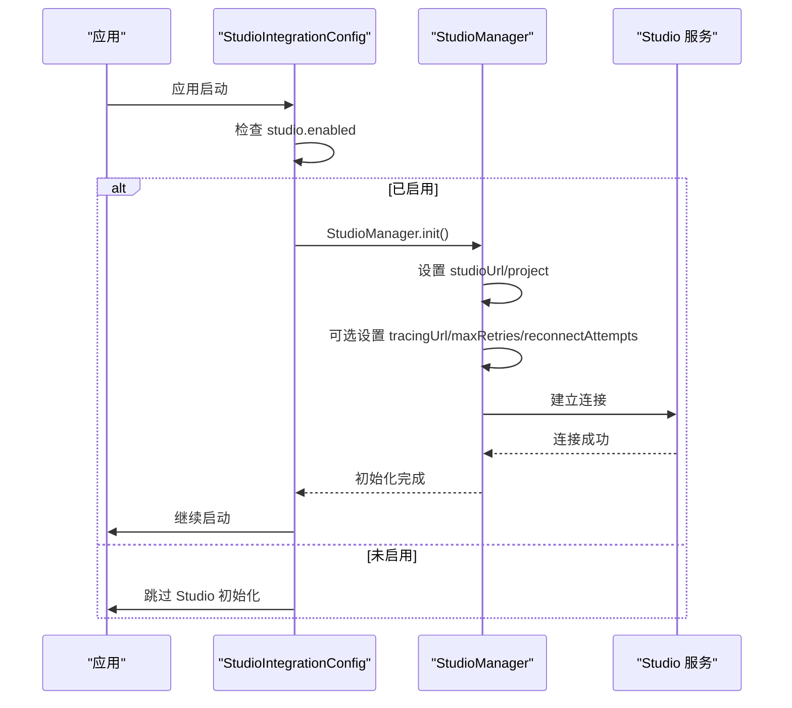
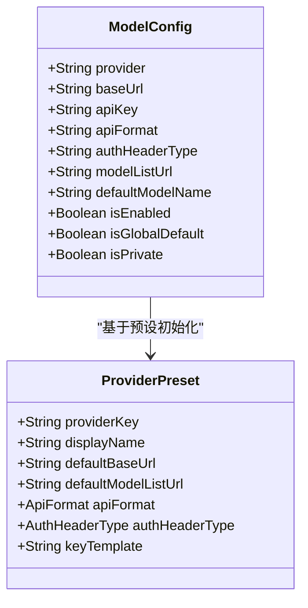
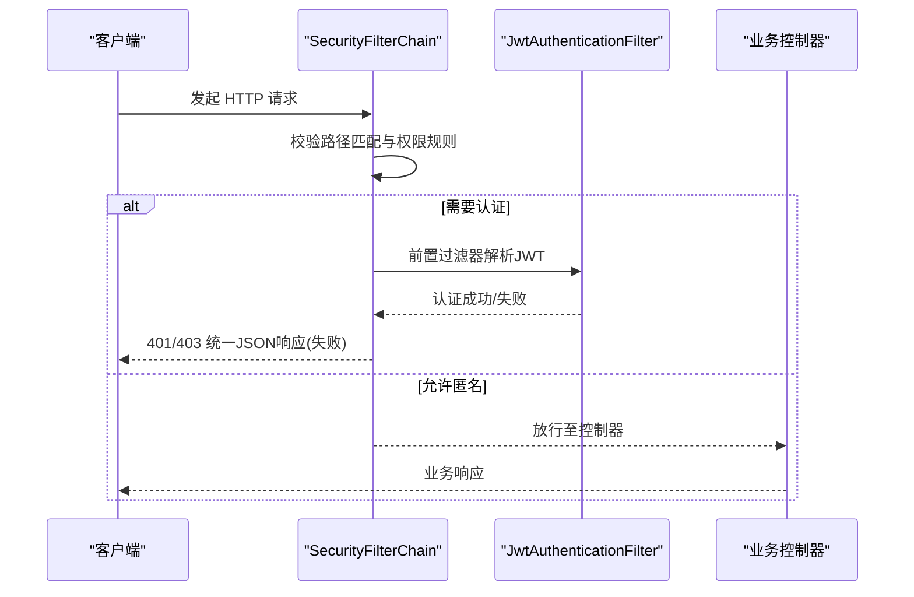
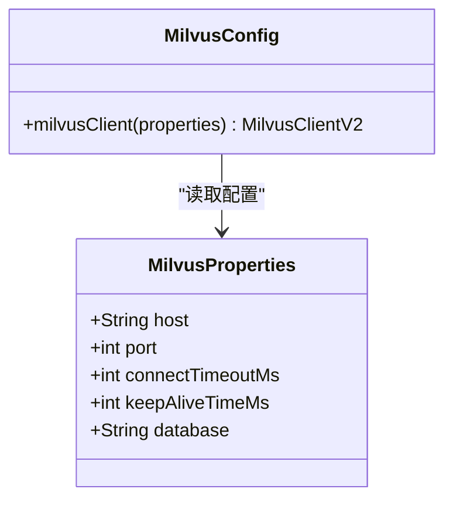
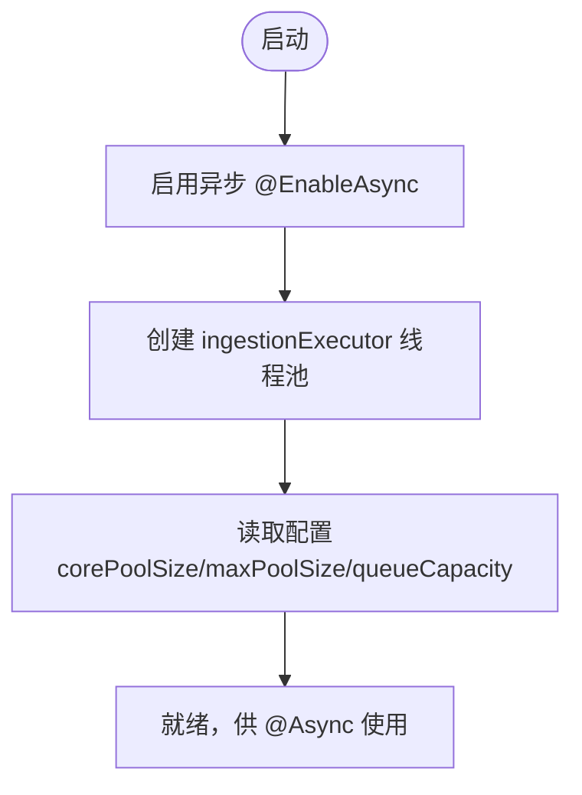
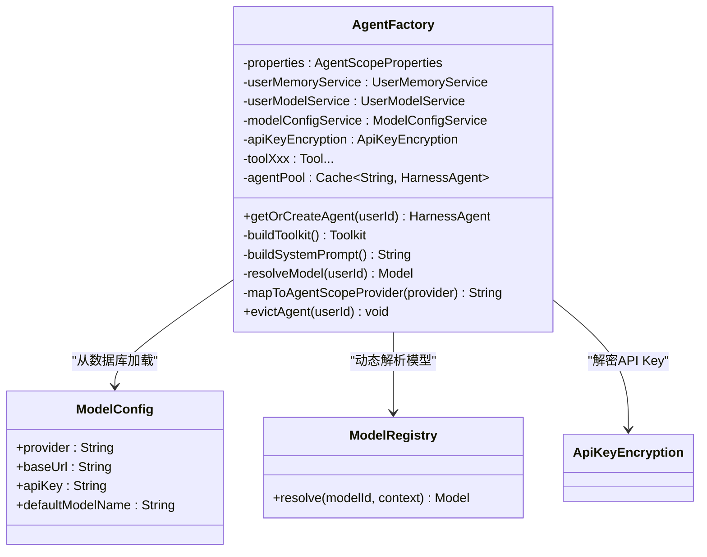
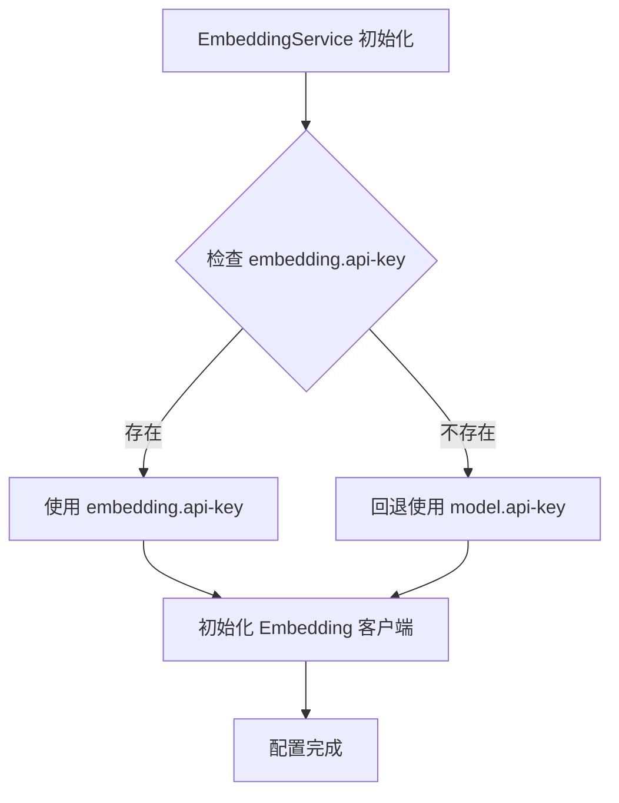
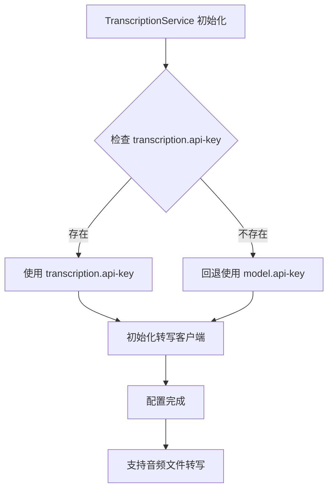

# 关键配置类代码导读

<cite>
**本文引用的文件**   
- [AgentScopeProperties.java](file://src/main/java/com/tutorial/offerpilot/config/AgentScopeProperties.java)
- [StudioIntegrationConfig.java](file://src/main/java/com/tutorial/offerpilot/config/StudioIntegrationConfig.java)
- [SecurityConfig.java](file://src/main/java/com/tutorial/offerpilot/config/SecurityConfig.java)
- [MilvusConfig.java](file://src/main/java/com/tutorial/offerpilot/config/MilvusConfig.java)
- [MilvusProperties.java](file://src/main/java/com/tutorial/offerpilot/config/MilvusProperties.java)
- [RedisConfig.java](file://src/main/java/com/tutorial/offerpilot/config/RedisConfig.java)
- [AsyncConfig.java](file://src/main/java/com/tutorial/offerpilot/config/AsyncConfig.java)
- [WebConfig.java](file://src/main/java/com/tutorial/offerpilot/config/WebConfig.java)
- [AgentFactory.java](file://src/main/java/com/tutorial/offerpilot/agent/AgentFactory.java)
- [ModelConfig.java](file://src/main/java/com/tutorial/offerpilot/entity/ModelConfig.java)
- [ProviderPreset.java](file://src/main/java/com/tutorial/offerpilot/enums/ProviderPreset.java)
- [ApiKeyEncryption.java](file://src/main/java/com/tutorial/offerpilot/service/ApiKeyEncryption.java)
- [ModelConfigService.java](file://src/main/java/com/tutorial/offerpilot/service/ModelConfigService.java)
- [ModelConfigController.java](file://src/main/java/com/tutorial/offerpilot/controller/ModelConfigController.java)
- [EmbeddingService.java](file://src/main/java/com/tutorial/offerpilot/service/EmbeddingService.java)
- [TranscriptionService.java](file://src/main/java/com/tutorial/offerpilot/service/TranscriptionService.java)
</cite>

## 更新摘要
**变更内容**   
- **新增 AgentScope Studio 监控集成** - 添加 StudioConfig 配置类和 StudioIntegrationConfig 集成配置，支持实时 Agent 调用监控和 Trace 追踪
- **升级默认模型配置** - 将默认 LLM 模型从 qwen-max 升级到更先进的 qwen3.5-plus
- **完善 Studio 连接配置** - 在 application.yml 中添加完整的 Studio 连接参数，包括 URL、项目名称、重试机制等
- **增强配置灵活性** - Studio 配置支持可选的 tracingUrl、maxRetries、reconnectAttempts 等高级参数

## 目录
- AgentScopeProperties（已增强 - 新增 Studio 配置）
- StudioIntegrationConfig（新增 - Studio 集成管理）
- 动态模型配置系统
- SecurityConfig
- MilvusConfig + MilvusProperties
- RedisConfig
- AsyncConfig
- WebConfig
- AgentFactory（核心构建器 - 已增强）
- 独立服务配置（新增）

## AgentScopeProperties（已增强 - 新增 Studio 配置）
- 作用与定位
  - 使用 @ConfigurationProperties(prefix="agentscope") 集中映射应用配置，提供模型、Agent、知识库等运行时参数。
  - 通过嵌套静态类组织不同域的配置：ModelConfig、AgentConfig、KnowledgeConfig、**EmbeddingConfig、TranscriptionConfig、StudioConfig**。
- 关键属性映射
  - agentscope.model.*：provider、apiKey、modelName、temperature、maxTokens
  - agentscope.agent.*：workspace、stateStore、compaction.enabled、compaction.maxTokens
  - agentscope.knowledge.*：basePath、embeddingModel、chunkSize、chunkOverlap、topK、autoInit
  - **agentscope.embedding.*：provider、apiKey、baseUrl（新增）**
  - **agentscope.transcription.*：model、apiKey、baseUrl（新增）**
  - **agentscope.studio.*：enabled、url、project、tracingUrl、maxRetries、reconnectAttempts（新增）**
- 典型修改点
  - 切换或新增 LLM provider 与模型名：agentscope.model.provider / agentscope.model.modelName
  - 调整温度与最大输出长度：agentscope.model.temperature / agentscope.model.maxTokens
  - 调整工作空间与状态存储策略：agentscope.agent.workspace / agentscope.agent.stateStore
  - 调整知识检索分块与召回数量：agentscope.knowledge.chunkSize / agentscope.knowledge.topK
  - **配置独立的 Embedding 服务：agentscope.embedding.provider / agentscope.embedding.apiKey / agentscope.embedding.baseUrl**
  - **配置独立的录音转写服务：agentscope.transcription.model / agentscope.transcription.apiKey / agentscope.transcription.baseUrl**
  - **启用 AgentScope Studio 监控：agentscope.studio.enabled=true / agentscope.studio.url=http://localhost:8000**
- 对应配置文件位置
  - application.yml 中 agentscope.* 段

**Section sources**
- [AgentScopeProperties.java:10-106](file://src/main/java/com/tutorial/offerpilot/config/AgentScopeProperties.java#L10-L106)

### 新增：StudioConfig 内部类
- 作用与定位
  - **AgentScope Studio 实时监控配置类，支持 Agent 调用链路追踪和性能监控。**
  - 接入 Studio 后可实时查看 Agent 消息流、工具调用参数/耗时/返回结果、Token 消耗等。
  - 默认关闭，开发/调试时通过 agentscope.studio.enabled=true 开启。
- 关键属性
  - enabled：是否启用 Studio 集成，默认 false
  - url：Studio 服务地址（AgentScope Studio 前端 + 后端），默认 http://localhost:8000
  - project：项目名称，在 Studio 中标识本项目，默认 OfferPilot
  - tracingUrl：Trace 端点，默认为 {url}/v1/traces
  - maxRetries：HTTP 请求最大重试次数，默认 3
  - reconnectAttempts：WebSocket 重连最大尝试次数，默认 3
- 设计优势
  - 支持灵活的 Studio 服务部署配置
  - 提供完善的错误处理和重试机制
  - 可选的 OpenTelemetry Trace 集成
  - 非阻塞式初始化，失败不影响主应用启动

**Section sources**
- [AgentScopeProperties.java:85-104](file://src/main/java/com/tutorial/offerpilot/config/AgentScopeProperties.java#L85-L104)

### 模型配置升级
- **重要变更**
  - **默认模型从 qwen-max 升级到 qwen3.5-plus**，提供更强的推理能力和更好的性能表现
  - 保持向后兼容，现有配置无需修改即可享受新模型带来的提升
- 配置说明
  - agentscope.model.model-name: qwen3.5-plus（原为 qwen-max）
  - 其他配置项保持不变：provider=dashscope, temperature=0.7, max-tokens=4096
- 升级收益
  - 更强的自然语言理解能力
  - 更准确的代码生成和分析
  - 更好的多轮对话一致性
  - 优化的 Token 使用效率

**Section sources**
- [AgentScopeProperties.java:27](file://src/main/java/com/tutorial/offerpilot/config/AgentScopeProperties.java#L27)
- [application.yml:37](file://src/main/resources/application.yml#L37)

### 新增：EmbeddingConfig 内部类
- 作用与定位
  - **独立于 LLM Model 的 Embedding 配置类，实现配置解耦。**
  - 当 LLM Provider 切换为 DeepSeek 等不支持 Embedding 的服务商时，可通过此配置单独指定 Embedding Provider（默认 DashScope），避免共用 api-key。
- 关键属性
  - provider：Embedding Provider，默认 dashscope
  - apiKey：Embedding API Key，未配置时回退使用 agentscope.model.api-key
  - baseUrl：Embedding API Base URL，默认指向 DashScope text-embedding 端点
- 设计优势
  - 支持不同的 API Key 管理策略
  - 允许使用不同的 Embedding 服务提供商
  - 提高配置灵活性和安全性

**Section sources**
- [AgentScopeProperties.java:55-68](file://src/main/java/com/tutorial/offerpilot/config/AgentScopeProperties.java#L55-L68)

### 新增：TranscriptionConfig 内部类
- 作用与定位
  - **独立于 LLM Model 的录音转写配置类，实现配置解耦。**
  - 默认使用 DashScope Paraformer（OpenAI 兼容 /v1/audio/transcriptions）。
  - 未配置 api-key 时自动回退使用 agentscope.model.api-key。
- 关键属性
  - model：转写模型，默认 paraformer-v2
  - apiKey：转写 API Key，未配置时回退使用 agentscope.model.api-key
  - baseUrl：转写 API Base URL（OpenAI 兼容端点），默认指向 DashScope 兼容模式
- 设计优势
  - 支持独立的音频转写服务配置
  - 提供灵活的 API Key 管理策略
  - 兼容多种音频格式和转写引擎

**Section sources**
- [AgentScopeProperties.java:70-83](file://src/main/java/com/tutorial/offerpilot/config/AgentScopeProperties.java#L70-L83)

## StudioIntegrationConfig（新增 - Studio 集成管理）
- 作用与定位
  - **AgentScope Studio 集成配置类，负责 Studio 连接的初始化和生命周期管理。**
  - 在应用启动时自动检测并初始化 Studio 连接，支持优雅降级和错误处理。
- 核心功能
  - **@PostConstruct initStudio()**：应用启动时检查 Studio 配置并建立连接
  - **@PreDestroy shutdownStudio()**：应用关闭时释放 Studio 资源（HTTP 连接池、WebSocket）
  - **智能配置解析**：支持可选的 tracingUrl、maxRetries、reconnectAttempts 参数
  - **容错机制**：初始化失败不会阻止应用启动，仅记录 ERROR 日志
- 配置优先级
  - StudioManager.Builder 按顺序设置：studioUrl → project → tracingUrl → maxRetries → reconnectAttempts
  - 所有配置都来自 AgentScopeProperties.StudioConfig
- 监控能力
  - Agent 消息流（用户输入 → Agent 推理 → 工具调用 → 最终回复）
  - 工具调用参数、耗时、返回结果
  - LLM 调用 Token 消耗
  - OpenTelemetry Trace 全链路追踪

**Diagram sources**
- [StudioIntegrationConfig.java:40-77](file://src/main/java/com/tutorial/offerpilot/config/StudioIntegrationConfig.java#L40-L77)

**Section sources**
- [StudioIntegrationConfig.java:12-91](file://src/main/java/com/tutorial/offerpilot/config/StudioIntegrationConfig.java#L12-91)

## 动态模型配置系统
### ModelConfig 实体类
- 作用与定位
  - 数据库实体类，存储 LLM Provider 的接入配置信息，支持多提供商统一管理。
  - 表名 op_model_config，包含索引优化查询性能。
- 关键字段说明
  - provider：模型提供方标识（dashscope/openai/anthropic/gemini/ollama等）
  - baseUrl：API Base URL 地址
  - apiKey：AES 加密存储的 API Key
  - apiFormat：API 格式类型（openai/anthropic/gemini）
  - authHeaderType：认证 Header 类型（bearer/x-api-key/x-goog-api-key/none）
  - modelListUrl：模型列表获取链接
  - defaultModelName：该配置下的默认模型名称
  - isEnabled：是否启用该配置
  - isGlobalDefault：是否为全局默认模型配置
  - isPrivate：是否为用户私有模型
- 适用场景
  - 管理员通过后台界面动态添加和管理多个 LLM 提供商配置
  - 支持用户级别的私有模型配置和全局默认模型设置

**Diagram sources**
- [ModelConfig.java:23-64](file://src/main/java/com/tutorial/offerpilot/entity/ModelConfig.java#L23-64)
- [ProviderPreset.java:103-128](file://src/main/java/com/tutorial/offerpilot/enums/ProviderPreset.java#L103-128)

**Section sources**
- [ModelConfig.java:14-64](file://src/main/java/com/tutorial/offerpilot/entity/ModelConfig.java#L14-64)

### ProviderPreset 枚举
- 作用与定位
  - 系统预设的 LLM Provider 配置清单，支持 8 家主流提供商的快速配置。
  - 分为 OpenAI 兼容阵营（5家）和非 OpenAI 兼容阵营（3家）。
- 支持的提供商
  - **OpenAI 兼容阵营**：阿里百炼 DashScope、OpenAI、DeepSeek、硅基流动 SiliconFlow、火山引擎豆包
  - **非 OpenAI 兼容阵营**：Anthropic Claude、Google Gemini、Ollama 本地部署
- 关键特性
  - 每个 Provider 预置了默认的 Base URL、模型列表链接、API 格式和认证方式
  - 提供 fromProviderKey() 方法根据 provider key 查找预设配置
  - 内置 API Key 模板示例，便于用户快速了解密钥格式

**Section sources**
- [ProviderPreset.java:13-157](file://src/main/java/com/tutorial/offerpilot/enums/ProviderPreset.java#L13-157)

### ApiKeyEncryption 服务
- 作用与定位
  - API Key AES 加密/解密工具服务，确保敏感配置的安全存储。
  - 密钥从环境变量 app.encryption.secret-key 注入，生产环境必须修改默认值。
- 核心功能
  - encrypt()：对明文 API Key 进行 AES-128 加密并 Base64 编码
  - decrypt()：对密文进行解密还原为明文
  - mask()：API Key 脱敏显示，保留前4位和后4位，中间用 **** 替换
- 安全考虑
  - 使用 AES-128 算法，密钥不足16字节时补齐，超出时截断
  - 异常处理记录详细错误日志
  - 脱敏显示防止敏感信息泄露

**Section sources**
- [ApiKeyEncryption.java:21-77](file://src/main/java/com/tutorial/offerpilot/service/ApiKeyEncryption.java#L21-77)

### ModelConfigService 服务层
- 作用与定位
  - 模型配置管理服务，提供完整的 CRUD 操作和模型列表同步功能。
  - 集成 ProviderPreset 预设配置和 ApiKeyEncryption 加密服务。
- 核心功能
  - createConfig()：新增模型配置，自动从 Provider API 拉取模型名称列表
  - updateConfig()：更新模型配置，支持选择性字段更新
  - deleteConfig()：删除模型配置，检查是否有用户引用
  - refreshModels()：重新拉取模型名称列表
  - setGlobalDefault()：设置为全局默认模型
  - listProviderPresets()：获取系统预设 Provider 列表
- 数据流程
  - 创建配置时自动填充预设信息并加密 API Key
  - 拉取模型列表后保存到数据库，支持后续选择默认模型
  - 返回响应时对 API Key 进行脱敏处理

**Section sources**
- [ModelConfigService.java:30-290](file://src/main/java/com/tutorial/offerpilot/service/ModelConfigService.java#L30-290)

### ModelConfigController 控制器
- 作用与定位
  - 管理员模型配置管理接口，所有接口需要 ADMIN 角色权限。
  - 提供 RESTful API 供前端管理界面调用。
- 接口列表
  - GET /api/v1/admin/models：获取所有模型配置列表
  - POST /api/v1/admin/models：新增模型配置
  - PUT /api/v1/admin/models/{id}：更新模型配置
  - DELETE /api/v1/admin/models/{id}：删除模型配置
  - POST /api/v1/admin/models/{id}/refresh-models：重新拉取模型名称
  - PUT /api/v1/admin/models/{id}/set-global-default：设置全局默认模型
  - GET /api/v1/admin/models/provider-presets：获取系统预设 Provider 列表

**Section sources**
- [ModelConfigController.java:25-83](file://src/main/java/com/tutorial/offerpilot/controller/ModelConfigController.java#L25-83)

## SecurityConfig
- 安全总览
  - 启用 Spring Security 与方法级安全注解，采用 Servlet 栈的无状态认证策略。
- 关键 Bean 与配置链
  - SecurityFilterChain Bean：禁用 CSRF、设置 SessionCreationPolicy.STATELESS、注册自定义异常处理器、配置接口权限矩阵、前置注入 JwtAuthenticationFilter、关闭 H2 Console 的 frameOptions。
  - PasswordEncoder Bean：BCryptPasswordEncoder
  - AuthenticationManager Bean：由 AuthenticationConfiguration 暴露
- 接口权限矩阵（示例）
  - /api/v1/auth/**：允许匿名访问
  - /h2-console/**：允许匿名访问
  - /api/v1/admin/**：需 ADMIN 角色
  - /api/v1/kb/**：需认证
  - anyRequest()：默认需认证
- 注意事项
  - 所有受保护接口需在请求头携带有效 JWT，否则将返回 401/403 统一 JSON 响应。

**Diagram sources**
- [SecurityConfig.java:37-67](file://src/main/java/com/tutorial/offerpilot/config/SecurityConfig.java#L37-67)

**Section sources**
- [SecurityConfig.java:25-78](file://src/main/java/com/tutorial/offerpilot/config/SecurityConfig.java#L25-78)

## MilvusConfig + MilvusProperties
- 配置项来源
  - app.milvus.host、app.milvus.port、app.milvus.database、app.milvus.connectTimeoutMs、app.milvus.keepAliveTimeMs
- 关键 Bean
  - MilvusClientV2：基于 ConnectConfig 构建，包含 uri、dbName、connectTimeoutMs、keepAliveTimeMs
- 连接地址拼装
  - uri = "http://" + host + ":" + port
- 适用场景
  - 向量数据库连接、集合管理、索引创建与查询

**Diagram sources**
- [MilvusConfig.java:18-29](file://src/main/java/com/tutorial/offerpilot/config/MilvusConfig.java#L18-29)
- [MilvusProperties.java:12-20](file://src/main/java/com/tutorial/offerpilot/config/MilvusProperties.java#L12-20)

**Section sources**
- [MilvusConfig.java:18-29](file://src/main/java/com/tutorial/offerpilot/config/MilvusConfig.java#L18-29)
- [MilvusProperties.java:12-20](file://src/main/java/com/tutorial/offerpilot/config/MilvusProperties.java#L12-20)

## RedisConfig
- 关键 Bean
  - StringRedisTemplate：基于 Spring Data Redis 的 String 序列化模板，用于会话记忆、限流、缓存等字符串键值操作
- 依赖
  - RedisConnectionFactory：由 Spring Boot 自动装配（application.yml 中 redis.*）

**Section sources**
- [RedisConfig.java:14-17](file://src/main/java/com/tutorial/offerpilot/config/RedisConfig.java#L14-17)

## AsyncConfig
- 异步支持
  - @EnableAsync 开启异步执行能力
- 线程池 Bean
  - ingestionExecutor：名称为 ingestionExecutor，核心参数通过 @Value 注入，默认 corePoolSize=4、maxPoolSize=8、queueCapacity=100
  - 线程名前缀：ingestion-
- 适用场景
  - 文档解析、分块、向量化、入库等离线处理管道

**Diagram sources**
- [AsyncConfig.java:14-31](file://src/main/java/com/tutorial/offerpilot/config/AsyncConfig.java#L14-31)

**Section sources**
- [AsyncConfig.java:14-31](file://src/main/java/com/tutorial/offerpilot/config/AsyncConfig.java#L14-31)

## WebConfig
- CORS 配置
  - 对 /api/** 开放跨域，允许所有来源、常用方法与头部，允许携带凭证，预检缓存时间 3600s
- 适用场景
  - 前后端分离开发/部署时的跨域访问

**Section sources**
- [WebConfig.java:14-21](file://src/main/java/com/tutorial/offerpilot/config/WebConfig.java#L14-21)

## AgentFactory（核心构建器 - 已增强）
- 职责概述
  - 负责按用户维度构建并缓存 HarnessAgent 实例，组装 Toolkit（工具分组）、中间件、系统提示词与模型标识符。
  - **已增强**：支持多提供商模型动态解析，实现优先级选择机制和 OpenAI 兼容 Provider 映射。
- 构造器注入
  - 注入 AgentScopeProperties、UserMemoryService
  - **新增**：注入 UserModelService、ModelConfigService、ApiKeyEncryption
  - 注入 11 个 @Tool Bean：answerAnalyzeTool、answerSearchTool、audioTranscribeTool、companySearchTool、mockInterviewTool、progressTrackTool、questionSearchTool、resourceSearchTool、resumeEvaluateTool、resumeParseTool、salaryTool
- Caffeine 缓存
  - agentPool：最多 MAX_AGENTS=500 个实例，过期策略 expireAfterAccess=30 分钟，淘汰时记录日志
- 构建流程要点
  - buildToolkit：创建 4 个工具分组（knowledge_retrieval、resume_analysis、interview、utility），并将 11 个工具分别注册到对应分组，最后注册元工具
  - buildSystemPrompt：生成系统提示词，指导 Agent 如何解读工具返回的指导文本并生成自然语言结果
  - getOrCreateAgent：按 userId 获取或创建 Agent，命中缓存则直接复用
- 中间件
  - TokenMonitorMiddleware：统计 token 用量
  - CostControlMiddleware：控制成本
- **增强的模型解析机制**
  - resolveModel()：按优先级解析用户模型：用户私有 > 用户默认 > 全局默认 > application.yml 兜底
  - **新增 mapToAgentScopeProvider() 方法**：将 deepseek、siliconflow、volcengine 等非原生支持的 Provider 映射为 openai
  - **新增 OPENAI_COMPATIBLE_PROVIDERS 常量**：定义 OpenAI 兼容但非原生支持的 Provider 列表
  - 支持从数据库动态加载模型配置，包括 API Key 解密和 ModelRegistry 动态解析
  - 降级机制：当数据库配置解析失败时，回退到 application.yml 中的硬编码配置

**Diagram sources**
- [AgentFactory.java:39-98](file://src/main/java/com/tutorial/offerpilot/agent/AgentFactory.java#L39-98)
- [AgentFactory.java:274-325](file://src/main/java/com/tutorial/offerpilot/agent/AgentFactory.java#L274-325)

**Section sources**
- [AgentFactory.java:27-82](file://src/main/java/com/tutorial/offerpilot/agent/AgentFactory.java#L27-L82)
- [AgentFactory.java:91-122](file://src/main/java/com/tutorial/offerpilot/agent/AgentFactory.java#L91-122)
- [AgentFactory.java:134-211](file://src/main/java/com/tutorial/offerpilot/agent/AgentFactory.java#L134-211)
- [AgentFactory.java:216-245](file://src/main/java/com/tutorial/offerpilot/agent/AgentFactory.java#L216-245)
- [AgentFactory.java:250-253](file://src/main/java/com/tutorial/offerpilot/agent/AgentFactory.java#L250-253)
- [AgentFactory.java:274-325](file://src/main/java/com/tutorial/offerpilot/agent/AgentFactory.java#L274-325)

## 独立服务配置（新增）

### EmbeddingService 服务
- 作用与定位
  - **独立的 Embedding 向量生成服务，支持通过 agentscope.embedding.* 配置。**
  - 默认调用 DashScope text-embedding-v3 API，支持批量处理和智能 API Key 回退。
- 核心特性
  - **智能 API Key 回退机制**：优先使用 embedding.api-key，未配置时自动回退到 model.api-key
  - **批量处理能力**：支持 MAX_BATCH_SIZE=25 的批量向量生成
  - **灵活的配置管理**：支持独立的 provider、apiKey、baseUrl 配置
- 配置优先级
  - embedding.api-key > model.api-key（代码回退）
  - 支持环境变量覆盖：EMBEDDING_API_KEY > DASHSCOPE_API_KEY
- 技术实现
  - 基于 OkHttpClient 的 HTTP 客户端
  - 支持 1024 维向量输出
  - 完善的错误处理和日志记录

**Diagram sources**
- [EmbeddingService.java:37-58](file://src/main/java/com/tutorial/offerpilot/service/EmbeddingService.java#L37-58)

**Section sources**
- [EmbeddingService.java:20-156](file://src/main/java/com/tutorial/offerpilot/service/EmbeddingService.java#L20-156)

### TranscriptionService 服务
- 作用与定位
  - **独立的录音转写服务，支持通过 agentscope.transcription.* 配置。**
  - 默认调用 DashScope Paraformer（OpenAI 兼容 /v1/audio/transcriptions 端点）。
- 核心特性
  - **智能 API Key 回退机制**：优先使用 transcription.api-key，未配置时自动回退到 model.api-key
  - **多格式音频支持**：支持 mp3/wav/m4a/flac/ogg/webm 等常见音频格式
  - **MIME 类型自动推断**：根据文件名自动识别音频格式
- 配置优先级
  - transcription.api-key > model.api-key（代码回退）
  - 支持环境变量覆盖：TRANSCRIPTION_API_KEY > DASHSCOPE_API_KEY
- 技术实现
  - 基于 MultipartBody 的文件上传
  - 长超时配置（120秒）适应大文件处理
  - 完善的音频格式检测和错误处理

**Diagram sources**
- [TranscriptionService.java:33-53](file://src/main/java/com/tutorial/offerpilot/service/TranscriptionService.java#L33-53)

**Section sources**
- [TranscriptionService.java:18-122](file://src/main/java/com/tutorial/offerpilot/service/TranscriptionService.java#L18-122)

### 配置解耦架构优势
- **独立性**：LLM 模型配置与 Embedding、转写服务完全解耦
- **灵活性**：可以为不同服务配置不同的 API Key 和 Provider
- **安全性**：支持细粒度的密钥管理和权限控制
- **可维护性**：各服务配置独立，便于维护和故障排查
- **兼容性**：保持向后兼容，未配置新属性时自动回退到原有行为

**Section sources**
- [AgentScopeProperties.java:55-83](file://src/main/java/com/tutorial/offerpilot/config/AgentScopeProperties.java#L55-83)
- [application.yml:56-71](file://src/main/resources/application.yml#L56-71)

### 多提供商模型解析增强
- **OpenAI 兼容 Provider 映射机制**
  - **新增 OPENAI_COMPATIBLE_PROVIDERS 常量**：包含 deepseek、siliconflow、volcengine 三个 Provider
  - **mapToAgentScopeProvider() 方法**：将这些非原生支持的 Provider 自动映射为 openai 前缀
  - **解决 Provider 兼容性问题**：AgentScope 框架中这些 Provider 无独立 SPI ModelProvider
- **智能模型解析流程**
  - 首先尝试从数据库配置解析模型
  - 使用 mapToAgentScopeProvider() 转换 Provider 前缀
  - 构建 ModelCreationContext 并调用 ModelRegistry.resolve()
  - 失败时自动回退到 application.yml 配置
- **支持的 Provider 完整列表**
  - **原生支持**：dashscope、openai、anthropic、gemini、ollama
  - **OpenAI 兼容映射**：deepseek→openai、siliconflow→openai、volcengine→openai
  - **总计 8 家主流 Provider**全部可被 ModelRegistry 解析

**Section sources**
- [AgentFactory.java:45-46](file://src/main/java/com/tutorial/offerpilot/agent/AgentFactory.java#L45-46)
- [AgentFactory.java:320-325](file://src/main/java/com/tutorial/offerpilot/agent/AgentFactory.java#L320-325)
- [pom.xml:146-165](file://pom.xml#L146-165)
- [application.yml:34-39](file://src/main/resources/application.yml#L34-39)

### Studio 监控集成配置
- **Studio 连接配置**
  - **agentscope.studio.enabled**: 控制 Studio 集成的开关，默认 true（开发环境）
  - **agentscope.studio.url**: Studio 服务地址，默认 http://localhost:8000
  - **agentscope.studio.project**: 项目名称，用于在 Studio 中标识当前项目
- **高级配置选项**
  - **agentscope.studio.tracingUrl**: 可选的 OpenTelemetry Trace 端点
  - **agentscope.studio.maxRetries**: HTTP 请求重试次数，默认 3
  - **agentscope.studio.reconnectAttempts**: WebSocket 重连尝试次数，默认 3
- **配置优先级和环境变量**
  - 支持通过环境变量覆盖：STUDIO_URL、STUDIO_PROJECT 等
  - 生产环境建议通过环境变量注入敏感配置
- **监控效果**
  - 实时查看 Agent 执行流程和工具调用详情
  - 性能分析和 Token 消耗统计
  - 问题诊断和调试支持

**Section sources**
- [application.yml:72-79](file://src/main/resources/application.yml#L72-79)
- [StudioIntegrationConfig.java:40-77](file://src/main/java/com/tutorial/offerpilot/config/StudioIntegrationConfig.java#L40-77)