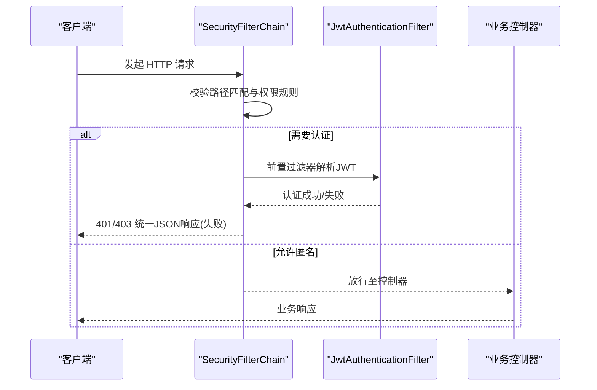
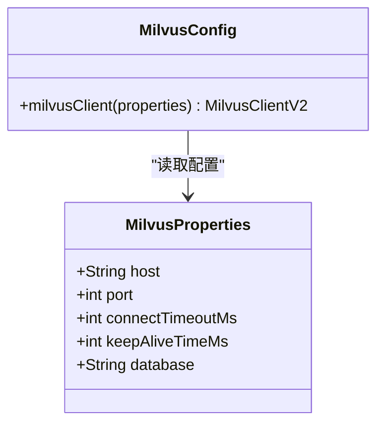
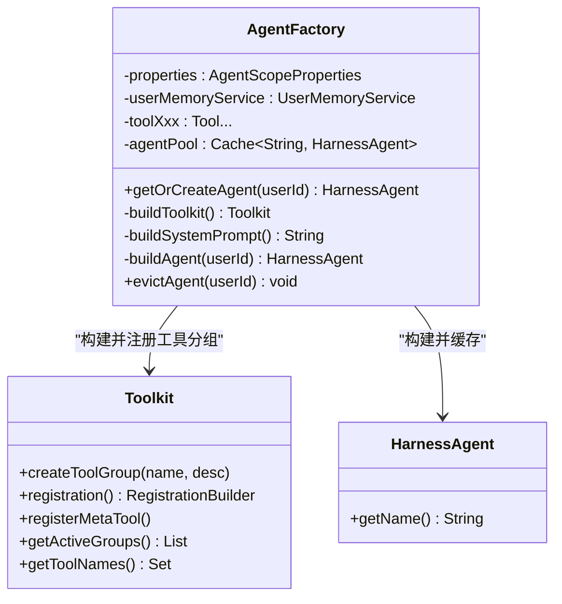

# 关键配置类代码导读

<cite>
**本文引用的文件**   
- [AgentScopeProperties.java](file://src/main/java/com/tutorial/offerpilot/config/AgentScopeProperties.java)
- [SecurityConfig.java](file://src/main/java/com/tutorial/offerpilot/config/SecurityConfig.java)
- [MilvusConfig.java](file://src/main/java/com/tutorial/offerpilot/config/MilvusConfig.java)
- [MilvusProperties.java](file://src/main/java/com/tutorial/offerpilot/config/MilvusProperties.java)
- [RedisConfig.java](file://src/main/java/com/tutorial/offerpilot/config/RedisConfig.java)
- [AsyncConfig.java](file://src/main/java/com/tutorial/offerpilot/config/AsyncConfig.java)
- [WebConfig.java](file://src/main/java/com/tutorial/offerpilot/config/WebConfig.java)
- [AgentFactory.java](file://src/main/java/com/tutorial/offerpilot/agent/AgentFactory.java)
</cite>

## Table of Contents
- AgentScopeProperties
- ModelConfig
- SecurityConfig
- MilvusConfig + MilvusProperties
- RedisConfig
- AsyncConfig
- WebConfig
- AgentFactory（核心构建器）

## AgentScopeProperties
- 作用与定位
  - 使用 @ConfigurationProperties(prefix="agentscope") 集中映射应用配置，提供模型、Agent、知识库等运行时参数。
  - 通过嵌套静态类组织不同域的配置：ModelConfig、AgentConfig、KnowledgeConfig。
- 关键属性映射
  - agentscope.model.*：provider、apiKey、modelName、temperature、maxTokens
  - agentscope.agent.*：workspace、stateStore、compaction.enabled、compaction.maxTokens
  - agentscope.knowledge.*：basePath、embeddingModel、chunkSize、chunkOverlap、topK、autoInit
- 典型修改点
  - 切换或新增 LLM provider 与模型名：agentscope.model.provider / agentscope.model.modelName
  - 调整温度与最大输出长度：agentscope.model.temperature / agentscope.model.maxTokens
  - 调整工作空间与状态存储策略：agentscope.agent.workspace / agentscope.agent.stateStore
  - 调整知识检索分块与召回数量：agentscope.knowledge.chunkSize / agentscope.knowledge.topK
- 对应配置文件位置
  - application.yml 中 agentscope.* 段

**Section sources**
- [AgentScopeProperties.java:10-50](file://src/main/java/com/tutorial/offerpilot/config/AgentScopeProperties.java#L10-L50)

## ModelConfig
- 说明
  - 本项目未单独定义 ModelConfig Bean；模型相关配置以内部类形式聚合在 AgentScopeProperties.ModelConfig 中，并通过 properties.getModel() 注入到 Agent 构建流程。
- 关键配置项
  - provider：默认 "dashscope"
  - apiKey：从环境变量 ${DASHSCOPE_API_KEY} 注入
  - modelName：默认 "qwen-max"
  - temperature：默认 0.7
  - maxTokens：默认 4096
- 使用方式
  - AgentFactory 在构建 HarnessAgent 时拼接 modelId = provider:modelName，并传入 builder().model(modelId)。

**Section sources**
- [AgentScopeProperties.java:19-26](file://src/main/java/com/tutorial/offerpilot/config/AgentScopeProperties.java#L19-L26)
- [AgentFactory.java:98-113](file://src/main/java/com/tutorial/offerpilot/agent/AgentFactory.java#L98-L113)

## SecurityConfig
- 安全总览
  - 启用 Spring Security 与方法级安全注解，采用 Servlet 栈的无状态认证策略。
- 关键 Bean 与配置链
  - SecurityFilterChain Bean：禁用 CSRF、设置 SessionCreationPolicy.STATELESS、注册自定义异常处理器、配置接口权限矩阵、前置注入 JwtAuthenticationFilter、关闭 H2 Console 的 frameOptions。
  - PasswordEncoder Bean：BCryptPasswordEncoder
  - AuthenticationManager Bean：由 AuthenticationConfiguration 暴露
- 接口权限矩阵（示例）
  - /api/v1/auth/**：允许匿名访问
  - /h2-console/**：允许匿名访问
  - /api/v1/kb/**：需认证
  - anyRequest()：默认需认证
- 注意事项
  - 所有受保护接口需在请求头携带有效 JWT，否则将返回 401/403 统一 JSON 响应。

**Diagram sources**
- [SecurityConfig.java:37-67](file://src/main/java/com/tutorial/offerpilot/config/SecurityConfig.java#L37-L67)

**Section sources**
- [SecurityConfig.java:25-78](file://src/main/java/com/tutorial/offerpilot/config/SecurityConfig.java#L25-L78)

## MilvusConfig + MilvusProperties
- 配置项来源
  - app.milvus.host、app.milvus.port、app.milvus.database、app.milvus.connectTimeoutMs、app.milvus.keepAliveTimeMs
- 关键 Bean
  - MilvusClientV2：基于 ConnectConfig 构建，包含 uri、dbName、connectTimeoutMs、keepAliveTimeMs
- 连接地址拼装
  - uri = "http://" + host + ":" + port
- 适用场景
  - 向量数据库连接、集合管理、索引创建与查询

**Diagram sources**
- [MilvusConfig.java:18-29](file://src/main/java/com/tutorial/offerpilot/config/MilvusConfig.java#L18-L29)
- [MilvusProperties.java:12-20](file://src/main/java/com/tutorial/offerpilot/config/MilvusProperties.java#L12-L20)

**Section sources**
- [MilvusConfig.java:18-29](file://src/main/java/com/tutorial/offerpilot/config/MilvusConfig.java#L18-L29)
- [MilvusProperties.java:12-20](file://src/main/java/com/tutorial/offerpilot/config/MilvusProperties.java#L12-L20)

## RedisConfig
- 关键 Bean
  - StringRedisTemplate：基于 Spring Data Redis 的 String 序列化模板，用于会话记忆、限流、缓存等字符串键值操作
- 依赖
  - RedisConnectionFactory：由 Spring Boot 自动装配（application.yml 中 redis.*）

**Section sources**
- [RedisConfig.java:14-17](file://src/main/java/com/tutorial/offerpilot/config/RedisConfig.java#L14-L17)

## AsyncConfig
- 异步支持
  - @EnableAsync 开启异步执行能力
- 线程池 Bean
  - ingestionExecutor：名称为 ingestionExecutor，核心参数通过 @Value 注入，默认 corePoolSize=4、maxPoolSize=8、queueCapacity=100
  - 线程名前缀：ingestion-
- 适用场景
  - 文档解析、分块、向量化、入库等离线处理管道

**Diagram sources**
- [AsyncConfig.java:14-31](file://src/main/java/com/tutorial/offerpilot/config/AsyncConfig.java#L14-L31)

**Section sources**
- [AsyncConfig.java:14-31](file://src/main/java/com/tutorial/offerpilot/config/AsyncConfig.java#L14-L31)

## WebConfig
- CORS 配置
  - 对 /api/** 开放跨域，允许所有来源、常用方法与头部，允许携带凭证，预检缓存时间 3600s
- 适用场景
  - 前后端分离开发/部署时的跨域访问

**Section sources**
- [WebConfig.java:14-21](file://src/main/java/com/tutorial/offerpilot/config/WebConfig.java#L14-L21)

## AgentFactory（核心构建器）
- 职责概述
  - 负责按用户维度构建并缓存 HarnessAgent 实例，组装 Toolkit（工具分组）、中间件、系统提示词与模型标识符。
- 构造器注入
  - 注入 AgentScopeProperties、UserMemoryService
  - 注入 11 个 @Tool Bean：answerAnalyzeTool、answerSearchTool、audioTranscribeTool、companySearchTool、mockInterviewTool、progressTrackTool、questionSearchTool、resourceSearchTool、resumeEvaluateTool、resumeParseTool、salaryTool
- Caffeine 缓存
  - agentPool：最多 MAX_AGENTS=500 个实例，过期策略 expireAfterAccess=30 分钟，淘汰时记录日志
- 构建流程要点
  - buildToolkit：创建 4 个工具分组（knowledge_retrieval、resume_analysis、interview、utility），并将 11 个工具分别注册到对应分组，最后注册元工具
  - buildSystemPrompt：生成系统提示词，指导 Agent 如何解读工具返回的指导文本并生成自然语言结果
  - getOrCreateAgent：按 userId 获取或创建 Agent，命中缓存则直接复用
- 中间件
  - TokenMonitorMiddleware：统计 token 用量
  - CostControlMiddleware：控制成本
- 模型标识符
  - modelId = provider:modelName，来自 AgentScopeProperties.ModelConfig

**Diagram sources**
- [AgentFactory.java:27-82](file://src/main/java/com/tutorial/offerpilot/agent/AgentFactory.java#L27-L82)
- [AgentFactory.java:134-211](file://src/main/java/com/tutorial/offerpilot/agent/AgentFactory.java#L134-L211)
- [AgentFactory.java:91-122](file://src/main/java/com/tutorial/offerpilot/agent/AgentFactory.java#L91-L122)

**Section sources**
- [AgentFactory.java:27-82](file://src/main/java/com/tutorial/offerpilot/agent/AgentFactory.java#L27-L82)
- [AgentFactory.java:91-122](file://src/main/java/com/tutorial/offerpilot/agent/AgentFactory.java#L91-L122)
- [AgentFactory.java:134-211](file://src/main/java/com/tutorial/offerpilot/agent/AgentFactory.java#L134-L211)
- [AgentFactory.java:216-245](file://src/main/java/com/tutorial/offerpilot/agent/AgentFactory.java#L216-L245)
- [AgentFactory.java:250-253](file://src/main/java/com/tutorial/offerpilot/agent/AgentFactory.java#L250-L253)