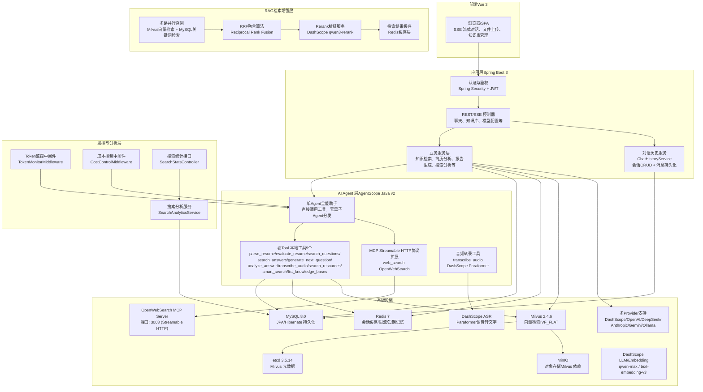
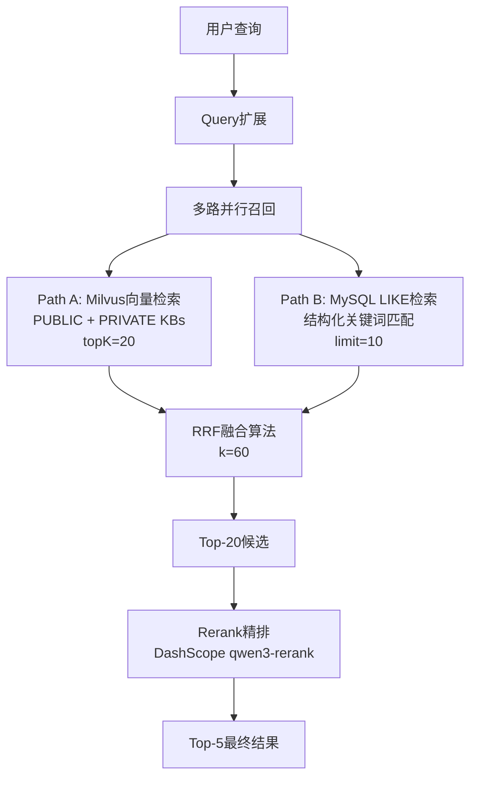
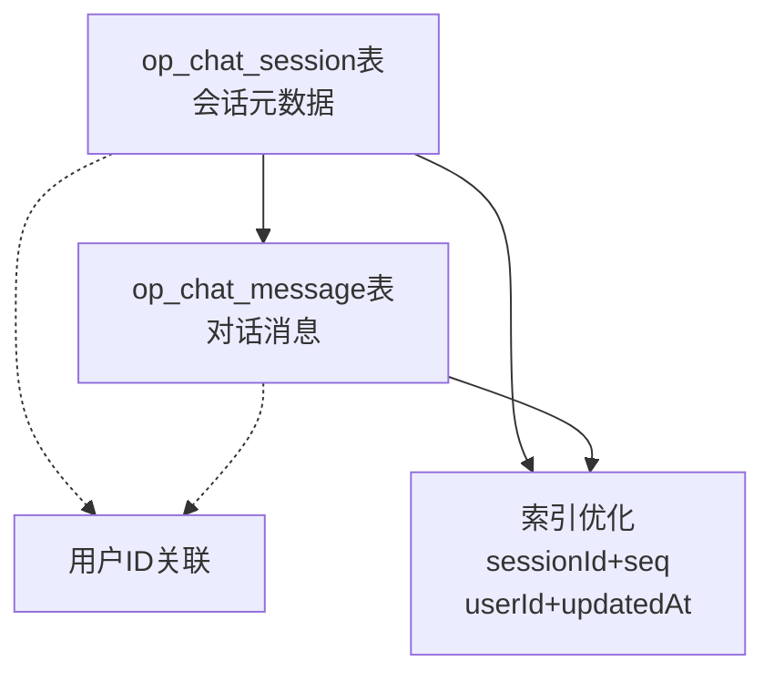
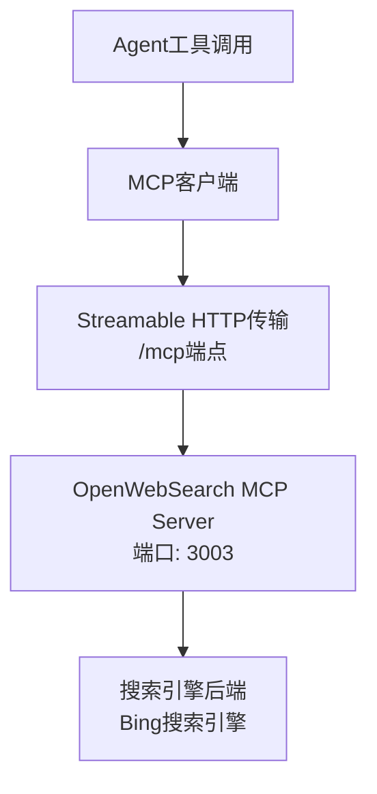

# 系统技术架构总览

<cite>
**本文引用的文件**   
- [Documents/02-系统架构设计说明书.md](file://Documents/02-系统架构设计说明书.md)
- [docker-compose.yml](file://docker-compose.yml)
- [src/main/resources/application.yml](file://src/main/resources/application.yml)
- [AGENTS.md](file://AGENTS.md)
- [pom.xml](file://pom.xml)
- [src/main/java/com/tutorial/offerpilot/agent/AgentFactory.java](file://src/main/java/com/tutorial/offerpilot/agent/AgentFactory.java)
- [workspace/tools.json](file://workspace/tools.json)
- [src/main/java/com/tutorial/offerpilot/service/RerankerService.java](file://src/main/java/com/tutorial/offerpilot/service/RerankerService.java)
- [src/main/java/com/tutorial/offerpilot/service/KnowledgeBaseService.java](file://src/main/java/com/tutorial/offerpilot/service/KnowledgeBaseService.java)
- [src/main/java/com/tutorial/offerpilot/service/VectorSearchService.java](file://src/main/java/com/tutorial/offerpilot/service/VectorSearchService.java)
- [src/main/java/com/tutorial/offerpilot/entity/ChatMessage.java](file://src/main/java/com/tutorial/offerpilot/entity/ChatMessage.java)
- [src/main/java/com/tutorial/offerpilot/entity/ChatSession.java](file://src/main/java/com/tutorial/offerpilot/entity/ChatSession.java)
- [src/main/java/com/tutorial/offerpilot/service/ChatHistoryService.java](file://src/main/java/com/tutorial/offerpilot/service/ChatHistoryService.java)
- [src/main/java/com/tutorial/offerpilot/config/AgentScopeProperties.java](file://src/main/java/com/tutorial/offerpilot/config/AgentScopeProperties.java)
</cite>

## 更新摘要
**变更内容**   
- **架构重大简化**：从多子Agent架构（1主+7子）简化为单Agent直接调用工具架构，删除所有子Agent声明
- **System Prompt重写**：从"调度中心"角色改为"全能助手"角色，直接管理所有工具调用
- **RAG召回策略升级**：实现两阶段多路并行召回+RRF融合+Rerank精排方案
- **对话历史持久化**：新增完整的会话管理和消息持久化功能
- **工具权限精简**：移除8个专用工具类和相关权限配置，保留9个核心工具

## 系统分层架构
> 绘制前端→Spring Boot→单Agent架构→工具层→基础设施 五层架构 Mermaid 图



**章节来源**
- [src/main/java/com/tutorial/offerpilot/agent/AgentFactory.java:139-155](file://src/main/java/com/tutorial/offerpilot/agent/AgentFactory.java#L139-L155)
- [src/main/java/com/tutorial/offerpilot/service/RerankerService.java:21-30](file://src/main/java/com/tutorial/offerpilot/service/RerankerService.java#L21-L30)
- [src/main/java/com/tutorial/offerpilot/service/ChatHistoryService.java:23-33](file://src/main/java/com/tutorial/offerpilot/service/ChatHistoryService.java#L23-L33)

## 单Agent架构详解

### 全能助手Agent设计
**已更新** 系统从复杂的多子Agent架构简化为单一全能助手Agent，直接管理所有工具调用，消除了子Agent间的通信开销和复杂性。

```mermaid
graph TB
MAIN["单Agent全能助手<br/>offerpilot_user"]
TOOLS["9个核心工具<br/>直接调用，无分组限制"]
RESUME["简历工具<br/>parse_resume, evaluate_resume"]
INTERVIEW["面试工具<br/>generate_next_question,<br/>analyze_answer, transcribe_audio"]
SEARCH["搜索工具<br/>search_questions, search_answers,<br/>smart_search, search_resources,<br/>list_knowledge_bases"]
MCP["联网搜索<br/>web_search (MCP)"]
MAIN --> RESUME
MAIN --> INTERVIEW
MAIN --> SEARCH
MAIN --> MCP
RESUME --> ["PDF解析<br/>质量评估"]
INTERVIEW --> ["模拟面试<br/>回答分析<br/>录音转写"]
SEARCH --> ["知识库检索<br/>智能路由<br/>资源查找"]
MCP --> ["互联网实时信息"]
```

**图表来源** 
- [src/main/java/com/tutorial/offerpilot/agent/AgentFactory.java:158-207](file://src/main/java/com/tutorial/offerpilot/agent/AgentFactory.java#L158-L207)
- [src/main/java/com/tutorial/offerpilot/agent/AgentFactory.java:212-309](file://src/main/java/com/tutorial/offerpilot/agent/AgentFactory.java#L212-L309)

### System Prompt重写
**已更新** System Prompt从"调度中心"角色完全重写为"全能助手"角色，定义了详细的执行流程和工具使用规范：

| 查询类型 | 处理流程 | 工具使用 |
|----------|----------|----------|
| 检索型 | 意图识别 → 知识库检索 → 联网兜底 → 信息整合 → 流式输出 | smart_search/search_questions/search_answers/web_search |
| 交互型 | 直接执行对应工具 → 结构化数据 → 自然语言回复 | parse_resume/evaluate_resume/generate_next_question/analyze_answer |
| 复盘型 | 问题清单 → 逐题分析 → 综合诊断 → 报告输出 | analyze_answer(逐题调用) |

**章节来源**
- [src/main/java/com/tutorial/offerpilot/agent/AgentFactory.java:212-309](file://src/main/java/com/tutorial/offerpilot/agent/AgentFactory.java#L212-L309)

## RAG召回策略升级

### 两阶段多路并行召回架构
**新增** 实现了行业标准的两阶段召回+精排架构，显著提升检索精度和性能：



**图表来源** 
- [src/main/java/com/tutorial/offerpilot/service/KnowledgeBaseService.java:267-280](file://src/main/java/com/tutorial/offerpilot/service/KnowledgeBaseService.java#L267-L280)
- [src/main/java/com/tutorial/offerpilot/service/VectorSearchService.java:134-142](file://src/main/java/com/tutorial/offerpilot/service/VectorSearchService.java#L134-L142)

### RRF融合算法实现
**新增** Reciprocal Rank Fusion (RRF) 多路召回融合算法，使用排名位置而非原始分数进行融合：

- **公式**: score(d) = Σ 1 / (k + rank_i(d))，其中 k=60
- **优势**: 不受各路score尺度差异影响，有效融合异构检索结果
- **去重**: 基于docId + chunkIndex作为唯一标识

### Rerank精排服务
**新增** DashScope Rerank API封装，对候选结果进行语义相关性重排序：

| 配置项 | 默认值 | 说明 |
|--------|--------|------|
| enabled | true | 是否启用Rerank精排 |
| modelName | qwen3-rerank | Rerank模型名称 |
| baseUrl | https://dashscope.aliyuncs.com/compatible-api/v1/reranks | API端点 |
| topN | 5 | 精排后保留数量 |
| scoreThreshold | 0.0 | 最低分数阈值 |

**失败降级**：API调用失败时自动回退到原始顺序，不阻断检索链路

**章节来源**
- [src/main/java/com/tutorial/offerpilot/service/RerankerService.java:47-80](file://src/main/java/com/tutorial/offerpilot/service/RerankerService.java#L47-L80)
- [src/main/java/com/tutorial/offerpilot/service/KnowledgeBaseService.java:552-570](file://src/main/java/com/tutorial/offerpilot/service/KnowledgeBaseService.java#L552-L570)

## 对话历史持久化系统

### 数据库架构设计
**新增** 完整的对话历史持久化机制，包含会话管理和消息存储：



**图表来源** 
- [src/main/java/com/tutorial/offerpilot/entity/ChatSession.java:12-14](file://src/main/java/com/tutorial/offerpilot/entity/ChatSession.java#L12-L14)
- [src/main/java/com/tutorial/offerpilot/entity/ChatMessage.java:12-14](file://src/main/java/com/tutorial/offerpilot/entity/ChatMessage.java#L12-L14)

### 会话管理功能
**新增** ChatHistoryService提供完整的会话CRUD操作：

| 功能 | 方法 | 描述 |
|------|------|------|
| 会话列表 | listSessions(userId) | 获取用户所有会话 |
| 创建会话 | createSession(userId, activeFunction) | 新建会话并初始化 |
| 删除会话 | deleteSession(sessionId, userId) | 级联删除会话及消息 |
| 重命名会话 | renameSession(sessionId, title, userId) | 修改会话标题 |
| 加载消息 | getMessages(sessionId, userId) | 按时间顺序获取全部消息 |

### 消息持久化机制
**新增** 支持用户消息和AI消息的完整持久化：

- **用户消息**：SSE流开始前同步保存到数据库
- **AI消息**：SSE流结束后由前端异步保存（含thinking内容和toolCalls）
- **序列号管理**：per-session锁确保seq生成的原子性
- **自动标题**：首条用户消息自动生成会话标题

**章节来源**
- [src/main/java/com/tutorial/offerpilot/service/ChatHistoryService.java:35-63](file://src/main/java/com/tutorial/offerpilot/service/ChatHistoryService.java#L35-L63)
- [src/main/java/com/tutorial/offerpilot/service/ChatHistoryService.java:112-161](file://src/main/java/com/tutorial/offerpilot/service/ChatHistoryService.java#L112-L161)

## 工具层精简

### 工具总数与分类
**已更新** 系统精简为9个@Tool注解工具，按功能分为三大类：

| 工具类别 | 工具数量 | 具体工具 |
|----------|----------|----------|
| 知识检索 | 5个 | search_questions, search_answers, smart_search, search_resources, list_knowledge_bases |
| 简历分析 | 2个 | parse_resume, evaluate_resume |
| 面试相关 | 2个 | generate_next_question, analyze_answer, transcribe_audio |

### 权限控制精简
**已更新** 权限配置大幅简化，移除了8个已删除工具的权限规则：

| 权限类型 | 工具示例 | 行为策略 |
|----------|----------|----------|
| ALLOW | parse_resume, search_questions, web_search | 直接放行 |
| DENY | delete_user_data | 明确拒绝 |

**章节来源**
- [src/main/java/com/tutorial/offerpilot/agent/AgentFactory.java:315-343](file://src/main/java/com/tutorial/offerpilot/agent/AgentFactory.java#L315-L343)

## MCP协议升级

### Streamable HTTP传输协议
**已更新** MCP协议从HTTP JSON-RPC迁移到Streamable HTTP协议，提供更高效的实时通信能力：



**图表来源** 
- [src/main/java/com/tutorial/offerpilot/agent/AgentFactory.java:351-378](file://src/main/java/com/tutorial/offerpilot/agent/AgentFactory.java#L351-L378)

## 部署拓扑
> 绘制 Docker Compose 服务编排关系的 Mermaid 图（app + Milvus + etcd + MinIO + MySQL + Redis + Web Search）

```mermaid
graph TB
APP["应用进程IDE/Maven 本地运行<br/>端口 8080"]
MYSQL["MySQL 8.0<br/>3306"]
REDIS["Redis 7<br/>6379"]
ETCD["etcd 3.5.14<br/>2379"]
MINIO["MinIO<br/>9000 API / 9001 Console"]
MILVUS["Milvus 2.4.6<br/>19530 gRPC / 9091 HTTP"]
WEBSEARCH["OpenWebSearch MCP<br/>3003 HTTP (Streamable)"]
DASHSCOPE["DashScope云服务<br/>LLM/Embedding/ASR/Rerank"]
APP --> MYSQL
APP --> REDIS
APP --> MILVUS
APP --> WEBSEARCH
APP --> DASHSCOPE
MILVUS --> ETCD
MILVUS --> MINIO
WEBSEARCH --> ["Bing搜索引擎"]
```

**章节来源**
- [docker-compose.yml:15-117](file://docker-compose.yml#L15-L117)

## 项目包结构导航
> 以树形图展示 src/main/java/com/tutorial/offerpilot/ 的包结构，标注各包职责

```
src/main/java/com/tutorial/offerpilot/
├── OfferPilotApplication.java          # 启动类
├── common/                             # 公共基础：BaseEntity, ApiResponse, PageRequest
├── enums/                              # 枚举：UserRole, Visibility, DocumentStatus, ProviderPreset等
├── config/                             # Spring 配置：Security, Milvus, Redis, Async, Web, AgentScopeProperties
│   └── AgentScopeProperties.java       # AgentScope配置类（含RerankConfig）
├── security/                           # 安全：JwtTokenProvider, JwtAuthenticationFilter, CustomUserDetailsService
├── controller/                         # REST/SSE 控制器：Auth, Chat, KB, ModelConfig, Report, FileUpload
├── service/                            # 业务服务：认证、简历、报告、知识库、向量检索、缓存、限流等
│   ├── ingestion/                      # 异步入库管道：DocumentParser, DocumentChunker, EmbeddingService
│   ├── RerankerService.java            # Rerank精排服务：DashScope API封装
│   ├── ChatHistoryService.java         # 对话历史服务：会话CRUD + 消息持久化
│   └── TranscriptionService.java       # 录音转写服务：DashScope Paraformer集成
├── agent/                              # AgentScope 集成：AgentFactory, @Tool 工具集, Middleware
│   ├── tool/                           # 9 个本地 @Tool：解析/评估/检索/转写/出题/分析/资源等
│   └── middleware/                     # 中间件：CostControlMiddleware, TokenMonitorMiddleware
├── entity/                             # JPA 实体：用户、会话、题目、知识库、记忆、日志等（20张表）
│   ├── ChatSession.java                # 聊天会话实体
│   └── ChatMessage.java                # 聊天消息实体
├── repository/                         # Spring Data JPA Repository 接口
├── dto/                                # 请求/响应 DTO（含 auth/chat/kb/tool 子包）
├── converter/                          # Entity ↔ DTO 转换：KbConverter
└── exception/                          # 异常体系：BusinessException + GlobalExceptionHandler
```

**章节来源**
- [src/main/java/com/tutorial/offerpilot/agent/AgentFactory.java:61-72](file://src/main/java/com/tutorial/offerpilot/agent/AgentFactory.java#L61-L72)

## 配置体系升级

### Rerank独立配置
**新增** Rerank配置与LLM模型配置完全解耦：

```yaml
agentscope:
  rerank:
    enabled: true                    # 启用Rerank精排
    api-key: ${RERANK_API_KEY:${DASHSCOPE_API_KEY:}}  # API Key优先级
    model-name: qwen3-rerank        # Rerank模型名称
    base-url: https://dashscope.aliyuncs.com/compatible-api/v1/reranks
    top-n: 5                        # 精排后保留数量
    score-threshold: 0.0           # 最低分数阈值
    connect-timeout: 10            # 连接超时（秒）
    read-timeout: 30               # 读取超时（秒）
```

### MCP协议配置升级
**已更新** MCP协议配置从HTTP JSON-RPC迁移到Streamable HTTP协议：

```json
{
  "mcpServers": {
    "web-search": {
      "transport": "streamable_http",
      "url": "http://localhost:3003/mcp",
      "protocolVersions": ["2024-11-05", "2025-03-26"]
    }
  }
}
```

**章节来源**
- [src/main/resources/application.yml:80-92](file://src/main/resources/application.yml#L80-L92)
- [src/main/java/com/tutorial/offerpilot/config/AgentScopeProperties.java:113-132](file://src/main/java/com/tutorial/offerpilot/config/AgentScopeProperties.java#L113-L132)