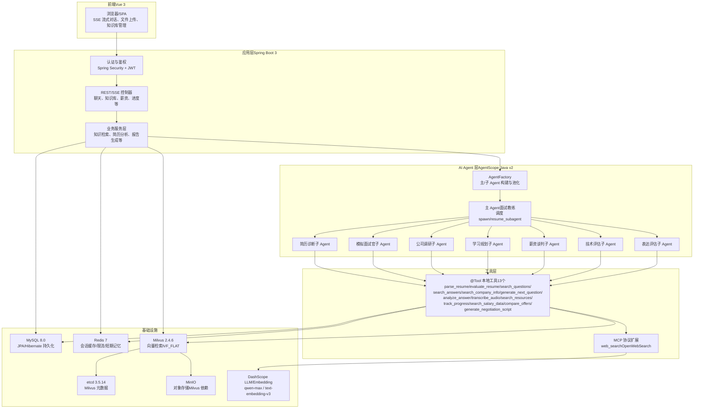
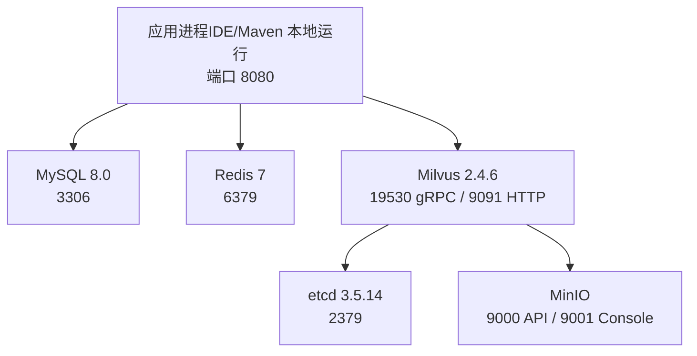

# 系统技术架构总览

<cite>
**本文引用的文件**   
- [Documents/02-系统架构设计说明书.md](file://Documents/02-系统架构设计说明书.md)
- [docker-compose.yml](file://docker-compose.yml)
- [src/main/resources/application.yml](file://src/main/resources/application.yml)
- [AGENTS.md](file://AGENTS.md)
</cite>

## 系统分层架构
> 绘制前端→Spring Boot→AgentScope→工具层→基础设施 五层架构 Mermaid 图



**图表来源** 
- [Documents/02-系统架构设计说明书.md:44-117](file://Documents/02-系统架构设计说明书.md#L44-L117)
- [AGENTS.md:21-48](file://AGENTS.md#L21-L48)
- [src/main/resources/application.yml:33-56](file://src/main/resources/application.yml#L33-L56)

**章节来源**
- [Documents/02-系统架构设计说明书.md:44-117](file://Documents/02-系统架构设计说明书.md#L44-L117)
- [AGENTS.md:21-48](file://AGENTS.md#L21-L48)
- [src/main/resources/application.yml:33-56](file://src/main/resources/application.yml#L33-L56)

## 技术栈全景
> 以表格列出各层技术选型及版本号

| 层级 | 技术选型 | 版本/说明 |
|---|---|---|
| 前端 | Vue 3 + Vite + TypeScript | SPA，SSE 流式渲染 |
| 后端框架 | Spring Boot 3.2.5（Servlet MVC） | 单模块 Maven 项目 |
| AI Agent 框架 | AgentScope Java v2（ReActAgent） | 主/子 Agent 协作，@Tool 注册 |
| 数据库 | MySQL 8.0（JPA + Hibernate） | 18 张表，DDL auto update |
| 缓存/限流 | Redis 7（Spring Data Redis） | 会话缓存、热点缓存、接口限流 |
| 向量数据库 | Milvus 2.4.6（RAG） | IVF_FLAT 索引，COSINE 相似度 |
| 对象存储 | MinIO | Milvus 依赖 + 文件上传 |
| 元数据存储 | etcd 3.5.14 | Milvus 集群元数据 |
| 认证鉴权 | Spring Security + JWT（jjwt 0.12.5） | Bearer Token 无状态认证 |
| LLM/Embedding | DashScope（阿里云通义） | qwen-max / text-embedding-v3 |
| 构建工具 | Maven | 单模块工程 |

**章节来源**
- [AGENTS.md:7-19](file://AGENTS.md#L7-L19)
- [src/main/resources/application.yml:1-102](file://src/main/resources/application.yml#L1-L102)

## 部署拓扑
> 绘制 Docker Compose 6 服务编排关系的 Mermaid 图（app + Milvus + etcd + MinIO + MySQL + Redis）



**图表来源** 
- [docker-compose.yml:15-100](file://docker-compose.yml#L15-L100)

**章节来源**
- [docker-compose.yml:1-108](file://docker-compose.yml#L1-L108)

## 项目包结构导航
> 以树形图展示 src/main/java/com/tutorial/offerpilot/ 的包结构，标注各包职责

```
src/main/java/com/tutorial/offerpilot/
├── OfferPilotApplication.java          # 启动类
├── common/                             # 公共基础：BaseEntity, ApiResponse, PageRequest
├── enums/                              # 枚举：UserRole, Visibility, DocumentStatus 等
├── config/                             # Spring 配置：Security, Milvus, Redis, Async, Web
├── security/                           # 安全：JwtTokenProvider, JwtAuthenticationFilter, CustomUserDetailsService
├── controller/                         # REST/SSE 控制器：Auth, Chat, KB, Salary, Progress, Report, FileUpload
├── service/                            # 业务服务：认证、简历、薪资、报告、知识库、向量检索、缓存、限流等
│   └── ingestion/                      # 异步入库管道：DocumentParser, DocumentChunker, EmbeddingService, DocumentIngestionService
├── agent/                              # AgentScope 集成：AgentFactory, @Tool 工具集, Middleware
│   ├── tool/                           # 13 个本地 @Tool：解析/评估/检索/转写/出题/分析/资源/进度/薪资等
│   └── middleware/                     # 中间件：CostControlMiddleware, TokenMonitorMiddleware
├── entity/                             # JPA 实体：用户、会话、题目、知识库、记忆、日志等（18 张表）
├── repository/                         # Spring Data JPA Repository 接口
├── dto/                                # 请求/响应 DTO（含 auth/chat/kb/tool 子包）
├── converter/                          # Entity ↔ DTO 转换：KbConverter
└── exception/                          # 异常体系：BusinessException + GlobalExceptionHandler
```

**章节来源**
- [AGENTS.md:21-48](file://AGENTS.md#L21-L48)