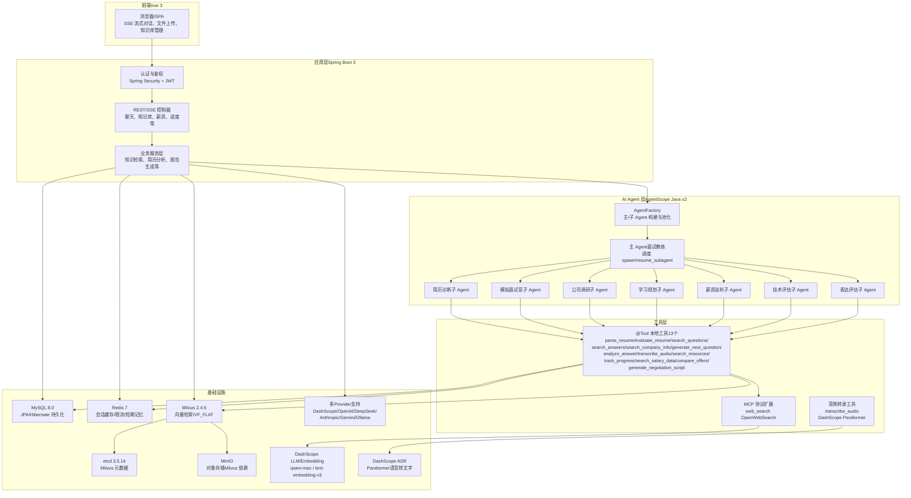
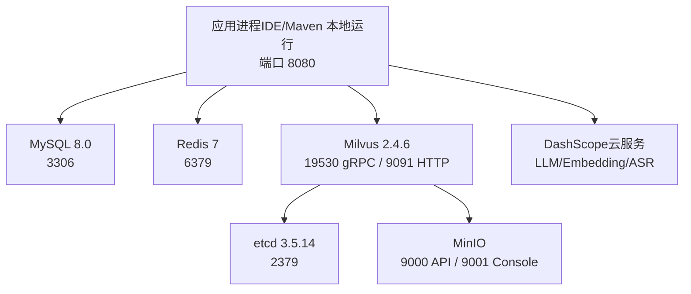
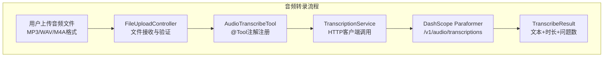

# 系统技术架构总览

<cite>
**本文引用的文件**   
- [Documents/02-系统架构设计说明书.md](file://Documents/02-系统架构设计说明书.md)
- [docker-compose.yml](file://docker-compose.yml)
- [src/main/resources/application.yml](file://src/main/resources/application.yml)
- [AGENTS.md](file://AGENTS.md)
- [pom.xml](file://pom.xml)
- [src/main/java/com/tutorial/offerpilot/agent/tool/AudioTranscribeTool.java](file://src/main/java/com/tutorial/offerpilot/agent/tool/AudioTranscribeTool.java)
- [src/main/java/com/tutorial/offerpilot/service/TranscriptionService.java](file://src/main/java/com/tutorial/offerpilot/service/TranscriptionService.java)
- [src/main/java/com/tutorial/offerpilot/config/AgentScopeProperties.java](file://src/main/java/com/tutorial/offerpilot/config/AgentScopeProperties.java)
- [src/main/java/com/tutorial/offerpilot/enums/ProviderPreset.java](file://src/main/java/com/tutorial/offerpilot/enums/ProviderPreset.java)
</cite>

## 更新摘要
**变更内容**   
- 新增音频转录能力，集成DashScope Paraformer模型实现实时语音转文字
- 增强多Provider支持，补齐4个缺失的AgentScope Model Extension依赖
- 优化Provider映射逻辑，支持8家主流LLM提供商的统一接入
- 完善配置体系，提供独立的转录服务配置项

## 系统分层架构
> 绘制前端→Spring Boot→AgentScope→工具层→基础设施 五层架构 Mermaid 图



**图表来源** 
- [Documents/02-系统架构设计说明书.md:44-117](file://Documents/02-系统架构设计说明书.md#L44-L117)
- [AGENTS.md:21-48](file://AGENTS.md#L21-L48)
- [src/main/resources/application.yml:33-72](file://src/main/resources/application.yml#L33-L72)

**章节来源**
- [Documents/02-系统架构设计说明书.md:44-117](file://Documents/02-系统架构设计说明书.md#L44-L117)
- [AGENTS.md:21-48](file://AGENTS.md#L21-L48)
- [src/main/resources/application.yml:33-72](file://src/main/resources/application.yml#L33-L72)

## 技术栈全景
> 以表格列出各层技术选型及版本号

| 层级 | 技术选型 | 版本/说明 |
|---|---|---|
| 前端 | Vue 3 + Vite + TypeScript | SPA，SSE 流式渲染 |
| 后端框架 | Spring Boot 3.2.5（Servlet MVC） | 单模块 Maven 项目 |
| AI Agent 框架 | AgentScope Java v2（ReActAgent） | 主/子 Agent 协作，@Tool 注册 |
| 数据库 | MySQL 8.0（JPA + Hibernate） | 18 张表，DDL auto update |
| 缓存/限流 | Redis 7（Spring Data Redis） | 会话缓存、热点缓存、接口限流 |
| 向量数据库 | Milvus 2.4.6（RAG） | IVF_FLAT 索引，COSINE 相似度 |
| 对象存储 | MinIO | Milvus 依赖 + 文件上传 |
| 元数据存储 | etcd 3.5.14 | Milvus 集群元数据 |
| 认证鉴权 | Spring Security + JWT（jjwt 0.12.5） | Bearer Token 无状态认证 |
| LLM/Embedding | DashScope（阿里云通义） | qwen-max / text-embedding-v3 |
| 语音转文字 | DashScope Paraformer | 实时语音转文本，OpenAI兼容API |
| 多Provider支持 | 8家主流LLM提供商 | DashScope/OpenAI/DeepSeek/Anthropic/Gemini/Ollama |
| 构建工具 | Maven | 单模块工程 |

**章节来源**
- [AGENTS.md:7-19](file://AGENTS.md#L7-L19)
- [src/main/resources/application.yml:1-122](file://src/main/resources/application.yml#L1-L122)
- [pom.xml:130-165](file://pom.xml#L130-L165)

## 部署拓扑
> 绘制 Docker Compose 6 服务编排关系的 Mermaid 图（app + Milvus + etcd + MinIO + MySQL + Redis）



**图表来源** 
- [docker-compose.yml:15-100](file://docker-compose.yml#L15-L100)

**章节来源**
- [docker-compose.yml:1-108](file://docker-compose.yml#L1-L108)

## 项目包结构导航
> 以树形图展示 src/main/java/com/tutorial/offerpilot/ 的包结构，标注各包职责

```
src/main/java/com/tutorial/offerpilot/
├── OfferPilotApplication.java          # 启动类
├── common/                             # 公共基础：BaseEntity, ApiResponse, PageRequest
├── enums/                              # 枚举：UserRole, Visibility, DocumentStatus, ProviderPreset等
├── config/                             # Spring 配置：Security, Milvus, Redis, Async, Web, AgentScopeProperties
├── security/                           # 安全：JwtTokenProvider, JwtAuthenticationFilter, CustomUserDetailsService
├── controller/                         # REST/SSE 控制器：Auth, Chat, KB, Salary, Progress, Report, FileUpload
├── service/                            # 业务服务：认证、简历、薪资、报告、知识库、向量检索、缓存、限流等
│   ├── ingestion/                      # 异步入库管道：DocumentParser, DocumentChunker, EmbeddingService, DocumentIngestionService
│   └── TranscriptionService.java       # 录音转写服务：DashScope Paraformer集成
├── agent/                              # AgentScope 集成：AgentFactory, @Tool 工具集, Middleware
│   ├── tool/                           # 13 个本地 @Tool：解析/评估/检索/转写/出题/分析/资源/进度/薪资等
│   │   └── AudioTranscribeTool.java    # 音频转录工具：调用TranscriptionService进行语音转文字
│   └── middleware/                     # 中间件：CostControlMiddleware, TokenMonitorMiddleware
├── entity/                             # JPA 实体：用户、会话、题目、知识库、记忆、日志等（18 张表）
├── repository/                         # Spring Data JPA Repository 接口
├── dto/                                # 请求/响应 DTO（含 auth/chat/kb/tool 子包）
│   └── tool/                           # 工具返回DTO：包含TranscribeResult等
├── converter/                          # Entity ↔ DTO 转换：KbConverter
└── exception/                          # 异常体系：BusinessException + GlobalExceptionHandler
```

**章节来源**
- [AGENTS.md:21-48](file://AGENTS.md#L21-L48)

## 新增音频转录功能架构

### 音频转录技术实现
系统新增了完整的音频转录能力，通过DashScope Paraformer模型实现实时语音转文字功能。该功能独立于LLM模型配置，提供专门的转录服务配置。



**图表来源**
- [src/main/java/com/tutorial/offerpilot/agent/tool/AudioTranscribeTool.java:27-56](file://src/main/java/com/tutorial/offerpilot/agent/tool/AudioTranscribeTool.java#L27-L56)
- [src/main/java/com/tutorial/offerpilot/service/TranscriptionService.java:55-106](file://src/main/java/com/tutorial/offerpilot/service/TranscriptionService.java#L55-L106)

### 多Provider支持增强
系统现已完整支持8家主流LLM提供商，通过AgentScope框架的SPI机制实现统一接入：

| Provider类型 | 提供商 | AgentScope前缀 | 特殊处理 |
|-------------|--------|---------------|----------|
| OpenAI兼容 | DashScope | dashscope | 原生支持 |
| OpenAI兼容 | OpenAI | openai | 原生支持 |
| OpenAI兼容 | DeepSeek | → openai | 自动映射 |
| OpenAI兼容 | SiliconFlow | → openai | 自动映射 |
| OpenAI兼容 | VolcEngine | → openai | 自动映射 |
| Anthropic | Claude | anthropic | 原生支持 |
| Gemini | Google Gemini | gemini | 原生支持 |
| OpenAI兼容 | Ollama | ollama | 原生支持 |

**章节来源**
- [src/main/java/com/tutorial/offerpilot/agent/AgentFactory.java:45-46](file://src/main/java/com/tutorial/offerpilot/agent/AgentFactory.java#L45-L46)
- [src/main/java/com/tutorial/offerpilot/enums/ProviderPreset.java:15-101](file://src/main/java/com/tutorial/offerpilot/enums/ProviderPreset.java#L15-L101)

## 配置体系升级

### 独立转录服务配置
系统提供了独立的转录服务配置，与LLM模型配置完全解耦：

```yaml
agentscope:
  transcription:
    api-key: ${TRANSCRIPTION_API_KEY:${DASHSCOPE_API_KEY:}}
    model: paraformer-v2
    base-url: https://dashscope.aliyuncs.com/compatible-mode/v1
```

### 多Provider依赖配置
通过Maven依赖管理实现了完整的Provider支持：

- `agentscope-extensions-model-dashscope` - DashScope支持
- `agentscope-extensions-model-anthropic` - Anthropic支持  
- `agentscope-extensions-model-gemini` - Gemini支持
- `agentscope-extensions-model-ollama` - Ollama支持

**章节来源**
- [src/main/resources/application.yml:66-72](file://src/main/resources/application.yml#L66-L72)
- [pom.xml:146-165](file://pom.xml#L146-L165)
- [src/main/java/com/tutorial/offerpilot/config/AgentScopeProperties.java:69-82](file://src/main/java/com/tutorial/offerpilot/config/AgentScopeProperties.java#L69-L82)