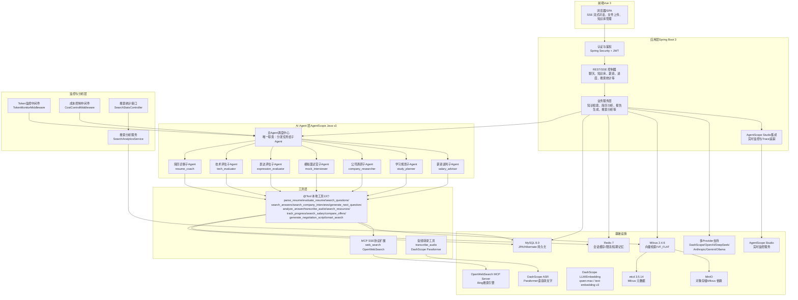
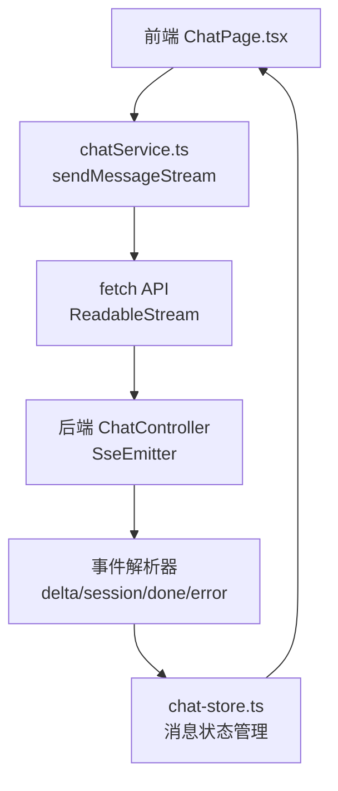
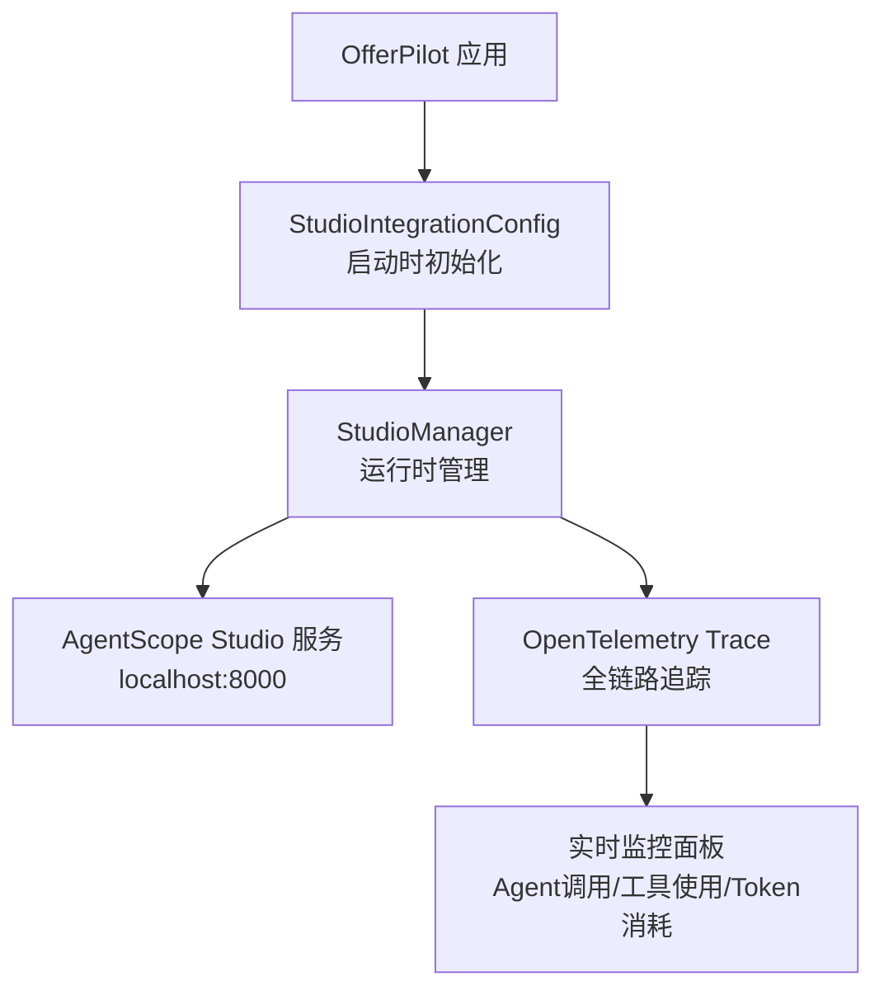
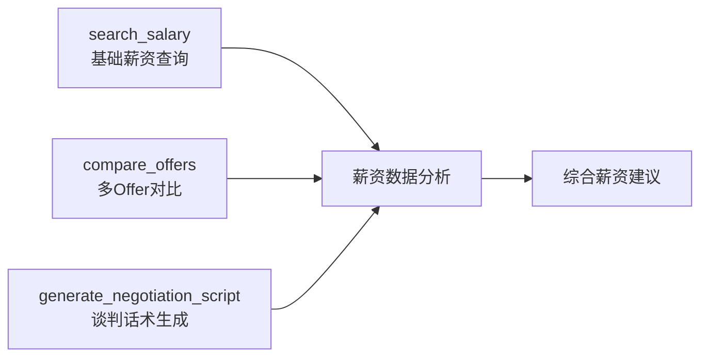
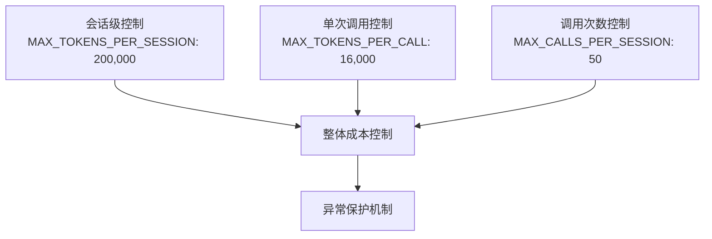

# 系统技术架构总览

<cite>
**本文引用的文件**   
- [Documents/02-系统架构设计说明书.md](file://Documents/02-系统架构设计说明书.md)
- [docker-compose.yml](file://docker-compose.yml)
- [src/main/resources/application.yml](file://src/main/resources/application.yml)
- [AGENTS.md](file://AGENTS.md)
- [pom.xml](file://pom.xml)
- [src/main/java/com/tutorial/offerpilot/agent/AgentFactory.java](file://src/main/java/com/tutorial/offerpilot/agent/AgentFactory.java)
- [workspace/tools.json](file://workspace/tools.json)
- [src/main/java/com/tutorial/offerpilot/agent/tool/SalaryTool.java](file://src/main/java/com/tutorial/offerpilot/agent/tool/SalaryTool.java)
- [src/main/java/com/tutorial/offerpilot/service/SearchAnalyticsService.java](file://src/main/java/com/tutorial/offerpilot/service/SearchAnalyticsService.java)
- [src/main/java/com/tutorial/offerpilot/agent/middleware/CostControlMiddleware.java](file://src/main/java/com/tutorial/offerpilot/agent/middleware/CostControlMiddleware.java)
- [src/main/java/com/tutorial/offerpilot/agent/middleware/TokenMonitorMiddleware.java](file://src/main/java/com/tutorial/offerpilot/agent/middleware/TokenMonitorMiddleware.java)
- [src/main/java/com/tutorial/offerpilot/controller/SearchStatsController.java](file://src/main/java/com/tutorial/offerpilot/controller/SearchStatsController.java)
- [src/main/java/com/tutorial/offerpilot/service/WebSearchFallbackService.java](file://src/main/java/com/tutorial/offerpilot/service/WebSearchFallbackService.java)
- [src/main/java/com/tutorial/offerpilot/config/StudioIntegrationConfig.java](file://src/main/java/com/tutorial/offerpilot/config/StudioIntegrationConfig.java)
- [src/main/java/com/tutorial/offerpilot/config/AgentScopeProperties.java](file://src/main/java/com/tutorial/offerpilot/config/AgentScopeProperties.java)
- [web/src/ui/pages/chat/ChatPage.tsx](file://web/src/ui/pages/chat/ChatPage.tsx)
- [web/src/service/chatService.ts](file://web/src/service/chatService.ts)
- [web/src/store/chat-store.ts](file://web/src/store/chat-store.ts)
</cite>

## 更新摘要
**变更内容**   
- MCP协议从HTTP JSON-RPC全面迁移到SSE流式HTTP协议，提升实时通信性能
- 搜索引擎从百度切换到Bing，提供更准确的搜索结果
- 新增AgentScope Studio可观测性集成，支持实时监控Agent调用和Trace追踪
- 前端SSE流式传输完全重写，采用原生fetch + ReadableStream实现
- 增强Web搜索兜底机制，支持MCP会话管理和错误降级处理

## 系统分层架构
> 绘制前端→Spring Boot→多Agent架构→工具层→基础设施 五层架构 Mermaid 图



**图表来源** 
- [src/main/java/com/tutorial/offerpilot/agent/AgentFactory.java:145-177](file://src/main/java/com/tutorial/offerpilot/agent/AgentFactory.java#L145-L177)
- [workspace/tools.json:1-11](file://workspace/tools.json#L1-11)
- [docker-compose.yml:103-110](file://docker-compose.yml#L103-L110)
- [src/main/java/com/tutorial/offerpilot/config/StudioIntegrationConfig.java:40-77](file://src/main/java/com/tutorial/offerpilot/config/StudioIntegrationConfig.java#L40-L77)

**章节来源**
- [src/main/java/com/tutorial/offerpilot/agent/AgentFactory.java:126-177](file://src/main/java/com/tutorial/offerpilot/agent/AgentFactory.java#L126-L177)
- [workspace/tools.json:1-11](file://workspace/tools.json#L1-11)
- [docker-compose.yml:103-110](file://docker-compose.yml#L103-L110)

## 多Agent架构详解

### 主Agent调度中心
主Agent作为整个系统的调度中心，其核心职责是理解用户需求并分派任务给专业的子Agent，严禁直接调用业务工具。

```mermaid
graph TB
MAIN["主Agent调度中心"]
RESUME["简历诊断<br/>resume_coach"]
TECH["技术评估<br/>tech_evaluator"]
EXPR["表达评估<br/>expression_evaluator"]
MOCK["模拟面试<br/>mock_interviewer"]
COMPANY["公司调研<br/>company_researcher"]
STUDY["学习规划<br/>study_planner"]
SALARY["薪资谈判<br/>salary_advisor"]
WEB["联网搜索<br/>web_search"]
MAIN --> RESUME
MAIN --> TECH
MAIN --> EXPR
MAIN --> MOCK
MAIN --> COMPANY
MAIN --> STUDY
MAIN --> SALARY
MAIN --> WEB
RESUME --> ["parse_resume, evaluate_resume,<br/>search_questions"]
TECH --> ["search_answers, analyze_answer,<br/>search_questions"]
EXPR --> ["analyze_answer"]
MOCK --> ["generate_next_question,<br/>search_answers, analyze_answer"]
COMPANY --> ["search_company_interviews,<br/>search_questions, web_search"]
STUDY --> ["track_progress, search_resources,<br/>search_questions, web_search"]
SALARY --> ["search_salary, compare_offers,<br/>generate_negotiation_script, web_search"]
WEB --> ["互联网实时信息"]
```

**图表来源** 
- [src/main/java/com/tutorial/offerpilot/agent/AgentFactory.java:275-305](file://src/main/java/com/tutorial/offerpilot/agent/AgentFactory.java#L275-305)
- [src/main/java/com/tutorial/offerpilot/agent/AgentFactory.java:311-421](file://src/main/java/com/tutorial/offerpilot/agent/AgentFactory.java#L311-421)

### 子Agent专业分工
每个子Agent都有明确的职责边界和工具白名单，确保专业化和安全性：

| 子Agent | 名称 | 核心职责 | 工具白名单 |
|---------|------|----------|------------|
| 简历诊断 | resume_coach | 简历解析、质量评估、优化建议 | parse_resume, evaluate_resume, search_questions |
| 技术评估 | tech_evaluator | 技术回答分析、评分标准对比 | search_answers, analyze_answer, search_questions |
| 表达评估 | expression_evaluator | 沟通技巧、逻辑结构分析 | analyze_answer |
| 模拟面试 | mock_interviewer | 交互式面试练习、动态提问 | generate_next_question, search_answers, analyze_answer |
| 公司调研 | company_researcher | 面试情报收集、公司信息调研 | search_company_interviews, search_questions, web_search |
| 学习规划 | study_planner | 学习计划制定、进度跟踪 | track_progress, search_resources, search_questions, web_search |
| 薪资谈判 | salary_advisor | 薪资查询、Offer对比、谈判策略 | search_salary, compare_offers, generate_negotiation_script, web_search |

**章节来源**
- [src/main/java/com/tutorial/offerpilot/agent/AgentFactory.java:311-421](file://src/main/java/com/tutorial/offerpilot/agent/AgentFactory.java#L311-421)

## MCP协议升级与SSE流式通信

### MCP协议架构升级
**已更新** MCP协议从HTTP JSON-RPC迁移到SSE流式HTTP协议，提供更高效的实时通信能力。

```mermaid
graph TB
AGENT["Agent工具调用"]
MCP_CLIENT["MCP客户端"]
TOOLS_JSON["workspace/tools.json<br/>MCP服务器配置"]
WEB_SEARCH_MCP["OpenWebSearch MCP Server<br/>端口: 3000"]
SEARCH_ENGINES["搜索引擎后端<br/>Bing搜索引擎"]
SSE_STREAM["SSE 流式连接<br/>/sse 端点"]
AGENT --> MCP_CLIENT
MCP_CLIENT --> TOOLS_JSON
TOOLS_JSON --> WEB_SEARCH_MCP
WEB_SEARCH_MCP --> SSE_STREAM
SSE_STREAM --> SEARCH_ENGINES
WEB_SEARCH_MCP -.-> ["SSE URL: /sse"]
WEB_SEARCH_MCP -.-> ["环境变量: DEFAULT_SEARCH_ENGINE=bing"]
```

**图表来源** 
- [workspace/tools.json:1-11](file://workspace/tools.json#L1-11)
- [docker-compose.yml:103-110](file://docker-compose.yml#L103-L110)

### 搜索引擎切换至Bing
**已更新** 搜索引擎从百度切换到Bing，提供更准确和实时的搜索结果。

| 搜索引擎 | 状态 | 配置项 | 特点 |
|----------|------|--------|------|
| Bing | ✅ 启用 | DEFAULT_SEARCH_ENGINE=bing | 全球覆盖、实时更新、API稳定 |
| 百度 | ❌ 停用 | - | 国内访问受限、结果质量下降 |

### 前端SSE流式传输重写
**已更新** 前端SSE流式传输完全重写，采用原生fetch + ReadableStream实现。



**图表来源** 
- [web/src/ui/pages/chat/ChatPage.tsx:92-115](file://web/src/ui/pages/chat/ChatPage.tsx#L92-L115)
- [web/src/service/chatService.ts:40-124](file://web/src/service/chatService.ts#L40-L124)
- [web/src/store/chat-store.ts:28-55](file://web/src/store/chat-store.ts#L28-L55)

### 兜底搜索机制增强
当MCP服务不可用时，系统自动降级到HTTP直连方式：

| 搜索层级 | 优先级 | 数据来源 | 响应时间 |
|----------|--------|----------|----------|
| 知识库检索 | 1 | Milvus向量数据库 | <100ms |
| 数据库检索 | 2 | MySQL结构化数据 | <200ms |
| MCP联网搜索 | 3 | OpenWebSearch MCP (SSE) | <2s |
| HTTP兜底搜索 | 4 | 直接HTTP调用 | <5s |

**章节来源**
- [workspace/tools.json:1-11](file://workspace/tools.json#L1-11)
- [src/main/java/com/tutorial/offerpilot/service/WebSearchFallbackService.java:60-117](file://src/main/java/com/tutorial/offerpilot/service/WebSearchFallbackService.java#L60-L117)

## AgentScope Studio可观测性集成

### Studio集成架构
**新增** AgentScope Studio提供完整的可观测性支持，包括实时监控、Trace追踪和性能分析。



**图表来源** 
- [src/main/java/com/tutorial/offerpilot/config/StudioIntegrationConfig.java:40-77](file://src/main/java/com/tutorial/offerpilot/config/StudioIntegrationConfig.java#L40-L77)
- [src/main/java/com/tutorial/offerpilot/config/AgentScopeProperties.java:85-104](file://src/main/java/com/tutorial/offerpilot/config/AgentScopeProperties.java#L85-L104)

### Studio配置选项
Studio集成通过配置文件进行灵活控制：

| 配置项 | 默认值 | 说明 |
|--------|--------|------|
| enabled | false | 是否启用Studio集成 |
| url | http://localhost:8000 | Studio服务地址 |
| project | OfferPilot | 项目名称标识 |
| tracingUrl | null | Trace端点（可选） |
| maxRetries | 3 | HTTP请求最大重试次数 |
| reconnectAttempts | 3 | WebSocket重连最大尝试次数 |

### 监控功能特性
接入Studio后可实时监控：

- **Agent消息流**：用户输入 → Agent推理 → 工具调用 → 最终回复
- **工具调用详情**：参数、耗时、返回结果
- **Token消耗统计**：LLM调用成本分析
- **OpenTelemetry Trace**：全链路性能追踪

**章节来源**
- [src/main/java/com/tutorial/offerpilot/config/StudioIntegrationConfig.java:1-91](file://src/main/java/com/tutorial/offerpilot/config/StudioIntegrationConfig.java#L1-91)
- [src/main/java/com/tutorial/offerpilot/config/AgentScopeProperties.java:85-104](file://src/main/java/com/tutorial/offerpilot/config/AgentScopeProperties.java#L85-L104)

## 工具层增强

### 工具总数与分类
系统现已支持13个@Tool注解工具，按功能分为四大类：

| 工具类别 | 工具数量 | 具体工具 |
|----------|----------|----------|
| 知识检索 | 5个 | search_questions, search_answers, search_company_interviews, search_resources, smart_search |
| 简历分析 | 2个 | parse_resume, evaluate_resume |
| 面试相关 | 3个 | generate_next_question, analyze_answer, transcribe_audio |
| 通用工具 | 3个 | track_progress, search_salary, compare_offers, generate_negotiation_script |

### SalaryTool增强
SalaryTool新增了三个核心方法，支持完整的薪资谈判流程：



**章节来源**
- [src/main/java/com/tutorial/offerpilot/agent/tool/SalaryTool.java:31-99](file://src/main/java/com/tutorial/offerpilot/agent/tool/SalaryTool.java#L31-L99)

## 监控与分析层

### Token监控中间件
TokenMonitorMiddleware提供了细粒度的Token使用监控：

| 监控指标 | 数据类型 | 用途 |
|----------|----------|------|
| reasoningCount | AtomicInteger | 推理轮次统计 |
| totalPromptTokens | AtomicLong | 输入Token累计 |
| totalCompletionTokens | AtomicLong | 输出Token累计 |
| totalToolCalls | AtomicInteger | 工具调用次数 |

### 成本控制中间件
CostControlMiddleware实现了三层成本控制机制：



### 搜索分析服务
SearchAnalyticsService提供完整的搜索行为分析：

| 分析维度 | 数据指标 | 应用场景 |
|----------|----------|----------|
| 热门查询 | Top 10查询词 | 内容建设指导 |
| 零结果分析 | 无结果查询统计 | 知识库优化 |
| 来源分布 | KB/DB/Web占比 | 搜索效果评估 |
| 性能监控 | 平均响应时间 | 系统优化 |

**章节来源**
- [src/main/java/com/tutorial/offerpilot/agent/middleware/TokenMonitorMiddleware.java:34-122](file://src/main/java/com/tutorial/offerpilot/agent/middleware/TokenMonitorMiddleware.java#L34-L122)
- [src/main/java/com/tutorial/offerpilot/agent/middleware/CostControlMiddleware.java:29-116](file://src/main/java/com/tutorial/offerpilot/agent/middleware/CostControlMiddleware.java#L29-L116)
- [src/main/java/com/tutorial/offerpilot/service/SearchAnalyticsService.java:24-125](file://src/main/java/com/tutorial/offerpilot/service/SearchAnalyticsService.java#L24-L125)

## 权限控制系统

### 细粒度权限管理
系统采用PermissionContextState实现了基于工具的细粒度权限控制：

| 权限类型 | 工具示例 | 行为策略 | 说明 |
|----------|----------|----------|------|
| ALLOW | parse_resume, search_questions | 直接放行 | 查询类工具无需用户确认 |
| DENY | delete_user_data | 明确拒绝 | 危险操作严格禁止 |
| ACCEPT_EDITS | 所有工具 | 编辑模式 | 允许Agent修改用户设置 |

### 权限规则配置
所有13个查询类工具都配置为ALLOW策略，确保用户体验流畅：

```java
PermissionContextState.builder()
    .mode(PermissionMode.ACCEPT_EDITS)
    .addAllowRule("parse_resume", new PermissionRule(...))
    .addAllowRule("search_salary", new PermissionRule(...))
    .addAllowRule("compare_offers", new PermissionRule(...))
    .addAllowRule("generate_negotiation_script", new PermissionRule(...))
    .addAllowRule("web_search", new PermissionRule(..., "联网搜索直接放行"))
    .addDenyRule("delete_user_data", new PermissionRule(...))
    .build();
```

**章节来源**
- [src/main/java/com/tutorial/offerpilot/agent/AgentFactory.java:427-463](file://src/main/java/com/tutorial/offerpilot/agent/AgentFactory.java#L427-L463)

## 部署拓扑
> 绘制 Docker Compose 7 服务编排关系的 Mermaid 图（app + Milvus + etcd + MinIO + MySQL + Redis + Web Search）

```mermaid
graph TB
APP["应用进程IDE/Maven 本地运行<br/>端口 8080"]
MYSQL["MySQL 8.0<br/>3306"]
REDIS["Redis 7<br/>6379"]
ETCD["etcd 3.5.14<br/>2379"]
MINIO["MinIO<br/>9000 API / 9001 Console"]
MILVUS["Milvus 2.4.6<br/>19530 gRPC / 9091 HTTP"]
WEBSEARCH["OpenWebSearch MCP<br/>3000 HTTP (SSE)"]
STUDIO["AgentScope Studio<br/>8000 WebSocket"]
DASHSCOPE["DashScope云服务<br/>LLM/Embedding/ASR"]
APP --> MYSQL
APP --> REDIS
APP --> MILVUS
APP --> WEBSEARCH
APP --> STUDIO
APP --> DASHSCOPE
MILVUS --> ETCD
MILVUS --> MINIO
WEBSEARCH --> ["Bing搜索引擎"]
STUDIO --> ["实时监控面板"]
```

**图表来源** 
- [docker-compose.yml:15-117](file://docker-compose.yml#L15-L117)

**章节来源**
- [docker-compose.yml:1-117](file://docker-compose.yml#L1-L117)

## 项目包结构导航
> 以树形图展示 src/main/java/com/tutorial/offerpilot/ 的包结构，标注各包职责

```
src/main/java/com/tutorial/offerpilot/
├── OfferPilotApplication.java          # 启动类
├── common/                             # 公共基础：BaseEntity, ApiResponse, PageRequest
├── enums/                              # 枚举：UserRole, Visibility, DocumentStatus, ProviderPreset等
├── config/                             # Spring 配置：Security, Milvus, Redis, Async, Web, AgentScopeProperties
│   ├── StudioIntegrationConfig.java    # AgentScope Studio集成配置
│   └── AgentScopeProperties.java       # AgentScope配置类（含Studio配置）
├── security/                           # 安全：JwtTokenProvider, JwtAuthenticationFilter, CustomUserDetailsService
├── controller/                         # REST/SSE 控制器：Auth, Chat, KB, Salary, Progress, Report, FileUpload, SearchStats
├── service/                            # 业务服务：认证、简历、薪资、报告、知识库、向量检索、缓存、限流等
│   ├── ingestion/                      # 异步入库管道：DocumentParser, DocumentChunker, EmbeddingService, DocumentIngestionService
│   └── TranscriptionService.java       # 录音转写服务：DashScope Paraformer集成
├── agent/                              # AgentScope 集成：AgentFactory, @Tool 工具集, Middleware
│   ├── tool/                           # 13 个本地 @Tool：解析/评估/检索/转写/出题/分析/资源/进度/薪资等
│   │   ├── SalaryTool.java             # 薪资工具：search_salary + compare_offers + generate_negotiation_script
│   │   └── AudioTranscribeTool.java    # 音频转录工具：调用TranscriptionService进行语音转文字
│   └── middleware/                     # 中间件：CostControlMiddleware, TokenMonitorMiddleware
├── entity/                             # JPA 实体：用户、会话、题目、知识库、记忆、日志等（18 张表）
├── repository/                         # Spring Data JPA Repository 接口
├── dto/                                # 请求/响应 DTO（含 auth/chat/kb/tool 子包）
│   └── tool/                           # 工具返回DTO：包含TranscribeResult等
├── converter/                          # Entity ↔ DTO 转换：KbConverter
└── exception/                          # 异常体系：BusinessException + GlobalExceptionHandler
```

**章节来源**
- [src/main/java/com/tutorial/offerpilot/agent/AgentFactory.java:61-73](file://src/main/java/com/tutorial/offerpilot/agent/AgentFactory.java#L61-L73)

## 配置体系升级

### MCP协议配置升级
**已更新** MCP协议配置从HTTP JSON-RPC迁移到SSE流式协议：

```json
{
  "mcpServers": {
    "web-search": {
      "transport": "sse",
      "url": "http://localhost:3000/sse",
      "env": {
        "DEFAULT_SEARCH_ENGINE": "bing"
      }
    }
  }
}
```

### AgentScope Studio配置
**新增** AgentScope Studio完整配置支持：

```yaml
agentscope:
  studio:
    enabled: true                    # 启用Studio集成
    url: http://localhost:8000      # Studio服务地址
    project: OfferPilot             # 项目名称
    tracingUrl: null                # Trace端点（可选）
    maxRetries: 3                   # HTTP重试次数
    reconnectAttempts: 3            # WebSocket重连次数
```

### 独立转录服务配置
系统提供了独立的转录服务配置，与LLM模型配置完全解耦：

```yaml
agentscope:
  transcription:
    api-key: ${TRANSCRIPTION_API_KEY:${DASHSCOPE_API_KEY:}}
    model: paraformer-v2
    base-url: https://dashscope.aliyuncs.com/compatible-mode/v1
```

**章节来源**
- [workspace/tools.json:1-11](file://workspace/tools.json#L1-11)
- [src/main/resources/application.yml:72-79](file://src/main/resources/application.yml#L72-L79)
- [src/main/resources/application.yml:66-72](file://src/main/resources/application.yml#L66-L72)