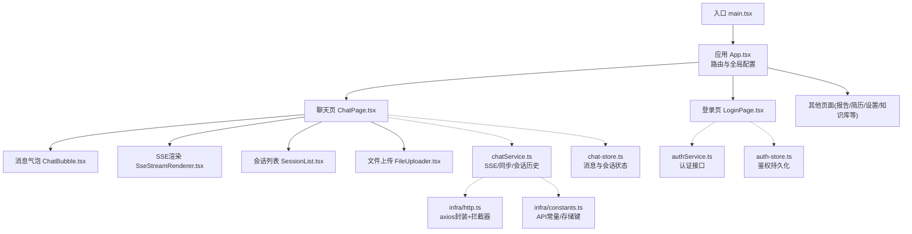
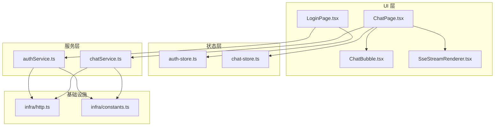
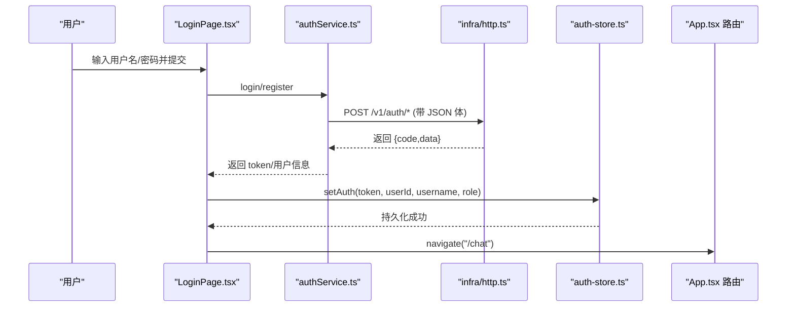
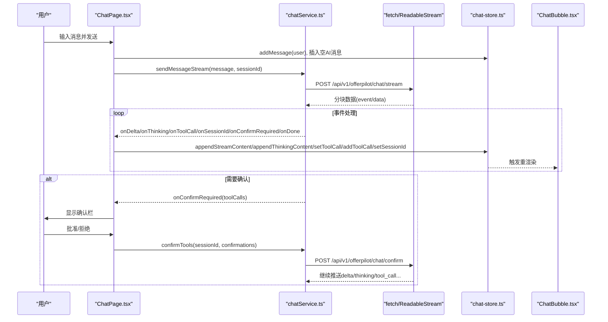
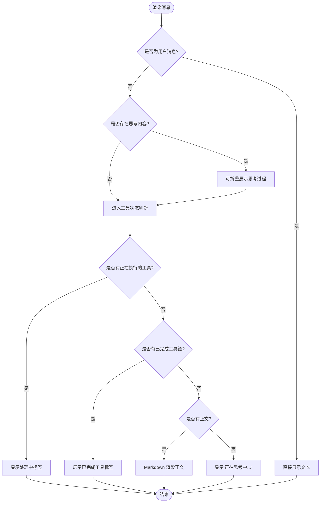
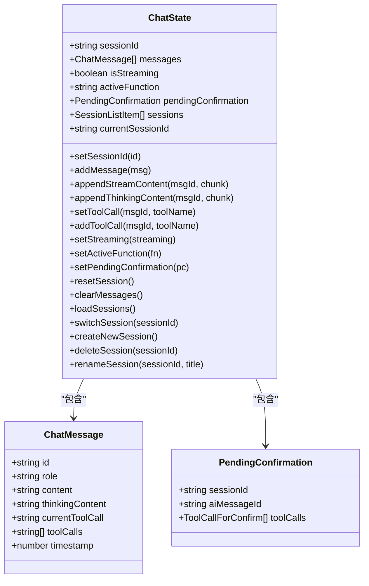
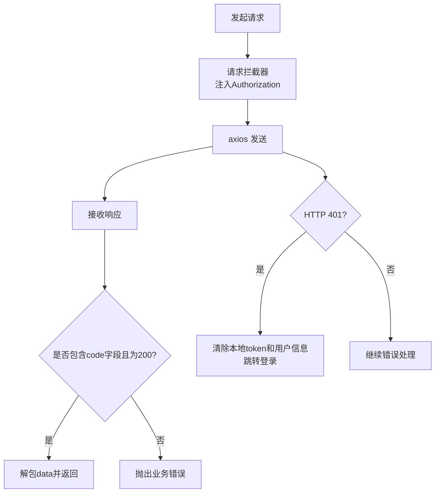
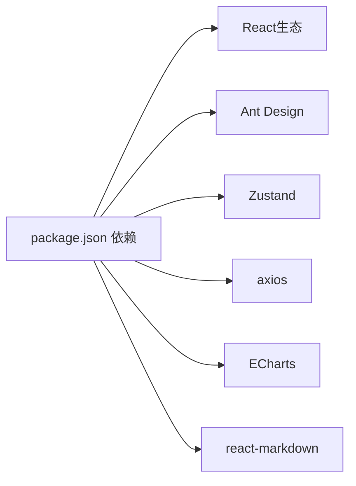

# 前端技术栈与用户界面

<cite>
**本文引用的文件**   
- [web/package.json](file://web/package.json)
- [web/src/app/main.tsx](file://web/src/app/main.tsx)
- [web/src/app/App.tsx](file://web/src/app/App.tsx)
- [web/src/infra/constants.ts](file://web/src/infra/constants.ts)
- [web/src/infra/http.ts](file://web/src/infra/http.ts)
- [web/src/service/authService.ts](file://web/src/service/authService.ts)
- [web/src/store/auth-store.ts](file://web/src/store/auth-store.ts)
- [web/src/ui/pages/login/LoginPage.tsx](file://web/src/ui/pages/login/LoginPage.tsx)
- [web/src/service/chatService.ts](file://web/src/service/chatService.ts)
- [web/src/store/chat-store.ts](file://web/src/store/chat-store.ts)
- [web/src/ui/pages/chat/ChatPage.tsx](file://web/src/ui/pages/chat/ChatPage.tsx)
- [web/src/ui/components/ChatBubble.tsx](file://web/src/ui/components/ChatBubble.tsx)
- [web/src/ui/components/SseStreamRenderer.tsx](file://web/src/ui/components/SseStreamRenderer.tsx)
</cite>

## 目录
1. [简介](#简介)
2. [项目结构](#项目结构)
3. [核心组件](#核心组件)
4. [架构总览](#架构总览)
5. [详细组件分析](#详细组件分析)
6. [依赖关系分析](#依赖关系分析)
7. [性能考虑](#性能考虑)
8. [故障排查指南](#故障排查指南)
9. [结论](#结论)
10. [附录](#附录)

## 简介
本章节聚焦 OfferPilot 的前端技术栈与用户界面实现，涵盖 React + Vite 工程组织、Ant Design 主题与国际化、Zustand 状态管理、Axios 请求封装、SSE 流式对话与 HITL（人机协同）确认流程、以及页面与组件的交互方式。文档以“从入口到页面、从状态到网络”的层次展开，帮助读者快速理解前端代码结构与关键交互路径。

## 项目结构
前端位于 web 子模块，采用 Vite + TypeScript + React 的工程化方案，使用 Ant Design 作为 UI 基础库，Zustand 进行轻量状态管理，axios 统一封装 HTTP 请求，并通过 SSE 实现实时流式对话。

图表来源
- [web/src/app/main.tsx:1-13](file://web/src/app/main.tsx#L1-L13)
- [web/src/app/App.tsx:1-113](file://web/src/app/App.tsx#L1-L113)
- [web/src/ui/pages/login/LoginPage.tsx:1-145](file://web/src/ui/pages/login/LoginPage.tsx#L1-L145)
- [web/src/ui/pages/chat/ChatPage.tsx:1-507](file://web/src/ui/pages/chat/ChatPage.tsx#L1-L507)
- [web/src/ui/components/ChatBubble.tsx:1-143](file://web/src/ui/components/ChatBubble.tsx#L1-L143)
- [web/src/ui/components/SseStreamRenderer.tsx:1-13](file://web/src/ui/components/SseStreamRenderer.tsx#L1-L13)
- [web/src/service/chatService.ts:1-462](file://web/src/service/chatService.ts#L1-L462)
- [web/src/store/chat-store.ts:1-198](file://web/src/store/chat-store.ts#L1-L198)
- [web/src/service/authService.ts:1-32](file://web/src/service/authService.ts#L1-L32)
- [web/src/store/auth-store.ts:1-55](file://web/src/store/auth-store.ts#L1-L55)
- [web/src/infra/http.ts:1-62](file://web/src/infra/http.ts#L1-L62)
- [web/src/infra/constants.ts:1-60](file://web/src/infra/constants.ts#L1-L60)

章节来源
- [web/package.json:1-39](file://web/package.json#L1-L39)
- [web/src/app/main.tsx:1-13](file://web/src/app/main.tsx#L1-L13)
- [web/src/app/App.tsx:1-113](file://web/src/app/App.tsx#L1-L113)

## 核心组件
- 应用入口与路由
  - main.tsx 负责创建根节点并挂载 App；App.tsx 提供 Ant Design 主题与中文本地化、BrowserRouter 路由、以及 AuthGuard 鉴权守卫。
- 认证与权限
  - authService 封装登录/注册；auth-store 持久化 token 与用户信息并提供 isAuthenticated 校验；LoginPage 提供登录/注册表单。
- 聊天与流式对话
  - chatService 提供 SSE 流式发送、HITL 确认恢复、同步兜底、会话历史与搜索；chat-store 维护消息、工具调用链、流式状态与会话切换；ChatPage 编排发送、流事件处理、HITL 弹窗与功能导航；ChatBubble 展示思考过程、工具调用标签与 Markdown 正文。
- 基础设施
  - infra/http.ts 基于 axios 封装，注入 Authorization 头、解包后端 ApiResponse、统一错误处理与 401 跳转；infra/constants.ts 集中定义 API 路径、存储键与上传限制。

章节来源
- [web/src/app/main.tsx:1-13](file://web/src/app/main.tsx#L1-L13)
- [web/src/app/App.tsx:1-113](file://web/src/app/App.tsx#L1-L113)
- [web/src/service/authService.ts:1-32](file://web/src/service/authService.ts#L1-L32)
- [web/src/store/auth-store.ts:1-55](file://web/src/store/auth-store.ts#L1-L55)
- [web/src/ui/pages/login/LoginPage.tsx:1-145](file://web/src/ui/pages/login/LoginPage.tsx#L1-L145)
- [web/src/service/chatService.ts:1-462](file://web/src/service/chatService.ts#L1-L462)
- [web/src/store/chat-store.ts:1-198](file://web/src/store/chat-store.ts#L1-L198)
- [web/src/ui/pages/chat/ChatPage.tsx:1-507](file://web/src/ui/pages/chat/ChatPage.tsx#L1-L507)
- [web/src/ui/components/ChatBubble.tsx:1-143](file://web/src/ui/components/ChatBubble.tsx#L1-L143)
- [web/src/infra/http.ts:1-62](file://web/src/infra/http.ts#L1-L62)
- [web/src/infra/constants.ts:1-60](file://web/src/infra/constants.ts#L1-L60)

## 架构总览
前端整体分层清晰：UI 层（页面与组件）→ 状态层（Zustand stores）→ 服务层（service）→ 基础设施（http 与 constants）。SSE 用于实时对话，axios 用于常规 REST 操作。鉴权通过 JWT 在请求头中传递，并在 401 时自动跳转登录。

图表来源
- [web/src/ui/pages/login/LoginPage.tsx:1-145](file://web/src/ui/pages/login/LoginPage.tsx#L1-L145)
- [web/src/ui/pages/chat/ChatPage.tsx:1-507](file://web/src/ui/pages/chat/ChatPage.tsx#L1-L507)
- [web/src/ui/components/ChatBubble.tsx:1-143](file://web/src/ui/components/ChatBubble.tsx#L1-L143)
- [web/src/ui/components/SseStreamRenderer.tsx:1-13](file://web/src/ui/components/SseStreamRenderer.tsx#L1-L13)
- [web/src/store/auth-store.ts:1-55](file://web/src/store/auth-store.ts#L1-L55)
- [web/src/store/chat-store.ts:1-198](file://web/src/store/chat-store.ts#L1-L198)
- [web/src/service/authService.ts:1-32](file://web/src/service/authService.ts#L1-L32)
- [web/src/service/chatService.ts:1-462](file://web/src/service/chatService.ts#L1-L462)
- [web/src/infra/http.ts:1-62](file://web/src/infra/http.ts#L1-L62)
- [web/src/infra/constants.ts:1-60](file://web/src/infra/constants.ts#L1-L60)

## 详细组件分析

### 认证与登录流程
- 登录/注册由 LoginPage 触发，调用 authService 完成认证，成功后将 token 与用户信息写入 auth-store 并持久化，随后跳转到聊天页。
- http 拦截器在每次请求前注入 Authorization，若收到 401 则清除本地状态并跳转登录。

图表来源
- [web/src/ui/pages/login/LoginPage.tsx:1-145](file://web/src/ui/pages/login/LoginPage.tsx#L1-L145)
- [web/src/service/authService.ts:1-32](file://web/src/service/authService.ts#L1-L32)
- [web/src/infra/http.ts:1-62](file://web/src/infra/http.ts#L1-L62)
- [web/src/store/auth-store.ts:1-55](file://web/src/store/auth-store.ts#L1-L55)
- [web/src/app/App.tsx:1-113](file://web/src/app/App.tsx#L1-L113)

章节来源
- [web/src/ui/pages/login/LoginPage.tsx:1-145](file://web/src/ui/pages/login/LoginPage.tsx#L1-L145)
- [web/src/service/authService.ts:1-32](file://web/src/service/authService.ts#L1-L32)
- [web/src/infra/http.ts:1-62](file://web/src/infra/http.ts#L1-L62)
- [web/src/store/auth-store.ts:1-55](file://web/src/store/auth-store.ts#L1-L55)
- [web/src/app/App.tsx:1-113](file://web/src/app/App.tsx#L1-L113)

### 聊天与 SSE 流式对话
- ChatPage 负责构建用户消息、插入占位 AI 消息、发起 SSE 连接，并根据事件类型更新消息内容、思考过程、工具调用状态与会话 ID。
- chatService.sendMessageStream 使用原生 fetch + ReadableStream 解析 event/data 行，支持 delta/thinking/tool_call/session/done/error/confirm_required 等事件，内置空闲超时保护。
- HITL 流程：当后端返回 confirm_required 时，ChatPage 弹出确认栏，用户确认后调用 chatService.confirmTools 恢复流式输出。

图表来源
- [web/src/ui/pages/chat/ChatPage.tsx:1-507](file://web/src/ui/pages/chat/ChatPage.tsx#L1-L507)
- [web/src/service/chatService.ts:1-462](file://web/src/service/chatService.ts#L1-L462)
- [web/src/store/chat-store.ts:1-198](file://web/src/store/chat-store.ts#L1-L198)
- [web/src/ui/components/ChatBubble.tsx:1-143](file://web/src/ui/components/ChatBubble.tsx#L1-L143)

章节来源
- [web/src/ui/pages/chat/ChatPage.tsx:1-507](file://web/src/ui/pages/chat/ChatPage.tsx#L1-L507)
- [web/src/service/chatService.ts:1-462](file://web/src/service/chatService.ts#L1-L462)
- [web/src/store/chat-store.ts:1-198](file://web/src/store/chat-store.ts#L1-L198)
- [web/src/ui/components/ChatBubble.tsx:1-143](file://web/src/ui/components/ChatBubble.tsx#L1-L143)

### 消息气泡与工具调用可视化
- ChatBubble 根据消息角色区分样式，支持折叠展示 thinkingContent，并以 Tag 形式展示当前执行中的工具与已完成工具链。
- 工具名称到中文摘要的映射便于用户理解后台动作。

图表来源
- [web/src/ui/components/ChatBubble.tsx:1-143](file://web/src/ui/components/ChatBubble.tsx#L1-L143)

章节来源
- [web/src/ui/components/ChatBubble.tsx:1-143](file://web/src/ui/components/ChatBubble.tsx#L1-L143)

### 会话管理与状态设计
- chat-store 维护当前会话 ID、消息数组、流式状态、活跃功能、待确认 HITL 信息与会话列表。
- 提供加载/切换/新建/删除/重命名会话等方法，并在切换时拉取服务端消息转换为前端模型。

图表来源
- [web/src/store/chat-store.ts:1-198](file://web/src/store/chat-store.ts#L1-L198)

章节来源
- [web/src/store/chat-store.ts:1-198](file://web/src/store/chat-store.ts#L1-L198)

### 基础设施与 API 约定
- infra/http.ts 提供统一的 baseURL、超时、请求拦截（注入 JWT）、响应拦截（解包 code=200 的 data、业务错误抛出异常、401 清理状态并跳转）。
- infra/constants.ts 集中定义所有 API 路径、存储键与上传限制，避免硬编码字符串散落各处。

图表来源
- [web/src/infra/http.ts:1-62](file://web/src/infra/http.ts#L1-L62)
- [web/src/infra/constants.ts:1-60](file://web/src/infra/constants.ts#L1-L60)

章节来源
- [web/src/infra/http.ts:1-62](file://web/src/infra/http.ts#L1-L62)
- [web/src/infra/constants.ts:1-60](file://web/src/infra/constants.ts#L1-L60)

## 依赖关系分析
- 包依赖
  - React 19、React Router DOM 6、Ant Design 6、ECharts 6、zustand 5、axios 1.x、react-markdown 10、@microsoft/fetch-event-source（可选，当前使用原生 fetch + ReadableStream 实现 SSE）。
- 模块耦合
  - 页面依赖 service 与 store；service 依赖 infra/http 与 constants；store 依赖 service；组件仅依赖 store 与 UI 库。
- 外部集成点
  - 后端 REST API（/v1/*）与 SSE 流（/v1/offerpilot/chat/stream、/v1/offerpilot/chat/confirm）。

图表来源
- [web/package.json:1-39](file://web/package.json#L1-L39)

章节来源
- [web/package.json:1-39](file://web/package.json#L1-L39)

## 性能考虑
- 流式渲染
  - 使用 SSE 增量更新消息内容，减少首屏等待时间；对 thinkingContent 追加设置上限，防止超长文本导致渲染卡顿。
- 内存与状态
  - 会话切换时仅加载当前会话消息；消息对象采用不可变更新策略，避免不必要的重渲染扩散。
- 网络健壮性
  - SSE 空闲超时保护，避免长时间无事件导致 UI 卡死；流结束时处理残留 buffer，确保 done 事件可靠落地。
- 鉴权与缓存
  - 通过 localStorage 持久化 token，减少重复登录；axios 拦截器统一处理 401，避免无效请求浪费资源。

[本节为通用指导，不直接分析具体文件]

## 故障排查指南
- 无法获取或刷新会话列表
  - 检查 http 拦截器是否正确注入 Authorization；确认后端返回的 code 是否为 200；查看浏览器控制台错误日志。
- SSE 流中断或一直“思考中”
  - 确认后端是否按 event/data 格式推送；检查空闲超时逻辑是否被触发；观察是否收到 done/error/confirm_required 事件。
- 401 未跳转登录
  - 验证 http 响应拦截器是否命中 401 分支；确认本地 token 是否过期或被清理。
- 工具调用状态不同步
  - 核对 ChatPage 的 onToolCall/onToolCallEnd 回调是否成对调用；检查 chat-store 的 setToolCall/addToolCall 是否按顺序执行。

章节来源
- [web/src/infra/http.ts:1-62](file://web/src/infra/http.ts#L1-L62)
- [web/src/service/chatService.ts:1-462](file://web/src/service/chatService.ts#L1-L462)
- [web/src/ui/pages/chat/ChatPage.tsx:1-507](file://web/src/ui/pages/chat/ChatPage.tsx#L1-L507)
- [web/src/store/chat-store.ts:1-198](file://web/src/store/chat-store.ts#L1-L198)

## 结论
OfferPilot 前端采用清晰的模块化分层与轻量状态管理，结合 SSE 实现流畅的实时对话体验，并通过 HITL 机制增强可控性与安全性。基础设施层的统一封装提升了可维护性与健壮性。后续可在错误上报、重试策略、离线缓存等方面持续优化。

[本节为总结性内容，不直接分析具体文件]

## 附录
- 主要页面与功能
  - 登录/注册：LoginPage
  - 聊天与对话：ChatPage、ChatBubble、SseStreamRenderer
  - 会话管理：chat-store 提供的会话 CRUD 与历史加载
  - 认证：auth-service 与 auth-store
  - 基础设施：http 封装与 API 常量

章节来源
- [web/src/ui/pages/login/LoginPage.tsx:1-145](file://web/src/ui/pages/login/LoginPage.tsx#L1-L145)
- [web/src/ui/pages/chat/ChatPage.tsx:1-507](file://web/src/ui/pages/chat/ChatPage.tsx#L1-L507)
- [web/src/ui/components/ChatBubble.tsx:1-143](file://web/src/ui/components/ChatBubble.tsx#L1-L143)
- [web/src/ui/components/SseStreamRenderer.tsx:1-13](file://web/src/ui/components/SseStreamRenderer.tsx#L1-L13)
- [web/src/store/chat-store.ts:1-198](file://web/src/store/chat-store.ts#L1-L198)
- [web/src/service/authService.ts:1-32](file://web/src/service/authService.ts#L1-L32)
- [web/src/store/auth-store.ts:1-55](file://web/src/store/auth-store.ts#L1-L55)
- [web/src/infra/http.ts:1-62](file://web/src/infra/http.ts#L1-L62)
- [web/src/infra/constants.ts:1-60](file://web/src/infra/constants.ts#L1-L60)