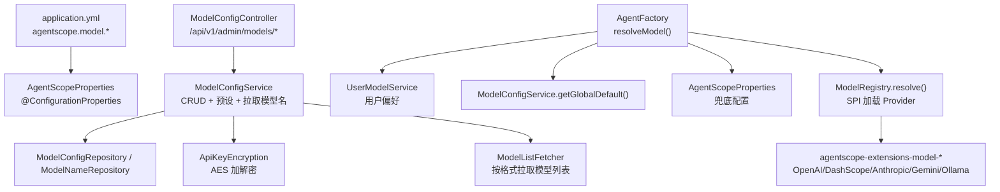
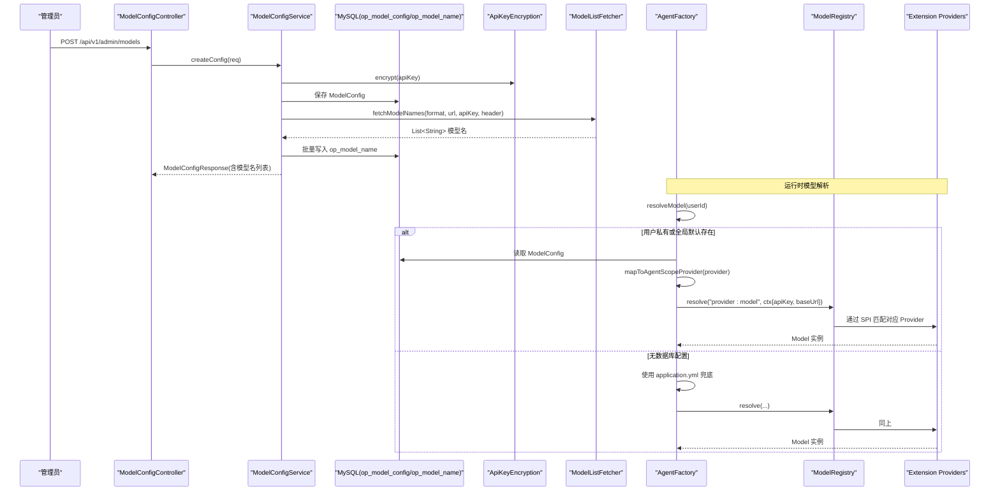
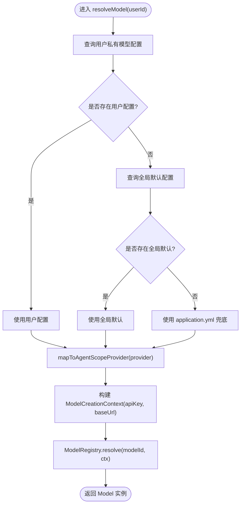
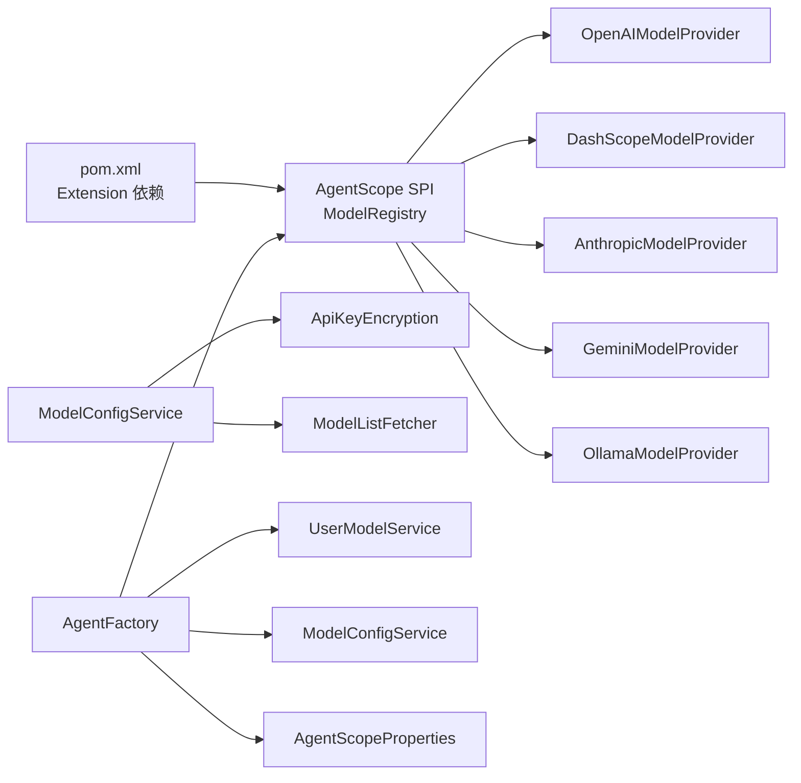

# 多Provider LLM支持与动态模型选择

<cite>
**本文引用的文件**   
- [AgentScopeProperties.java](file://src/main/java/com/tutorial/offerpilot/config/AgentScopeProperties.java)
- [ModelConfig.java](file://src/main/java/com/tutorial/offerpilot/entity/ModelConfig.java)
- [ModelConfigService.java](file://src/main/java/com/tutorial/offerpilot/service/ModelConfigService.java)
- [ModelConfigController.java](file://src/main/java/com/tutorial/offerpilot/controller/ModelConfigController.java)
- [AgentFactory.java](file://src/main/java/com/tutorial/offerpilot/agent/AgentFactory.java)
- [ProviderPreset.java](file://src/main/java/com/tutorial/offerpilot/enums/ProviderPreset.java)
- [pom.xml](file://pom.xml)
- [application.yml](file://src/main/resources/application.yml)
</cite>

## 目录
1. [简介](#简介)
2. [项目结构](#项目结构)
3. [核心组件](#核心组件)
4. [架构总览](#架构总览)
5. [详细组件分析](#详细组件分析)
6. [依赖关系分析](#依赖关系分析)
7. [性能与可用性考量](#性能与可用性考量)
8. [故障排查指南](#故障排查指南)
9. [结论](#结论)

## 简介
本章节聚焦于 OfferPilot 在多 Provider LLM 支持方面的设计与实现，包括：
- 多厂商 LLM 接入（DashScope、OpenAI、Anthropic、Gemini、Ollama 以及 OpenAI 兼容的 DeepSeek/SiliconFlow/VolcEngine）
- 运行时动态模型选择（用户私有 > 全局默认 > application.yml 兜底）
- AgentScope SPI 扩展加载与 ModelRegistry 解析机制
- 配置管理、密钥安全与模型列表自动拉取

该能力使平台具备“即插即用”的多模型接入能力，同时保证在任意时刻可无缝切换底层 LLM 提供商。

## 项目结构
围绕多 Provider 与动态模型选择的关键代码分布在以下包与文件中：
- 配置层：AgentScopeProperties（应用级默认配置）、application.yml（环境变量注入）
- 实体与持久化：ModelConfig（数据库中的模型配置记录）
- 服务层：ModelConfigService（CRUD、预设填充、模型列表拉取、全局默认设置）
- 控制层：ModelConfigController（管理员 API）
- 运行时选择：AgentFactory（按优先级解析并构建 Model，映射 Provider 前缀）
- 枚举与元数据：ProviderPreset（预设 Provider 清单与协议信息）
- 构建依赖：pom.xml（AgentScope 各 Provider Extension JAR）



图表来源
- [application.yml:32-40](file://src/main/resources/application.yml#L32-L40)
- [AgentScopeProperties.java:12-31](file://src/main/java/com/tutorial/offerpilot/config/AgentScopeProperties.java#L12-L31)
- [ModelConfigController.java:20-82](file://src/main/java/com/tutorial/offerpilot/controller/ModelConfigController.java#L20-L82)
- [ModelConfigService.java:27-289](file://src/main/java/com/tutorial/offerpilot/service/ModelConfigService.java#L27-L289)
- [AgentFactory.java:383-434](file://src/main/java/com/tutorial/offerpilot/agent/AgentFactory.java#L383-L434)
- [pom.xml:130-165](file://pom.xml#L130-L165)

章节来源
- [application.yml:32-40](file://src/main/resources/application.yml#L32-L40)
- [AgentScopeProperties.java:12-31](file://src/main/java/com/tutorial/offerpilot/config/AgentScopeProperties.java#L12-L31)
- [ModelConfigController.java:20-82](file://src/main/java/com/tutorial/offerpilot/controller/ModelConfigController.java#L20-L82)
- [ModelConfigService.java:27-289](file://src/main/java/com/tutorial/offerpilot/service/ModelConfigService.java#L27-L289)
- [AgentFactory.java:383-434](file://src/main/java/com/tutorial/offerpilot/agent/AgentFactory.java#L383-L434)
- [pom.xml:130-165](file://pom.xml#L130-L165)

## 核心组件
- 配置类 AgentScopeProperties：提供 agentscope.model.* 等默认值，包含 provider、apiKey、baseUrl、modelName、temperature、maxTokens 等字段；同时提供 embedding/transcription/rerank/studio 独立子配置，便于解耦不同服务的 Key 与端点。
- 实体 ModelConfig：持久化存储每个 Provider 的接入参数（provider、baseUrl、apiKey、apiFormat、authHeaderType、modelListUrl、defaultModelName、isEnabled、isGlobalDefault、isPrivate）。
- 服务 ModelConfigService：负责模型配置的增删改查、预设填充、模型列表拉取、全局默认设置、删除保护（有用户引用时拒绝删除）。
- 控制器 ModelConfigController：暴露管理员接口，用于维护模型池与全局默认。
- 工厂 AgentFactory：运行时按优先级解析模型（用户私有 > 全局默认 > application.yml），将业务侧 providerKey 映射为 AgentScope SPI providerId，并通过 ModelRegistry 创建 Model 实例。
- 枚举 ProviderPreset：定义 8 个主流 Provider 的元信息（名称、默认 Base URL、模型列表 URL、API 格式、认证头类型、Key 模板）。
- 构建依赖 pom.xml：引入 agentscope-core、harness 及多个 extension（openai/dashscope/anthropic/gemini/ollama），确保 SPI 可被加载。

章节来源
- [AgentScopeProperties.java:12-31](file://src/main/java/com/tutorial/offerpilot/config/AgentScopeProperties.java#L12-L31)
- [ModelConfig.java:14-64](file://src/main/java/com/tutorial/offerpilot/entity/ModelConfig.java#L14-L64)
- [ModelConfigService.java:27-289](file://src/main/java/com/tutorial/offerpilot/service/ModelConfigService.java#L27-L289)
- [ModelConfigController.java:20-82](file://src/main/java/com/tutorial/offerpilot/controller/ModelConfigController.java#L20-L82)
- [AgentFactory.java:383-434](file://src/main/java/com/tutorial/offerpilot/agent/AgentFactory.java#L383-L434)
- [ProviderPreset.java:13-101](file://src/main/java/com/tutorial/offerpilot/enums/ProviderPreset.java#L13-L101)
- [pom.xml:130-165](file://pom.xml#L130-L165)

## 架构总览
下图展示了从管理员配置到运行时模型选择的完整链路，以及 AgentScope SPI 如何根据 modelId 匹配对应 Provider 实现。



图表来源
- [ModelConfigController.java:36-41](file://src/main/java/com/tutorial/offerpilot/controller/ModelConfigController.java#L36-L41)
- [ModelConfigService.java:49-80](file://src/main/java/com/tutorial/offerpilot/service/ModelConfigService.java#L49-L80)
- [AgentFactory.java:383-434](file://src/main/java/com/tutorial/offerpilot/agent/AgentFactory.java#L383-L434)
- [pom.xml:130-165](file://pom.xml#L130-L165)

## 详细组件分析

### 组件一：配置与默认值（AgentScopeProperties + application.yml）
- AgentScopeProperties 以 @ConfigurationProperties(prefix="agentscope") 绑定配置，提供 model/embedding/transcription/rerank/studio 等子配置项。
- application.yml 中 agentscope.model.provider/baseUrl/apiKey/modelName 作为启动兜底；同时通过环境变量注入敏感信息（如 ${DASHSCOPE_API_KEY}）。
- Embedding/Transcription/Rerank 独立配置允许在不同 Provider 下灵活指定各自的 Key 与端点，避免共用 Key 带来的耦合。

章节来源
- [AgentScopeProperties.java:12-31](file://src/main/java/com/tutorial/offerpilot/config/AgentScopeProperties.java#L12-L31)
- [AgentScopeProperties.java:56-84](file://src/main/java/com/tutorial/offerpilot/config/AgentScopeProperties.java#L56-L84)
- [AgentScopeProperties.java:107-131](file://src/main/java/com/tutorial/offerpilot/config/AgentScopeProperties.java#L107-L131)
- [application.yml:32-40](file://src/main/resources/application.yml#L32-L40)
- [application.yml:56-92](file://src/main/resources/application.yml#L56-L92)

### 组件二：模型配置管理（ModelConfig + ModelConfigService + ModelConfigController）
- ModelConfig 实体包含 provider、baseUrl、apiKey、apiFormat、authHeaderType、modelListUrl、defaultModelName、isEnabled、isGlobalDefault、isPrivate 等字段，并提供索引优化查询。
- ModelConfigService 提供：
  - 新增配置时基于 ProviderPreset 自动填充 baseUrl、apiFormat、authHeaderType、modelListUrl，并对 apiKey 进行 AES 加密。
  - 更新配置时按需刷新模型列表。
  - 删除配置前检查是否有用户引用，防止破坏性变更。
  - 设置全局默认时校验 modelName 是否在可用列表中，并清除旧的全局默认。
  - 拉取模型列表：调用 ModelListFetcher，按 apiFormat/authHeaderType 适配不同 Provider 的 /models 接口，落库 op_model_name。
- ModelConfigController 暴露管理员 API，受 Spring Security 角色限制（ADMIN）。

```mermaid
classDiagram
class ModelConfig {
+String provider
+String baseUrl
+String apiKey
+String apiFormat
+String authHeaderType
+String modelListUrl
+String defaultModelName
+Boolean isEnabled
+Boolean isGlobalDefault
+Boolean isPrivate
}
class ModelConfigService {
+listConfigs()
+createConfig(req)
+updateConfig(id, req)
+deleteConfig(id)
+refreshModels(id)
+setGlobalDefault(id, modelName)
+getGlobalDefault()
+listProviderPresets()
}
class ModelConfigController {
+GET /api/v1/admin/models
+POST /api/v1/admin/models
+PUT /api/v1/admin/models/{id}
+DELETE /api/v1/admin/models/{id}
+POST /api/v1/admin/models/{id}/refresh-models
+PUT /api/v1/admin/models/{id}/set-global-default
+GET /api/v1/admin/models/provider-presets
}
class ApiKeyEncryption {
+encrypt(key)
+decrypt(key)
+mask(key)
}
class ModelListFetcher {
+fetchModelNames(format, url, apiKey, header)
}
ModelConfigService --> ModelConfig : "读写"
ModelConfigService --> ApiKeyEncryption : "加解密"
ModelConfigService --> ModelListFetcher : "拉取模型名"
ModelConfigController --> ModelConfigService : "调用"
```

图表来源
- [ModelConfig.java:14-64](file://src/main/java/com/tutorial/offerpilot/entity/ModelConfig.java#L14-L64)
- [ModelConfigService.java:27-289](file://src/main/java/com/tutorial/offerpilot/service/ModelConfigService.java#L27-L289)
- [ModelConfigController.java:20-82](file://src/main/java/com/tutorial/offerpilot/controller/ModelConfigController.java#L20-L82)

章节来源
- [ModelConfig.java:14-64](file://src/main/java/com/tutorial/offerpilot/entity/ModelConfig.java#L14-L64)
- [ModelConfigService.java:49-80](file://src/main/java/com/tutorial/offerpilot/service/ModelConfigService.java#L49-L80)
- [ModelConfigService.java:85-130](file://src/main/java/com/tutorial/offerpilot/service/ModelConfigService.java#L85-L130)
- [ModelConfigService.java:135-150](file://src/main/java/com/tutorial/offerpilot/service/ModelConfigService.java#L135-L150)
- [ModelConfigService.java:166-195](file://src/main/java/com/tutorial/offerpilot/service/ModelConfigService.java#L166-L195)
- [ModelConfigController.java:20-82](file://src/main/java/com/tutorial/offerpilot/controller/ModelConfigController.java#L20-L82)

### 组件三：运行时模型选择（AgentFactory.resolveModel）
- 优先级策略：
  1) 用户私有模型（UserModelService.getUserModelConfig）
  2) 全局默认（ModelConfigService.getGlobalDefault）
  3) application.yml 兜底（AgentScopeProperties.model.*）
- Provider 映射：
  - deepseek/siliconflow/volcengine 无独立 SPI Provider，统一映射为 openai，并通过 ModelCreationContext.baseUrl 覆盖各自 Base URL。
- Model 构建：
  - 组装 modelId = provider:modelName
  - 构造 ModelCreationContext（apiKey、baseUrl）
  - 调用 ModelRegistry.resolve(modelId, context) 由 SPI 匹配具体 Provider 实现



图表来源
- [AgentFactory.java:383-434](file://src/main/java/com/tutorial/offerpilot/agent/AgentFactory.java#L383-L434)

章节来源
- [AgentFactory.java:383-434](file://src/main/java/com/tutorial/offerpilot/agent/AgentFactory.java#L383-L434)

### 组件四：Provider 预设与 SPI 扩展（ProviderPreset + pom.xml）
- ProviderPreset 定义了 8 家主流 Provider 的元信息，包括 providerKey、displayName、默认 Base URL、模型列表 URL、API 格式、认证头类型、Key 模板。
- pom.xml 引入了 agentscope-core、harness 以及多个 extension（openai/dashscope/anthropic/gemini/ollama），确保 ModelRegistry 可通过 SPI 发现并加载对应 Provider。
- 对于 OpenAI 兼容但非 openai 前缀的 Provider（deepseek/siliconflow/volcengine），在 AgentFactory 中将 providerKey 映射为 openai，并通过 baseUrl 指向各自端点。

章节来源
- [ProviderPreset.java:13-101](file://src/main/java/com/tutorial/offerpilot/enums/ProviderPreset.java#L13-L101)
- [pom.xml:130-165](file://pom.xml#L130-L165)
- [AgentFactory.java:429-434](file://src/main/java/com/tutorial/offerpilot/agent/AgentFactory.java#L429-L434)

## 依赖关系分析
- 外部依赖
  - AgentScope SPI 扩展：agentscope-extensions-model-openai、dashscope、anthropic、gemini、ollama
  - 数据库：MySQL（op_model_config、op_model_name）
  - 缓存/状态：Redis（会话状态、中间件状态）
  - 向量检索：Milvus（RAG 链路，与多 Provider 解耦）
- 内部依赖
  - ModelConfigService 依赖 ApiKeyEncryption（AES 加解密）与 ModelListFetcher（按格式拉取模型列表）
  - AgentFactory 依赖 UserModelService（用户偏好）、ModelConfigService（全局默认）、AgentScopeProperties（兜底配置）
  - ModelRegistry 通过 SPI 加载 Extension Provider，最终由对应 Provider 实现完成 HTTP 调用



图表来源
- [pom.xml:130-165](file://pom.xml#L130-L165)
- [ModelConfigService.java:27-289](file://src/main/java/com/tutorial/offerpilot/service/ModelConfigService.java#L27-L289)
- [AgentFactory.java:383-434](file://src/main/java/com/tutorial/offerpilot/agent/AgentFactory.java#L383-L434)

章节来源
- [pom.xml:130-165](file://pom.xml#L130-L165)
- [ModelConfigService.java:27-289](file://src/main/java/com/tutorial/offerpilot/service/ModelConfigService.java#L27-L289)
- [AgentFactory.java:383-434](file://src/main/java/com/tutorial/offerpilot/agent/AgentFactory.java#L383-L434)

## 性能与可用性考量
- 模型列表拉取
  - 建议在新增/更新配置后异步拉取模型列表，避免阻塞请求；当前实现同步拉取，可在高并发场景考虑引入队列与重试。
- 模型解析失败回退
  - AgentFactory.resolveModel 在 ModelRegistry.resolve 异常时会回退至 application.yml 配置，提升可用性；建议增加更详细的错误码与告警。
- 密钥安全
  - 所有 API Key 均经 AES 加密存储，响应中仅展示脱敏版本；生产环境需严格保管 ENCRYPTION_SECRET_KEY。
- 超时与重试
  - 对 Rerank/Embedding/Transcription 等外部服务，应结合连接/读取超时与重试策略，避免级联失败。
- 缓存与限流
  - 结合 Redis 对模型列表、鉴权结果等进行缓存；对高频接口实施限流，防止滥用。

[本节为通用指导，不直接分析具体文件]

## 故障排查指南
- 无法解析 modelId（例如 Cannot resolve model）
  - 检查是否已引入对应 Extension JAR（pom.xml）
  - 确认 providerKey 映射是否正确（deepseek/siliconflow/volcengine → openai）
  - 核对 ModelCreationContext 中的 baseUrl 与 apiKey 是否与目标 Provider 一致
- 模型列表为空或拉取失败
  - 检查 ModelListFetcher 调用的 /models 端点是否可达
  - 验证 apiFormat 与 authHeaderType 是否与 Provider 要求一致
  - 查看日志中拉取失败的异常堆栈
- 全局默认未生效
  - 确认 setGlobalDefault 成功且 isEnabled=true
  - 检查用户是否设置了私有模型（会优先使用用户配置）
- 鉴权失败
  - 确认 apiKey 是否被正确解密
  - 检查 Header 类型（Bearer/x-api-key/x-goog-api-key/none）是否符合 Provider 要求

章节来源
- [AgentFactory.java:383-434](file://src/main/java/com/tutorial/offerpilot/agent/AgentFactory.java#L383-L434)
- [ModelConfigService.java:235-263](file://src/main/java/com/tutorial/offerpilot/service/ModelConfigService.java#L235-L263)
- [ProviderPreset.java:13-101](file://src/main/java/com/tutorial/offerpilot/enums/ProviderPreset.java#L13-L101)

## 结论
OfferPilot 通过 ProviderPreset 预设、AgentFactory 动态解析与 ModelRegistry SPI 扩展机制，实现了多 Provider LLM 的统一接入与运行时动态选择。配合 ModelConfigService 的配置管理与模型列表自动拉取，系统具备良好的可扩展性与运维友好性。在生产环境中，建议进一步完善异步拉取、错误告警与监控指标，以提升整体稳定性与可观测性。