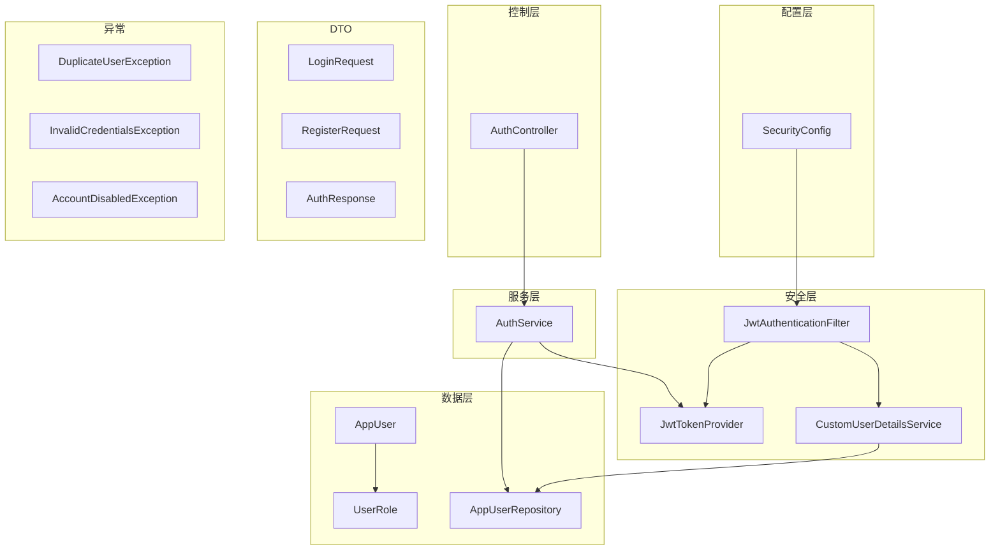
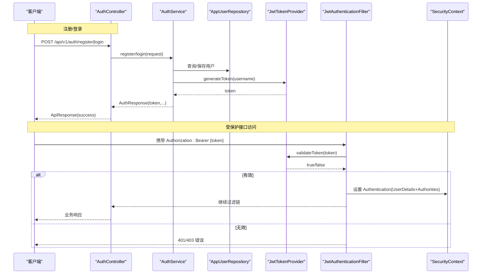
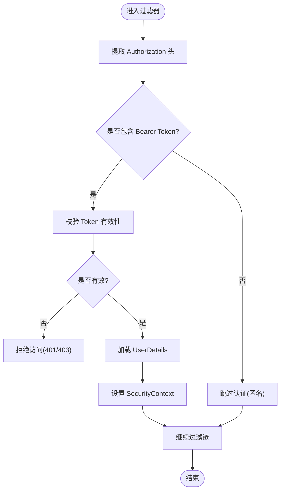
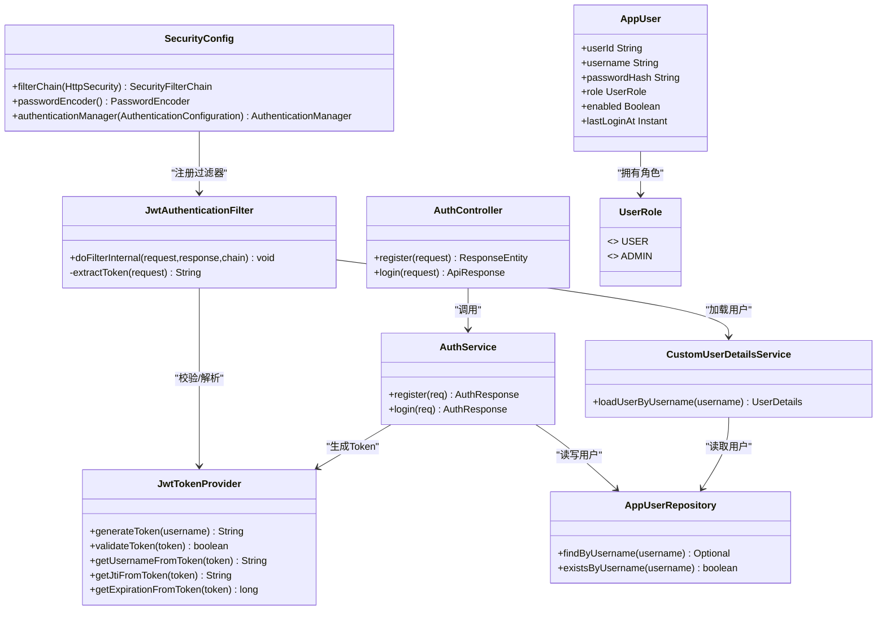
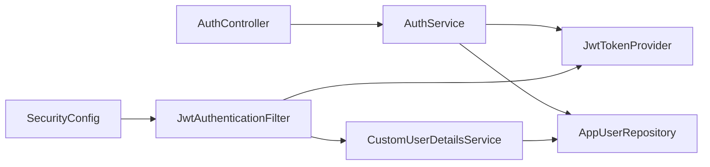

# 安全认证与权限控制

<cite>
**本文引用的文件**   
- [SecurityConfig.java](file://src/main/java/com/tutorial/offerpilot/config/SecurityConfig.java)
- [JwtAuthenticationFilter.java](file://src/main/java/com/tutorial/offerpilot/security/JwtAuthenticationFilter.java)
- [JwtTokenProvider.java](file://src/main/java/com/tutorial/offerpilot/security/JwtTokenProvider.java)
- [CustomUserDetailsService.java](file://src/main/java/com/tutorial/offerpilot/security/CustomUserDetailsService.java)
- [AuthController.java](file://src/main/java/com/tutorial/offerpilot/controller/AuthController.java)
- [AuthService.java](file://src/main/java/com/tutorial/offerpilot/service/AuthService.java)
- [AppUser.java](file://src/main/java/com/tutorial/offerpilot/entity/AppUser.java)
- [UserRole.java](file://src/main/java/com/tutorial/offerpilot/enums/UserRole.java)
- [AppUserRepository.java](file://src/main/java/com/tutorial/offerpilot/repository/AppUserRepository.java)
- [LoginRequest.java](file://src/main/java/com/tutorial/offerpilot/dto/auth/LoginRequest.java)
- [RegisterRequest.java](file://src/main/java/com/tutorial/offerpilot/dto/auth/RegisterRequest.java)
- [AuthResponse.java](file://src/main/java/com/tutorial/offerpilot/dto/auth/AuthResponse.java)
- [DuplicateUserException.java](file://src/main/java/com/tutorial/offerpilot/exception/DuplicateUserException.java)
- [InvalidCredentialsException.java](file://src/main/java/com/tutorial/offerpilot/exception/InvalidCredentialsException.java)
- [AccountDisabledException.java](file://src/main/java/com/tutorial/offerpilot/exception/AccountDisabledException.java)
</cite>

## 目录
1. [简介](#简介)
2. [项目结构](#项目结构)
3. [核心组件](#核心组件)
4. [架构总览](#架构总览)
5. [详细组件分析](#详细组件分析)
6. [依赖关系分析](#依赖关系分析)
7. [性能与安全考量](#性能与安全考量)
8. [故障排查指南](#故障排查指南)
9. [结论](#结论)

## 简介
本章节聚焦于 OfferPilot 的安全认证与权限控制体系，涵盖无状态 JWT 认证、Spring Security 过滤器链、基于角色的访问控制（RBAC）、用户注册登录流程、异常处理与错误响应。整体采用 Spring Security + JWT 的无状态方案，结合 BCrypt 密码加密、角色枚举与路径级授权策略，确保接口访问的安全性、可维护性与可扩展性。

## 项目结构
围绕安全与鉴权的核心代码分布在以下包：
- config: 安全配置与 Web 配置
- security: JWT 提供器、过滤器、自定义用户详情服务
- controller: 认证入口控制器
- service: 认证业务逻辑
- entity/enums/repository: 用户实体、角色枚举与数据访问
- dto/auth: 认证请求与响应模型
- exception: 认证相关异常类型

图表来源
- [SecurityConfig.java:39-84](file://src/main/java/com/tutorial/offerpilot/config/SecurityConfig.java#L39-L84)
- [JwtAuthenticationFilter.java:30-66](file://src/main/java/com/tutorial/offerpilot/security/JwtAuthenticationFilter.java#L30-L66)
- [JwtTokenProvider.java:30-82](file://src/main/java/com/tutorial/offerpilot/security/JwtTokenProvider.java#L30-L82)
- [CustomUserDetailsService.java:24-36](file://src/main/java/com/tutorial/offerpilot/security/CustomUserDetailsService.java#L24-L36)
- [AuthController.java:26-37](file://src/main/java/com/tutorial/offerpilot/controller/AuthController.java#L26-L37)
- [AuthService.java:34-72](file://src/main/java/com/tutorial/offerpilot/service/AuthService.java#L34-L72)
- [AppUser.java:14-54](file://src/main/java/com/tutorial/offerpilot/entity/AppUser.java#L14-L54)
- [UserRole.java:6-9](file://src/main/java/com/tutorial/offerpilot/enums/UserRole.java#L6-L9)
- [AppUserRepository.java:11-21](file://src/main/java/com/tutorial/offerpilot/repository/AppUserRepository.java#L11-L21)
- [LoginRequest.java:9-17](file://src/main/java/com/tutorial/offerpilot/dto/auth/LoginRequest.java#L9-L17)
- [RegisterRequest.java:11-24](file://src/main/java/com/tutorial/offerpilot/dto/auth/RegisterRequest.java#L11-L24)
- [AuthResponse.java:14-20](file://src/main/java/com/tutorial/offerpilot/dto/auth/AuthResponse.java#L14-L20)
- [DuplicateUserException.java:6-11](file://src/main/java/com/tutorial/offerpilot/exception/DuplicateUserException.java#L6-L11)
- [InvalidCredentialsException.java:6-11](file://src/main/java/com/tutorial/offerpilot/exception/InvalidCredentialsException.java#L6-L11)
- [AccountDisabledException.java:6-11](file://src/main/java/com/tutorial/offerpilot/exception/AccountDisabledException.java#L6-L11)

章节来源
- [SecurityConfig.java:39-84](file://src/main/java/com/tutorial/offerpilot/config/SecurityConfig.java#L39-L84)
- [JwtAuthenticationFilter.java:30-66](file://src/main/java/com/tutorial/offerpilot/security/JwtAuthenticationFilter.java#L30-L66)
- [JwtTokenProvider.java:30-82](file://src/main/java/com/tutorial/offerpilot/security/JwtTokenProvider.java#L30-L82)
- [CustomUserDetailsService.java:24-36](file://src/main/java/com/tutorial/offerpilot/security/CustomUserDetailsService.java#L24-L36)
- [AuthController.java:26-37](file://src/main/java/com/tutorial/offerpilot/controller/AuthController.java#L26-L37)
- [AuthService.java:34-72](file://src/main/java/com/tutorial/offerpilot/service/AuthService.java#L34-L72)
- [AppUser.java:14-54](file://src/main/java/com/tutorial/offerpilot/entity/AppUser.java#L14-L54)
- [UserRole.java:6-9](file://src/main/java/com/tutorial/offerpilot/enums/UserRole.java#L6-L9)
- [AppUserRepository.java:11-21](file://src/main/java/com/tutorial/offerpilot/repository/AppUserRepository.java#L11-L21)
- [LoginRequest.java:9-17](file://src/main/java/com/tutorial/offerpilot/dto/auth/LoginRequest.java#L9-L17)
- [RegisterRequest.java:11-24](file://src/main/java/com/tutorial/offerpilot/dto/auth/RegisterRequest.java#L11-L24)
- [AuthResponse.java:14-20](file://src/main/java/com/tutorial/offerpilot/dto/auth/AuthResponse.java#L14-L20)
- [DuplicateUserException.java:6-11](file://src/main/java/com/tutorial/offerpilot/exception/DuplicateUserException.java#L6-L11)
- [InvalidCredentialsException.java:6-11](file://src/main/java/com/tutorial/offerpilot/exception/InvalidCredentialsException.java#L6-L11)
- [AccountDisabledException.java:6-11](file://src/main/java/com/tutorial/offerpilot/exception/AccountDisabledException.java#L6-L11)

## 核心组件
- 安全配置（SecurityConfig）
  - 禁用 CSRF，启用无状态会话
  - 定义全局异常处理器：未认证返回 401，拒绝访问返回 403
  - 路径授权：认证接口放行、管理接口要求 ADMIN 角色、知识库接口需已认证、其余默认需认证
  - 注入 JWT 过滤器到 UsernamePasswordAuthenticationFilter 之前
- JWT 过滤器（JwtAuthenticationFilter）
  - 从 Authorization 头提取 Bearer Token
  - 校验 Token 有效性并解析用户名
  - 通过 CustomUserDetailsService 加载 UserDetails 并写入 SecurityContext
  - 兼容 SSE 异步场景，避免重复响应导致的异常
- JWT 令牌提供器（JwtTokenProvider）
  - 使用 HMAC-SHA 密钥生成与验证 Token
  - 支持从 Token 获取 subject、jti、过期时间等载荷信息
- 自定义用户详情服务（CustomUserDetailsService）
  - 根据用户名查询 AppUser，构建包含角色权限的 UserDetails
- 认证控制器与服务（AuthController / AuthService）
  - 注册：检查用户名唯一性、BCrypt 加密存储、返回 Token
  - 登录：校验密码、检查账号启用状态、记录最后登录时间、返回 Token
- 用户实体与角色（AppUser / UserRole）
  - 用户标识、用户名、密码哈希、邮箱、角色、启用状态、最后登录时间等字段
- 数据访问（AppUserRepository）
  - 按用户名/用户ID查询、存在性判断、统计引用某模型配置的用户数
- DTO 与异常（LoginRequest / RegisterRequest / AuthResponse / DuplicateUserException / InvalidCredentialsException / AccountDisabledException）
  - 统一输入校验与错误码语义

章节来源
- [SecurityConfig.java:39-84](file://src/main/java/com/tutorial/offerpilot/config/SecurityConfig.java#L39-L84)
- [JwtAuthenticationFilter.java:30-66](file://src/main/java/com/tutorial/offerpilot/security/JwtAuthenticationFilter.java#L30-L66)
- [JwtTokenProvider.java:30-82](file://src/main/java/com/tutorial/offerpilot/security/JwtTokenProvider.java#L30-L82)
- [CustomUserDetailsService.java:24-36](file://src/main/java/com/tutorial/offerpilot/security/CustomUserDetailsService.java#L24-L36)
- [AuthController.java:26-37](file://src/main/java/com/tutorial/offerpilot/controller/AuthController.java#L26-L37)
- [AuthService.java:34-72](file://src/main/java/com/tutorial/offerpilot/service/AuthService.java#L34-L72)
- [AppUser.java:14-54](file://src/main/java/com/tutorial/offerpilot/entity/AppUser.java#L14-L54)
- [UserRole.java:6-9](file://src/main/java/com/tutorial/offerpilot/enums/UserRole.java#L6-L9)
- [AppUserRepository.java:11-21](file://src/main/java/com/tutorial/offerpilot/repository/AppUserRepository.java#L11-L21)
- [LoginRequest.java:9-17](file://src/main/java/com/tutorial/offerpilot/dto/auth/LoginRequest.java#L9-L17)
- [RegisterRequest.java:11-24](file://src/main/java/com/tutorial/offerpilot/dto/auth/RegisterRequest.java#L11-L24)
- [AuthResponse.java:14-20](file://src/main/java/com/tutorial/offerpilot/dto/auth/AuthResponse.java#L14-L20)
- [DuplicateUserException.java:6-11](file://src/main/java/com/tutorial/offerpilot/exception/DuplicateUserException.java#L6-L11)
- [InvalidCredentialsException.java:6-11](file://src/main/java/com/tutorial/offerpilot/exception/InvalidCredentialsException.java#L6-L11)
- [AccountDisabledException.java:6-11](file://src/main/java/com/tutorial/offerpilot/exception/AccountDisabledException.java#L6-L11)

## 架构总览
下图展示了认证与鉴权的端到端流程：客户端发起注册或登录请求，控制器调用服务完成业务校验与持久化，服务生成 JWT；后续受保护请求携带 Token，由过滤器校验并建立安全上下文，最终由 Spring Security 进行路径级授权。

图表来源
- [AuthController.java:26-37](file://src/main/java/com/tutorial/offerpilot/controller/AuthController.java#L26-L37)
- [AuthService.java:34-72](file://src/main/java/com/tutorial/offerpilot/service/AuthService.java#L34-L72)
- [AppUserRepository.java:11-21](file://src/main/java/com/tutorial/offerpilot/repository/AppUserRepository.java#L11-L21)
- [JwtTokenProvider.java:30-82](file://src/main/java/com/tutorial/offerpilot/security/JwtTokenProvider.java#L30-L82)
- [JwtAuthenticationFilter.java:30-66](file://src/main/java/com/tutorial/offerpilot/security/JwtAuthenticationFilter.java#L30-L66)
- [SecurityConfig.java:39-84](file://src/main/java/com/tutorial/offerpilot/config/SecurityConfig.java#L39-L84)

## 详细组件分析

### 认证与授权流程
- 注册流程
  - 校验用户名唯一性，若存在则抛出重复用户异常
  - 使用 BCrypt 对密码进行哈希后持久化
  - 生成并返回 JWT
- 登录流程
  - 按用户名查询用户，校验密码与账号启用状态
  - 更新最后登录时间
  - 生成并返回 JWT
- 鉴权流程
  - 过滤器从请求头提取 Bearer Token
  - 校验 Token 有效性，解析用户名并加载用户详情
  - 将 Authentication 写入 SecurityContext
  - Spring Security 依据路径规则进行授权（ADMIN 角色、已认证等）

图表来源
- [JwtAuthenticationFilter.java:30-66](file://src/main/java/com/tutorial/offerpilot/security/JwtAuthenticationFilter.java#L30-L66)
- [SecurityConfig.java:39-84](file://src/main/java/com/tutorial/offerpilot/config/SecurityConfig.java#L39-L84)

章节来源
- [AuthController.java:26-37](file://src/main/java/com/tutorial/offerpilot/controller/AuthController.java#L26-L37)
- [AuthService.java:34-72](file://src/main/java/com/tutorial/offerpilot/service/AuthService.java#L34-L72)
- [JwtAuthenticationFilter.java:30-66](file://src/main/java/com/tutorial/offerpilot/security/JwtAuthenticationFilter.java#L30-L66)
- [SecurityConfig.java:39-84](file://src/main/java/com/tutorial/offerpilot/config/SecurityConfig.java#L39-L84)

### 类与关系图

图表来源
- [SecurityConfig.java:39-84](file://src/main/java/com/tutorial/offerpilot/config/SecurityConfig.java#L39-L84)
- [JwtAuthenticationFilter.java:30-66](file://src/main/java/com/tutorial/offerpilot/security/JwtAuthenticationFilter.java#L30-L66)
- [JwtTokenProvider.java:30-82](file://src/main/java/com/tutorial/offerpilot/security/JwtTokenProvider.java#L30-L82)
- [CustomUserDetailsService.java:24-36](file://src/main/java/com/tutorial/offerpilot/security/CustomUserDetailsService.java#L24-L36)
- [AuthController.java:26-37](file://src/main/java/com/tutorial/offerpilot/controller/AuthController.java#L26-L37)
- [AuthService.java:34-72](file://src/main/java/com/tutorial/offerpilot/service/AuthService.java#L34-L72)
- [AppUser.java:14-54](file://src/main/java/com/tutorial/offerpilot/entity/AppUser.java#L14-L54)
- [UserRole.java:6-9](file://src/main/java/com/tutorial/offerpilot/enums/UserRole.java#L6-L9)
- [AppUserRepository.java:11-21](file://src/main/java/com/tutorial/offerpilot/repository/AppUserRepository.java#L11-L21)

章节来源
- [SecurityConfig.java:39-84](file://src/main/java/com/tutorial/offerpilot/config/SecurityConfig.java#L39-L84)
- [JwtAuthenticationFilter.java:30-66](file://src/main/java/com/tutorial/offerpilot/security/JwtAuthenticationFilter.java#L30-L66)
- [JwtTokenProvider.java:30-82](file://src/main/java/com/tutorial/offerpilot/security/JwtTokenProvider.java#L30-L82)
- [CustomUserDetailsService.java:24-36](file://src/main/java/com/tutorial/offerpilot/security/CustomUserDetailsService.java#L24-L36)
- [AuthController.java:26-37](file://src/main/java/com/tutorial/offerpilot/controller/AuthController.java#L26-L37)
- [AuthService.java:34-72](file://src/main/java/com/tutorial/offerpilot/service/AuthService.java#L34-L72)
- [AppUser.java:14-54](file://src/main/java/com/tutorial/offerpilot/entity/AppUser.java#L14-L54)
- [UserRole.java:6-9](file://src/main/java/com/tutorial/offerpilot/enums/UserRole.java#L6-L9)
- [AppUserRepository.java:11-21](file://src/main/java/com/tutorial/offerpilot/repository/AppUserRepository.java#L11-L21)

## 依赖关系分析
- 松耦合设计
  - 控制器仅依赖服务接口，服务依赖仓库与令牌提供器，过滤器依赖令牌提供器与用户详情服务
- 关键依赖链
  - AuthController → AuthService → AppUserRepository / JwtTokenProvider
  - JwtAuthenticationFilter → JwtTokenProvider / CustomUserDetailsService → AppUserRepository
  - SecurityConfig 注入过滤器并配置路径授权
- 潜在风险点
  - 令牌密钥与过期时间应通过环境变量注入，避免硬编码
  - 角色扩展需同步更新路径授权与前端权限展示

图表来源
- [AuthController.java:26-37](file://src/main/java/com/tutorial/offerpilot/controller/AuthController.java#L26-L37)
- [AuthService.java:34-72](file://src/main/java/com/tutorial/offerpilot/service/AuthService.java#L34-L72)
- [AppUserRepository.java:11-21](file://src/main/java/com/tutorial/offerpilot/repository/AppUserRepository.java#L11-L21)
- [JwtTokenProvider.java:30-82](file://src/main/java/com/tutorial/offerpilot/security/JwtTokenProvider.java#L30-L82)
- [JwtAuthenticationFilter.java:30-66](file://src/main/java/com/tutorial/offerpilot/security/JwtAuthenticationFilter.java#L30-L66)
- [CustomUserDetailsService.java:24-36](file://src/main/java/com/tutorial/offerpilot/security/CustomUserDetailsService.java#L24-L36)
- [SecurityConfig.java:39-84](file://src/main/java/com/tutorial/offerpilot/config/SecurityConfig.java#L39-L84)

章节来源
- [SecurityConfig.java:39-84](file://src/main/java/com/tutorial/offerpilot/config/SecurityConfig.java#L39-L84)
- [JwtAuthenticationFilter.java:30-66](file://src/main/java/com/tutorial/offerpilot/security/JwtAuthenticationFilter.java#L30-L66)
- [JwtTokenProvider.java:30-82](file://src/main/java/com/tutorial/offerpilot/security/JwtTokenProvider.java#L30-L82)
- [CustomUserDetailsService.java:24-36](file://src/main/java/com/tutorial/offerpilot/security/CustomUserDetailsService.java#L24-L36)
- [AuthController.java:26-37](file://src/main/java/com/tutorial/offerpilot/controller/AuthController.java#L26-L37)
- [AuthService.java:34-72](file://src/main/java/com/tutorial/offerpilot/service/AuthService.java#L34-L72)
- [AppUserRepository.java:11-21](file://src/main/java/com/tutorial/offerpilot/repository/AppUserRepository.java#L11-L21)

## 性能与安全考量
- 性能
  - 无状态认证避免服务端会话开销，适合水平扩展
  - 过滤器在每次请求中执行 Token 校验，建议配合缓存或短生命周期 Token 提升吞吐
- 安全
  - 密码使用 BCrypt 加盐哈希存储
  - 路径级授权最小化暴露面，管理员接口严格限制角色
  - 异常处理统一返回结构化错误，避免泄露敏感信息
  - 建议引入 Token 黑名单或刷新机制以增强安全性（当前实现未包含）

[本节为通用指导，不直接分析具体文件]

## 故障排查指南
- 常见错误码与含义
  - 401 未认证：缺少或无效 Token、Token 过期
  - 403 权限不足：未满足角色要求或账号被禁用
  - 409 用户名已存在：注册时用户名冲突
- 定位步骤
  - 确认请求头是否正确携带 Authorization: Bearer {token}
  - 检查过滤器日志输出，确认 Token 校验结果
  - 核对路径授权规则是否符合预期
  - 检查用户状态（enabled）与角色（USER/ADMIN）
- 快速修复
  - 重新登录获取新 Token
  - 修正路径授权策略或用户角色
  - 清理重复用户名或调整注册校验规则

章节来源
- [SecurityConfig.java:43-74](file://src/main/java/com/tutorial/offerpilot/config/SecurityConfig.java#L43-L74)
- [JwtAuthenticationFilter.java:30-66](file://src/main/java/com/tutorial/offerpilot/security/JwtAuthenticationFilter.java#L30-L66)
- [DuplicateUserException.java:6-11](file://src/main/java/com/tutorial/offerpilot/exception/DuplicateUserException.java#L6-L11)
- [InvalidCredentialsException.java:6-11](file://src/main/java/com/tutorial/offerpilot/exception/InvalidCredentialsException.java#L6-L11)
- [AccountDisabledException.java:6-11](file://src/main/java/com/tutorial/offerpilot/exception/AccountDisabledException.java#L6-L11)

## 结论
OfferPilot 的安全认证与权限控制采用 Spring Security + JWT 的无状态方案，结合 BCrypt 密码加密与 RBAC 路径授权，实现了清晰、可扩展且易于维护的认证鉴权体系。通过统一的异常处理与结构化错误响应，提升了系统的健壮性与可观测性。未来可在 Token 刷新、黑名单、审计日志等方面进一步增强安全性与合规性。