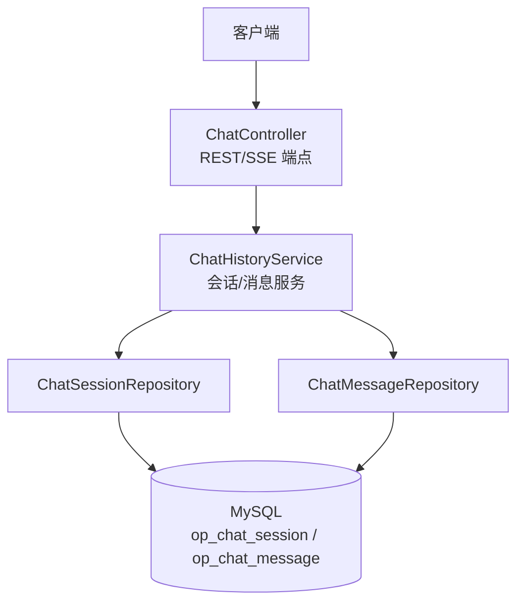
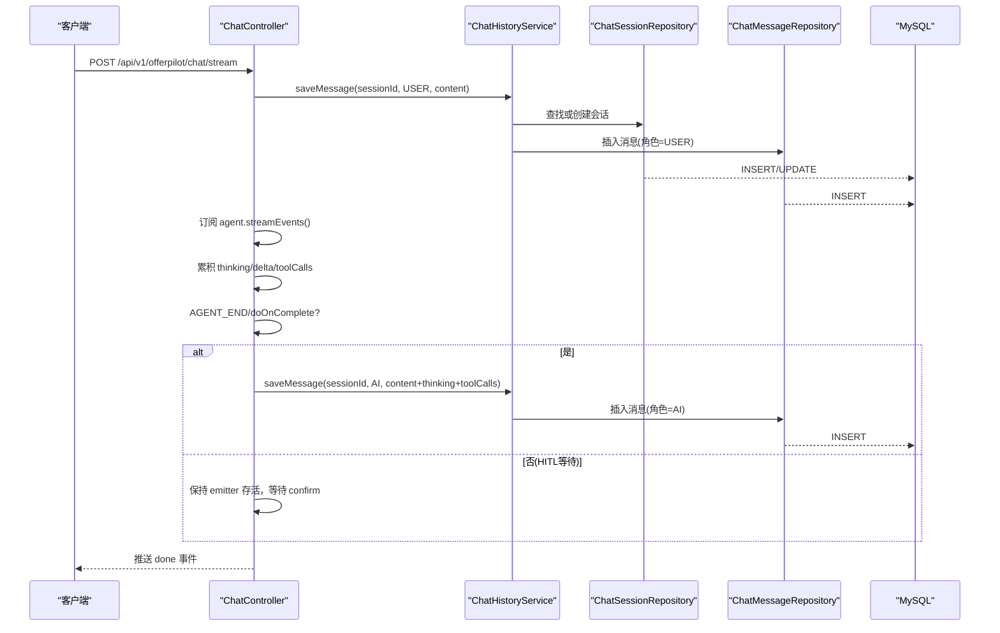
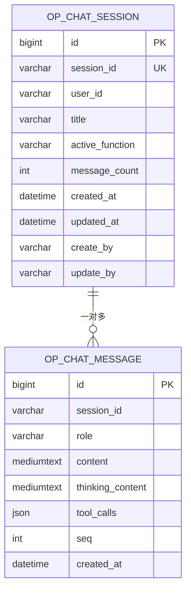
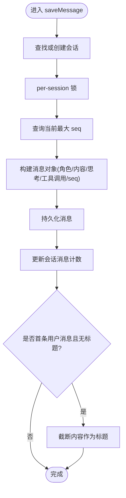
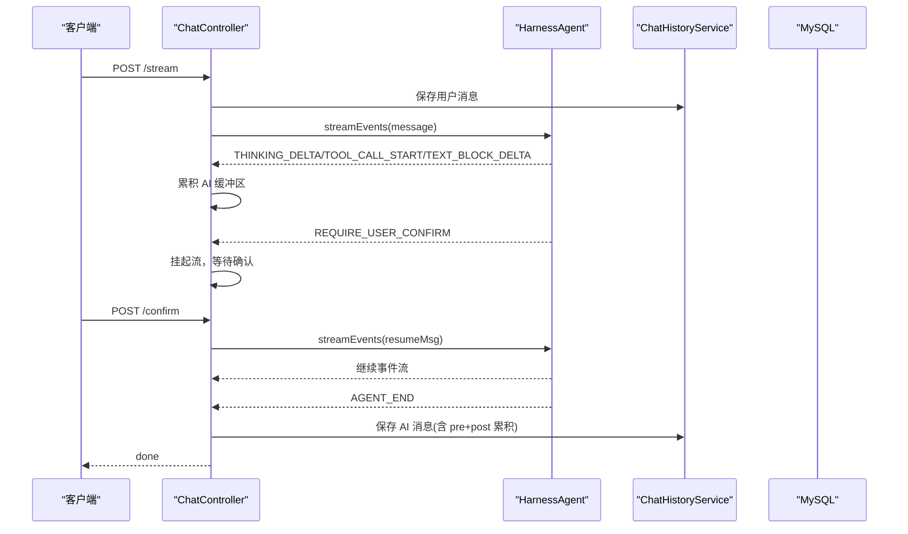
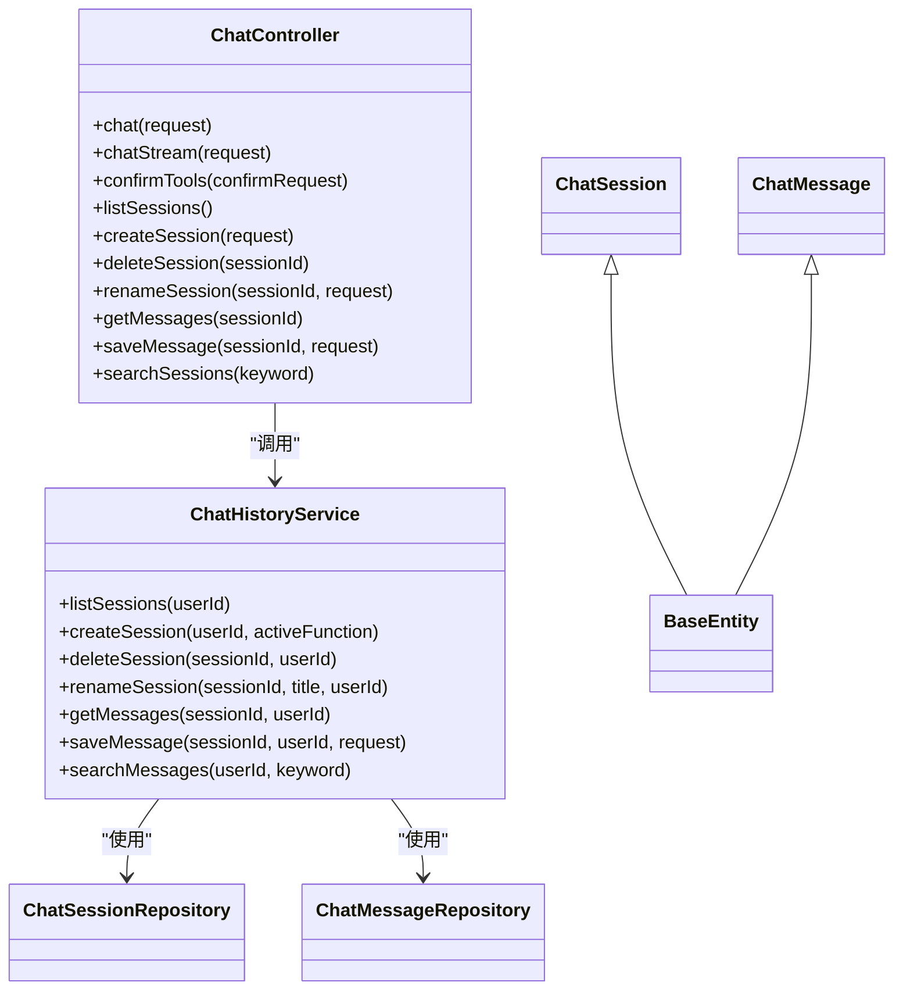

# 数据库架构现代化

<cite>
**本文引用的文件**   
- [ChatMessage.java](file://src/main/java/com/tutorial/offerpilot/entity/ChatMessage.java)
- [ChatSession.java](file://src/main/java/com/tutorial/offerpilot/entity/ChatSession.java)
- [BaseEntity.java](file://src/main/java/com/tutorial/offerpilot/common/BaseEntity.java)
- [ChatMessageRepository.java](file://src/main/java/com/tutorial/offerpilot/repository/ChatMessageRepository.java)
- [ChatSessionRepository.java](file://src/main/java/com/tutorial/offerpilot/repository/ChatSessionRepository.java)
- [ChatHistoryService.java](file://src/main/java/com/tutorial/offerpilot/service/ChatHistoryService.java)
- [ChatController.java](file://src/main/java/com/tutorial/offerpilot/controller/ChatController.java)
- [20260712-153212-对话历史持久化建表.sql](file://Documents/Sql变更/20260712-153212-对话历史持久化建表.sql)
- [AI消息后端持久化.md](file://Documents/需求分析/需求/20260712-165741-AI消息后端持久化.md)
- [chat-message-persistence/spec.md](file://openspec/changes/chat-history-persistence/specs/chat-message-persistence/spec.md)
- [design.md](file://openspec/changes/chat-history-persistence/design.md)
</cite>

## 目录
1. [引言](#引言)
2. [项目结构](#项目结构)
3. [核心组件](#核心组件)
4. [架构总览](#架构总览)
5. [详细组件分析](#详细组件分析)
6. [依赖关系分析](#依赖关系分析)
7. [性能与扩展性](#性能与扩展性)
8. [故障排查指南](#故障排查指南)
9. [结论](#结论)
10. [附录](#附录)

## 引言
本文件聚焦 OfferPilot 的“对话历史持久化”能力，围绕 MySQL 中的会话与消息模型、JPA 实体与仓储层、服务层事务与并发控制、以及控制器层的 SSE 流式保存策略进行系统化梳理。目标是帮助读者理解从前端请求到数据库落盘的完整链路，并掌握在 AgentScope 流式推理场景下如何保证 AI 消息可靠落库。

## 项目结构
本次文档涉及的代码位于 Spring Boot 模块中，采用典型的四层架构：
- 控制器层：暴露 REST/SSE 接口，处理鉴权、限流、事件分发与保存时机控制
- 服务层：封装业务逻辑（会话管理、消息保存、搜索），提供事务与并发安全
- 仓储层：基于 JPA Repository 定义数据访问方法
- 实体层：JPA 实体映射 MySQL 表结构

图表来源
- [ChatController.java](file://src/main/java/com/tutorial/offerpilot/controller/ChatController.java)
- [ChatHistoryService.java](file://src/main/java/com/tutorial/offerpilot/service/ChatHistoryService.java)
- [ChatSessionRepository.java](file://src/main/java/com/tutorial/offerpilot/repository/ChatSessionRepository.java)
- [ChatMessageRepository.java](file://src/main/java/com/tutorial/offerpilot/repository/ChatMessageRepository.java)
- [ChatSession.java](file://src/main/java/com/tutorial/offerpilot/entity/ChatSession.java)
- [ChatMessage.java](file://src/main/java/com/tutorial/offerpilot/entity/ChatMessage.java)

章节来源
- [ChatController.java](file://src/main/java/com/tutorial/offerpilot/controller/ChatController.java)
- [ChatHistoryService.java](file://src/main/java/com/tutorial/offerpilot/service/ChatHistoryService.java)
- [ChatSessionRepository.java](file://src/main/java/com/tutorial/offerpilot/repository/ChatSessionRepository.java)
- [ChatMessageRepository.java](file://src/main/java/com/tutorial/offerpilot/repository/ChatMessageRepository.java)
- [ChatSession.java](file://src/main/java/com/tutorial/offerpilot/entity/ChatSession.java)
- [ChatMessage.java](file://src/main/java/com/tutorial/offerpilot/entity/ChatMessage.java)

## 核心组件
- 实体模型
  - ChatSession：会话元信息（用户、标题、活跃功能、消息计数等）
  - ChatMessage：消息正文、思考过程、工具调用链、会话内序号
  - BaseEntity：统一审计字段（创建时间、更新时间、操作人）
- 仓储接口
  - ChatSessionRepository：按 sessionId 查询、按 userId 列表、删除、存在性检查
  - ChatMessageRepository：按 sessionId 顺序查询、全文检索（FULLTEXT + LIKE 降级）、最大 seq 获取
- 服务层
  - ChatHistoryService：会话 CRUD、消息保存（含 per-session 锁保障 seq 原子性）、自动标题生成、全文搜索
- 控制器层
  - ChatController：同步对话、SSE 流式对话、HITL 确认恢复、会话管理 API、消息保存与搜索

章节来源
- [ChatSession.java](file://src/main/java/com/tutorial/offerpilot/entity/ChatSession.java)
- [ChatMessage.java](file://src/main/java/com/tutorial/offerpilot/entity/ChatMessage.java)
- [BaseEntity.java](file://src/main/java/com/tutorial/offerpilot/common/BaseEntity.java)
- [ChatSessionRepository.java](file://src/main/java/com/tutorial/offerpilot/repository/ChatSessionRepository.java)
- [ChatMessageRepository.java](file://src/main/java/com/tutorial/offerpilot/repository/ChatMessageRepository.java)
- [ChatHistoryService.java](file://src/main/java/com/tutorial/offerpilot/service/ChatHistoryService.java)
- [ChatController.java](file://src/main/java/com/tutorial/offerpilot/controller/ChatController.java)

## 架构总览
下图展示一次 SSE 流式对话的关键路径：用户消息先落库，Agent 流式事件累积 AI 内容，AGENT_END 或 doOnComplete 兜底时由后端直接保存 AI 消息，避免依赖前端异步保存。

图表来源
- [ChatController.java](file://src/main/java/com/tutorial/offerpilot/controller/ChatController.java)
- [ChatHistoryService.java](file://src/main/java/com/tutorial/offerpilot/service/ChatHistoryService.java)
- [ChatSessionRepository.java](file://src/main/java/com/tutorial/offerpilot/repository/ChatSessionRepository.java)
- [ChatMessageRepository.java](file://src/main/java/com/tutorial/offerpilot/repository/ChatMessageRepository.java)

章节来源
- [ChatController.java](file://src/main/java/com/tutorial/offerpilot/controller/ChatController.java)
- [ChatHistoryService.java](file://src/main/java/com/tutorial/offerpilot/service/ChatHistoryService.java)

## 详细组件分析

### 数据模型与索引设计
- 会话表 op_chat_session
  - 主键 id；唯一键 session_id；索引 user_id, updated_at 用于会话列表排序
  - 字段包含 title、active_function、message_count 等元信息
- 消息表 op_chat_message
  - 主键 id；索引 (session_id, seq) 用于按序加载
  - FULLTEXT 索引 ft_content(content, thinking_content) 支持中文分词检索
  - 字段 role(USER/AI)、content、thinking_content、tool_calls(JSON)、seq
- 审计基类 BaseEntity
  - 统一 id、createdAt、updatedAt、createBy、updateBy

图表来源
- [20260712-153212-对话历史持久化建表.sql](file://Documents/Sql变更/20260712-153212-对话历史持久化建表.sql)
- [ChatSession.java](file://src/main/java/com/tutorial/offerpilot/entity/ChatSession.java)
- [ChatMessage.java](file://src/main/java/com/tutorial/offerpilot/entity/ChatMessage.java)
- [BaseEntity.java](file://src/main/java/com/tutorial/offerpilot/common/BaseEntity.java)

章节来源
- [20260712-153212-对话历史持久化建表.sql](file://Documents/Sql变更/20260712-153212-对话历史持久化建表.sql)
- [ChatSession.java](file://src/main/java/com/tutorial/offerpilot/entity/ChatSession.java)
- [ChatMessage.java](file://src/main/java/com/tutorial/offerpilot/entity/ChatMessage.java)
- [BaseEntity.java](file://src/main/java/com/tutorial/offerpilot/common/BaseEntity.java)

### 服务层：会话与消息管理
- 会话列表：按用户最近更新时间倒序返回
- 会话创建：自动生成短 sessionId，记录 activeFunction
- 会话删除：级联删除该会话所有消息
- 会话重命名：权限校验后更新标题
- 消息保存：
  - 若会话不存在则自动创建（兼容流式场景）
  - 使用 per-session 锁确保 seq 递增原子性
  - 首条用户消息自动截取前若干字符作为标题
  - 更新会话消息计数
- 全文搜索：
  - 优先 FULLTEXT 检索，失败时回退 LIKE 模糊匹配
  - 返回会话维度摘要与命中数量

图表来源
- [ChatHistoryService.java](file://src/main/java/com/tutorial/offerpilot/service/ChatHistoryService.java)
- [ChatMessageRepository.java](file://src/main/java/com/tutorial/offerpilot/repository/ChatMessageRepository.java)
- [ChatSessionRepository.java](file://src/main/java/com/tutorial/offerpilot/repository/ChatSessionRepository.java)

章节来源
- [ChatHistoryService.java](file://src/main/java/com/tutorial/offerpilot/service/ChatHistoryService.java)
- [ChatMessageRepository.java](file://src/main/java/com/tutorial/offerpilot/repository/ChatMessageRepository.java)
- [ChatSessionRepository.java](file://src/main/java/com/tutorial/offerpilot/repository/ChatSessionRepository.java)

### 控制器层：SSE 流式保存与 HITL 恢复
- 同步对话：阻塞式调用 Agent，返回文本
- SSE 流式对话：
  - 用户消息立即落库
  - 监听 Agent 事件：thinking_start/delta/end、tool_call_start/end、delta、AGENT_END
  - 累积 AI 响应缓冲区（content/thinking/toolCalls）
  - AGENT_END 或 doOnComplete 兜底时，由后端直接保存 AI 消息
  - 发送 done 事件结束流
- HITL 确认：
  - 当出现 REQUIRE_USER_CONFIRM 时，暂停流并等待前端确认
  - 将 emitter 与上下文（agent、ctx、sessionId、缓冲区）暂存
  - 确认后复用同一 emitter 继续推送，并在结束时保存完整 AI 消息

图表来源
- [ChatController.java](file://src/main/java/com/tutorial/offerpilot/controller/ChatController.java)
- [ChatHistoryService.java](file://src/main/java/com/tutorial/offerpilot/service/ChatHistoryService.java)

章节来源
- [ChatController.java](file://src/main/java/com/tutorial/offerpilot/controller/ChatController.java)
- [ChatHistoryService.java](file://src/main/java/com/tutorial/offerpilot/service/ChatHistoryService.java)

### 数据访问层：查询与搜索
- 会话查询：按 sessionId 精确查找、按 userId 倒序列表、存在性判断
- 消息查询：按 sessionId 升序加载、删除会话消息、全文检索
- 全文检索策略：
  - 优先 FULLTEXT 对 content 与 thinking_content 联合检索
  - 若结果为空（短词/特殊字符限制），回退 LIKE 模糊匹配

章节来源
- [ChatSessionRepository.java](file://src/main/java/com/tutorial/offerpilot/repository/ChatSessionRepository.java)
- [ChatMessageRepository.java](file://src/main/java/com/tutorial/offerpilot/repository/ChatMessageRepository.java)

## 依赖关系分析
- 控制器依赖服务与限流、分析服务、Agent 工厂
- 服务依赖两个仓储接口，内部维护 per-session 并发锁
- 仓储接口依赖 JPA 与原生 SQL（全文检索）
- 实体继承审计基类，统一审计字段

图表来源
- [ChatController.java](file://src/main/java/com/tutorial/offerpilot/controller/ChatController.java)
- [ChatHistoryService.java](file://src/main/java/com/tutorial/offerpilot/service/ChatHistoryService.java)
- [ChatSessionRepository.java](file://src/main/java/com/tutorial/offerpilot/repository/ChatSessionRepository.java)
- [ChatMessageRepository.java](file://src/main/java/com/tutorial/offerpilot/repository/ChatMessageRepository.java)
- [ChatSession.java](file://src/main/java/com/tutorial/offerpilot/entity/ChatSession.java)
- [ChatMessage.java](file://src/main/java/com/tutorial/offerpilot/entity/ChatMessage.java)
- [BaseEntity.java](file://src/main/java/com/tutorial/offerpilot/common/BaseEntity.java)

章节来源
- [ChatController.java](file://src/main/java/com/tutorial/offerpilot/controller/ChatController.java)
- [ChatHistoryService.java](file://src/main/java/com/tutorial/offerpilot/service/ChatHistoryService.java)
- [ChatSessionRepository.java](file://src/main/java/com/tutorial/offerpilot/repository/ChatSessionRepository.java)
- [ChatMessageRepository.java](file://src/main/java/com/tutorial/offerpilot/repository/ChatMessageRepository.java)
- [ChatSession.java](file://src/main/java/com/tutorial/offerpilot/entity/ChatSession.java)
- [ChatMessage.java](file://src/main/java/com/tutorial/offerpilot/entity/ChatMessage.java)
- [BaseEntity.java](file://src/main/java/com/tutorial/offerpilot/common/BaseEntity.java)

## 性能与扩展性
- 写入优化
  - 用户消息在流开始前同步落库，AI 消息在流结束时由后端保存，降低前端网络不确定性带来的丢失风险
  - per-session 锁保证 seq 原子性，避免并发写入导致序号错乱
- 读取优化
  - 会话列表使用 (user_id, updated_at DESC) 索引，提升分页/列表渲染性能
  - 消息加载使用 (session_id, seq) 索引，保证顺序高效
- 搜索优化
  - FULLTEXT 索引支持中文分词，短词/特殊字符场景回退 LIKE，兼顾召回率与性能
- 可扩展性
  - 实体与仓储分离，便于后续引入读写分离、分库分表或缓存层
  - 全文检索可结合外部搜索引擎（如 Elasticsearch）进一步扩展

章节来源
- [ChatHistoryService.java](file://src/main/java/com/tutorial/offerpilot/service/ChatHistoryService.java)
- [ChatMessageRepository.java](file://src/main/java/com/tutorial/offerpilot/repository/ChatMessageRepository.java)
- [ChatSessionRepository.java](file://src/main/java/com/tutorial/offerpilot/repository/ChatSessionRepository.java)

## 故障排查指南
- AI 消息缺失
  - 现象：历史列表中仅有用户消息，AI 回复缺失
  - 根因：旧方案依赖前端 onDone 回调异步保存，易受网络波动、页面关闭、Token 过期影响
  - 解决：改为后端在 AGENT_END 或 doOnComplete 兜底时直接保存 AI 消息
- 流异常或客户端断开
  - 现象：SSE 流提前终止
  - 行为：doOnCancel 不触发保存，避免半写状态；错误分支发送 error 事件
- 并发冲突
  - 现象：同一会话并发写入导致 seq 重复
  - 行为：per-session 锁确保序列号递增原子性
- 搜索无效
  - 现象：短词或特殊字符无法通过 FULLTEXT 检索
  - 行为：自动回退 LIKE 模糊匹配

章节来源
- [AI消息后端持久化.md](file://Documents/需求分析/需求/20260712-165741-AI消息后端持久化.md)
- [ChatController.java](file://src/main/java/com/tutorial/offerpilot/controller/ChatController.java)
- [ChatHistoryService.java](file://src/main/java/com/tutorial/offerpilot/service/ChatHistoryService.java)
- [ChatMessageRepository.java](file://src/main/java/com/tutorial/offerpilot/repository/ChatMessageRepository.java)

## 结论
通过将 AI 消息的持久化从前端异步迁移至后端同步，并结合 per-session 并发控制与 FULLTEXT/LIKE 双通道搜索，OfferPilot 的对话历史持久化具备更高的可靠性与可用性。整体架构清晰、职责分明，具备良好的扩展空间以应对未来规模增长与检索增强需求。

## 附录
- 需求与设计参考
  - 需求规格：AI 消息后端持久化
  - 变更提案与规范：聊天消息持久化、会话管理
- 数据库 DDL
  - 对话历史持久化建表脚本

章节来源
- [AI消息后端持久化.md](file://Documents/需求分析/需求/20260712-165741-AI消息后端持久化.md)
- [chat-message-persistence/spec.md](file://openspec/changes/chat-history-persistence/specs/chat-message-persistence/spec.md)
- [design.md](file://openspec/changes/chat-history-persistence/design.md)
- [20260712-153212-对话历史持久化建表.sql](file://Documents/Sql变更/20260712-153212-对话历史持久化建表.sql)