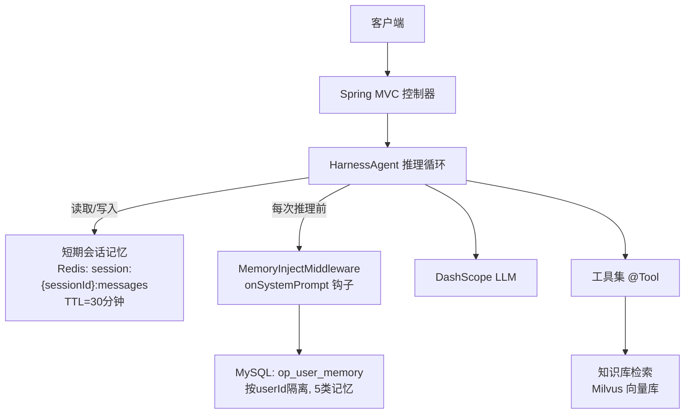
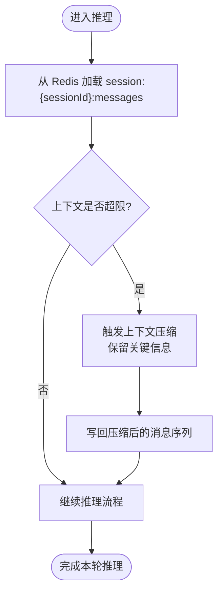
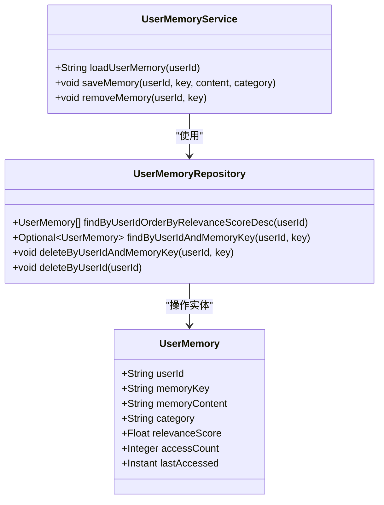
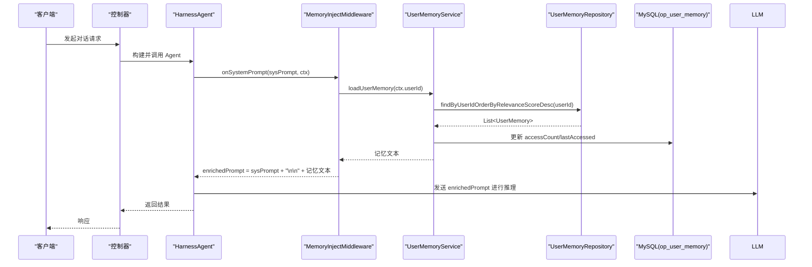
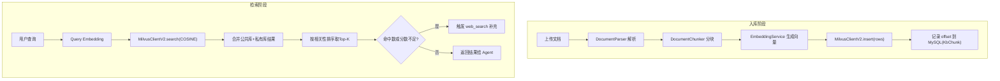

# 记忆与状态管理

<cite>
**本文引用的文件**   
- [03-详细设计说明书.md](file://Documents/03-详细设计说明书.md)
- [04-实现与编码规范.md](file://Documents/04-实现与编码规范.md)
- [MilvusConfig.java](file://src/main/java/com/tutorial/offerpilot/config/MilvusConfig.java)
- [AgentScopeProperties.java](file://src/main/java/com/tutorial/offerpilot/config/AgentScopeProperties.java)
- [UserMemoryService.java](file://src/main/java/com/tutorial/offerpilot/service/UserMemoryService.java)
- [UserMemory.java](file://src/main/java/com/tutorial/offerpilot/entity/UserMemory.java)
- [UserMemoryRepository.java](file://src/main/java/com/tutorial/offerpilot/repository/UserMemoryRepository.java)
</cite>

## 两层记忆架构
> 绘制短期会话记忆（Redis）与长期用户记忆（MySQL）的双层架构 Mermaid 图
> 说明各自的数据结构、TTL、读写场景

- 短期会话记忆：基于 Redis 的 Agent 会话状态存储，用于保存当前对话的消息历史。Key 形如 session:{sessionId}:messages，具备 TTL 自动过期能力，适合高并发读写的短时上下文。
- 长期用户记忆：持久化到 MySQL 的 op_user_memory 表，按 userId 隔离，支持分类、相关性评分与访问统计，作为系统提示词动态注入的“用户画像”来源。

**图表来源** 
- [04-实现与编码规范.md](file://Documents/04-实现与编码规范.md)
- [UserMemoryService.java](file://src/main/java/com/tutorial/offerpilot/service/UserMemoryService.java)
- [UserMemory.java](file://src/main/java/com/tutorial/offerpilot/entity/UserMemory.java)
- [UserMemoryRepository.java](file://src/main/java/com/tutorial/offerpilot/repository/UserMemoryRepository.java)

**章节来源**
- [04-实现与编码规范.md](file://Documents/04-实现与编码规范.md)
- [UserMemoryService.java](file://src/main/java/com/tutorial/offerpilot/service/UserMemoryService.java)
- [UserMemory.java](file://src/main/java/com/tutorial/offerpilot/entity/UserMemory.java)
- [UserMemoryRepository.java](file://src/main/java/com/tutorial/offerpilot/repository/UserMemoryRepository.java)

## 短期会话记忆（RedisAgentStateStore）
> 说明 Redis Key 设计（session:{sessionId}:messages）
> 说明 Session TTL 配置（30 分钟）和自动过期机制
> 说明 CompactionConfig（maxTokens=8000）对长对话的自动压缩策略

- Key 设计：会话消息以 session:{sessionId}:messages 为键存储在 Redis，便于按会话维度快速存取。
- TTL 与过期：会话级 TTL 设置为 30 分钟，超过后自动清理，避免长期占用内存。
- 上下文压缩：通过 CompactionConfig.maxTokens=8000 控制长对话的压缩阈值，当上下文接近或超过该值时触发压缩，降低后续推理成本并维持响应质量。

**图表来源** 
- [04-实现与编码规范.md](file://Documents/04-实现与编码规范.md)
- [AgentScopeProperties.java](file://src/main/java/com/tutorial/offerpilot/config/AgentScopeProperties.java)

**章节来源**
- [04-实现与编码规范.md](file://Documents/04-实现与编码规范.md)
- [AgentScopeProperties.java](file://src/main/java/com/tutorial/offerpilot/config/AgentScopeProperties.java)

## 长期用户记忆（op_user_memory 表）
> 展示 op_user_memory DDL 结构及 5 类记忆分类（PROFILE/WEAK_POINT/PREFERENCE/PLAN/GENERAL）
> 展示 UserMemoryService 的 CRUD 核心代码（loadUserMemory/saveMemory/removeMemory）
> 说明 relevanceScore 排序和 accessCount 访问统计机制

- 表结构与字段：
  - 主键：自增 id
  - 唯一约束：(userId, memoryKey)
  - 索引：idx_memory_user_id、idx_memory_category
  - 字段：userId、memoryKey、memoryContent、category（默认 GENERAL）、relevanceScore（默认 1.0）、accessCount（默认 0）、lastAccessed
- 记忆分类：PROFILE、WEAK_POINT、PREFERENCE、PLAN、GENERAL
- 核心服务方法：
  - loadUserMemory(userId)：按 relevanceScore 降序加载并按 category 分组拼接为 system prompt 片段；同时更新 accessCount 与 lastAccessed
  - saveMemory(userId, key, content, category)：按 (userId, memoryKey) 存在则更新，不存在则新建
  - removeMemory(userId, key)：删除指定记忆条目

**图表来源** 
- [UserMemory.java](file://src/main/java/com/tutorial/offerpilot/entity/UserMemory.java)
- [UserMemoryRepository.java](file://src/main/java/com/tutorial/offerpilot/repository/UserMemoryRepository.java)
- [UserMemoryService.java](file://src/main/java/com/tutorial/offerpilot/service/UserMemoryService.java)

**章节来源**
- [UserMemory.java](file://src/main/java/com/tutorial/offerpilot/entity/UserMemory.java)
- [UserMemoryRepository.java](file://src/main/java/com/tutorial/offerpilot/repository/UserMemoryRepository.java)
- [UserMemoryService.java](file://src/main/java/com/tutorial/offerpilot/service/UserMemoryService.java)

## MemoryInjectMiddleware 动态注入
> 展示 onSystemPrompt 钩子中从 DB 加载记忆并拼入 system prompt 的代码流程
> 对比静态注入方案的缺陷（Caffeine 缓存期间记忆不更新），说明动态注入的优越性

- 钩子位置：在 HarnessAgent 推理前的 onSystemPrompt 阶段执行，确保每次推理都拿到最新记忆。
- 注入流程：
  - 从 RuntimeContext 获取 userId
  - 调用 UserMemoryService.loadUserMemory(userId) 生成结构化记忆文本
  - 将记忆追加到原始 system prompt 末尾，形成 enrichedPrompt
  - 传递给下一个中间件或 LLM 推理
- 优势对比：
  - 静态注入：若 Agent 被 Caffeine 缓存，system prompt 不会随记忆更新而刷新，导致时效性问题
  - 动态注入：每次推理前实时加载，保证记忆即时生效，避免竞态与时滞

**图表来源** 
- [04-实现与编码规范.md](file://Documents/04-实现与编码规范.md)
- [UserMemoryService.java](file://src/main/java/com/tutorial/offerpilot/service/UserMemoryService.java)
- [UserMemoryRepository.java](file://src/main/java/com/tutorial/offerpilot/repository/UserMemoryRepository.java)

**章节来源**
- [04-实现与编码规范.md](file://Documents/04-实现与编码规范.md)
- [UserMemoryService.java](file://src/main/java/com/tutorial/offerpilot/service/UserMemoryService.java)

## 向量数据库 Milvus
> 解析 Milvus 适配与调用逻辑，包括连接配置、Collection 设计与检索流程

- 连接配置：
  - MilvusConfig 提供 MilvusClientV2 Bean，URI 由 host/port 组成，dbName 来自配置，支持 connectTimeoutMs 与 keepAliveTimeMs
- Collection 设计：
  - 通用 Schema：id（自增主键）、doc_id、chunk_index、content、tags、metadata_json、embedding（1024维浮点向量）
  - 索引：IVF_FLAT，metric_type=COSINE，nlist=128，适合中小规模数据
- 入库管道：
  - 文档解析 → 分块（AUTO/BY_QUESTION/BY_HEADING/BY_SIZE）→ Embedding（DashScope text-embedding-v3）→ 批量写入 Milvus → 记录 offset 到 MySQL
- 检索流程：
  - 多租户检索：公共库 + 用户私有库联合搜索
  - 向量检索：query embedding → COSINE 相似度检索 → 合并排序取 Top-K
  - Fallback：total==0 或 relevanceScore<0.6 时触发 web_search

**图表来源** 
- [03-详细设计说明书.md](file://Documents/03-详细设计说明书.md)
- [MilvusConfig.java](file://src/main/java/com/tutorial/offerpilot/config/MilvusConfig.java)

**章节来源**
- [03-详细设计说明书.md](file://Documents/03-详细设计说明书.md)
- [MilvusConfig.java](file://src/main/java/com/tutorial/offerpilot/config/MilvusConfig.java)